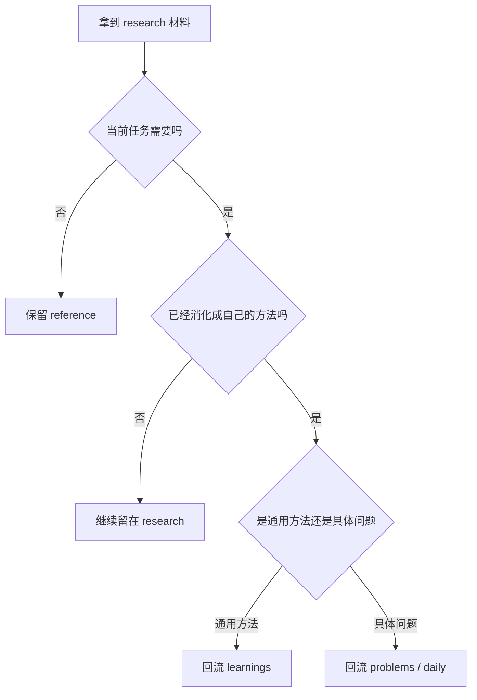

# Research 探索区

## 一句话结论

`research/` 是研究材料和外部参考的中转区，不是新的学习笔记目录。后续只有被当前计划触发、已经消化成自己的方法、能服务真实任务或复盘的内容，才回流到 `learnings/`、`problems/` 或 `daily/`。

## 日常类比

这里像一格研究资料抽屉。

- 论文原文和翻译像资料夹。
- 外部阅读站像别人整理好的书架。
- 长期路线图像未来可能开的项目清单。
- 架构观察笔记像贴在抽屉上的便签。

抽屉可以放材料，但不能让材料直接冒充工具书；真正能反复使用的方法，才应该进知识库正文。

## 当前分桶

| 条目 | 类型 | 当前状态 | 回流判断 |
|---|---|---|---|
| `browser-from-scratch/` | 长期路线图 / toy 实验 | paused | 恢复真实执行前，不新增 learning |
| `iot-reading-station/` | 外部阅读站 | reference | 读 `_meta/iot-reading-station.md`，只在任务触发时回流方法 |
| `multimodal-papers/` | 论文 txt / zh 材料包 | reference | 被当前任务引用时再补来源卡或 learning |
| ResearchStudio 笔记 | 架构观察 / 部署记录 | reference | 能复用为研究流水线或工具方法时再提炼 |
| Lark iOS 历史探索报告 | 历史探索报告 | reference | 只作背景索引；当前 iOS 学习以最新计划和脱敏样本为准 |

`embodied-ai` 已迁到 `explorations/embodied-ai/` 作为顶层独立项目，统一入口仍是 [`_meta/embodied-ai.md`](../_meta/embodied-ai.md)。

## 回流规则

1. **先判断任务触发**：没有当前任务、真实样本或明确缺口时，只保留入口。
2. **再判断是否可复用**：能迁移到其他项目的方法，才提炼到 `learnings/`。
3. **论文材料先消化再入库**：没有自己的结论、误区和自测，不升级成学习笔记。
4. **外部研究站只做导航**：文件数多不等于当前优先级高。
5. **历史探索报告标清边界**：只当背景，不替代当前计划、图谱命中和源码阅读。

## 最小流程

## 踩过的坑

- 把外部阅读站当成当前学习主线，导致 iOS / bugfix 样本被挤开。
- 论文材料还只是翻译或原文，就急着写成 learning。
- 长期路线图没有本周动作，却一直占据 active 心智。
- 历史探索报告没有标清“仅作背景”，容易误导后续判断。

## 自测问题

1. Q：`multimodal-papers/` 什么时候需要新增来源卡？
   A：当其中某篇材料被当前任务真正使用，并且能写出自己的关键收获和产出去向时。

2. Q：`browser-from-scratch/` 为什么当前不是 active？
   A：因为它是长期路线图；没有本周真实动作时，应保持 paused / reference。

3. Q：外部研究站文件很多，为什么不逐个学习？
   A：当前计划优先全仓接班和实习样本校准；外部研究站默认只作参考。

## 相关资源 / 关联

- [探索尝试总览](../README.md)
- [Explorations Content / Research 回流细分图](../../docs/plans/2026-07-09-explorations-content-research-routing-map.md)
- [Explorations 活跃 / 归档分流图](../../docs/plans/2026-07-09-explorations-active-archive-routing-map.md)
- [_meta/embodied-ai.md](../_meta/embodied-ai.md)
- [_meta/iot-reading-station.md](../_meta/iot-reading-station.md)
