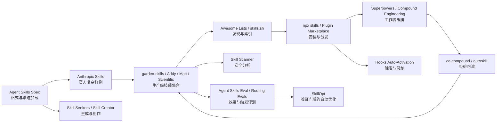

# Garden Skills 与 Agent Skills 工程生态研究

> 研究快照：2026-07-16
>
> 起点项目：[ConardLi/garden-skills](https://github.com/ConardLi/garden-skills)
>
> 深度语料：20 个已 fork 到 `estelledc`、已 clone 到本地的独立 Git 仓库

## 先说结论

`garden-skills` 不是简单的 Prompt 合集。它处在 Agent Skills 生命周期的“生产级技能包”位置：

1. 用 `SKILL.md` 描述触发条件、工作流、约束和检查点。
2. 用 `references/` 做渐进加载，避免一次塞满上下文。
3. 用 `scripts/` 和模板承载确定性动作，不让模型反复临时生成。
4. 用独立 manifest、SemVer、tag、ZIP、SHA-256 和 CI 把 Skill 当成软件包发布。
5. 用 Claude Plugin Marketplace、`npx skills`、手动复制和 Git submodule 覆盖多种安装方式。
6. 用 `reacticle`、案例网站等伴生项目，把“方法论 Skill”接到真实运行时协议和可阅读成果上。

更大的 Agent Skills 生态已经形成完整生命周期：

```text
开放规范
  -> Skill 生成与人工创作
  -> 集合、索引与发现
  -> 安装、版本与市场分发
  -> 宿主发现、触发与工作流编排
  -> 安全扫描与权限治理
  -> A/B 评测与触发评测
  -> 轨迹驱动优化
  -> 经验回流成新 Skill
```

当前领域最重要的变化，不是 Skill 数量增长，而是从“写一份提示词”转向“管理一种可安装、可审计、可评测、可演进的自然语言软件资产”。

## 核心判断

### 1. 开放标准只解决可移植骨架

`agentskills/agentskills` 规定最小目录、frontmatter 和渐进加载原则，但不规定：

- 如何发现和安装；
- 如何单独版本化；
- 如何验证触发准确率；
- 如何防止恶意脚本和提示注入；
- 如何证明 Skill 真正提升结果；
- 如何根据运行轨迹改进 Skill。

这些问题由 `vercel-labs/skills`、插件市场、Skill Scanner、Agent Skills Eval、SkillOpt 等项目分别补齐。

### 2. `garden-skills` 的核心贡献是“内容工程 + 发布工程”

它没有实现通用宿主或大型安装器，而是把少量高质量 Skill 做深：

- 5 个 Skill 各自解决明确任务；
- 大量参考文件按阶段和场景路由；
- 复杂工作流有用户 checkpoint；
- 每个 Skill 独立发布；
- 可复现安装依赖 immutable release artifact 和 checksum；
- 人类文档、Agent 指令、机器发布元数据分开维护。

它的优势是单包深度和产品化；短板是目前缺少仓内行为 eval、安全扫描门和统一的触发准确率测试。

### 3. Skill 与 Plugin/Harness 是不同层

- **Skill**：按需加载的程序性知识和局部工具包。
- **Plugin**：把 Skill、命令、Agent、Hook、MCP 等作为一个可安装扩展分发。
- **Harness**：规定任务从输入、计划、执行、验证到回流如何运行，并管理状态和质量门。

`garden-skills` 主要是 Skill collection；`superpowers` 和 Compound Engineering 更接近方法论 Harness；Claude Plugin Marketplace 是分发层；`claude-code-infrastructure-showcase` 展示 Hook 如何补强触发与强制执行。

### 4. “装了 Skill”不等于“Skill 有效”

需要分开验证四件事：

1. 格式合法：能否被宿主解析。
2. 路由正确：该触发时是否触发，不该触发时是否误触发。
3. 行为有效：使用 Skill 后，结果是否比 baseline 更好。
4. 安全可接受：指令、脚本、依赖、网络和文件行为是否符合预期。

规范验证器、Addy 的 lexical routing eval、`agent-skills-eval` 的 with/without 对照、Skill Scanner 分别覆盖不同层，不能互相替代。

### 5. 规模扩大后，治理比写作更难

20 个项目共同显示出这些工程难点：

- Skill 描述冲突和误触发；
- 多宿主目录、字段和工具名差异；
- 第三方 Skill 的供应链风险；
- 上游文档变化导致 Skill 过期；
- 大型集合的版本、来源和许可证治理；
- 评测成本、随机性与 judge 偏差；
- 自动优化可能把 Skill 改坏，需要 held-out gate；
- 经验回流如果没有查重和人工门，会形成重复或错误知识。

## 推荐阅读顺序

| 顺序 | 材料 | 解决的问题 |
|---|---|---|
| 1 | [研究范围与语料](01-scope-and-corpus.md) | 为什么选这 20 个项目，“所有相关”如何收口 |
| 2 | [生态全景与发展现状](02-ecosystem-landscape.md) | 领域有哪些层、当前发展到哪里、还有什么缺口 |
| 3 | [逐项目深度分析](03-project-deep-dives.md) | 每个项目的架构、核心功能、实现和代码组织 |
| 4 | [横向对比与可复用模式](04-cross-project-comparison.md) | 不同方案为什么不同，做自己的 Skill 系统时怎么选 |
| 5 | [关键思考点与基础问答](05-learning-questions-and-faq.md) | 后续学习问题，以及大部分基础问题的速查答案 |
| 6 | [fork、clone 与源码快照](06-repository-inventory.md) | 个人 fork、本地路径、commit、许可证和恢复方式 |

## 一张生态图



## 证据边界

- 架构判断以本地 pinned commit 的源码、配置、测试和 README 为依据。
- star、fork、push 时间只代表 2026-07-16 的 GitHub 快照，不代表质量排名。
- 项目自报的性能、用户规模、Skill 数量和 benchmark 提升均标为“项目自述”，没有在本机重跑时不视为独立验证。
- 本轮运行了仓库结构和 Git 状态验证；没有安装并执行 20 个项目的全部依赖、云 API 或端到端流程。
- Awesome List 是发现层证据，不等同于安全审计或技术背书。
- fork 只表示个人远端副本，许可证仍以上游为准；许可证未清晰识别的项目只用于研究。

## 后续如何提问

可以直接按以下形式继续：

- “从零解释 `SKILL.md` 为什么能按需加载。”
- “`garden-skills` 和 Anthropic 官方 skills 的架构差异是什么？”
- “沿着 `npx skills add` 追踪一次完整安装链。”
- “Skill Scanner 的静态、行为和 LLM 分析分别发现什么？”
- “为什么 A/B eval 仍不能完全证明 Skill 有效？”
- “SkillOpt 如何避免自动改坏 Skill？”
- “精读 `garden-skills` 的 release tag 到 ZIP/SHA256 链。”
- “我自己的 Skill 仓库最小应该补哪些门禁？”

## 当前状态

- 本轮状态：`reference`。
- 停止条件：20 个互补样本已经覆盖完整生命周期，不再为数量继续纳入同质集合。
- 重新激活条件：出现具体 Skill 设计、安装、安全、评测或优化问题。
- 重新激活后的第一步：先核对目标仓的 `upstream` 与 pinned commit 是否漂移，再做局部源码 trace 或最小运行验证。
