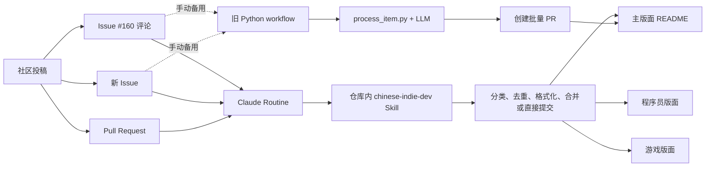

# 中国独立开发者列表源码研究

## 研究快照

- 上游：`1c7/chinese-independent-developer`
- 个人 fork：`estelledc/chinese-independent-developer`
- 固定提交：`58185a2de07cd2aea247b06fb689f08f8555d884`
- 研究日期：2026-07-16
- 本轮模式：`source-learn / 概览`
- 边界：只读源码和公开 GitHub 状态；不修改 fork，不处理 Issue / PR，不触发 Routine。

## 一句话结论

这个仓库更像一块由社区共同维护的“巨型公告栏”，不是传统应用：Markdown 是数据库，Issue / PR 是投稿箱，Claude Routine 和旧 Python 脚本是两代编辑部自动化。

## 仓库规模与数据模型

固定快照共有 14 个跟踪文件，约 695 KB；四个项目列表 Markdown 合计 8,809 行，约有 2,600 条项目状态行。

核心数据并没有 JSON Schema，而是隐含在 Markdown 约定中：

```markdown
### 2026 年 7 月 16 号添加

#### 制作者名字(城市) - [Github](url)
* :white_check_mark: [项目名](url)：一句话介绍
```

三个状态符号同时承担“枚举值”和视觉标记：

- `:clock8:`：开发中
- `:white_check_mark:`：已上线
- `:x:`：已关闭或缺乏维护

四个内容分区：

| 文件 | 定位 | 快照行数 |
|---|---|---:|
| `README.md` | 打开即用的网站或 App | 5,927 |
| `pages/README-Programmer-Edition.md` | 需要命令行、代码或依赖的项目 | 938 |
| `pages/README-Game.md` | 游戏 | 399 |
| `pages/README-2018-2020.md` | 因 GitHub 渲染限制拆出的历史归档 | 1,545 |

## 当前架构



## 两代自动化的真实边界

| 维度 | 当前主链：Claude Routine | 旧备用链：Python |
|---|---|---|
| 触发 | GitHub Actions 每 6 小时调用 Routine API | 仅保留 `workflow_dispatch` |
| 规则源 | `.claude/skills/chinese-indie-dev/SKILL.md` | `.github/scripts/process_item.py` |
| 输入 | #160 新评论、新 Issue、所有未关闭 PR | 管理员用 reaction 标记的评论和 Issue |
| 分类 | 主版面、程序员版面、游戏版面、拒绝 | 只写主 `README.md` |
| 写入 | Issue 类投稿批量直推 `master`；正常 PR squash merge | 创建临时分支和批量 PR |
| 幂等性 | 完整 URL 精确匹配 | reaction 成功标记 |
| 人工反馈 | 评论、关闭 Issue、处理 PR 冲突 | 添加成功 reaction、统一回复 |

这说明仓库已经从“确定性 Python 编排 + 单次 LLM 格式化”迁移到“自然语言 Skill 作为维护策略 + Routine 执行”。旧脚本仍是备用路径，但规则能力已明显落后于当前 Skill。

## 入口到输出的最小链路

1. `.github/workflows/trigger_claude_routine.yml`
   - 每 6 小时向 Anthropic Routine API 发起一次请求。
   - GitHub Actions 的成功只证明请求返回了 `routine_fire`，不等于下游 Routine 已完成项目处理。
2. `.claude/skills/chinese-indie-dev/SKILL.md`
   - 先预检新评论、新 Issue 和未关闭 PR。
   - 用完整产品 URL 做精确去重。
   - 按使用门槛分配到三个 README。
   - 对 Issue 类投稿直接批量提交，对贡献者 PR 保留提交归属。
3. `README.md` 与 `pages/*.md`
   - 是最终存储层，也是 GitHub 页面上的直接阅读界面。
4. `.github/workflows/process_list.yml` 与 `.github/scripts/process_item.py`
   - 构成仍可手动触发的旧链路。

## 第一轮验证

- fork 与上游：`origin/master` 和 `upstream/master` 都是 `58185a2`，分叉计数为 `0 / 0`。
- 旧脚本单测：`python3 -m unittest tests/test_process_item.py -v`，4 个测试全部通过。
- 这些测试只覆盖 reaction 归属、跳过 PR、保留管理员标记 Issue；没有覆盖：
  - LLM 输出格式
  - Markdown 日期区块插入
  - URL 去重
  - 三版面分类
  - Routine Skill 契约
  - GitHub API 写入后的端到端结果
- 公开运行记录中，最近 12 次“触发 Claude Routine”Action 均成功；日志显示返回 `type: routine_fire`，但仓库内没有下游完成回执。

## 第一轮发现

1. **Markdown 是单一事实源，但 Schema 只存在于人类约定和 Skill 文本中。**
   - 好处：贡献门槛低，GitHub 原生可读。
   - 代价：重复、日期顺序、状态符号和版面分类很难靠类型系统保证。
2. **当前主链和旧备用链存在规则漂移。**
   - 当前 Skill 覆盖三个版面、PR 合并和 URL 去重。
   - 旧 Python 脚本只写主版面，并依赖 reaction。
3. **维护策略已经“代码化为自然语言”。**
   - 262 行 Skill 不只是提示词，而是权限、幂等性、冲突处理、署名清理和用户沟通的运行契约。
4. **可观察性停在 Routine 触发边界。**
   - Action 会打印 Routine session URL；是否有访问风险取决于外部鉴权，本轮不能仅凭公开日志证明。
   - 当前 Action 成功不能证明 Routine 内部成功，更不能证明 README 一定产生变化。
5. **现有自动测试主要保护旧实现。**
   - 当前最关键的自然语言 Skill 没有对应的契约测试或离线案例集。

## 推荐学习路线

1. **精读当前 Skill**
   - 重点：预检、URL 幂等性、三版面分类、直接推送与 PR 归属。
2. **追踪一条真实投稿**
   - 从近期 Issue 或 PR 开始，追到最终 README commit 和感谢评论。
3. **对比旧 Python 脚本**
   - 建立“代码规则 vs 自然语言规则”差异矩阵，找出哪些约束已经漂移。
4. **提炼可复用模式**
   - Markdown-as-database、human-in-the-loop、append-only 内容治理、Agent Skill 作为操作手册。

## 下一轮建议精读入口

1. `.claude/skills/chinese-indie-dev/SKILL.md`
   - 当前真实维护政策，优先级最高。
2. `.github/scripts/process_item.py`
   - 用来理解旧系统如何把 GitHub 对象、LLM 和 README 写入串起来。
3. `tests/test_process_item.py`
   - 用来识别当前测试保护了什么、遗漏了什么。
4. 一条近期上游 PR
   - 用真实提交验证 Skill 文本描述是否与运行结果一致。

## 思考题

1. 如果完整 URL 相同但带有不同 tracking query，当前“精确匹配”会发生什么？
2. 当两个 Routine 会话同时向当天日期区块写入时，直接推 `master` 如何避免竞态？
3. 如果把 Markdown Schema 抽成结构化数据，怎样保留当前“任何人都能直接改 README”的低门槛？
4. 旧 Python 备用链长期不与 Skill 同步时，它还是可靠的灾备，还是隐藏的第二套产品规则？
