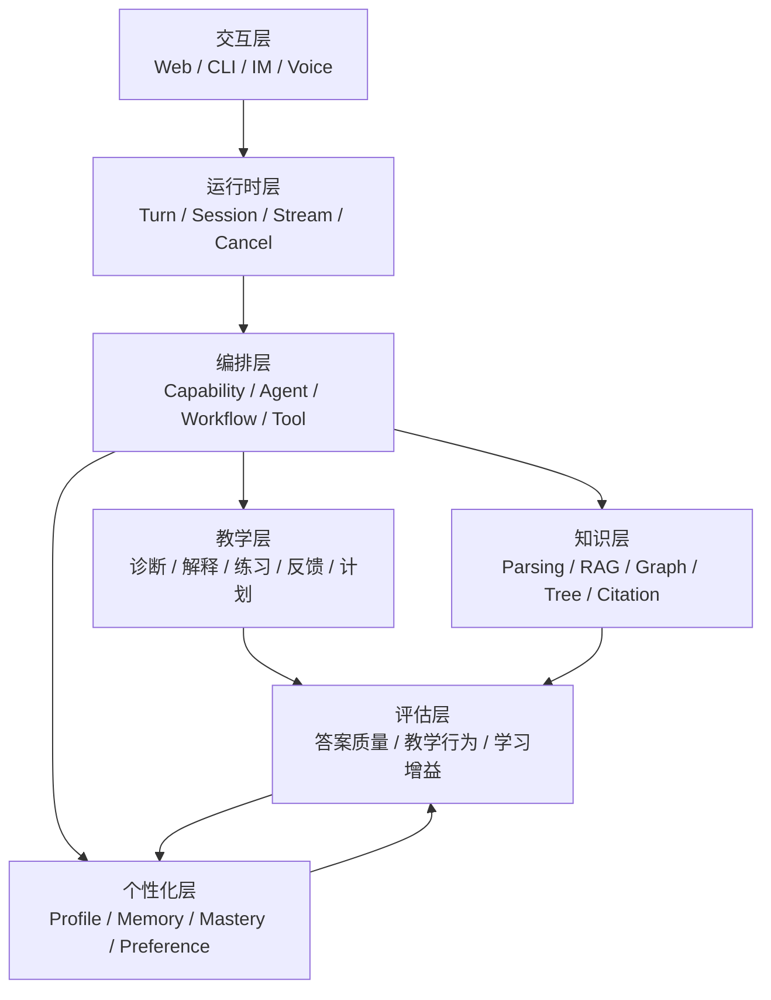

# Agentic AI Tutor 领域生态与发展现状

## 1. 从聊天机器人到闭环教学系统

可以把发展过程理解为四代：

### 第一代：问答式助手

用户提问，大模型直接回答。优势是实现简单、交互自然；问题是：

- 不知道学习目标；
- 不知道用户已经会什么；
- 容易直接给答案；
- 会话结束后没有稳定状态；
- 很难判断用户是否真正理解。

### 第二代：RAG 教材助手

系统把教材、课程或 PDF 检索进上下文，解决“答案有没有依据”。典型组件是 LlamaIndex 和向量数据库。

它改善了知识 grounding，但没有自动解决个性化。相同检索结果仍可能对所有学生生成相同解释。

### 第三代：多 Agent 教学流程

系统把任务分给诊断、规划、教学、测验、反馈等 Agent。GenMentor 是清晰代表：

```text
学习目标
 -> 技能要求
 -> 技能差距
 -> 学习者画像
 -> 学习路径
 -> 定制内容
 -> 测验/聊天
 -> 画像更新
```

这一代开始把“教学”视为多个决策步骤，而不是一个超级 prompt。

### 第四代：Agent-native 长期学习工作区

DeepTutor 代表更综合的方向：

- 多个学习 surface 共用运行时；
- 知识库、记忆、persona、skill、笔记和题库相互连接；
- capability 不是独立 API，而是同一上下文上的不同目标；
- 每次互动可以进入长期记忆和后续学习路径；
- Web、CLI、SDK 和外部 Agent 共享同一执行模型。

这类系统的难度更接近“学习操作系统”，而不是单一 AI 功能。

## 2. 技术栈分层



### 交互与运行时

关键问题不是“有没有聊天 UI”，而是：

- 是否有稳定 turn/session 标识；
- 是否支持 streaming、暂停、恢复、取消；
- 工具执行是否有状态和权限；
- 多入口是否共享同一条主链；
- 失败后能否知道执行到哪一步。

DeepTutor 与 nanobot 在这一层最值得精读。nanobot 用显式状态机表达一次 turn；DeepTutor 用 TurnRuntime、UnifiedContext、Orchestrator 和 StreamBus 解耦入口与能力。

### 教学编排

核心对象包括：

- learner profile：学习目标、背景、能力和偏好；
- skill gap：目标要求与当前能力之间的差；
- learning path：知识点和练习顺序；
- tutor policy：何时提示、追问、示范或给出答案；
- feedback loop：如何把表现写回状态。

GenMentor 把这些对象做成一组结构化 Agent；Tutor-GPT 用 Empath 先决定需要查询哪些用户心理信息，再把结果交给 Tutor。

### 知识摄取与检索

当前已不是“向量数据库一家独大”：

| 路线 | 代表 | 适合 | 主要代价 |
|---|---|---|---|
| 通用向量/索引框架 | LlamaIndex | 多数据源、快速集成、常规文档问答 | 需要自行组合最佳 pipeline |
| 轻量图 + 向量 | LightRAG | 实体关系明显、需要局部/全局关系 | 建图需要 LLM，增量与一致性更复杂 |
| 重型社区图 | GraphRAG | 大语料主题、社区和全局问题 | 索引成本高、工作流与存储更重 |
| 层次树/无向量 | PageIndex | 长 PDF、法规、财报、教材章节定位 | 树生成依赖结构质量与 LLM reasoning |
| 多模态图 RAG | RAG-Anything | 图、表、公式和复杂 Office/PDF | 解析链、视觉模型和资产管理成本高 |

DeepTutor 的多引擎策略说明：知识库引擎已经成为 per-KB 决策，而不是全产品只能选一个。

### 长期记忆和个性化

长期记忆至少有四类信息：

1. 事实：用户的背景、目标和偏好。
2. 能力：哪些概念熟悉、练习中或不确定。
3. 事件：做过哪些题、看过哪些材料、收到什么反馈。
4. 策略：什么解释方式、节奏和难度更有效。

三种主要工程路线：

- 全量会话压缩：实现简单，但容易把事实和推测混在一起。
- 向量事实记忆：如 Mem0，检索方便，但需要处理抽取、重复、冲突和时间。
- 分层可追溯记忆：如 DeepTutor L1/L2/L3，人工可读且能追溯，但 consolidation 与引用治理更复杂。

### 教学评估

传统指标往往只看答案是否正确。教学系统还应评估：

- 是否先诊断再解释；
- 是否发现了学生的具体误区；
- 是否给出恰当提示而非直接代做；
- 是否根据已有知识调整难度；
- 是否引用了正确材料；
- 多轮后学生能否独立完成相似任务；
- 记忆更新是否准确。

相关评估正在从静态答案走向开放式教学和交互流程：

- [MathTutorBench](https://arxiv.org/abs/2502.18940)：开放式数学教学能力；
- [TutorBench](https://arxiv.org/abs/2510.02663)：通用 tutoring capability；
- [DeepTutor](https://arxiv.org/abs/2604.26962)：source-grounded learner profile 与交互式学生模拟；
- [Are Agents Ready to Teach?](https://arxiv.org/abs/2605.14322)：真实教学工作流的多阶段评估。

## 3. 2026 年可观察到的主要趋势

### 趋势一：学习者状态成为一等数据

聊天历史不再等于学习者模型。项目开始显式维护：

- skill gap；
- learner profile；
- mastery path；
- preference/profile memory；
- session 与跨 session 状态。

### 趋势二：RAG 从“找相似段落”变为“恢复知识结构”

图、树、章节层级、跨模态关系和引用位置越来越重要。原因是教材和专业文档并不是无结构的句子集合。

### 趋势三：Agent 编排从隐式 prompt 变为可检查流程

显式状态机、workflow、capability registry 和 tool schema 带来：

- 可观察；
- 可替换；
- 可测试；
- 可限制预算；
- 可区分失败阶段。

### 趋势四：个性化需要证据治理

越长期的系统，越不能把模型推断直接当成用户事实。DeepTutor 的引用链和 Mem0 的 scoped filters 都是在回答：

> 这条记忆从哪里来，属于谁，何时有效，能不能被修改或删除？

### 趋势五：多模态从展示能力变为教学材料能力

图片、表格、公式、语音和动画不仅是 UI 装饰，还参与：

- 材料解析；
- 问题理解；
- 解释生成；
- 练习反馈；
- 可视化和动画产出。

RAG-Anything 与 ManimCat 分别代表“读懂多模态材料”和“生成多模态教学表达”。

### 趋势六：开放协议和外部 Agent 协作增多

CLI JSON/NDJSON、MCP、skills、WebSocket、SDK 和 agent handoff 让教学系统可以被其他 Agent 调用。DeepTutor 不只服务人类 UI，也尝试成为其他 Agent 可操作的学习工具。

## 4. 当前生态的主要矛盾

### 完整性与可理解性

DeepTutor 功能完整，但代码面广、状态多；GenMentor 更容易理解，但大量编排仍由 endpoint 和 prompt 串联。

### 个性化与隐私

越完整的 learner model 越有用，也越敏感。系统必须提供删除、审计、scope 和授权，而不能只追求“记得更多”。

### 检索质量与索引成本

GraphRAG 和多模态图索引可能更强，但离线成本、更新延迟和部署复杂度更高。不是每个知识库都值得建图。

### Agent 自主性与教学控制

自由工具循环可以解决复杂任务，也可能：

- 直接替学生完成任务；
- 走偏或无限循环；
- 使用不合适的外部信息；
- 生成不稳定的学习路径。

需要最大轮数、工具白名单、sandbox、HITL 和教学策略约束。

### 产品功能与可验证学习增益

“有 Quiz 按钮”不等于“练习设计有效”；“保存 profile”不等于“个性化正确”。未来竞争点会逐渐从功能数量转向长期学习证据。
