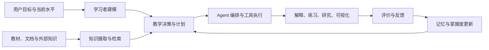

# DeepTutor 与 Agentic AI Tutor 生态研究

> 研究快照：2026-07-17
> 主项目：[HKUDS/DeepTutor](https://github.com/HKUDS/DeepTutor)
> 研究对象：14 个已 fork、已在本地保存为独立 Git 仓库的开源项目

## 先说结论

DeepTutor 不是一个“给聊天机器人加教材”的项目，而是一套把学习活动组织成长周期闭环的 Agent 工作区：

1. 用知识库和附件回答“这次应该依据什么”。
2. 用学习者记忆、persona 和历史回答“应该怎样对这个人讲”。
3. 用 capability、tool 和多阶段 pipeline 回答“这次要完成哪一种学习任务”。
4. 用会话、题库、书籍、笔记和 mastery path 回答“这次结果如何进入下一次学习”。

整个领域也正从“会回答问题的聊天框”转向“能够诊断、计划、教学、练习、反馈、记忆和评估的闭环系统”。目前最难的已经不只是调用大模型，而是：

- 如何建立可信、可更新的学习者模型；
- 如何让知识 grounding 与个性化同时生效；
- 如何区分“替学生解题”和“帮助学生学会”；
- 如何审计记忆、引用和工具行为；
- 如何在成本、延迟、安全和教学效果之间做工程取舍。

## 推荐阅读顺序

| 顺序 | 材料 | 解决的问题 |
|---|---|---|
| 1 | [研究范围与项目清单](01-scope-and-corpus.md) | 为什么选这 14 个项目，哪些项目没有纳入 |
| 2 | [领域生态与发展现状](02-ecosystem-landscape.md) | 这个领域有哪些技术层，正在往哪里发展 |
| 3 | [逐项目深度分析](03-project-deep-dives.md) | 每个项目怎么组织、核心链路是什么、值得学什么 |
| 4 | [横向对比与可复用模式](04-comparison-and-patterns.md) | DeepTutor 与其他项目的差异、架构模式和取舍 |
| 5 | [关键思考点与提问入口](05-learning-questions.md) | 后续可以围绕哪些问题继续精读或验证 |
| 6 | [来源、fork 与源码快照](06-sources-and-snapshots.md) | 研究依据、个人 fork、本地仓库和 commit |
| 7 | [2026-07-17 全量刷新](07-2026-07-17-refresh.md) | 14 仓漂移、138 项真实测试和项目卡治理 |
| 8 | [零基础教学证据实验](08-beginner-evidence-tutor-lab.md) | 为什么系统完成、答对、mastery 和 learning gain 不相等 |
| 9 | [14 个项目上手卡](09-beginner-project-onboarding-cards.md) | 每个项目的类比、输入输出、源码锚点和第一项任务 |

## 零基础 30 分钟路线

1. 用 5 分钟读本页“先说结论”。
2. 用 10 分钟读[教学证据实验](08-beginner-evidence-tutor-lab.md)第 1-5 节，
   记住 system health、task performance、mastery estimate 和 learning gain 四层。
3. 用 10 分钟运行最小实验和 9 个测试：

   ```bash
   cd explorations/research/deeptutor-ecosystem-study/labs
   PYTHONDONTWRITEBYTECODE=1 python3 evidence_tutor.py
   PYTHONDONTWRITEBYTECODE=1 python3 -m unittest -v test_evidence_tutor.py
   ```

4. 用 5 分钟回答实验页第 13 节前 3 题。
5. 再从[项目上手卡](09-beginner-project-onboarding-cards.md)选择一个项目精读，
   不要从 14 个仓库顺序扫起。

## 一张路线图



对应到本轮项目：

- 完整教学系统：DeepTutor、Open TutorAI、GenMentor、Tutor-GPT。
- Agent 与能力编排：nanobot、AutoAgent、AI-Researcher、ManimCat。
- 知识与检索：LlamaIndex、LightRAG、RAG-Anything、GraphRAG、PageIndex。
- 长期个性化记忆：Mem0；DeepTutor 自己也实现了可审计的 L1/L2/L3 文件记忆。

## 当前最重要的判断

### 1. DeepTutor 的优势是“统一运行时”，不是单点算法

其主链是：

```text
CLI / Web / SDK
  -> TurnRuntimeManager
  -> UnifiedContext
  -> ChatOrchestrator
  -> Capability / Agent Pipeline
  -> Tools + StreamBus
  -> 会话、题库、记忆、书籍等持久化
```

Chat、Quiz、Research、Solve、Visualize、Mastery 等模式共享上下文、事件和工具基础设施。相较于把每个功能做成互不相干的 LLM endpoint，这种统一运行时更适合长期演进。

### 2. “学习者模型”有三种主要实现思路

- Prompt/结构化 JSON 型：GenMentor 由 Agent 生成和更新 `LearnerProfile`。
- 外部认知服务型：Tutor-GPT 用 Honcho 保存用户心理与偏好表示。
- 可追溯文件记忆型：DeepTutor 将原始事件、surface 摘要和跨 surface 综合分成 L1/L2/L3。

Mem0 则代表通用 Agent memory：事实抽取、向量存储、实体关联和多信号检索。

### 3. RAG 已经分裂成不同问题的不同解法

- LlamaIndex：通用摄取、索引、检索和集成框架。
- LightRAG：实体—关系图与向量检索结合。
- GraphRAG：重型离线图构建、社区摘要和多种结构化查询。
- PageIndex：保留长文档层次结构的无向量树检索。
- RAG-Anything：在 LightRAG 上增加复杂文档解析与多模态内容处理。

因此，“选哪个 RAG”不是单纯比较准确率，而是先判断文档结构、更新频率、引用要求、成本、部署方式和查询类型。

### 4. 当前开源生态的短板仍是教学效果验证

很多项目能够生成解释、课程和测验，但较少能证明：

- 学生是否真正形成了新知识；
- 提示是否适配了已有误区；
- 系统是否避免直接代做；
- 长期记忆是否正确而非不断累积错误；
- 跨多轮、跨任务的个性化是否稳定。

MathTutorBench、TutorBench、DeepTutor 的 TutorBench 和更新的教学工作流 benchmark，说明评估重点正从最终答案正确率转向教学行为、个性化和多轮闭环。

### 5. Mastery 是估计，不是“学生脑内状态”

DeepTutor 当前 Mastery Path 已用低置信上限避免一次答对直接满分，并按知识类型
区分 quantitative 和 qualitative gate。本轮 74 项真实测试证明这些软件合同成立。

但当前 mastery 计算只接收最近答题的真假序列，不知道是否同题、是否使用提示、是否
经过独立迁移。因此：

```text
mastery score crossed gate
  != teaching caused learning gain
```

本轮新增的[教学证据实验](08-beginner-evidence-tutor-lab.md)用
`baseline -> practice -> independent transfer` 补足这一概念边界。

## 证据边界

- 14 个项目均在 pinned commit 下完成源码复核；10 个 upstream 无漂移，4 个有增量。
- DeepTutor 在一次性 Python 3.11 环境运行 9 个定向测试文件，共 138 项通过。
- E2 只覆盖 Context、Orchestrator、Memory 和 Mastery 的确定性合同，不覆盖真实
  provider、完整 Web/CLI、RAG、多模态和长期用户学习效果。
- 其余 13 个项目以及 4 个 upstream 增量仍是 E1 静态证据。
- GitHub star 和 push 时间是快照信息，不作为质量结论。

## 后续使用方式

如果后续遇到不理解的内容，可以直接从以下形式提问：

- “用零基础方式解释 DeepTutor 的 `UnifiedContext`。”
- “对比 DeepTutor L1/L2/L3 与 Mem0。”
- “沿着一次 `deeptutor run` 继续追踪到 AgentLoop。”
- “LightRAG、GraphRAG、PageIndex 分别适合什么教材？”
- “GenMentor 的学习者模型为什么比普通聊天历史更有用？”
- “逐行精读 `projects/nanobot/nanobot/agent/loop.py` 的状态机。”
