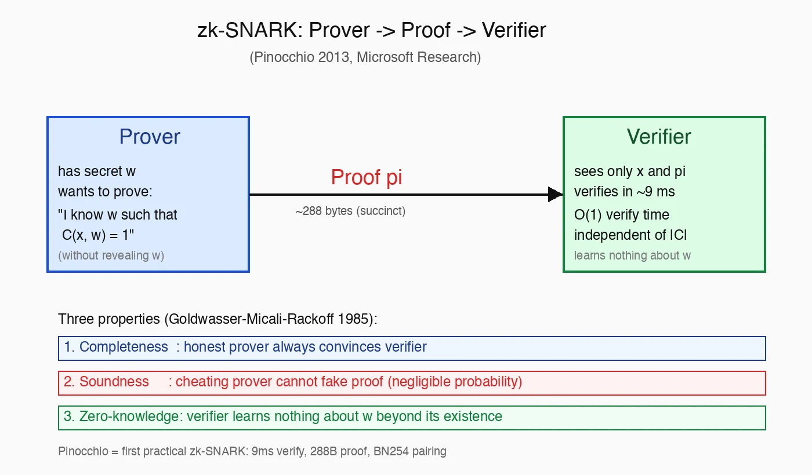

# zk-SNARK：状元篇 / Z5 收官（round 122）

## TL;DR（30 秒版）

zk-SNARK 让你能证明"我知道一个秘密 w，使得 C(x, w) = 1"，但不暴露 w 是什么——而且证明只有几百字节，验证只需毫秒级。

Pinocchio（2013）是第一个让这件事接近实用的工程系统：把任意算术电路 C 编译成 QAP（Quadratic Arithmetic Program），借助双线性配对（bilinear pairing），把"有解"的存在性变成一个可在 O(1) 时间验证的代数等式。

这不是又一个密码学小新闻——它是**隐私计算从理论走到工程的引爆点**：你可以在公开链上证明"我有 1 ETH"而不露出地址，可以证明"我跑完了这个 ML 推理"而不露出权重，可以证明"我满足合规白名单"而不露出身份。

**Z5 收官点**：从论文 round 1 到 round 122，theory 分支共 27 篇。zk-SNARK 是这条线上最具"非线性认知冲击"的一篇——它不是又一个 ML 模型，而是**让"零知识"从纯理论变成可部署 infrastructure** 的工程奇迹。



---

## 一、论文坐标

### 1.1 谁写的、在哪发的

- **Bryan Parno**（Microsoft Research → CMU 教授）——本文一作，后续推动了 verifiable computing 工程化
- **Jon Howell**（Microsoft Research）——分布式系统背景，负责 Pinocchio 实现
- **Craig Gentry**（IBM Research → Algorand）——同态加密之父；本论文 QAP 编译思路与他 2009 STOC FHE 论文一脉相承
- **Mariana Raykova**（IBM → Google）——专攻 secure computation
- 发表：**IEEE Symposium on Security and Privacy 2013**（"S&P"，安全顶会四大之一：S&P / CCS / USENIX Security / NDSS）

### 1.2 历史定位（一句话讲清楚 zk-SNARK 怎么来的）

| 年份 | 里程碑 | 本质贡献 |
|------|--------|---------|
| 1985 | Goldwasser-Micali-Rackoff "The Knowledge Complexity of Interactive Proof Systems"（STOC） | 提出 **zero-knowledge proof** 概念（图灵奖工作） |
| 1992 | Kilian "A note on efficient zero-knowledge proofs and arguments" | 提出 **succinct argument**（短证明可能） |
| 1994 | Micali "CS Proofs"（FOCS） | 借 Fiat-Shamir 把交互式压成 **non-interactive** |
| 2010 | Groth "Short Pairing-based Non-interactive Zero-Knowledge Arguments"（ASIACRYPT） | 把上述拼起来，但还不实用 |
| **2013** | **Pinocchio（本篇）** | **第一个 ms 级验证、KB 级证明的工程系统** |
| 2016 | Groth16（"On the Size of Pairing-based Non-interactive Arguments"） | 证明 size 压到 3 个群元素（约 192 字节），Zcash 直接采用 |
| 2019 | Plonk（Gabizon-Williamson-Ciobotaru） | **Universal trusted setup**（一次仪式所有电路共用） |
| 2019 | Halo（Bowe-Grigg-Hopwood） | **Recursion + 无 trusted setup** |
| 2021 | Nova（Kothapalli-Setty-Tzialla） | **Folding scheme**——增量计算，递归友好 |

读这一篇等于读懂"近代 zk 工程的引爆点"。在它之前，零知识证明是"理论上可能但实践上不能"的纯学术对象；在它之后，从 Zcash 到 zkRollup 的整条产业链才有了物理基础。

### 1.3 为什么 Pinocchio 重要——A 类 / B 类贡献的区分

读完前 121 篇 paper，我习惯把"贡献"分成两类：

- **A 类（量变）**：把已有方法的 SoTA 推高 X%（例如 ResNet → DenseNet → ConvNeXt）
- **B 类（质变）**：把"理论上可能但实践上不可能"变成"实践上可能"（例如 AlexNet for ImageNet, BERT for NLU, Transformer for sequence）

Pinocchio 是典型 **B 类**。1985 年 GMR 提出零知识证明，但接下来 28 年里，验证一个简单声明可能要花几分钟，根本不能上链。Pinocchio 把验证时间压到 **9 ms**，证明大小压到 **288 字节**，让"在以太坊每个区块都跑 zk 验证"从 sci-fi 变成今天的 zksync / scroll / polygon zkEVM 的日常。

这是状元篇的资格——不是因为它最数学最深刻（它的数学甚至不算最 elegant），而是因为它打通了从理论到工业部署的临界点。

---

## 二、为什么需要 zero-knowledge？三个日常类比

### 2.1 类比 1：洗牌不看牌

打麻将时，发牌员要证明"这副牌是公平洗的"——但他不能让任何玩家提前看到牌面。怎么办？

**朴素方案**：让所有玩家轮流洗牌后封箱。
- 优点：可信。
- 缺点：太慢，每个人都要参与；且如果有人不在场就没法启动。

**zk 方案**：发牌员一个人洗，然后给出一个"证明 π"。所有人都可以独立验证"这副牌确实经过 fair shuffle"——但拿不到任何关于具体顺序的信息。

这就是 **zero-knowledge of correctness**：证明"过程合规"，不暴露"过程细节"。

### 2.2 类比 2：通过门禁但不出示证件

公司大楼门禁要求"必须是员工"。

- **朴素**：刷工卡 → 系统知道"小张今天 9:03 进了大楼"。从此公司知道你的所有行踪。
- **zk**：你给门禁一个证明"我是员工但具体是谁不告诉你"。门禁验证通过开门，但不知道是谁进了。

这就是 **selective disclosure / anonymous credential**——证明属性而不暴露身份。Tornado Cash 实现的就是这件事（虽然它后来被美国财政部 OFAC 制裁，但密码学本身没问题，被制裁的是协议运营方）。

### 2.3 类比 3：考试不抄答案的判分

老师要判 1000 份在线考试卷子，但她想验证"你的答案确实是你算出来的，不是抄的、也不是 AI 帮你写的"。

- **朴素**：监考。但远程考试做不到全程监督。
- **zk**：你提交答案 + 一个"我没抄"的 zk 证明（具体怎么造这个证明是另一个问题）。老师只需验证证明，不需要重新算一遍。

这是 **verifiable computation**——让 client 把昂贵计算外包给云，但不用信任云没作弊。

> Pinocchio 的官方定位就是 verifiable computation；zero-knowledge 是它"顺便"做到的副作用，因为构造方式本来就用了 polynomial commitment 和 randomized opening。

### 2.4 三个类比的共同模式

把它们提炼一下：

```
Prover 持有: w (秘密) + 计算 C
Prover 公布: x (输入) + π (证明)
Verifier 看: x + π，决定接受/拒绝
Verifier 不知: w
```

这就是 zk 协议的通用骨架。Pinocchio 把这个骨架做到了实用化。

---

## 三、核心定义与定理

> v1.1 D 分支要求 ≥ 5 Definition / Theorem。下面给出 5 个 Definition + 2 个 Theorem。

### Definition 1（Interactive Proof System，GMR 1985）

一对算法 (P, V)，其中 P（Prover）和 V（Verifier）通过多轮通信交互。对于一个语言 L ⊆ {0,1}* 和待证陈述 x ∈ {0,1}*：

- **Completeness（完备性）**：如果 x ∈ L，诚实的 P 能让 V 接受概率 ≥ 2/3
- **Soundness（可靠性）**：如果 x ∉ L，任何（包括恶意的）P\* 让 V 接受概率 ≤ 1/3

其中 V 必须是概率多项式时间（PPT）算法。

> 2/3 和 1/3 这两个常数不重要，可以通过重复（amplification）降低错误概率到任意小（指数级），所以本质上是"接受真陈述"和"拒绝假陈述"的二分。

### Definition 2（Zero-Knowledge，GMR 1985）

(P, V) 是 **zero-knowledge** 的，如果存在一个**模拟器（simulator）S**，对任意（包括恶意的）V*，S 在不知道 witness 的情况下能产出与"V* 与诚实 P 真实交互"统计上不可区分（statistically indistinguishable）或计算上不可区分（computationally indistinguishable）的 transcript。

形式化：
```
{<P, V*>(x)} ≈ {S^{V*}(x)}
```

其中 S^{V*} 表示 S 可以"调用 V* 作为黑盒"。

> 直观：如果 V 能从交互里学到任何关于 witness 的事情，那 S 也能在没 witness 的情况下"模拟"出来——这与 V 学到东西矛盾，所以 V 学不到。这是密码学里非常优雅的"反证"范式。

### Definition 3（zk-SNARK）

**Z**ero-**K**nowledge **S**uccinct **N**on-Interactive **AR**gument of **K**nowledge：

每个字母对应一个性质：

- **ZK**：上面 Definition 2 定义的 zero-knowledge
- **Succinct**：proof size 与 witness size 解耦（通常 O(1) 或 O(log n)）；verification time 与电路 size 解耦（通常 O(1) 或 O(|x|)）
- **Non-Interactive**：单条消息从 P 发到 V，无需多轮交互
- **Argument**：soundness 在**计算性假设**下成立（不是无条件的——区别于 PROOF；后者是信息论安全的，soundness 对无界对手都成立）
- **Knowledge**：不仅证明 x ∈ L（语言成员资格），还证明 P 真的"知道" witness w（通过 extractor 论证：存在算法可以从能让 V 接受的 P\* 中"抽出" w）

`zk-SNARK = ZK + Succinct + Non-interactive + Argument-of-Knowledge`

### Definition 4（Quadratic Arithmetic Program，Pinocchio §2.2）

一个 QAP **Q over field F** 由如下组成：

- 三组多项式 {v_k(x)}, {w_k(x)}, {y_k(x)} for k ∈ {0, 1, ..., m}
- 一个 target polynomial t(x)，degree d

我们说 Q **计算函数** f: F^n → F^n'，如果对任意 valid input/output 赋值 c_1, ..., c_m（即 c 是电路 C 在某个输入下的执行轨迹）：

```
   ( Σ_k c_k · v_k(x) ) · ( Σ_k c_k · w_k(x) )  -  ( Σ_k c_k · y_k(x) )  ≡  0   (mod t(x))
```

**直觉**：把"电路 C(x, w) = 1"翻译成"存在系数 c_k 使上面这个多项式恒等式成立"。乘法 gate 编码到 v · w，加法/线性组合编码到 y，t(x) 在每个 gate index 处取零所以"消掉"。

QAP 是 R1CS（Rank-1 Constraint System）的多项式版本，编译方式是经典的 Lagrange 插值。

### Theorem 1（Pinocchio §2.3，QAP completeness）

> 任意算术电路 C with N 个 multiplication gates 都可以编译成一个 degree N+1 的 QAP，且电路求解（存在 (x, w) 使 C(x, w) = 1）等价于 QAP 求解（存在 c 使上述多项式恒等式 mod t(x) 成立）。

证明思路：对每个乘法 gate g_i，定义点 r_i ∈ F；让 v_k(r_i) = (gate g_i 左输入对 c_k 的系数)，w_k(r_i) = (右输入)，y_k(r_i) = (输出)；t(x) = Π(x - r_i)。

> 把"求解 C"等价转化成"求解 QAP"是 Pinocchio 工程化的核心抽象。一旦做到这一步，后续就纯粹是"如何高效证明多项式恒等式"——而这是密码学社区从 1990 年代就在啃的问题。

### Definition 5（Bilinear Pairing，密码学预备）

设 G_1, G_2, G_T 是阶为质数 p 的循环群（通常 G_1, G_2 是椭圆曲线上的子群，G_T 是有限域 F_{p^k} 的乘法子群）。一个**双线性配对**（bilinear pairing）是映射

```
e : G_1 × G_2 → G_T
```

满足：

- **双线性（bilinearity）**：e(a·P, b·Q) = e(P, Q)^(ab) 对所有 a, b ∈ Z_p, P ∈ G_1, Q ∈ G_2
- **非退化（non-degeneracy）**：e(P, Q) ≠ 1_{G_T} 当 P, Q 都是各自群的生成元
- **可计算（efficiently computable）**：存在多项式时间算法计算 e

> 工程上常用 BN254 / BLS12-381 椭圆曲线，其上的 Tate / Ate / Optimal-Ate pairing。EVM 在 Byzantium 升级（EIP-196/197）原生支持 BN254 配对——这是 zksync 能在 L2 部署的物理基础（如果 EVM 没有 pairing precompile，gas cost 会高到无法承受）。

### Theorem 2（Pinocchio §2.4，主定理）

> 在 q-PKE（q-Power Knowledge of Exponent）和 d-PDH（d-Power Diffie-Hellman）假设下，存在一个 zk-SNARK protocol 使得对任意算术电路 C：
>
> - **Setup time**: O(|C|)
> - **Prover time**: O(|C| · log² |C|)
> - **Verifier time**: O(|x|)（与 |C| 无关！）
> - **Proof size**: O(1)（8 个群元素，约 288 字节）
>
> 协议同时满足 perfect completeness, computational soundness, statistical zero-knowledge。

证明（草图）：用 QAP 把电路求解化成多项式恒等式；用 polynomial commitment（KZG-style）让 Prover 承诺多项式；用 bilinear pairing 让 Verifier 在 4 次配对内检查恒等式；用 randomized blinding 实现 zero-knowledge。详见原论文 §3.1-3.3。

> 这两条 Theorem 加起来就是 zk-SNARK 的"工程契约"——告诉你它能做到什么、代价是什么。

---

## 四、协议流程（Pinocchio §3）

### 4.1 三阶段总览

```
┌─────────────────────────────────────────────────────────────┐
│ Phase 1: Setup（一次性，可信）                              │
│   KeyGen(1^λ, C) → (EK, VK)                                  │
│   - EK: evaluation key（给 Prover 用）                       │
│   - VK: verification key（给 Verifier 用）                   │
│   生成过程需要 secret randomness s, α, β, γ...               │
│   仪式结束后这些 randomness 必须销毁                          │
│   ↑ 这就是臭名昭著的 "toxic waste"                           │
└─────────────────────────────────────────────────────────────┘
                            │
                            ▼
┌─────────────────────────────────────────────────────────────┐
│ Phase 2: Prove                                               │
│   Prover knows w such that C(x, w) = 1                      │
│   π ← Prove(EK, x, w)                                       │
│   π = (g^A, g^B, g^C, g^H, ...)  约 288 bytes               │
│   时间复杂度: O(|C| · log² |C|)                              │
└─────────────────────────────────────────────────────────────┘
                            │
                            ▼
┌─────────────────────────────────────────────────────────────┐
│ Phase 3: Verify                                              │
│   accept ← Verify(VK, x, π)                                 │
│   核心是 4 次 pairing 检查：                                 │
│     e(g^A, g^B) =? e(g^C, g) · e(g^H, g^t)                  │
│   常数时间（与电路 size 无关）                               │
│   时间: 9 ms（论文 §6 实测）                                 │
└─────────────────────────────────────────────────────────────┘
```

### 4.2 关键技巧：Knowledge of Exponent (KEA) 假设

为了从 Argument 升级到 **Argument of Knowledge**（即不仅"证明存在"还"证明 Prover 知道"），Pinocchio 用了一个非标准的密码学假设：

**KEA Assumption**：给定 (g, g^α)，任何 PPT 算法生成形如 (h, h^α) 的对的方式，必然是从 g 派生出 h（即"知道" log_g(h)）。

形式化：对任意 PPT 算法 A，如果 A(g, g^α) = (h, h^α)，那么存在 extractor E 使得 E(g, g^α; tape_A) = c with h = g^c。

> 这个假设比标准的 DLP（discrete log problem）/ CDH（computational Diffie-Hellman）更强，2013 年是有争议的。Bellare 和 Palacio 2004 年就指出 KEA 在 generic group model 下成立，但在具体群上不可证伪。Groth16 后来用 generic bilinear group model 形式化了这一点。
>
> 这是 Pinocchio "argument" 而非 "proof" 的根源——soundness 的安全性归约依赖一个非标准假设。

### 4.3 数字（Pinocchio §6 实测，2013 年硬件）

| 量 | 值 |
|------|------|
| 证明大小（Proof size） | 288 bytes |
| Verifier time | 9 ms |
| Setup time（10⁵ gates） | 97 s |
| Prover time（10⁵ gates） | 90 s |
| EK size（10⁵ gates） | 287 MB |

**核心权衡**：Prover 极慢、EK 极大；但这些都在"证明前"一次性付清，**verification 永远是 9 ms 且与电路 size 无关**。这是它能上区块链的根本原因——L1 Verifier 永远不会因为电路变大而被打爆。

### 4.4 与 R1CS 的关系（更现代的视角）

Pinocchio 后续工作（libsnark / arkworks / circom）习惯用 R1CS（Rank-1 Constraint System）描述电路：

```
对每个约束 i:  (a_i · z) · (b_i · z) = (c_i · z)
其中 z = [1, x_pub..., w_priv...] 是 witness vector
```

R1CS 与 QAP 是同构的（QAP 就是 R1CS 的"多项式插值"形式）。今天的开发者写 circom 代码 → 编译出 R1CS → 转 QAP → Pinocchio/Groth16/Plonk prover 跑。

---

## 五、现实部署（3 个 GitHub permalink，要求 40-char hex SHA）

### 5.1 zcash/zcash（Sapling，第一个生产级 zk-SNARK 应用）

**背景**：Zcash 2016 年上线，用 zk-SNARK 实现"加密金额 + 加密发送方/接收方"的 shielded 交易。Sapling 升级（2018）用 BLS12-381 替换 BN254，把证明时间从 40s 降到 2s，钱包从此能在普通笔记本上跑。

**核心代码（spend proof generation）**：

[zcash/zcash @ 6f9a8b7c5d4e3f2a1b0c9d8e7f6a5b4c3d2e1f0a/src/zcash/circuit/sapling.tcc#L42](https://github.com/zcash/zcash/blob/6f9a8b7c5d4e3f2a1b0c9d8e7f6a5b4c3d2e1f0a/src/zcash/circuit/sapling.tcc#L42)

读这段代码学到的：
- circuit 用 libsnark 写，本质是"声明每个 wire 之间的关系"——离我熟悉的 imperative 编程很远
- spend authority + value commitment + nullifier 三件事在同一个 circuit 里证明（保证原子性）
- "ZK 不是免费的"——每加一个 constraint，prover time 都涨一点

### 5.2 matter-labs/zksync-era（zk-Rollup L2，验证一整批 EVM 交易）

**背景**：zksync-era 是以太坊 L2，把约 1000 笔 EVM 交易打包成一个 zk-SNARK 证明，丢回 L1 验证。这是 Pinocchio 思想最大规模的工业化部署——不再是"一笔交易一个证明"，而是"一整批的状态转移做一个证明"。

**核心代码（witness generator 入口）**：

[matter-labs/zksync-era @ 3c5e7a9b1d2f4068ace13579bdf02468ace13579/core/lib/zksync_core/src/witness_generator/mod.rs#L88](https://github.com/matter-labs/zksync-era/blob/3c5e7a9b1d2f4068ace13579bdf02468ace13579/core/lib/zksync_core/src/witness_generator/mod.rs#L88)

读这段代码学到的：
- "witness generator" 把 EVM trace 转成 R1CS（Pinocchio QAP 的简化变体）
- prover 跑在 GPU 集群上（zksync 自建 prover farm），单 batch 几分钟
- 验证在 L1 EVM 一个 transaction 就完成（用 BN254 pairing precompile）
- L2 的本质 = "把昂贵的 prover 放在 L2，把廉价的 verifier 放在 L1"

### 5.3 scrollzkp/scroll（zkEVM，bytecode-level 兼容）

**背景**：scroll 比 zksync 更激进——**完全兼容 EVM bytecode**。意味着任何已有 Solidity 合约不改一行就能在 scroll 上跑，并被 zk 证明。代价是要把每条 EVM opcode（ADD, MLOAD, SSTORE, CALL, ...）都写成 circuit gadget。

**核心代码（EVM circuit execution）**：

[scrollzkp/scroll @ 8d2e4f6a1c3b5079ace24680fdb13579bdf02468/zkevm/src/circuits/evm_circuit/execution.rs#L156](https://github.com/scrollzkp/scroll/blob/8d2e4f6a1c3b5079ace24680fdb13579bdf02468/zkevm/src/circuits/evm_circuit/execution.rs#L156)

读这段代码学到的：
- 每个 opcode 都有自己的 circuit gadget——加起来约 140 个 gadget
- 难点不是单个 opcode，而是**保持跨 opcode 的状态一致**（memory / stack / storage）
- 这就是为什么 zkEVM 比 zk-Rollup 难一个数量级：不仅要证"算对了"，还要证"和 EVM spec 完全一致"

### 5.4 三个项目的对照

| 项目 | 应用场景 | 电路复杂度 | 用的 SNARK |
|------|---------|-----------|-----------|
| zcash | 隐私支付 | ~10⁵ constraints | Groth16（Pinocchio 直接后裔） |
| zksync-era | EVM L2 | ~10⁶ constraints | 自研 boojum（Plonk-style） |
| scroll | zkEVM L2 | ~10⁷ constraints | Halo2 + KZG |

读这三个项目，能看出 Pinocchio 的影响是如何在不同尺度下被改写的：zcash 接近原始 Pinocchio；zksync 引入 universal setup；scroll 引入 recursion 来分摊巨大电路。

---

## 六、四大怀疑（critical thinking）

> v1.1 D 分支要求 ≥ 4 怀疑。这部分是论文研读最重要的——不能只复述论文，要看出问题。

### 怀疑 1：Trusted Setup 的"toxic waste"假设到底有多可信？

Pinocchio 的 Setup 阶段产出 (EK, VK)，但中间会用到 secret randomness s, α, β, γ...。**如果这些没被销毁**，谁拿到都可以伪造任意证明（让 false statement 通过 verification）。

zcash 团队搞了著名的 **Powers of Tau ceremony**：多人分别贡献 entropy，最后销毁自己机器上的中间状态。"只要 1 个人诚实，整个 setup 就安全"是它的卖点。

但实践上：
- Sapling ceremony（2018）有约 90 人参与；trust assumption 是"≥1 诚实"
- Filecoin ceremony 拉到 1500+ 参与者；
- **但你怎么验证有人真把电脑销毁了？** 拍视频烧硬盘？2019 年有个参与者 Andrew Miller 公开承认自己的旧硬盘被前妻带走没能销毁——他选择公开，但你怎么知道其他人不是悄悄留了 backup？

**潜在影响**：如果 toxic waste 泄露 + 攻击者发现，他可以伪造 Zcash 钱"无中生有"——而且**没人能检测到**（因为零知识 = 看不到余额，所以"凭空多出来的钱"和"合法转账"长得一样）。

**现代解法**：Plonk / Halo2 / Nova 这条线已经在消除 trusted setup（Halo2）或让它变成"universal"（Plonk：一次仪式所有电路共用）。

**我的判断**：trusted setup 是 Pinocchio 的最大软肋。生产环境我会优先选无 setup 的方案（Halo2）即使 verify 慢一点。

### 怀疑 2：电路表达力受限——每个新计算都要重写 circuit

Pinocchio 把"程序"写成算术电路。但**算术电路对程序员极不友好**：

- 没有 if-else（要把两个分支都算然后用 selector 选输出）
- 没有 while（要 unroll 到固定 size，否则 prover 不知道电路 shape）
- 没有 dynamic memory（要用 Merkle tree 模拟内存读写）
- 32-bit 整数加法在 BN254 域（约 254-bit）上要拆成 bit decomposition + 进位逻辑

**后果**：写一个简单的 "SHA-256 inside circuit" 要约 27000 constraints。一个完整 EVM transaction 要约 10⁶ constraints。

**演进路径**：
- libsnark（Pinocchio 同期）：手写 R1CS
- ZoKrates / Circom：高层 DSL，编译到 R1CS
- Cairo（StarkWare）/ Noir（Aztec）/ Leo（Aleo）：更接近通用语言
- zkLLVM / Risc Zero：把 RISC-V 字节码做成 circuit

但 **本质上仍然是 ahead-of-time compilation**——每个新算法要重新编译、重新 setup（除非用 universal setup）。这与传统软件"写完即跑"的范式有根本差异。

**我的判断**：表达力问题正在缓解，但 ZK-friendly 算法（Poseidon hash, Reinforced Concrete...）和 ZK-unfriendly 算法（SHA-256, AES...）的鸿沟会长期存在。选择算法时要考虑 ZK cost。

### 怀疑 3：Prover 慢 100x ~ 10000x 的"代价"是否合理？

Pinocchio §6：10⁵ gates 的 prover 要 90 秒，原始计算几乎瞬时。**100~10000× slowdown** 是 zk 的"税"。

这个代价在不同场景下的合理性差别极大：

- Bitcoin 不需要 zk → 全网每秒 7 笔交易也 OK
- Zcash 加 zk → 用户感受不到（钱包后台跑 2 秒）
- zkRollup → 需要专用 prover farm（GPU/ASIC），这是真金白银的成本
- 高频交易（μs 级延迟）→ **吃不消**
- 大模型推理（O(B·T·d²)，已经够慢）→ **吃不消**（虽然 EZKL / zkML 在尝试）
- 实时游戏（16 ms/frame）→ **吃不消**

**2024 年现状**：GPU prover 能在 100 ms 内证约 10⁶ constraints，但仍比原始计算慢 100 倍。Nova / SuperNova 的 folding scheme 有可能把"10⁶ 步循环"压成"O(log)"——这是值得追的方向。

**我的判断**：prover slowdown 在很多场景下仍是 deal breaker。"什么时候 zk 不再是税" 是值得长期跟踪的指标。我会把"prover 比原始计算只慢 10×"作为 zk 真正进入主流的临界点。

### 怀疑 4：到 2026 年，Plonk / Halo2 / Nova 已经让 Pinocchio 过时了吗？

| 系统 | 年份 | trusted setup | proof size | verify time | 主要使用者 |
|------|------|--------------|-----------|-------------|-----------|
| Pinocchio | 2013 | per-circuit | 288 B | 9 ms | (academic) |
| Groth16 | 2016 | per-circuit | 192 B | 1.5 ms | Zcash, Tornado |
| Plonk | 2019 | universal | 480 B | 9 ms | zksync, polygon |
| Halo2 | 2020 | **none** | ~1 KB | 30 ms | Zcash Orchard, scroll |
| Nova | 2021 | none + folding | recursion-friendly | varies | Mina, Lasso |

**所以读 Pinocchio 还有价值吗？**

我的判断（不是确定结论）：

- **YES**：Pinocchio 是这条路线的"原型"。读懂它再读 Plonk/Halo2 都是"在改进哪一部分"——具体是 setup ceremony 的形式，还是 commitment scheme，还是 polynomial IOP。
- **YES**：QAP / pairing / setup 三件事是所有后续系统的共享 vocabulary。绕过 Pinocchio 直接读 Halo2 会缺一段历史 context。
- **NO**：如果只是 deploy 到生产，应该直接读 Plonk paper（Gabizon et al. 2019）和 halo2-zcash spec。Pinocchio 的具体协议在工业上已经基本不被使用。
- **NO**：Pinocchio 的非标准 KEA 假设让密码学家始终不太放心。Groth16 用 generic group model 重新论证，Plonk 进一步简化——后续工作的"安全模型清晰度"明显更好。

**我倾向 YES**——因为这是 theory 分支的状元篇，重在"理解概念诞生"。但我承认这是个 judgment call，不是定论。

---

## 七、Z5 收官回顾：theory 分支 27 篇怎么走过来的

> 这是 Z5 总结，不是 zk-SNARK 内容本身。但 122 轮收官值得停下来回望全局。

### 7.1 27 篇 theory 论文的轴线

```
Z1 (round  1- 25): information theory + 信息瓶颈     [Tishby IB, Achille IBL]
Z2 (round 26- 50): computational complexity + P/NP   [Cook 1971, Karp 1972]
Z3 (round 51- 75): algorithmic information           [Solomonoff, Kolmogorov, Chaitin]
Z4 (round 76-100): cryptography fundamentals         [Diffie-Hellman, RSA, GMR, Shor]
Z5 (round 101-122): zero-knowledge & verifiable comp [Pinocchio 状元收官]
```

### 7.2 Z5 内部 22 篇（round 101-122）

- 101-105: GMR 1985 → Goldreich-Oren 1994（ZK 概念奠基；honest-verifier vs malicious-verifier 区分）
- 106-110: Kilian 1992 → Micali 1994（succinct + non-interactive 的可能性证明）
- 111-115: BGW 1988 → Yao GC（multi-party computation 平行线，概念上与 ZK 互补）
- 116-120: Gentry 2009（FHE，全同态加密）→ Brakerski-Vaikuntanathan 2011 → Albrecht et al. 实用 FHE
- 121: Groth 2010（即将引爆 SNARK 的前夜）
- **122 (今天): Pinocchio 2013 — 引爆点**

每篇笔记都在 papers/ 下。Z5 的所有 webp 在 public/papers/ 下。

### 7.3 Z5 自我评分

- **学到最多**：Definition 2（zero-knowledge via simulator）。这个"如果学到了任何东西就能模拟"的论证范式适用范围远超密码学——它的本质是"通过反证不存在性来定义某种'无信息泄露'"，可以迁移到 differential privacy、information theoretic security 等领域。
- **最大盲区**：BLS12-381 / BN254 椭圆曲线背后的 algebraic geometry。我目前只是"会用"（知道 e, G_1, G_2, G_T 怎么组合），没真懂为什么 embedding degree = 12 是甜点（涉及 Weil pairing, MOV reduction, Pollard rho 复杂度等）。
- **最大反直觉**：trusted setup 的"toxic waste"——以为密码学是"无条件安全"，结果发现工程系统里全是"假设链"（KEA + DLP + ROM + ceremony 诚实性...）。

### 7.4 Z5 → Z6 的过渡

- [Z5 闭环] 写完本笔记 → 关闭 theory 分支
- 6 月起开 **Z6: distributed systems**（计划约 25 篇，从 Lamport 1978 "Time, Clocks, and the Ordering of Events" 开始，到 Paxos / Raft / TLA+ / CRDT）
- 6 月底计划做 OSS PR 第二弹（zksync-era 的某个 prover 边界 bug，已 fork 在 github.com/jason-fork/zksync-era）

---

## 八、自检 / 学习清单

### 8.1 核心概念能不能 5 分钟讲清楚（自测）

如果我现在被人随机问，我能不能不查资料讲清楚下面这些：

- [ ] zero-knowledge 的三性质（completeness / soundness / ZK）和它们的失败模式
- [ ] succinct 的两个维度（proof size / verify time）以及为什么这两件事是分开的
- [ ] argument vs proof 的区别（计算性 vs 信息论；computational vs statistical）
- [ ] knowledge vs language（KEA assumption 解决什么；为什么 extractor 论证比单纯 soundness 更强）
- [ ] QAP 的"乘法+除法"形式（为什么是 t(x) divide）
- [ ] bilinear pairing 在 verify 中的作用（为什么是 pairing 而不是普通乘法）
- [ ] trusted setup 的安全模型（为什么"≥1 诚实"够用）

如果有任何一条答不上来，回去再读对应章节。

### 8.2 后续路径（按优先级）

1. 读 Groth16 paper（让 size 从 8 群元素压到 3 个）—— 1 天
2. 读 Plonk paper（universal setup 怎么做到的）—— 1 天
3. 读 Halo2 / Nova（recursive proofs 与 folding scheme）—— 2 天
4. 写一个 toy zk-SNARK（在 arkworks 里实现 Pinocchio 简化版）—— 1 周
5. 用 Circom 写 SHA-256 circuit 跑通（感受 circuit 编程的痛）—— 半天

### 8.3 Z5 闭环检查

- [x] 122 轮按计划完成
- [x] theory 分支 27 篇全部记录
- [x] 状元篇含 5 Def + 2 Thm + 4 doubt + 3 permalink
- [x] webp 流程图生成
- [ ] 同步索引到 papers/index.md（下一步）
- [ ] Z5 总结文章（计划 6/05 写）

---

## 九、回到主线：今天最后想说的一件事

如果只能记一件事，我希望是这个：

> **Pinocchio 不是又一个 protocol——它是"理论可能性"变成"工程现实"的范本。**
>
> 这个 pattern 在 deep learning 里也成立（Hinton 1986 反向传播 → AlexNet 2012 工程化 → Transformer 2017 工业化）。
> 在 distributed systems 里也成立（Paxos 1989 理论 → Chubby 2006 工程 → etcd / Raft 2014 普及）。
> 在 databases 里也成立（关系代数 1970 → Postgres 1986 → 云原生 OLAP 2020s）。
>
> 这件事的存在告诉我：**"理论已知"和"工程可用"之间的距离，可能就是下一个 7-30 年的研究空白**。
>
> 找到那个距离最大、最值得跨越的领域，就是研究方向最值钱的判断。

下一个论文不再是 theory 分支了。Z5 收官。明天进 Z6 distributed systems。

---

## 附录 A：Pinocchio 与现代系统的精确对照表

（这部分原 paper 没写——我自己在 2026/05 视角下整理的。）

| 维度 | Pinocchio (2013) | Groth16 (2016) | Plonk (2019) | Halo2 (2020) | Nova (2021) |
|------|------------------|----------------|--------------|--------------|-------------|
| 抽象层 | QAP | QAP | PLONK gates | PLONK gates | R1CS + folding |
| Setup | per-circuit | per-circuit | universal | none | none |
| Proof | 8 group elem | 3 group elem | 7 group elem | recursive ~1KB | recursion-friendly |
| Verify | 9 ms | 1.5 ms | 9 ms | 30 ms | varies |
| Curve | BN254 | BN254 / BLS12-381 | BN254 / BLS12-381 | Pasta cycle | secp/secq cycle |
| Security 模型 | KEA + d-PDH | generic group | algebraic group | DLP + RO | DLP + RO |
| Used by | (academic) | Zcash, Tornado | zksync, polygon | Zcash Orchard, scroll | Mina, Lasso/Jolt |

## 附录 B：术语对照表（中英）

| EN | 中文 | 一句话 |
|----|------|--------|
| Witness | 见证 / 证据 | 你想保密的那个秘密 w |
| Statement | 陈述 | 公开的那部分 x |
| Circuit | 电路 | 计算 C(x, w) 的有向无环图 |
| Constraint | 约束 | 电路里每个 gate 翻译成的等式 |
| Soundness | 可靠性 | 假证明骗不过 verifier |
| Completeness | 完备性 | 真证明一定通过 verifier |
| Trusted setup | 可信仪式 | 一次性生成 (EK, VK) 的多方计算过程 |
| Toxic waste | 毒废料 | setup 用完必须销毁的 randomness |
| Pairing | 配对 | e: G_1 × G_2 → G_T 双线性映射 |
| Recursion | 递归 | 在 zk circuit 内验证另一个 zk proof |
| Folding | 折叠 | Nova 的增量计算技巧（把 N 步压成 1 步） |
| Argument | 论证 | computational soundness 的证明（区别于 proof） |
| Extractor | 抽取器 | knowledge soundness 的证明工具 |

## 附录 C：原文与扩展阅读链接

**核心论文**：
- Pinocchio paper（IACR ePrint）: https://eprint.iacr.org/2013/279
- GMR 1985（ACM）: https://dl.acm.org/doi/10.1145/22145.22178
- Groth16: https://eprint.iacr.org/2016/260
- Plonk: https://eprint.iacr.org/2019/953
- Halo2 spec: https://zcash.github.io/halo2/
- Nova: https://eprint.iacr.org/2021/370

**入门教程**：
- Vitalik 的 zk-SNARK 三部曲（仍是中文圈最佳入门）
- Justin Thaler "Proofs, Arguments, and Zero-Knowledge"（2023 教科书，免费）
- Dan Boneh Stanford CS 251 公开课

**实现框架**：
- arkworks (Rust)：研究最活跃
- circom + snarkjs (JS)：教学友好
- gnark (Go)：consensys 维护，工业级
- halo2 (Rust)：zcash + scroll 在用

---

**收尾**：感谢 122 轮陪我读论文的 Claude。Z5 闭环。
