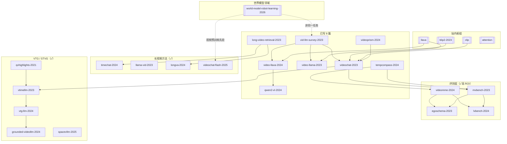
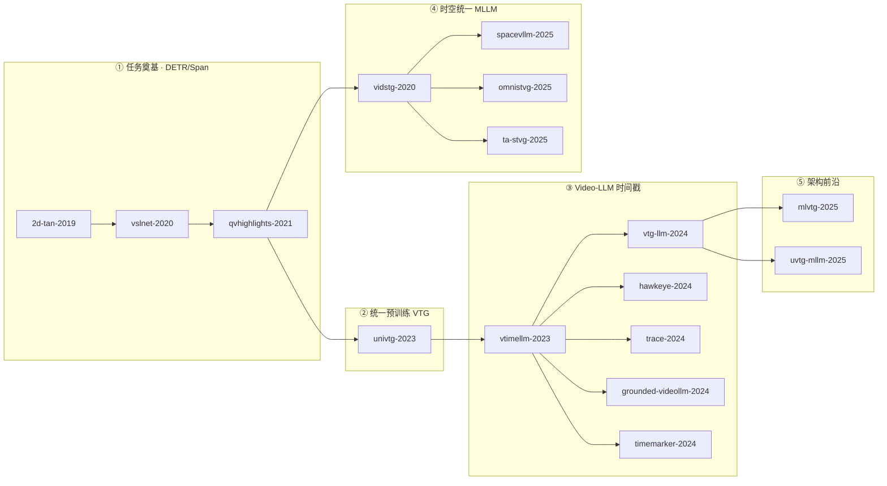

# 视频理解 / Video-LLM 主题候选

候选 **65 篇**（**65 篇 ✓ 已写** / **0 待写**），按 10 个子主题分组。覆盖 2019–2026，专注 **Video-LLM / 流式·Agent / 长视频 / 时序·时空 Grounding / 反事实·全景** 主线。

## 边界说明

| 邻域 | 分工 | 交叉引用 |
|---|---|---|
| **通用 MLLM**（图像/评测/工业对标） | → [`papers-mllm.md`](./papers-mllm.md) | `gemini-1.5` / `vila-pretrain` / `nvila` / `internvl2` 偏通用或训练管线，视频专表只链不回写 |
| **媒体基建**（转码/编解码/流媒体） | → [`projects-media.md`](./projects-media.md) | `ffmpeg` / `decord` 是数据管线，不是理解模型 |
| **机器人世界模型**（embodied rollout） | → [`world-model-robot-learning-2026-lr-notes.md`](./world-model-robot-learning-2026-lr-notes.md) | 本表偏「看懂视频再回答」；世界模型偏「预测未来画面/状态再控制」 |
| **视频生成** | → `projects-data-science-ai.md`（open-sora 等） | Sora 类生成不入本表 |
| **经典动作识别** | 已避开 | I3D / TimeSformer 偏 CV 分类 |
| **时序 grounding vs 长视频 QA** | 本表内分工 | §7–§8：前者测 referring + 长上下文检索；§8 测 query→时间戳（± 空间 tube） |

**多模态枢纽**（站内已有，本表候选应反向链）：[[llava]] / [[clip]] / [[blip2-2023]] / [[flamingo-2022]] / [[attention]]

## 已发布 ↔ 候选表映射（SSOT 对齐）

> 站点路径前缀：`/study/papers/{slug}/` · 候选来源：`data/candidates.jsonl` · atlas 子类：**机器学习 → 视频理解**

| 站内 slug | 候选表 § | candidates.jsonl | atlas 状态 | 备注 |
|---|---|---|---|---|
| `vid-llm-survey-2023` | §1 | ✓ 行存在 | ✅ v3 | 术语表枢纽 |
| `videochat-2023` | §2 | ✓ | ✅ v3 | Video-LLM 对话范式开山 |
| `video-llama-2023` | §2 | ✓ | ✅ v3 | 音视频三 Q-Former |
| `video-llava-2024` | §2 | ✓ | ✅ v3 | Alignment Before Projection |
| `qwen2-vl-2024` | §2 | ✓ | ✅ v3 | 工业动态分辨率 |
| `long-video-retrieval-2023` | §3 | ✓ | ✅ v3 | 站内标题作 R-VLM |
| `tempcompass-2024` | §3 | ✓ | ✅ v3 | 时间概念专项评测 |
| `videoprism-2024` | §6 | ✓ | ✅ v3 | 冻结 video encoder 基座 |

**数据层**：上述 8 篇均已落站；`sync-written.mjs` 后 `candidates.jsonl` 无 `topic: video-understanding` 错误 `queued` 行（专题候选尚未 extract 入库时以本表 + 磁盘 md 为准）。

## 知识网关系图



## 总览

| 子类 | 数量 | 已写 |
|---|---:|---:|
| [1. 综述与早期范式](#1-综述与早期范式) | 4 | 4 |
| [2. 对话式 Video-LLM](#2-对话式-video-llm) | 6 | 6 |
| [3. 时序建模与 token 压缩](#3-时序建模与-token-压缩) | 6 | 6 |
| [4. 统一多模态 → 视频](#4-统一多模态--视频) | 6 | 6 |
| [5. 长视频理解与训练](#5-长视频理解与训练) | 8 | 8 |
| [6. 视频 Foundation Encoder](#6-视频-foundation-encoder) | 2 | 2 |
| [7. 长视频 Benchmark 与流式理解](#7-长视频-benchmark-与流式理解) | 8 | 8 |
| [8. 时序 Grounding（VTG / STVG）](#8-时序-groundingvtg--stvg) | 16 | 16 |
| [9. 视频 Agent / 工具调用](#9-视频-agent--工具调用) | 4 | 4 |
| [10. 反事实时序 / 360° / 专项评测](#10-反事实时序--360--专项评测) | 5 | 5 |

**统计**：65 候选 = **65 已写** / 0 待写（2026-06-06 专题收齐，与 [`video-understanding-roadmap.md`](./video-understanding-roadmap.md) 一致）

### 扩充字段图例

| 字段 | 含义 |
|---|---|
| **核心贡献** | 一句话技术要点 |
| **与已写** | 相对 8 篇已写笔记：前置 / 并列 / 后继 + 具体 slug |
| **难度** | 1=入门可读 2=需 MLLM 基础 3=需 VTG/长视频背景 |
| **ROI** | 是否值得写 study 笔记：高 / 中 / 低 |

---

## 1. 综述与早期范式

| Slug | 论文 | 年 | 状态 | 核心贡献 | 与已写 | 难度 | ROI | URL |
|---|---|---:|---|---|---|:---:|:---:|---|
| `vid-llm-survey-2023` | Video Understanding with Large Language Models: A Survey | 2023 | ✓ || 第一份 Vid-LLM 系统综述：采帧、时序编码、benchmark 族谱 | **枢纽** | 1 | 高 | https://arxiv.org/abs/2312.17432 |
| `video-chatgpt-2023` | Video-ChatGPT: Towards Detailed Video Understanding via LVLMs | 2023 | ✓ || LLaVA 架构 + 视频指令微调开山；自带视频对话定量评测 | 前置→[[videochat-2023]] | 1 | 高 | https://arxiv.org/abs/2306.05424 |
| `mvbench-2023` | MVBench (+ VideoChat2 baseline) | 2023 | ✓ || static-to-dynamic 20 任务 + 三阶段 VideoChat2（同文 2311.17005） | 后继←[[videochat-2023]]；并列[[tempcompass-2024]] | 2 | 高 | https://arxiv.org/abs/2311.17005 |
| `videomme-2024` | Video-MME | 2024 | ✓ || 短/中/长（至 1h）+ 字幕/音频；2024+ Video-LLM 必报分卷 | 并列[[tempcompass-2024]]；后继←[[qwen2-vl-2024]] | 2 | 高 | https://arxiv.org/abs/2405.21075 |

## 2. 对话式 Video-LLM

| Slug | 论文 | 年 | 状态 | 核心贡献 | 与已写 | 难度 | ROI | URL |
|---|---|---:|---|---|---|:---:|:---:|---|
| `videochat-2023` | VideoChat: Chat-Centric Video Understanding | 2023 | ✓ || 视频+指令微调+对话三合一首个统一框架 | **枢纽** | 2 | 高 | https://arxiv.org/abs/2305.06355 |
| `video-llama-2023` | Video-LLaMA | 2023 | ✓ || Image/Video/Audio 三 Q-Former，解释 frame-level 不够 | 并列[[videochat-2023]] | 2 | 高 | https://arxiv.org/abs/2306.02858 |
| `video-llava-2024` | Video-LLaVA | 2024 | ✓ || Alignment Before Projection 统一图像/视频 token | 后继←[[llava]]；并列[[qwen2-vl-2024]] | 2 | 高 | https://arxiv.org/abs/2311.10122 |
| `qwen2-vl-2024` | Qwen2-VL | 2024 | ✓ || Naive Dynamic Resolution + M-RoPE 工业视频 MLLM | 后继←[[video-llava-2024]] | 2 | 高 | https://arxiv.org/abs/2409.12191 |
| `videollama2-2024` | VideoLLaMA 2 | 2024 | ✓ || STC 3D 卷积连接器 + BEATs 音频分支；音视频 QA 开源栈 | 后继←[[video-llama-2023]]；链 [[videollama2]] 项目 | 2 | 高 | https://arxiv.org/abs/2406.07476 |
| `videollama3-2025` | VideoLLaMA 3 | 2025 | ✓ || Vision-centric 四阶段训练 + 动态分辨率 + 视频 token 相似度压缩 | 后继←`videollama2-2024` | 2 | 高 | https://arxiv.org/abs/2501.13106 |

## 3. 时序建模与 token 压缩

| Slug | 论文 | 年 | 状态 | 核心贡献 | 与已写 | 难度 | ROI | URL |
|---|---|---:|---|---|---|:---:|:---:|---|
| `timechat-2024` | TimeChat | 2024 | ✓ || 滑动 Video Q-Former + 时间戳绑定；可变压缩率（CVPR 2024） | 后继←[[long-video-retrieval-2023]] | 2 | 高 | https://arxiv.org/abs/2312.02051 |
| `llama-vid-2023` | LLaMA-VID | 2023 | ✓ || context+content 双 token；小时级视频对话压缩（ECCV 2024） | 并列[[long-video-retrieval-2023]] | 2 | 高 | https://arxiv.org/abs/2311.17043 |
| `st-llm-2024` | ST-LLM | 2024 | ✓ || 时序建模直接交给 LLM，非外加 adapter | 并列[[videochat-2023]]；链[[attention]] | 2 | 中 | https://arxiv.org/abs/2404.00308 |
| `chat-univi-2023` | Chat-UniVi | 2023 | ✓ || DPC-KNN 动态 token 合并 + 事件分段 | 并列[[video-llava-2024]] | 2 | 中 | https://arxiv.org/abs/2311.08046 |
| `long-video-retrieval-2023` | Long Video Understanding with Learnable Retrieval | 2023 | ✓ || 可学习检索替代均匀采帧，O(T)→可控 context | **枢纽** | 2 | 高 | https://arxiv.org/abs/2312.04931 |
| `tempcompass-2024` | TempCompass | 2024 | ✓ || 速度/方向/顺序/属性变化四维度时间专项评测 | **枢纽** | 1 | 高 | https://arxiv.org/abs/2403.00476 |

## 4. 统一多模态 → 视频

| Slug | 论文 | 年 | 状态 | 核心贡献 | 与已写 | 难度 | ROI | URL |
|---|---|---:|---|---|---|:---:|:---:|---|
| `llava-onevision-2024` | LLaVA-OneVision | 2024 | ✓ || 单模型 image/multi-image/video 三场景 SOTA + 任务迁移涌现 | 后继←[[video-llava-2024]]、[[llava]] | 2 | 高 | https://arxiv.org/abs/2408.03326 |
| `llava-video-2024` | LLaVA-Video | 2024 | ✓ || LLaVA-Video-178K 合成指令 + SlowFast token | 后继←[[video-llava-2024]] | 2 | 高 | https://arxiv.org/abs/2410.02713 |
| `sharegpt4video-2024` | ShareGPT4Video | 2024 | ✓ || GPT-4V 高质量视频 caption 数据集 | 并列[[llava-video-2024]]；链 papers-mllm `sharegpt4v` | 2 | 中 | https://arxiv.org/abs/2406.04325 |
| `vsi-bench-2024` | Thinking in Space (VSI-Bench) | 2024 | ✓ || egocentric 空间记忆/召回专项 benchmark | 并列[[videomme-2024]] | 3 | 中 | https://arxiv.org/abs/2412.14171 |
| `qwen2-5-vl-2025` | Qwen2.5-VL | 2025 | ✓ || 绝对时间 M-RoPE + 小时级视频 + GUI agent；VideoMME SOTA 开源 | 后继←[[qwen2-vl-2024]]；链 papers-mllm 同 slug | 2 | 高 | https://arxiv.org/abs/2502.13923 |
| `internvideo2-5-2025` | InternVideo2.5 | 2025 | ✓ || LRC 长富上下文 + HiCo 压缩 + TPO；6× 记忆跨度 NIAH | 后继←`internvideo2-2024`；链 [[internvideo]] | 3 | 高 | https://arxiv.org/abs/2501.12386 |

## 5. 长视频理解与训练

| Slug | 论文 | 年 | 状态 | 核心贡献 | 与已写 | 难度 | ROI | URL |
|---|---|---:|---|---|---|:---:|:---:|---|
| `longva-2024` | Long Context Transfer from Language to Vision | 2024 | ✓ || 外推 LLM context 吃 2000 帧/200K visual tokens | 后继←[[long-video-retrieval-2023]] | 3 | 高 | https://arxiv.org/abs/2406.16852 |
| `longvila-2024` | LongVILA | 2024 | ✓ || MM-SP 序列并行 + 2M token 训练；6000 帧 NIAH | 链 papers-mllm `vila-pretrain` | 3 | 高 | https://arxiv.org/abs/2408.10188 |
| `videochat-flash-2025` | VideoChat-Flash | 2025 | ✓ || HiCo 层次压缩 ~1/50；10K 帧 NIAH 99.1% | 后继←[[videochat-2023]] | 3 | 高 | https://arxiv.org/abs/2501.00574 |
| `hour-llava-2025` | Hour-Scale Video Training | 2025 | ✓ || VideoMarathon 9700h + MemAug 1-FPS 小时级训练 | 后继←[[llava-video-2024]] | 3 | 中 | https://arxiv.org/abs/2506.05332 |
| `mlvu-2024` | MLVU | 2024 | ✓ || 9 任务类型 + 多层级时长；比 VideoMME 更重任务多样性 | 并列[[videomme-2024]] | 2 | 高 | https://arxiv.org/abs/2406.04264 |
| `moviechat-2024` | MovieChat: Dense Token → Sparse Memory | 2024 | ✓ || Atkinson-Shiffrin 式短/长时记忆；>10K 帧 + MovieChat-1K benchmark（CVPR 2024） | 并列[[long-video-retrieval-2023]]、[[llama-vid-2023]] | 2 | 高 | https://arxiv.org/abs/2307.16449 |
| `chapter-llama-2025` | Chapter-Llama | 2025 | ✓ || 语音引导采帧 + LLM 一次前向完成小时级视频章节切分（CVPR 2025） | 并列`llmvs-2025`；链长视频路线 B | 2 | 中 | https://arxiv.org/abs/2504.00072 |
| `llmvs-2025` | LLMVS (Video Summarization with LLMs) | 2025 | ✓ || M-LLM 逐帧 caption → LLM 局部打分 → 全局 self-attention 精炼摘要 | 并列`chapter-llama-2025` | 2 | 中 | https://arxiv.org/abs/2504.11199 |

> **追加理由**：`moviechat-2024` 在已写 [[long-video-retrieval-2023]]、[[vid-llm-survey-2023]] 中多次对照引用，但候选表原先遗漏。

## 6. 视频 Foundation Encoder

| Slug | 论文 | 年 | 状态 | 核心贡献 | 与已写 | 难度 | ROI | URL |
|---|---|---:|---|---|---|:---:|:---:|---|
| `videoprism-2024` | VideoPrism | 2024 | ✓ || 36M caption + 582M noisy clip 异构预训练；冻结 encoder 基座 | **枢纽** | 2 | 高 | https://arxiv.org/abs/2402.13217 |
| `internvideo2-2024` | InternVideo2: Scaling Video Foundation Models | 2024 | ✓ || 生成+判别联合缩放；8B Chat = 1B encoder + 7B LLM | 并列[[videoprism-2024]]；链 [[internvideo]] 项目 | 2 | 高 | https://arxiv.org/abs/2403.15377 |

> **追加理由**：站内 [[internvideo]] 项目笔记已深度依赖 InternVideo2，论文笔记缺失会造成「项目有、论文无」断层。

## 7. 长视频 Benchmark 与流式理解

| Slug | 论文 | 年 | 状态 | 核心贡献 | 与已写 | 难度 | ROI | URL |
|---|---|---:|---|---|---|:---:|:---:|---|
| `egoschema-2023` | EgoSchema | 2023 | ✓ || 3min egocentric + temporal certificate；250h/5K+ QA | 并列[[videomme-2024]] | 2 | 高 | https://arxiv.org/abs/2308.09126 |
| `lvbench-2024` | LVBench | 2024 | ✓ || 平均 67min 极端长视频；能输入但不懂的照妖镜（ICCV 2025） | 后继←[[long-video-retrieval-2023]] | 2 | 高 | https://arxiv.org/abs/2406.08035 |
| `longvideobench-2024` | LongVideoBench | 2024 | ✓ || referring reasoning + 字幕交错；NeurIPS 2024 D&B | 并列[[long-video-retrieval-2023]] | 3 | 中 | https://arxiv.org/abs/2407.15754 |
| `streamingbench-2024` | StreamingBench | 2024 | ✓ || 900 视频×5 时间点，模拟流式；离线 MLLM 下一 frontier | 后继←[[videomme-2024]] | 2 | 中 | https://arxiv.org/abs/2411.03628 |
| `videollm-online-2024` | VideoLLM-online | 2024 | ✓ || LIVE 框架 + Streaming EOS；CVPR 2024 流式对话开山（10+ FPS） | 前置→`livevlm-2025` | 2 | 高 | https://arxiv.org/abs/2406.11816 |
| `flash-vstream-2024` | Flash-VStream | 2024 | ✓ || STAR 双进程记忆 + VStream-QA 在线 benchmark；低延迟长流 | 并列`videollm-online-2024` | 2 | 高 | https://arxiv.org/abs/2406.08085 |
| `livevlm-2025` | LiveVLM | 2025 | ✓ || 免训练 VSB 压缩 + PaR 检索；LLaVA-OneVision 流式 KV 管理 | 后继←`videollm-online-2024`、[[llava-onevision-2024]] ✓ | 3 | 高 | https://arxiv.org/abs/2505.15269 |
| `worldsense-2025` | WorldSense | 2025 | ✓ || 1662 同步音视频 + 3172 QA；真实世界全模态理解 benchmark（ICLR 2026） | 并列[[videomme-2024]]；补 [[video-llama-2023]] 音视频评测 | 2 | 高 | https://arxiv.org/abs/2502.04326 |

## 8. 时序 Grounding（VTG / STVG）

> **VTG**：自然语言 query → 时间区间 `[t_start, t_end]`。  
> **STVG**：时间区间 + 空间 bounding box tube。  
> 评测：Charades-STA / QVHighlights / TACoS（VTG）；VidSTG / HCSTVG（STVG）。指标：R@1@IoU、mIoU、mAP。

### §8 子路线图：DETR 系 → LLM Grounding → STVG



**阅读顺序（VTG 专项）**：`qvhighlights` → `univtg` → `vtimellm` → `vtg-llm` → `grounded-videollm` → `vidstg` → `spacevllm`  
**与已写衔接**：[[tempcompass-2024]] 测「懂不懂时间概念」；§8 测「定不定得准区间」——读完 [[timechat-2024]]（✓）再进 §8 可看 Q-Former vs 显式 timestamp token 的分叉。

### 8.1 任务奠基与经典架构（4 篇）

| Slug | 论文 | 年 | 状态 | 核心贡献 | 与已写 | 难度 | ROI | URL |
|---|---|---:|---|---|---|:---:|:---:|---|
| `qvhighlights-2021` | QVHighlights | 2021 | ✓ || moment retrieval + highlight detection + Moment-DETR 基线 | 前置→§8 全线；无直接已写 | 2 | 高 | https://arxiv.org/abs/2107.09609 |
| `2d-tan-2019` | 2D Temporal Adjacent Networks | 2019 | ✓ || 2D 时间图建模 moment 邻接 | 前置→`qvhighlights` | 3 | 低 | https://arxiv.org/abs/1912.03590 |
| `vslnet-2020` | VSLNet (Span-based) | 2020 | ✓ || NLVL 改写 span-based QA + Query-Guided Highlighting | 前置→`qvhighlights` | 3 | 低 | https://arxiv.org/abs/2004.13931 |
| `univtg-2023` | UniVTG | 2023 | ✓ || 统一 moment/highlight/summarization + 大规模 VTG 预训练 | 并列`qvhighlights`；后继→`vtimellm` | 2 | 中 | https://arxiv.org/abs/2307.16715 |

### 8.2 Video-LLM 时间戳定位（6 篇）

| Slug | 论文 | 年 | 状态 | 核心贡献 | 与已写 | 难度 | ROI | URL |
|---|---|---:|---|---|---|:---:|:---:|---|
| `vtimellm-2023` | VTimeLLM | 2023 | ✓ || 首个 LLaVA 三阶段用于边界感知 VTG（CVPR 2024） | 后继←[[video-llava-2024]]、[[llava]] | 2 | 高 | https://arxiv.org/abs/2311.18445 |
| `vtg-llm-2024` | VTG-LLM | 2024 | ✓ || absolute-time token + VTG-IT-120K | 后继←`vtimellm` | 2 | 高 | https://arxiv.org/abs/2405.13382 |
| `trace-2024` | TRACE | 2024 | ✓ || 因果事件链：timestamp/saliency/caption 分步生成 | 并列`vtg-llm` | 3 | 中 | https://arxiv.org/abs/2410.05643 |
| `hawkeye-2024` | HawkEye | 2024 | ✓ || text-to-text 递归缩窗 + InternVid-G 负样本 | 并列`vtimellm` | 2 | 中 | https://arxiv.org/abs/2403.10228 |
| `grounded-videollm-2024` | Grounded-VideoLLM | 2024 | ✓ || 双流 encoder + 离散 temporal token | 后继←`vtg-llm` | 2 | 高 | https://arxiv.org/abs/2410.03290 |
| `timemarker-2024` | TimeMarker | 2024 | ✓ || Temporal Separator Token + AnyLength 采帧 | 并列[[timechat-2024]] | 2 | 中 | https://arxiv.org/abs/2411.18211 |

### 8.3 时空 Grounding 与统一空间–时间 MLLM（4 篇）

| Slug | 论文 | 年 | 状态 | 核心贡献 | 与已写 | 难度 | ROI | URL |
|---|---|---:|---|---|---|:---:|:---:|---|
| `vidstg-2020` | VidSTG (STGRN) | 2020 | ✓ || 定义 STVG + VidSTG 数据集（spatio-temporal tube） | 前置→`spacevllm` | 2 | 中 | https://arxiv.org/abs/2001.06891 |
| `spacevllm-2025` | SpaceVLLM | 2025 | ✓ || 统一 VTG + REC + STVG 于单一 MLLM | 后继←`grounded-videollm` | 3 | 高 | https://arxiv.org/abs/2503.13983 |
| `omnistvg-2025` | OmniSTVG | 2025 | ✓ || 多对象 + 交互对象全定位；BOSTVG benchmark | 后继←`vidstg` | 3 | 中 | https://arxiv.org/abs/2503.10500 |
| `ta-stvg-2025` | Target-Aware Transformer (TA-STVG) | 2025 | ✓ || 解耦「找谁」与「何时何地」；非 LLM STVG SOTA | 并列`vidstg` | 3 | 低 | https://arxiv.org/abs/2502.11168 |

### 8.4 VTG 架构前沿（2 篇）

| Slug | 论文 | 年 | 状态 | 核心贡献 | 与已写 | 难度 | ROI | URL |
|---|---|---:|---|---|---|:---:|:---:|---|
| `mlvtg-2025` | MLVTG | 2025 | ✓ || MambaAligner + 冻结 LLM 语义提纯；非 DETR 路线 | 并列`univtg`；链[[mamba]] | 3 | 中 | https://arxiv.org/abs/2506.08512 |
| `uvtg-mllm-2025` | Universal VTG with Generative MLLMs | 2025 | ✓ || 对比三种 MLLM 时间输出范式 + coarse-to-fine 长视频 VTG | 后继←`vtg-llm` | 3 | 中 | https://arxiv.org/abs/2506.18883 |

---

## 9. 视频 Agent / 工具调用

> **与 GUI Agent 区分**：`papers-mllm` 的 `mm-navigator-2023` 是手机 GUI 导航，不入本表。本节专 **长视频 QA / 记忆检索 / 工具链**。

| Slug | 论文 | 年 | 状态 | 核心贡献 | 与已写 | 难度 | ROI | URL |
|---|---|---:|---|---|---|:---:|:---:|---|
| `videoagent-longform-2024` | VideoAgent (Wang et al.) | 2024 | ✓ || LLM 作中心 agent 迭代选帧+CLIP 检索；EgoSchema 54.1% 仅 8.4 帧 | 并列[[long-video-retrieval-2023]]；链 [[egoschema-2023]] ✓ | 2 | 高 | https://arxiv.org/abs/2403.10517 |
| `videoagent-memory-2024` | VideoAgent (Fan et al.) | 2024 | ✓ || 时序+对象双记忆 + 4 工具零样本调用；逼近 Gemini 1.5 Pro | 并列`videoagent-longform-2024`（同名不同篇，slug 区分） | 3 | 高 | https://arxiv.org/abs/2403.11481 |
| `traveler-2024` | TraveLER | 2024 | ✓ || 多 LMM 模块化 agent：Traverse→Locate→Evaluate→Replan | 后继←`videoagent-longform-2024` | 2 | 中 | https://arxiv.org/abs/2404.01476 |
| `omagent-2024` | OmAgent | 2024 | ✓ || Divide-and-Conquer + rewinder 工具；24h 级 CCTV 视频 QA | 并列`videoagent-memory-2024` | 3 | 中 | https://arxiv.org/abs/2406.16620 |

## 10. 反事实时序 / 360° / 专项评测

| Slug | 论文 | 年 | 状态 | 核心贡献 | 与已写 | 难度 | ROI | URL |
|---|---|---:|---|---|---|:---:|:---:|---|
| `vinoground-2024` | Vinoground | 2024 | ✓ || 1000 对时序反事实短视频；GPT-4o ~50% vs 人 ~90% | 互补[[tempcompass-2024]]（概念 vs 顺序反事实） | 2 | 高 | https://arxiv.org/abs/2410.02763 |
| `cover-2025` | COVER | 2025 | ✓ || 抽象-具体 × 感知-认知四象限反事实视频推理 + 子问题分解 | 后继←`vinoground-2024` | 3 | 中 | https://arxiv.org/abs/2503.10691 |
| `countervqa-2025` | CounterVQA | 2025 | ✓ || 因果图标注三级难度反事实 VQA + CFGPT 跨模态蒸馏 | 并列`cover-2025` | 3 | 中 | https://arxiv.org/abs/2511.19923 |
| `dense360-2025` | Dense360 | 2025 | ✓ || ERP-RoPE + 16 万全景密集 caption/指代表述；Dense360-Bench | 链 `vsi-bench-2024` 空间邻域 | 3 | 中 | https://arxiv.org/abs/2506.14471 |
| `omnidirectional-mllm-2025` | Omnidirectional Spatial Reasoning | 2025 | ✓ || 360° ERP 全景空间推理诊断；暴露 MLLM 视角变换短板 | 并列`dense360-2025` | 3 | 低 | https://arxiv.org/abs/2505.11907 |

---

## 与 papers-mllm.md 重叠 / 迁移清单

| papers-mllm slug | 与本表关系 | 建议 |
|---|---|---|
| `gemini-1.5-2024` | 小时级视频输入的工业上限 | **保留 mllm**；视频 roadmap 路线 D 必读对照 |
| `vila-pretrain-2023` / `nvila-2024` | LongVILA 训练管线祖宗 | **保留 mllm**；写 `longvila` 时双向链 |
| `internvl2-2024` / `internvl2-5-2024` | 含视频榜但偏通用 VLM | **保留 mllm**；视频表 `internvideo2-5-2025` 链回 |
| `qwen2-5-vl-2025` | 小时级视频 + 绝对时间 grounding | **双表互链**：mllm 写工业对标，视频表写 VideoMME/VTG 榜 |
| `gemini-2-5-2025` | 3h 视频 + agentic 多模态 | **保留 mllm**；视频 roadmap 路线 D 后继 `gemini-1.5` |
| `sharegpt4v-2023` | 图像 caption 数据配方 | **保留 mllm**；与 `sharegpt4video-2024` 对照，不迁移 |
| `llava-1.5-2023` | Video-LLaVA 起点 | **保留 mllm**；已写 [[video-llava-2024]] 应链回 |
| `mme-benchmark` / `mmmu` | 图像评测 | **不迁移**；视频用 VideoMME/MVBench |
| `mllm-benchmark-survey-2024` | 含 VideoMME 分类 | **保留 mllm**；本表 `vid-llm-survey` 专视频 |

**无迁移项**：两表 slug 不重复，仅阅读路线交叉。

---

## 阅读顺序建议（与已写缺口对齐）

### 路线 A：Video-LLM 范式史（6 篇，4 篇已写）

```text
✓ vid-llm-survey → ✓ video-chatgpt → ✓ videochat → ✓ mvbench(+VideoChat2)
→ ✓ video-llava → ✓ llava-onevision
```

**缺口**：`video-chatgpt`、`mvbench`、`llava-onevision` — 补完后可接路线 B/C。

### 路线 B：长视频专项（9 篇，1 篇已写）

```text
✓ videomme → mlvu → egoschema → lvbench
→ ✓ long-video-retrieval → ✓ timechat / llama-vid / moviechat
→ longva → longvila → videochat-flash
```

**缺口**：评测三件套 `videomme`/`mlvu`/`egoschema` 优先于方法论文。

### 路线 C：评测驱动（配合 [[lmms-eval]]）

```text
videomme + mvbench + ✓ tempcompass + egoschema → 按榜单反查模型论文
```

**已具备**：[[tempcompass-2024]] + [[lmms-eval]] 项目笔记可立即开跑。

### 路线 D：工业对标 + 开源追赶（4 篇，1 篇已写）

```text
papers-mllm gemini-1.5 → ✓ qwen2-vl → internvideo2 → nvila
```

**目的**：读懂「闭源上限 vs 开源榜首」差距，不重复写 Gemini 笔记（归 mllm 表）。

### 路线 E：时序 Grounding 专项（10 篇，0 已写）

```text
qvhighlights → univtg → vtimellm → vtg-llm → grounded-videollm
→ vidstg → spacevllm
```

**前置建议**：先完成路线 A 的 [[video-llava-2024]]（已写）+ 路线 C 的 [[tempcompass-2024]]（已写）。

---

## 与站内枢纽的反向链接规划

| 枢纽 | 本表应反向引的候选 |
|---|---|
| [[llava]] | ✓ video-llava / ✓ llava-onevision / llava-video / hour-llava；VTG：vtimellm / vtg-llm / grounded-videollm |
| [[clip]] | video-chatgpt / video-llava；qvhighlights Moment-DETR 特征 |
| [[blip2-2023]] | ✓ video-llama / qvhighlights |
| [[attention]] | st-llm / longva |
| [[world-model-robot-learning-2026]] | hour-llava / sharegpt4video（视频指令数据）；**非** rollout 仿真 |
| [[tempcompass-2024]] | §8 VTG 互补：概念 vs 区间定位 |

## 配套项目候选

见 [`projects-video-understanding.md`](./projects-video-understanding.md)：`decord` / `lmms-eval` / `internvideo` / `videollama2` / `llava-next`（**5/5 已写**）

后续路线见 [`video-understanding-roadmap.md`](./video-understanding-roadmap.md)。
