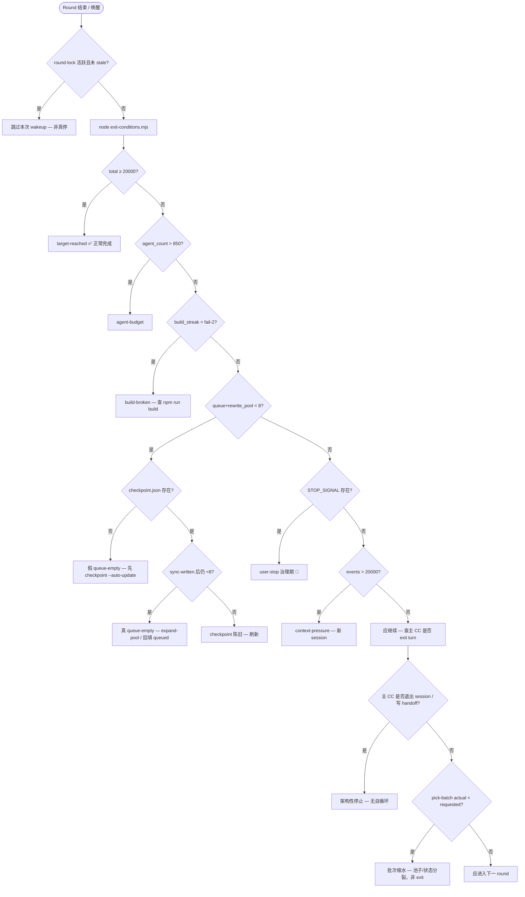

# Pipeline 停止根因调查

> **调查范围**：`STOP_SIGNAL`、`auto-push/SKILL.md`、`dispatch-batch` / `pick-batch` / `loop-status` / `round-lock`、`candidates.jsonl` 状态分布、历史 blocker、git/终端记录。  
> **约束**：未删除 `data/STOP_SIGNAL`；未 mass 写笔记；命令以只读为主。  
> **目标口径**：SKILL 写的是 **20000** 篇累计；用户口语「2000」可能指 round 数或阶段性目标——本报告以 `exit-conditions.mjs` 的 `TARGET=20000` 为准。

---

## 1. 执行摘要（2026-06-06 实测）

| 指标 | 值 | 来源 |
|---|---:|---|
| 站点已写 | **1663**（papers 932 + projects 731） | `loop-status.mjs` / 磁盘计数 |
| `candidates.jsonl` queued | **341** | 状态分布脚本 |
| `rewrite-pool.jsonl` available | **4** | 同上 |
| `priority-queue.jsonl` | **38 条全 `picked`** | 无 `status=new` 可消费 |
| `l4-backfill-queue.jsonl` | **1519** | `OPERATIONS.md` 恢复门槛 <50 |
| `data/STOP_SIGNAL` | **存在**（2026-06-05 10:07） | `ls -la` |
| `data/checkpoint.json` | **缺失** | `exit-conditions` 读默认全零 |
| `graveyard.jsonl` | **缺失** | pick-batch 无永久排除集 |
| 当前 `exit-conditions` | **`user-stop`**（刷新 checkpoint 后）/ 缺失时误报 **`queue-empty`** | 两次实测 |

**一句话结论**：流水线停止是**多层闸门叠加**——治理期 `STOP_SIGNAL` 是显性开关；更隐蔽的是 **checkpoint 缺失导致假 queue-empty**、**主 CC 无法跨 turn 自循环**、**pick/claim 与池子状态不同步**使每 round 有效 slug 远小于请求量。

---

## 2. 停止原因分类表

### 2.1 治理（Governance）

| 现象 | 根因 | 证据 | 严重度 | 修复建议 |
|---|---|---|---|---|
| `/auto-push` 启动即退 | `data/STOP_SIGNAL` 存在 | `docs/OPERATIONS.md` L68–81；`exit-conditions.mjs` L50–54；文件 `Jun 5 10:07` | **P0** | 治理期 intentional；恢复前跑 `npm run verify` + `audit-l4 --check`，**人工** `rm data/STOP_SIGNAL` |
| 恢复 checklist 卡住 | `l4-backfill-queue` **1519 > 50** | `OPERATIONS.md` L73；`wc -l data/l4-backfill-queue.jsonl` | **P1** | Phase 0 分批 backfill 或 OPERATIONS 修订门槛；勿与 new 稿 round 混跑 |
| round 末意外 push | `finalize-round.sh` 步骤 6 硬编码 `git push` | `scripts/finalize-round.sh` L102–116；用户 git 规则禁止未请求 push | **P1** | 加 `SKIP_PUSH=1` 或 `DRY_RUN=1`；治理期只用本地 cherry-pick + 本地 build |
| 过早写 handoff 终止接力 | 主 CC 在**非 exit** 时写 `SESSION-HANDOFF` 并 commit/push | `SKILL.md` L195–206 明确禁止；现存 handoff 停在 480/20000 | **P1** | 仅 `should_exit:true` 时写 handoff；round 末同一 turn 内直接开 round N+1 |

### 2.2 架构（Architecture）

| 现象 | 根因 | 证据 | 严重度 | 修复建议 |
|---|---|---|---|---|
| Session 跑几 round 后「没人接力」 | `ScheduleWakeup` 普通 CC 不可用；Cron 仅 REPL idle 触发 | `SKILL.md` L187–209 | **P0** | **路径 A**：主 CC 单 session 内连续 round，不 exit turn |
| Shell subagent 派不出 pipeline | Shell 型 subagent **无 Task tool**，不能嵌套派 general-purpose | 本会话 subagent 回报 | **P0** | 批量 round 必须由**主 CC**或带 Task 的 general-purpose 派 N 个 pipeline subagent |
| `dispatch-batch` papers-new 崩溃 | 旧脚本按 **4 类 × 2 worktree** 静态分配；papers-new 仅 2 槽，满负载时碰撞 | `dispatch-batch.mjs` L29–47、L182–183 `papers-new short` | **P2** | v3 已改用 `pick-batch` + `run-pipeline`（4 papers WT 循环 idx）；弃用 dispatch-batch 做满载 |
| round-lock 误跳过 | 前序 round <90min 仍持锁 | `round-lock.mjs` L44–48；`SKILL.md` wakeup 检查 | **P2** | stale 后 `--acquire` 自动替换；巡检 `round-lock.mjs --check` |
| pick-batch 不 claim | `pick-batch.mjs` 只标 `priority-queue` 为 `picked`，**不写** `candidates`/`rewrite-pool` 的 `claimed` | 对比 `dispatch-batch.mjs` L209–226 vs `pick-batch.mjs` L210–217 | **P1** | Phase 1 给 pick-batch 补 claim + release；或 round 末 `reconcile-claims.mjs` |

### 2.3 资源（Resources）

| 现象 | 根因 | 证据 | 严重度 | 修复建议 |
|---|---|---|---|---|
| `--count 20` 只出 14 条 | rewrite 池仅 **4 available**；priority **0 new** | `pick-batch --count 20` → `rewrite short: 4/10`, `priority short: 0/7` | **P1** | `--rewrite 0 --new 16 --no-priority`；跑 `build-rewrite-pool.mjs` 扩容 legacy |
| rewrite 配比空转 | `build-rewrite-pool` 规则偏行数，legacy 高枢纽未入池 | 池内仅 hindley-milner/plane/lexical/lottie；master plan §1.2 | **P2** | 按 master plan Phase 1 手工 seed rewrite-pool Top-20 |
| agent budget 退出 | 单 round `agent_count > 850` | `exit-conditions.mjs` L30–35 | **P3** | round_size ≤ 20（治理期已要求） |
| context-pressure 退出 | `pipeline-events.jsonl` > 20000 行 | 当前 **476** 行；阈值在 `exit-conditions.mjs` L56–64 | **P3** | 长 session 定期新开会话 + checkpoint 接力 |

### 2.4 质量（Quality）

| 现象 | 根因 | 证据 | 严重度 | 修复建议 |
|---|---|---|---|---|
| cherry-pick 成功但 main 无文件 | Layer 2 gate **行数 150–200** 拒 merge | `quality-gate.mjs` L4、L95–99；`sync-and-merge-single.mjs` L77–84 | **P1** | Writer prompt 强调 ≥150；merge 失败写 graveyard（需创建 `graveyard.jsonl`） |
| 边界 150 行仍失败 | lame 恰好 150 行过 gate；<150 硬拒 | `pipeline-events.jsonl` 末条 `lines:150` success | **P2** | 目标 **170±10**（SKILL L97）留 buffer |
| build 连续失败退出 | `build_streak === 'fail-2'` | `exit-conditions.mjs` L37–40；`finalize-round.sh` rollback | **P1** | 失败时 `npm run build` 诊断；`checkpoint` 记 streak |
| reviewer ≥2 reject → graveyard | 三评审聚合规则 | `SKILL.md` L99 | **P2** | 正常损耗；需 graveyard 文件持久化 |

### 2.5 数据同步（Data Sync）

| 现象 | 根因 | 证据 | 严重度 | 修复建议 |
|---|---|---|---|---|
| `exit-conditions` 报 queue-empty，loop-status 显示 queue 341 | **`checkpoint.json` 缺失** → 默认 `queue=0, rewrite_pool=0` | 缺失文件；`checkpoint.mjs` DEFAULT L17–28；实测 `total_queue:0` | **P0** | 每 round 末 `checkpoint.mjs --auto-update`；启动前若无文件则先跑一次 |
| candidates 状态分裂 | 除 queued 外还有 **new 213、candidate 282**；pick 只吃 `queued` | 状态分布；`pick-batch.mjs` L104–105 | **P1** | Phase 0 脚本：`new/candidate → queued`（master plan P0.2 backfill） |
| priority 已 written 仍 picked | 38 条全 `picked`，无 `new` | `priority-queue.jsonl` 状态 | **P1** | `sync-written` 后重置 priority 已落盘项为 `written` |
| claimed 遗留未落盘 | 历史 claimed 188（papers plan）；当前 claimed=0 但机制缺口仍在 | `papers-refactor-master-plan.md` L30；pick-batch 不 claim | **P1** | `reconcile-claims.mjs`：claimed 超时 → queued |
| 站点超前于 jsonl | 1663 磁盘 vs candidates written 1172 | 计数差 ~491 | **P2** | `sync-written.mjs` + candidates 回填（master plan G4） |
| graveyard 缺失 | 失败 slug 无永久排除 | 文件不存在；pick-batch L157–161 读空 | **P2** | 创建空 `graveyard.jsonl`；merge/review 失败 append |

---

## 3. 决策树：「为什么这轮停了？」



### 3.1 快速 CLI 诊断（复制即用）

```bash
# 1. 总闸
ls -la data/STOP_SIGNAL 2>&1

# 2. 退出判定（注意：无 checkpoint 时会误报 queue-empty）
node scripts/exit-conditions.mjs

# 3. 真实池子（不依赖 checkpoint）
node scripts/loop-status.mjs --summary

# 4. 本 round 能 pick 多少
node scripts/pick-batch.mjs --count 20 2>&1 | python3 -c "import json,sys;d=json.load(sys.stdin);print(d['actual'],d.get('issues'))"

# 5. 锁
node scripts/round-lock.mjs --check
```

---

## 4. 可执行修复清单 Phase 0–3

> 设计目标：**不删除 `STOP_SIGNAL` 也能半自动续跑**（本地写稿 + 本地 build + 不 push）；去掉 STOP_SIGNAL 后同一套脚本无缝切 full auto-push。

### Phase 0 — 恢复可观测性（≤30 min，零笔记）

| # | 动作 | 命令 / 产物 |
|---|------|-------------|
| 0.1 | 生成 checkpoint（消除假 queue-empty） | `node scripts/checkpoint.mjs --auto-update --round_n 0` |
| 0.2 | 刷新 written 索引 | `node scripts/sync-written.mjs` |
| 0.3 | 重建 rewrite-pool | `node scripts/build-rewrite-pool.mjs --incremental` |
| 0.4 | 创建 graveyard | `touch data/graveyard.jsonl` |
| 0.5 | 仪表盘 | `node scripts/loop-status.mjs` → `data/STATUS.md` |
| 0.6 | 候选状态审计 | 统计 `queued/new/candidate/claimed`；计划 backfill 脚本（不批量改，仅出 diff 报告） |
| 0.7 | L4 门槛评估 | `node scripts/audit-l4.mjs --check`（1519 条 — 恢复前需策略） |

### Phase 1 — 半自动续跑（STOP_SIGNAL 仍 ON）

| # | 动作 | 说明 |
|---|------|------|
| 1.1 | 本地 round 参数 | `pick-batch --count 8 --rewrite 0 --new 8 --no-priority`（绕过枯竭 rewrite + 空 priority） |
| 1.2 | 无 push finalize | `DRY_RUN=1 bash scripts/finalize-round.sh` 或手动 `npm run build` |
| 1.3 | 主 CC 单 session 连跑 | 同一 turn 循环 §1–6；**禁止** round 末 handoff |
| 1.4 | pick-batch 补 claim | 新脚本 `claim-batch.mjs`：pick 后写 claimed；失败 round 末回滚 |
| 1.5 | priority 重置 | 已落盘 slug：`picked → written`（小脚本，读 written.txt） |

### Phase 2 — 池子扩容（与 master plan 对齐）

| # | 动作 | 衔接文档 |
|---|------|----------|
| 2.1 | candidates `new/candidate → queued` | `papers-refactor-master-plan.md` §5 P0.2、`projects-refactor-master-plan.md` G4 |
| 2.2 | priority-queue 重填 tier-1/2 | `papers-refactor-master-plan.md` §5 Phase 3–4、`reading-stations` |
| 2.3 | rewrite-pool seed Top-20 枢纽 | 两 master plan §10 / §6 legacy 清单 |
| 2.4 | expand-pool 有机扩池 | `scripts/expand-pool.mjs`（queue-empty 时 SKILL 要求，M4 实装） |
| 2.5 | 在站不在 candidates 的 ~205+194 回填 | 两 master plan §1.1 双轨问题 |

### Phase 3 — 全自循环（治理解除后）

| # | 动作 | 说明 |
|---|------|------|
| 3.1 | 人工删除 STOP_SIGNAL | `OPERATIONS.md` 唯一入口；前：`npm run verify` 全绿 |
| 3.2 | finalize 恢复 push | 去掉 `DRY_RUN`；或 `SKIP_PUSH` 默认 0 |
| 3.3 | Cron 兜底 | `*/30 * * * *` 读 checkpoint，仅主 CC idle 时 `/auto-push 8` |
| 3.4 | round_size 20 → 120 渐进 | rewrite 池 >50 后再拉高 |
| 3.5 | graveyard + gate 指标进 checkpoint | `last_round_stats.gate_fail_rate`（OPERATIONS L96） |

---

## 5. 与 Master Plan 衔接

| 停止根因 | `papers-refactor-master-plan.md` | `projects-refactor-master-plan.md` |
|----------|----------------------------------|-------------------------------------|
| STOP_SIGNAL / Phase 0 暂停 | §5 Phase 0「暂停 1 round」、§5 停止条件 L416–421 | §6 执行记录后 handoff pipeline |
| queue/claimed 分裂 | §3 C2 188 claimed；§5 P0.2 backfill | §1.2 双轨 194+393；G4 池子同步 |
| rewrite 池枯竭 | §3 C4 legacy 未入池；Phase 1 8R+0N | §1.2 rewrite 失灵 3 篇；Phase 1 枢纽提质 |
| priority 消费 | §5 Phase 3–4 高 new + priority-queue | video/media queued 落盘表 §8 |
| pick 配比 | 默认 `4R+16N`，视频期 `2R+18N` | new:rewrite **50:50** §7 |
| 质量 / L4 | gate + classify Phase 5–6 | L4 1519 与 media 0/50 并行风险 |

**推荐执行顺序**：先两文档 **Phase 0 数据/sync** → 本报告 Phase 1 半自动 → master plan **Phase 1 rewrite** 与 **Phase 3 new** 分叉并行。

---

## 6. 监控与 Resume 草案

### 6.1 `loop-status` Cron（每 15 分钟）

```bash
# crontab -e
*/15 * * * * cd /Users/jason/study && node scripts/loop-status.mjs --md >> /tmp/loop-status.log 2>&1
```

告警规则（可用 `grep` / 简单脚本）：

- `queue` < 50 → WARN
- `rewrite-pool` < 8 → WARN
- `build FAIL` → PAGE
- `data/STOP_SIGNAL` 存在 → INFO（治理期预期）

### 6.2 Resume 脚本草案 `scripts/resume-pipeline.sh`

```bash
#!/usr/bin/env bash
# 半自动恢复：不碰 STOP_SIGNAL，不 push
set -euo pipefail
ROOT="$(cd "$(dirname "$0")/.." && pwd)"
cd "$ROOT"

echo "=== Phase 0 刷新 ==="
node scripts/checkpoint.mjs --auto-update
node scripts/sync-written.mjs
node scripts/build-rewrite-pool.mjs --incremental
node scripts/loop-status.mjs --summary

echo "=== 退出条件 ==="
node scripts/exit-conditions.mjs

echo "=== 锁 ==="
node scripts/round-lock.mjs --check

echo "=== 可 pick 批次（预览）==="
node scripts/pick-batch.mjs --count 8 --rewrite 0 --new 8 --no-priority 2>&1 \
  | python3 -c "import json,sys;d=json.load(sys.stdin);print('actual',d['actual'],'issues',d.get('issues'))"

if [[ -f data/STOP_SIGNAL ]]; then
  echo "STOP_SIGNAL 存在 — 全量 auto-push 仍 blocked；可主 CC 本地 round + DRY_RUN finalize"
fi
```

### 6.3 主 CC 唤醒 Prompt（跨 session）

```
读 data/checkpoint.json + scripts/exit-conditions.mjs。
若 STOP_SIGNAL：只跑 Phase 1 半自动（pick 8, DRY_RUN finalize），不 push。
否则：round-lock --check → pick-batch → N×Task pipeline → cherry-pick → finalize-round → checkpoint --auto-update → 同一 turn 下一 round。
```

---

## 7. 历史 Blocker 对照（本会话 subagent）

| Blocker | 分类 | 状态 | 缓解 |
|---------|------|------|------|
| shell subagent 不能派 Task | 架构 P0 | 未修复 | 主 CC 派 pipeline |
| dispatch-batch papers-new 2 WT 崩溃 | 架构 P2 | 已绕过 | 用 pick-batch + run-pipeline |
| quality gate <150 拒 merge | 质量 P1 | 持续 | 170±10 目标 + graveyard |
| priority 已 written 导致 pick 空 | 数据 P1 | **当前 38 picked 无 new** | priority 重置脚本 |
| candidates queued=0 vs 站点超前 | 数据 P1 | **当前 queued=341** 但 papers 仅 59 | 状态 backfill + sync-written |
| finalize-round push 用户禁止 | 治理 P1 | 持续 | DRY_RUN / SKIP_PUSH |
| claimed 遗留未落盘 | 数据 P1 | 当前 claimed=0 | pick-batch 补 claim |

---

## 8. 附录：原始数据快照

### candidates.jsonl（2018 行）

| status | count |
|--------|------:|
| written | 1172 |
| queued | 341 |
| new | 213 |
| candidate | 282 |
| blacklisted | 10 |

| area × queued | count |
|---------------|------:|
| projects | 282 |
| papers | 59 |

### exit-conditions 两次实测

```
# checkpoint 缺失时
{"should_exit":true,"reason":"queue-empty","total_queue":0}

# checkpoint --auto-update 后（STOP_SIGNAL 仍在）
{"should_exit":true,"reason":"user-stop"}
```

### git 近期

- 末批成功 merge：`pipeline-events.jsonl` 显示 svt-av1/opus/lame 等 cherry-pick 成功（150–151 行）
- 最近治理提交：`chore(governance): full quality governance — gate 1522/1522`
- `SESSION-HANDOFF.md` 仍指向 **480/20000**（2026-05-30），与当前 1663 脱节 → handoff 过期

---

*维护：每次调查或 Phase 完成后更新 §1 快照与 §7 blocker 表。*
