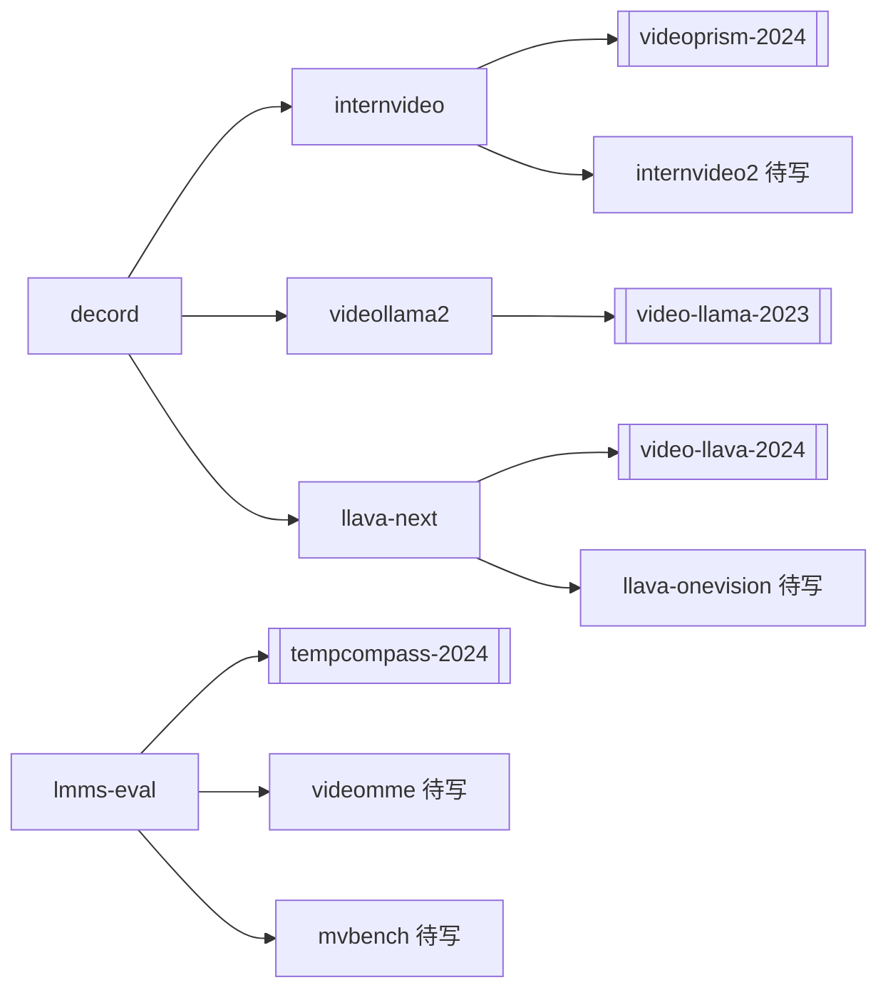

# 视频理解 / Video-LLM 工具链 项目候选

候选 **10 个**（**9 个 ✓ 已写** / **1 待写**），聚焦「理解模型 + 评测 + 数据管线 + 推理 Serving」，不收转码 / 流媒体 / WebRTC。

## 边界说明

| 邻域 | 文件 | 边界 |
|---|---|---|
| **媒体基建** | [`projects-media.md`](./projects-media.md) | ffmpeg / hls.js / WebRTC = 编解码与传输；本表 = 语义理解 |
| **AI 生成** | `projects-data-science-ai.md` | open-sora / comfyui = 生成；本表 = 理解 |
| **通用 MLLM 训练** | llava-next 兼 image | 视频 branch 归本表；纯 image 可归 data-science-ai |
| **世界模型** | [`world-model-robot-learning-2026-lr-notes.md`](./world-model-robot-learning-2026-lr-notes.md) | Cosmos/DreamGen 类 rollout 仿真不归本表 |

**与 media 池交叉（不重复收录）**：

- `decord`（本表）vs `ffmpeg`（media）：前者 Video-LLM **训练采样**；后者 **转码封装**
- `opencv`（media §9 **P1**）：可作解码 fallback；与 [[decord]] 对照读，**不迁入本表**（见 media 升格标注）
- `ffmpeg`（media **P0**）：转码/抽帧上游；理解管线只需交叉引用

Stars 量级为 2025–2026 近似值。

## 已发布 ↔ 候选表映射

| 站内 slug | candidates.jsonl | atlas 子类 | 状态 | 对应论文 |
|---|---|---|---|---|
| `decord` | ✓ | 机器学习 → 视频理解 | ✓ 已写 | （基建，无单篇论文） |
| `lmms-eval` | ✓ | 同上 | ✓ 已写 | [[tempcompass-2024]]、videomme、mvbench 等 |
| `internvideo` | ✓ | 同上 | ✓ 已写 | [[videoprism-2024]]、待写 `internvideo2-2024` |
| `videollama2` | ✓ | 同上 | ✓ 已写 | [[video-llama-2023]] |
| `llava-next` | ✓ | 同上 | ✓ 已写 | [[video-llava-2024]]、待写 llava-onevision / llava-video |
| `videochat2` | ✓ | 同上 | ✓ 已写 | [[mvbench-2023]]、[[videochat-2023]] |
| `vllm-multimodal` | ✓ | 同上 | ✓ 已写 | [[qwen2-vl-2024]]、[[livevlm-2025]] serving |
| `transformers-video` | ✓ | 同上 | ✓ 已写 | HF `Qwen2VLVideoProcessor` / `video_utils` |

**media 侧链已写**（本表不收、站 hub 交叉引用）：`ffmpeg` ✓、`opencv` ✓ — 见 [`projects-media.md`](./projects-media.md)。

## 知识网（项目 ↔ 论文）

## 总览

- **总数**：10 个（**9 已写** / **1 待写**）
- **media 交叉**（不迁入本表，**已落站**）：`ffmpeg` ✓、`opencv` ✓ — 见 [`projects-media.md`](./projects-media.md)

### 子类分布

| 子类 | 数量 | 已写 |
|---|---:|---:|
| [1. 视频解码与数据管线](#1-视频解码与数据管线) | 2 | 1 |
| [2. 多模态评测框架](#2-多模态评测框架) | 1 | 1 |
| [3. 视频基础模型套件](#3-视频基础模型套件) | 1 | 1 |
| [4. Audio-Visual LLM](#4-audio-visual-llm) | 2 | 2 |
| [5. 统一多模态主线仓库](#5-统一多模态主线仓库) | 2 | 2 |
| [6. 推理 Serving 与 HF 生态](#6-推理-serving-与-hf-生态) | 2 | 2 |

---

## 1. 视频解码与数据管线

| Slug | 项目 | Stars | 状态 | 一句话价值 | URL |
|---|---|---:|---|---|---|
| `decord` | decord | ~1k | ✓ 已写 | VideoReader + seek-by-frame；Video-LLM 数据管线事实底层 | https://github.com/dmlc/decord |
| `torchcodec` | TorchCodec | ~0.3k | 待写 P1 | PyTorch 官方视频解码；lmms-eval v0.7+ 推荐路径，与 decord 对照 | https://github.com/pytorch/torchcodec |

## 2. 多模态评测框架

| Slug | 项目 | Stars | 状态 | 一句话价值 | URL |
|---|---|---:|---|---|---|
| `lmms-eval` | LMMs-Eval | ~2k | ✓ 已写 | VideoMME / MVBench / EgoSchema 等 30+ benchmark 统一 CLI | https://github.com/EvolvingLMMs-Lab/lmms-eval |

## 3. 视频基础模型套件

| Slug | 项目 | Stars | 状态 | 一句话价值 | URL |
|---|---|---:|---|---|---|
| `internvideo` | InternVideo | ~2k | ✓ 已写 | 与 VideoPrism 对照的工业开源栈；InternVideo2 Chat 全栈 | https://github.com/OpenGVLab/InternVideo |

## 4. Audio-Visual LLM

| Slug | 项目 | Stars | 状态 | 一句话价值 | URL |
|---|---|---:|---|---|---|
| `videollama2` | VideoLLaMA 2 | ~1.5k | ✓ 已写 | [[video-llama-2023]] 可运行实现；帧+音频双输入 | https://github.com/DAMO-NLP-SG/VideoLLaMA2 |
| `videollama3` | VideoLLaMA 3 | ~0.5k | ✓ 已写 | `videollama3-2025` 官方仓；动态分辨率 + 视频 token 压缩可复现 | https://github.com/DAMO-NLP-SG/VideoLLaMA3 |

## 5. 统一多模态主线仓库

| Slug | 项目 | Stars | 状态 | 一句话价值 | URL |
|---|---|---:|---|---|---|
| `llava-next` | LLaVA-NeXT (OneVision) | ~12k | ✓ 已写 | Video-LLaVA / OneVision 代码归宿；image vs video branch 对照 | https://github.com/LLaVA-VL/LLaVA-NeXT |
| `videochat2` | Ask-Anything / VideoChat2 | ~3k | ✓ 已写 | [[mvbench-2023]] + VideoChat2 三阶段训练代码；含 vllm 加速分支 | https://github.com/OpenGVLab/Ask-Anything |

## 6. 推理 Serving 与 HF 生态

| Slug | 项目 | Stars | 状态 | 一句话价值 | URL |
|---|---|---:|---|---|---|
| `vllm-multimodal` | vLLM（多模态/视频推理） | ~30k | ✓ 已写 | Qwen2.5-VL / LLaVA-OneVision 视频 `video_url` serving；与 data-science-ai `vllm` 同仓不同笔记角度 | https://github.com/vllm-project/vllm |
| `transformers-video` | Hugging Face Transformers（视频处理器） | ~140k | ✓ 已写 | `Qwen2VLVideoProcessor` / `video_utils` 解码后端选型（decord/pyav/opencv） | https://github.com/huggingface/transformers |

---

## 阅读顺序建议

1. **跑通评测**：[[lmms-eval]] + [[tempcompass-2024]] 论文
2. **数据管线**：[[decord]] → 任选 [[internvideo]] 或 [[videollama2]] 推理 demo
3. **统一架构**：[[llava-next]] 对照 [[video-llava-2024]] 笔记读 video branch

专题论文路线见 [`video-understanding-roadmap.md`](./video-understanding-roadmap.md)。
