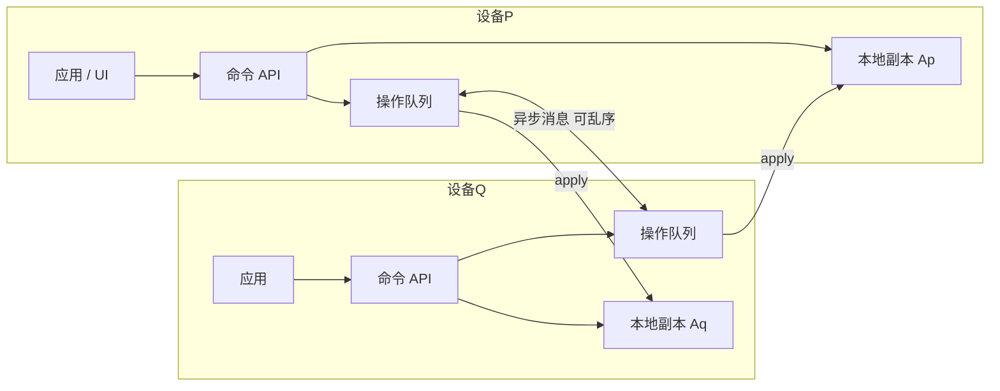

## 日常类比：共享购物清单，而不是抢遥控器

你和室友维护同一份 JSON 购物清单：`{ "grocery": ["牛奶", "鸡蛋"] }`。你在地铁里离线加了一行「面包」，他在公司同时把 `grocery` 整个清空再写入「火腿」。传统「最后写入者赢」（Last Writer Wins）像**抢遥控器**：谁最后按保存，谁覆盖全场——另一个人的改动无声消失。

这篇 2017 年 IEEE TPDS 论文（作者 Martin Kleppmann、Alastair R. Beresford，arXiv 预印本 [1608.03960](https://arxiv.org/abs/1608.03960)）提出的是另一种思路：**把合并规则写进数据结构本身**。每台设备本地随便改，改完把「操作」异步发给其他副本；网络可以乱序、重复、延迟，只要消息最终都能送达，所有副本会**自动收敛到同一棵 JSON 树**——这就是 CRDT（Conflict-Free Replicated Data Type，无冲突可复制数据类型）。

论文后来催生了 **Automerge** 库（Kleppmann 参与创建）。需要区分：Automerge 受这篇论文启发，但内部算法为性能做了大量改写；README 明确说与论文算法**并不相同**。学论文重在理解**嵌套 JSON 的 CRDT 语义**；写产品时再对照 [[yjs-crdt-overview]]、[[crdt-json]] 和 Automerge 文档。

## 论文解决什么问题

许多应用用 JSON 存状态：待办、通讯录、密码库、协同白板元数据。单机顺序修改语义清晰；**多副本并发修改**时却缺少通用答案：

| 传统做法 | 问题 |
|----------|------|
| 数据库串行化 | 弱网/离线时应用几乎不可用 |
| Last Writer Wins | 并发写会**丢数据** |
| 弹窗让用户选 | 繁琐、易错 |
| 各应用自写合并逻辑 | 难证明正确、难复用 |

论文贡献：给出**可嵌套任意深度**的 JSON CRDT——map、list、register 可组合；支持插入、删除、赋值；在客户端完成合并，**不依赖网络全序**；适合 P2P、端到端加密消息、移动弱网。附录证明**强最终一致性**（strong eventual consistency）：副本间两两合并结果与合并顺序无关。

## JSON 数据模型（论文视角）

论文把 JSON 看成一棵**可变树**：

- **Map（对象）**：子节点无序；key 不可变，value 可变；可增删键。
- **List（数组）**：子节点有**应用定义的顺序**；可插入、删除元素。
- **Leaf（叶子）**：string / number / boolean / null；视为**不可变原语**，修改 = 给 register 赋新值。

与 XML 的关键区别：JSON 允许 **list 嵌在 map 里、map 嵌在 list 里**；XML 属性只能是标量，无法表达论文 Figure 3、Figure 5 那类「同一 key 下并发创建不同类型子树」的场景。

文本协同编辑在论文里很自然：把文档建模为**字符 list**，每次键入 = `insertAfter`，删除 = `delete`（见论文 Figure 4）。

## 三条设计原则

论文 Section 1.2 明确三条原则，后文所有奇怪合并行为都由此推导：

1. **强最终一致性**：任意并发修改后，所有副本最终状态相同。
2. **不丢用户输入**：并发写尽量都保留（与 LWW 对立）。
3. **可交换性**：若一组更新按任意顺序串行执行结果相同，则并发执行也应相同。

## 架构：操作在本地产生，在网络上传播



论文假设网络只保证**最终送达**（可重试），允许延迟、乱序、重复。没有中心服务器做 OT 变换；`yield` 命令模型化「把本地操作广播给其他副本」。

## 核心概念

### 1. 命令语言（Figure 7）——不是完整编程语言，是 CRDT 的「光标 API」

| 构造 | 含义 |
|------|------|
| `doc` | 文档根 |
| `expr.get(key)` | 进入 map 的某个 key |
| `expr.idx(i)` | 进入 list 的第 i 个元素；`idx(0)` = 表头虚拟位置 |
| `expr := value` | 给 register 赋值 |
| `expr.insertAfter(value)` | 在光标所指 list 元素**之后**插入 |
| `expr.delete` | 删除 map 键或 list 元素 |
| `let x = expr` | 保存**光标**（按元素身份，不是整数下标） |
| `expr.keys` / `expr.values` | 读 map 的键集 / register 的多值集合 |

**光标按身份定位**：Figure 8 购物列表示例里，先 `insertAfter("eggs")` 得到变量 `eggs` 指向该元素；再在表头插入 `cheese` 后，`eggs` 的下标从 1 变成 2，但 `eggs.insertAfter("milk")` 仍插在 eggs **后面**——这对并发编辑至关重要（整数下标在并发插入时会漂移）。

### 2. Multi-Value Register（多值寄存器）

两人同时写同一叶子字段：

```
p: doc.get("key") := "B"
q: doc.get("key") := "C"
合并后读: doc.get("key").values => {"B", "C"}
```

字符串无法自动「语义合并」，所以**两个值都保留**，由应用层决定展示策略（例如取最新时间戳、或让用户选）。这比 Cassandra 式 LWW 安全，因为不会静默丢弃一方输入。数字可换成 **counter CRDT**；可编辑字符串可换成 **字符 list CRDT**（Figure 4）。

### 3. 嵌套 Map 的「清空 vs 子键写入」（Figure 2）

```
p: 在 colors.red 写入 "#ff0000"
q: colors := {}  再 colors.green := "#00ff00"
```

若「高层覆盖总赢」，red 会被丢掉，违反原则 2。论文语义：**清空 map 会删掉当时存在的键（如 blue）**；但并发在子层新加的 red、green **仍保留**。行为与 Riak 嵌套 map CRDT 一致。

### 4. 同一 Map Key 的并发创建（Figure 3）

两人都在离线状态下执行 `doc.get("grocery") := []` 并各自插入：

```
p: ["eggs", "ham"]
q: ["milk", "flour"]
合并: ["eggs", "ham", "milk", "flour"]  （或另一合法全序，但所有副本一致）
```

两个 list **可自动合并**；各副本内部相对顺序保留（ham 紧跟 eggs）。跨副本谁先谁后论文允许任意但确定的选择。

### 5. 类型标签：mapT / listT / regT（Figure 5）

同一 key 并发赋不同类型：

```
p: doc.get("a") := {}  再写 a.x := "y"   → 嵌套 map
q: doc.get("a") := []  再插入 "z"       → list
```

map 与 list **无法语义合并**，于是 key `a` 下并存 `mapT("a")` 与 `listT("a")` 两个命名空间——读时要带类型。这是「不丢输入」与「单一 JSON 值」之间的诚实折中。

### 6. Ordered List CRDT（RGA 家族）

论文 list 基于文献中的有序 list CRDT（如 RGA、LSEQ 等），每个插入操作带**唯一 id**，删除用 **tombstone** 标记而非物理抹除，以便并发 `insertAfter(已删元素)` 仍有锚点。Figure 4 展示了并发删 `b`、插 `x`/`y`/`z` 后所有字符都出现在最终文档中的合并结果。

### 7. 已知局限（Figure 6）

Replica p 删除 todo 某项，Replica q 同时把该项 `done := true`。合并后可能出现**只有 `done: true`、没有 `title` 的幽灵项**——因为子字段更新与父 list 删除在不同层级并发，论文选择保留所有操作痕迹。作者指出：若应用有隐式 schema（todo 必有 title），可能需要 schema 感知的合并或丢弃一侧更新——**留给后续工作**。

## 代码示例 1：用论文命令语义手搓购物清单

下面用 JavaScript **模拟论文 Figure 8** 的命令序列（非 Automerge API，重在理解语义）：

```javascript
// 伪代码：每个 insertAfter 生成带唯一 opId 的操作，光标绑定 opId 而非下标
const doc = makeEmptyJsonCrdt()

let head = doc.get('shopping').idx(0)   // 空 list 的表头
head.insertAfter('eggs')
const eggs = doc.get('shopping').idx(1) // 光标指向 opId(eggs)

head.insertAfter('cheese')              // cheese 插到表头
eggs.insertAfter('milk')              // 仍插在 eggs 后，尽管 eggs 下标已变

console.log(doc.toJSON())
// => { shopping: ['cheese', 'eggs', 'milk'] }
```

要点：**永远用稳定元素 id 当光标**，不要用「第 2 个下标」这种会在并发下失效的坐标。现代 Yjs `Y.Array`、Automerge 的 list 内部都遵循同一思想。

## 代码示例 2：双副本离线合并 multi-value register

模拟 Figure 1：两设备并发改同一字段，再交换操作日志。

```javascript
// 简化教学模型：操作 = { lamport, replicaId, path, op, value }
function applyOps(state, ops) {
  for (const op of [...ops].sort((a, b) =>
    a.lamport - b.lamport || a.replicaId.localeCompare(b.replicaId)
  )) {
    if (op.op === 'assign') {
      const cell = state.getOrCreateRegister(op.path)
      cell.add(op.value, op.lamport, op.replicaId) // multi-value：不覆盖，只追加并发写
    }
  }
  return state
}

const opP = { lamport: 2, replicaId: 'p', path: ['key'], op: 'assign', value: 'B' }
const opQ = { lamport: 2, replicaId: 'q', path: ['key'], op: 'assign', value: 'C' }

const replicaP = applyOps(emptyDoc({ key: 'A' }), [opP])
const replicaQ = applyOps(emptyDoc({ key: 'A' }), [opQ])

// 交换：各应用对方全部操作
const mergedOnP = applyOps(replicaP, [opQ])
const mergedOnQ = applyOps(replicaQ, [opP])

console.log(mergedOnP.readRegister(['key'])) // Set { 'B', 'C' }
console.log(mergedOnQ.readRegister(['key'])) // Set { 'B', 'C' } — 与顺序无关
```

真实 Automerge / 论文实现还会附带**因果依赖**（vector clock / dot clock），这里用 Lamport 时间戳 + replicaId 字典序做全序，足以说明「并发赋值 → 多值集合 → 副本一致」。

## 代码示例 3：用 Automerge 感受「JSON 式 CRDT」产品 API

生产环境应使用 [Automerge](https://github.com/automerge/automerge)（算法与论文有差异，但体验最接近「可合并的 JSON」）：

```javascript
import * as Automerge from '@automerge/automerge'

let docA = Automerge.init()
docA = Automerge.change(docA, d => { d.title = 'Hello A' })

let docB = Automerge.init()
docB = Automerge.change(docB, d => { d.title = 'Hello B' })

// 合并：无需中心服务器，顺序无关
const merged1 = Automerge.merge(docA, docB)
const merged2 = Automerge.merge(docB, docA)
// merged1 与 merged2 深度相等

console.log(Automerge.getHistory(merged1).length) // 可审计每次 change
```

若同一字段并发写产生冲突，Automerge 会保留冲突信息供应用读取（具体 API 随版本演变）；论文则用 multi-value register 在类型层面显式表达「多个并发值」。

## 与 OT、其他 CRDT 的对比

| 维度 | OT（Google Docs 类） | 平坦 CRDT（Riak 等） | 本篇 JSON CRDT |
|------|----------------------|----------------------|----------------|
| 嵌套 map+list | 需中心服务器（多数部署） | map 可嵌套，list 难与 JSON 对齐 | 任意嵌套 |
| 网络要求 | 常需全序广播 | 视类型而定 | 仅最终送达 |
| 离线编辑 | 困难 | 部分支持 | 原生支持 |
| 冲突语义 | 变换函数保证收敛 | 单类型成熟 | 组合证明 + multi-value |
| 字符串协同 | OT 主流 | 需字符 list | 建模为 list |

## 适用场景

**适合**：

- 离线优先笔记、待办、通讯录（原则 2：尽量不丢编辑）
- P2P 或 E2E 加密同步（无中心序）
- 需要 JSON 形状、又不想写 ad-hoc 合并的 local-first 应用
- 研究嵌套 CRDT 组合与形式化语义

**不太适合**：

- 银行账户、库存扣减等需要**全局不变式 + 拒绝并发**的领域（用事务 / 共识，不是 CRDT）
- 超大单字段频繁覆盖（multi-value 与元数据开销）
- 要求「并发写同一标量必须自动选一个赢家、且不能暴露多值」且不愿写应用策略的产品

## 读后带走的三句话

1. **JSON 协同难在嵌套**：不是 list CRDT 或 map CRDT 单独难，而是 map 里并发清空、子层并发写入、同 key 并发建不同类型子树——组合后仍要证明收敛。
2. **不丢输入 ≠ 不制造尴尬状态**：Figure 6 的「无标题已完成 todo」说明 CRDT 语义诚实，schema 约束要额外一层。
3. **论文是语义与证明，库是工程**：Automerge、Yjs、Loro 等在压缩、垃圾回收、字符串 CRDT 上走得更远；读论文建立「合并应发生什么」的直觉，读库解决「怎么快」。

## 延伸阅读

- 论文正式版：[IEEE TPDS 28(10), 2017](https://doi.org/10.1109/TPDS.2017.2697382)，作者页 [Martin Kleppmann](https://martin.kleppmann.com/2017/04/24/json-crdt.html)
- 本书仓库：[[crdt-json]]（同主题短笔记）、[[yjs-crdt-overview]]（工业级 JS CRDT）、[[eg-walker-collab-text-2024]]（文本 CRDT 新进展）
- 背景：Kleppmann《Designing Data-Intensive Applications》第 9 章（复制与一致性）
- 生态：[Automerge](https://automerge.org/)、[crdt.tech](https://crdt.tech/)
