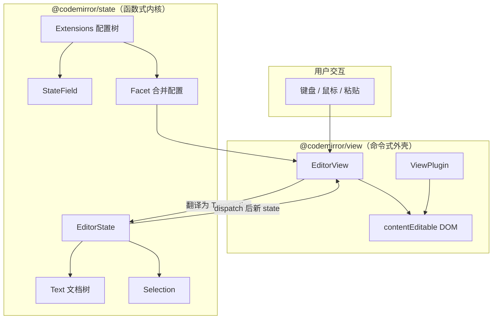

## 是什么

**CodeMirror 6** 是一套用 JavaScript 写的**模块化代码编辑器框架**。官方 [System Guide](https://codemirror.net/docs/guide/) 描述的不是「一个大类 + 一堆 option」，而是一组 npm 包拼出来的**编辑系统**：`@codemirror/state` 管数据，`@codemirror/view` 管界面，行号、撤销、语法高亮、自动补全各自是独立扩展。

日常类比：老式编辑器像**一体式电饭煲**——买回家插电就能煮饭，但想换内胆或加蒸汽功能得拆整机。CodeMirror 6 像**开放式厨房**：灶台（state）、操作台（view）、抽油烟机（语法高亮）、调料架（keymap）都是标准接口，你按菜谱（extensions 数组）自己摆。Replit、Sourcegraph、Obsidian 等产品的代码区背后，常见的就是这套架构。

和 CodeMirror 5 的最大区别：**没有「上帝类」**。第 5 版的 `CodeMirror` 类把 DOM、选项、模式全缝在一起；第 6 版把「当前编辑世界长什么样」收敛进不可变的 `EditorState`，把「怎么画、怎么响应按键」交给 `EditorView` 和扩展，思路接近 Redux / Elm 的**单向数据流**。

## 为什么重要

不理解这套架构，下面几件事很难做对：

- 为什么改 `state.doc` 不会生效，必须 `dispatch` 事务——状态是不可变的，原地赋值等于和框架对着干
- 为什么同一个功能要同时写 StateField、Facet、ViewPlugin——不同层负责不同副作用边界
- 为什么大文件打开不卡——视口（viewport）只渲染可见行，装饰和高亮也按可见范围算
- 为什么 Monaco（VS Code 内核）开箱即用却更重，而 CodeMirror 能压到几十 KB——功能默认不打包，靠扩展按需组合

## 架构全景



核心口号来自官方文档：**Functional Core, Imperative Shell**（函数式内核，命令式外壳）。内核里的一切是值；外壳负责跟 DOM 和浏览器事件打交道。

## 核心概念

### 1. 模块化包，而非单体类

最小可运行编辑器只需要三个概念：`EditorState.create` → `EditorView` → `parent` DOM 节点。行号、历史、语言包都不是默认自带的——这和 CM5「new 一个类就全有了」完全不同。

常用包分工：

| 包 | 职责 |
|----|------|
| `@codemirror/state` | 文档 `Text`、选区、事务、Facet、StateField |
| `@codemirror/view` | `EditorView`、装饰、主题、ViewPlugin |
| `@codemirror/commands` | 编辑命令与默认键位 |
| `codemirror` | `basicSetup` 捆绑常用扩展的便利包 |
| `@codemirror/lang-*` | 各语言 Lezer 语法 + 高亮 |

### 2. EditorState：不可变的「编辑世界快照」

`EditorState` 包含：

- **doc**：按行切成树形结构的 `Text`，支持廉价随机修改与按行号索引
- **selection**：一个或多个 range（光标是长度为 0 的 range）
- **configuration**：由 extensions 解析出的 Facet 值与 StateField

旧 state 在更新后**仍然完整保留**。撤销、协同编辑、时间旅行调试都受益于「手里同时握着 before / after」。

文档位置用**从 0 开始的 UTF-16 码元偏移**（与 DOM / JS 字符串一致）。换行符永远算 1 个单位。跨版本变更时，用 `ChangeSet` 和 `mapPos` 把旧坐标映射到新文档。

### 3. Transaction + dispatch：唯一的合法变更路径

用户输入、命令、插件逻辑**不直接改 state**，而是：

1. 用 `state.update({...})` 或 `view.state.update({...})` 构造 **Transaction**
2. 调用 `view.dispatch(transaction)` 提交
3. View 持有新 state，同步 DOM

Transaction 可携带：文档变更、选区变更、滚动意图、`annotations`（元数据）、`effects`（给 StateField 的自定义效果）、配置重配（Compartment）等。

### 4. Extension：功能的唯一装配单位

配置不是 `setOption('lineNumbers', true)`，而是往 `extensions` 数组里**塞值**：

- 单个扩展对象（如 `history()`）
- 嵌套数组（任意深度，配置时会被拍平）
- `Prec.high(...)` 等优先级包装

扩展可以拉入其他扩展；**相同扩展实例会去重**，重复 import 不会装两遍。冲突时先比 `Prec` 类别，再比在数组里的顺序——靠前的 keymap 优先尝试处理按键。

### 5. Facet：多路输入，单路（或数组）输出

Facet 是带合并策略的「配置插槽」：

- `tabSize`：取最高优先级的一个数
- `keymap`：合并成按优先级排序的处理器数组
- `changeFilter`：逻辑或 / 自定义 reduce

还可 `Facet.compute(["doc"], state => ...)`，在依赖字段变化时自动重算——类似带 deps 的 memo。

### 6. StateField：挂在 state 上的 reducer 状态

撤销栈、折叠信息、补全会话等**必须跟文档变更同步**的数据，应放进 `StateField.define({ create, update })`，在每次 transaction 的 `update` 里根据 `tr.docChanged`、`tr.effects` 演化。不要偷偷用模块级变量——那会跟协同、撤销、重配脱节。

### 7. ViewPlugin：视图侧的命令式钩子

需要操作 DOM、读视口、挂全局监听时，用 `ViewPlugin.fromClass`。插件在 `update` 里读 `update.docChanged` 等，**尽量不存独立真源状态**——真源应在 StateField，View 只是投影。

### 8. Decoration：改「看起来怎样」而不改 doc

四类装饰：Mark（样式）、Widget（插入 DOM）、Replace（隐藏/替换）、Line（行属性）。大文件场景下，装饰集可随 `ChangeSet` 映射，也可只装饰可见范围以省算力。

### 9. Viewport：只画看得见的行

长文档不会一次性渲染全文。View 计算可见区域 + margin，只对这部分建 `cm-line` 节点；视口外坐标查询会失败。块折叠、未换行的超长行会让「可见范围」仍很大——此时还有 `visibleRanges` API 供高亮器跳过不可见内容。

### 10. Compartment：运行时可替换的配置舱

静态 `extensions` 够用直到你要「运行时切换主题 / 语言 / 只读模式」。把可变部分包进 `Compartment.of(...)`，之后 `dispatch` 带 `reconfigure` 效果即可热替换，而不必重建整个 state。

## 代码示例

### 示例 1：最小可用编辑器（state + view + 键位）

官方 Guide 里的「最小 viable editor」：只有文档、默认键位，没有行号也没有历史。

```ts
import { EditorState } from "@codemirror/state"
import { EditorView, keymap } from "@codemirror/view"
import { defaultKeymap } from "@codemirror/commands"

const startState = EditorState.create({
  doc: "Hello World",
  extensions: [keymap.of(defaultKeymap)],
})

const view = new EditorView({
  state: startState,
  parent: document.body,
})
```

要点：`EditorView` 构造后，一切变更都应 `view.dispatch(...)`，不要对 `view.state` 做原地修改。

### 示例 2：事务、不可变 state 与坐标映射

下面演示：先 `update` 出事务，此时 view 仍是旧画面；`dispatch` 后才刷新。`mapPos` 用于在变更后找到原偏移的新位置。

```ts
// 假设 view 中文档为 "123"
const transaction = view.state.update({
  changes: { from: 0, insert: "0" },
})
console.log(transaction.state.doc.toString()) // "0123"
// 此时 view 仍显示 "123"
view.dispatch(transaction)
// 现在 DOM 显示 "0123"
```

多段变更时，所有 `from`/`to` 都相对**变更前**的文档；库在内部一次性应用 `ChangeSet`。

### 示例 3：用 StateField 统计文档修改次数

扩展作者的标准模式：`create` 给初值，`update` 里读 `tr.docChanged` 或 `tr.effects`。

```ts
import { EditorState, StateField } from "@codemirror/state"

const countDocChanges = StateField.define({
  create() {
    return 0
  },
  update(value, tr) {
    return tr.docChanged ? value + 1 : value
  },
})

const state = EditorState.create({ extensions: countDocChanges })
const next = state.update({ changes: { from: 0, insert: "." } }).state
console.log(next.field(countDocChanges)) // 1
```

### 示例 4：ViewPlugin 在角落显示文档长度

视图副作用放在 ViewPlugin；数据来自 `view.state`，不在插件里维护第二份 doc。

```ts
import { ViewPlugin } from "@codemirror/view"

const docSizePlugin = ViewPlugin.fromClass(
  class {
    dom: HTMLDivElement

    constructor(view: EditorView) {
      this.dom = view.dom.appendChild(document.createElement("div"))
      this.dom.style.cssText =
        "position: absolute; inset-block-start: 2px; inset-inline-end: 5px"
      this.dom.textContent = String(view.state.doc.length)
    }

    update(update: ViewUpdate) {
      if (update.docChanged) {
        this.dom.textContent = String(update.state.doc.length)
      }
    }

    destroy() {
      this.dom.remove()
    }
  },
)
```

### 示例 5：带 basicSetup 与 JavaScript 语言的实用配置

生产环境通常用 `codemirror` 包的 `basicSetup`，再叠加语言包：

```ts
import { EditorView, basicSetup } from "codemirror"
import { javascript } from "@codemirror/lang-javascript"

const view = new EditorView({
  extensions: [basicSetup, javascript()],
  parent: document.getElementById("editor")!,
})
```

`javascript()` 返回的是一组扩展（解析器、高亮、缩进等），体现了「一个功能 = 多扩展组合」的模式。

## 扩展作者清单

官方 Guide 总结：一个完整功能往往要组合多种机制：

| 需求 | 常用机制 |
|------|----------|
| 存状态、跟 doc 同步 | StateField + StateEffect |
| 可配置、多实例合并 | Facet（module-private + `of` / `compute`） |
| 改样式、插入 widget | Decoration + `EditorView.decorations` |
| 监听 DOM、读视口 | ViewPlugin |
| 用户操作入口 | Command + `keymap.of` |
| 运行时开关 | Compartment |

导出时推荐 `function myFeature(config?) { return [...] }`，即使暂无参数也保留函数形态，日后加配置不破坏调用方。

## 与 CodeMirror 5 / Monaco 的对照

| 维度 | CodeMirror 5 | CodeMirror 6 | Monaco |
|------|--------------|--------------|--------|
| 配置方式 | `option` 键值 | extensions 树 | `IStandaloneEditorConstructionOptions` |
| 状态模型 | 可变、封在实例里 | 不可变 `EditorState` | 可变、偏 OOP |
| 模块化 | 单包为主 | 多 @codemirror/* 包 | 单大包 |
| 默认功能 | 较多内置 | 极少，需自己拼 | 极多（接近 VS Code） |
| 包体 | 中等 | 可压到很小 | 通常数百 KB 起 |

从 CM5 迁移时：原来的 `CodeMirror` 类 ≈ `EditorView`；`getValue` / `setValue` ≈ 读 `state.doc` / `dispatch` 变更；动态改 option ≈ Compartment 重配。

## 常见坑

1. **直接赋值 `state.doc = ...`**：无效且不受支持；永远走 transaction。
2. **在 StateField 外存编辑相关状态**：撤销、协同、重配后会不同步。
3. **对视口外位置调 `coordsAtPos`**：返回不准；需滚动进视口或接受限制。
4. **手改 View 管理的 DOM**：会被下一帧重绘覆盖；用 Decoration。
5. **忘记 `view.destroy()`**：泄漏全局监听与 MutationObserver。
6. **嵌套扩展重复配置**：应用 `Prec` 与去重规则，或把配置收进 Facet 合并。

## DOM 结构速查

View 管理的结构大致为：

```html
<div class="cm-editor">
  <div class="cm-scroller">
    <!-- 行号 gutter 插在这里 -->
    <div class="cm-content" contenteditable="true">
      <div class="cm-line">...</div>
    </div>
  </div>
</div>
```

主题用 `EditorView.theme` 注入；与外部 CSS 共存时，选择器建议带 `.cm-editor` 以匹配注入样式的优先级。

## 小结

CodeMirror 6 的架构可以用三句话记住：

1. **State 是真相**：文档、选区、扩展配置全是不可变数据，变更是 Transaction。
2. **View 是投影**：把 state 画出来，把输入翻译成 transaction。
3. **一切功能是 Extension**：Facet 合并配置，StateField 存衍生状态，ViewPlugin / Decoration 接 DOM，Command 接用户意图。

先接受「没有一键全能编辑器」的心智模型，再按官方 Guide 从最小示例拼到 `basicSetup` + 语言包，最后才写自定义扩展——这条路径和文档作者的预期一致，也是社区大量生产实践验证过的入门顺序。

## 延伸阅读

- [CodeMirror System Guide](https://codemirror.net/docs/guide/) — 本文主要来源
- [Reference Manual](https://codemirror.net/docs/ref/) — API 逐项查阅
- [Configuration Example](https://codemirror.net/examples/config/) — Compartment 与动态重配
- [Migration Guide (5→6)](https://codemirror.net/docs/migration/) — 旧项目迁移对照
- 本仓库 [`projects/codemirror`](../projects/codemirror.md) — 面向实践的扩展与 Facet 案例
