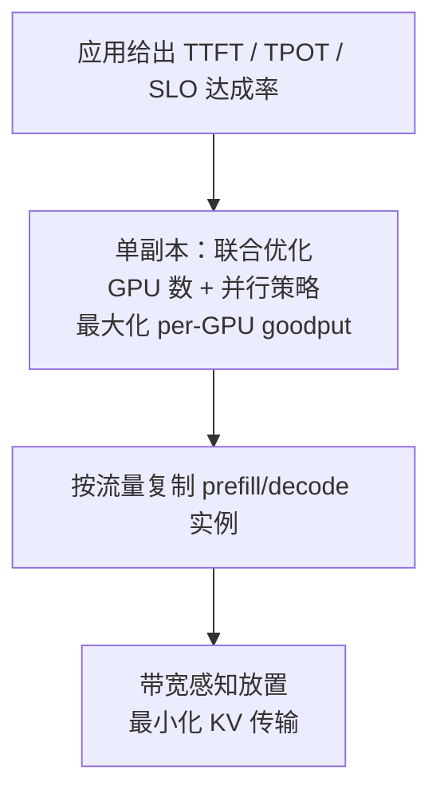

## 从日常类比开始：快餐店的「备餐台」与「出餐口」

想象一家连锁快餐店（GPU 集群）同时服务两类顾客：

1. **Prefill（备餐）**：顾客一次点了一整份套餐（prompt 可能有几百个 token）。后厨要把所有食材**同时下锅**炒好第一盘菜（生成**第一个 token**），并把配方写进账本（**KV cache**）。这一步像**大锅爆炒**——火力要猛、灶台要大，顾客最关心「多久能上第一道菜」（**TTFT，Time-To-First-Token**）。
2. **Decode（出餐）**：之后每来一位客人要**一勺汤**（每步只生成 1 个 token），厨师从账本翻旧料、加一小撮新料。火力不大，但要**不停翻账本、搬罐子**——吃显存带宽。顾客关心「每勺之间等多久」（**TPOT，Time-Per-Output-Token**），只要比人眼阅读快就行。

**传统 vLLM / Orca 式系统**把备餐和出餐**挤在同一口锅、同一批火**里炒（colocate + continuous batching）：

- 一锅大菜没炒完，旁边等一勺汤的人全得干等 → **Decode 的 TPOT 被 Prefill 拖慢**。
- 为了照顾等汤的人，大菜也不能全力炒 → **Prefill 的 TTFT 被 Decode 拖慢**。
- 更糟的是：备餐台和出餐口**共用同一套灶台编号和排班表**（资源与并行策略耦合）——给大锅菜配 4 个灶，出餐口也被迫 4 个灶，但出餐其实 1 个灶就够忙。

**DistServe 的做法**像把店拆成两个区域：

- **一楼专门备餐**（Prefill GPU 集群），按 TTFT 目标单独配灶、单独排并行策略。
- **二楼专门出餐**（Decode GPU 集群），按 TPOT 目标配灶；因为出餐 GPU 常常闲着，可以**多个一楼备餐台对应一个二楼出餐口**（例如 2:1 的 prefill:decode 实例比）。
- 备餐完成后用**传送带**把账本（KV cache）送到二楼——在现代 NVLink 集群里，这笔搬运费往往**比互相挡锅便宜得多**。

一句话：**不是让 GPU「每秒吐更多 token」（吞吐），而是在 TTFT 和 TPOT 两个 SLO 都达标的前提下，让每张 GPU 能接更多单（Goodput）——DistServe 用 PD 分离把这件事做成可优化的系统问题。**

---

## 是什么

**DistServe: Disaggregating Prefill and Decoding for Goodput-optimized Large Language Model Serving**（Zhong 等，**OSDI 2024**，arXiv:[2401.09670](https://arxiv.org/abs/2401.09670)）提出：

1. 把 LLM 推理的 **Prefill** 与 **Decode** 拆到**不同 GPU** 上，消除两阶段在同一 batch 里的**相互干扰**。
2. 针对应用给定的 **TTFT / TPOT** 延迟约束，**分别**为两阶段做 GPU 数量与**模型并行策略**的联合优化，最大化 **per-GPU goodput**。
3. 根据集群**网络带宽拓扑**，自动放置 prefill 实例与 decode 实例，最小化 KV cache 跨机传输开销。

| 项目 | 内容 |
|------|------|
| 会议 | OSDI 2024 |
| 机构 | 北京大学、StepFun、UC San Diego |
| 开源 | [github.com/LLMServe/DistServe](https://github.com/LLMServe/DistServe) |
| 对比基线 | vLLM、Orca 等 colocated 系统 |
| 效果 | 相同 SLO 下可多服务 **7.4×** 请求，或 SLO 收紧 **12.6×**；**>90%** 请求满足延迟约束 |

---

## 为什么重要

不理解 DistServe，下面几件事很难讲清楚：

- 为什么业界从 2024 年起大量出现 **PD 分离**（vLLM disagg、SGLang、Mooncake、Splitwise、Nexus 等）——DistServe 是这条线的**系统奠基论文之一**。
- 为什么在线服务要同时盯 **TTFT** 和 **TPOT**，而不能只优化「tokens/s」——聊天机器人重 TTFT，文档摘要重 TPOT，**Goodput** 才反映「在 SLO 内每张卡能接多少 rps」。
- 为什么 **Chunked Prefill** 能缓解但不能根治干扰——chunk 与 decode 混批仍会抢 SM/带宽，且长上下文下 KV 重复加载带来 **O(N²)** 访存开销。
- 为什么 Prefill 更爱 **张量并行（intra-op）**、Decode 在高负载下更爱 **流水线并行（inter-op）**——两阶段算力形态不同，**耦合部署会迫使你 over-provision**。

---

## 核心概念

### 1. 两阶段推理与双指标延迟

```text
用户 prompt (n tokens)
  → [Prefill]  并行处理全部 prompt token → 生成第 1 个 output token + 写入 KV cache
  → [Decode]   循环：每步 1 token，读全量 KV + 权重 → 直到 EOS

总延迟 ≈ TTFT + TPOT × (输出 token 数 - 1)
```

| 阶段 | 计算特征 | 典型瓶颈 | 用户关心的指标 |
|------|----------|----------|----------------|
| **Prefill** | 一次处理很多 token，大 GEMM | **Compute-bound**（长 prompt） | **TTFT** |
| **Decode** | 每步 1 token，仍要读全量权重+KV | **Memory-bandwidth-bound** | **TPOT** |

### 2. Goodput vs Throughput

| 指标 | 含义 | DistServe 优化目标 |
|------|------|-------------------|
| **Throughput** | 全系统每秒生成 token 总数 | 传统 colocated 系统常最大化它 |
| **Goodput** | 在 **SLO 达成率**（如 90%）下，**每张 GPU** 能承受的**最大请求速率** | DistServe 直接优化它 |

论文 Figure 1 的例子：13B 模型在单张 A100 上，colocated 系统 goodput 约 **1.6 rps**；若 prefill、decode **各用一张独立 GPU**，prefill 可达 **5.6 rps**、decode 可达 **10 rps**。按 **2 张 prefill + 1 张 decode** 配比，整体 goodput 可达 **10 rps（≈3.3 rps/GPU）**，比 colocated **高约 2.1×**——还没算上 DistServe 的并行与放置优化。

### 3. Colocated 系统的三大痛点

#### 3.1 Prefill–Decode 干扰

同一 batch 里混入一个 prefill job，会让整批 decode 的迭代时间**显著变长**（论文 Figure 2：batch 越大、prompt 越长，拖慢越狠）。即便调度上「先 prefill 再 decode」，**排队延迟**仍会让另一阶段违约。

**Chunked Prefill + piggyback** 只能折中：chunk 太小则 prefill 吃不满 GPU；chunk 太大则 decode 插不进 batch；且分 chunk 后 KV 要反复从 HBM 加载，长上下文下访存从 **O(N)** 恶化到 **O(N²)**。

#### 3.2 资源与并行策略耦合

- Prefill：**算力密集**，为压 TTFT 适合 **intra-op 并行**（张量切分，需 NVLink 高带宽）。
- Decode：batch 小时 GPU 利用率低；负载高时 **inter-op 流水线** 能线性扩吞吐、降排队（M/D/1 队列里执行时间越短，排队项越小）。

Colocated 时两阶段**被迫共用**同一套 GPU 数与 TP/PP 配置，往往只能 **over-provision** 才能同时满足 TTFT 和 TPOT。

#### 3.3 DistServe 的解：Disaggregation

```text
Client
  → Prefill Instance(s)   — 完整模型副本，只跑 prefill
        │ 传输 KV cache + 首 token 元数据
        ▼
  → Decode Instance(s)    — 完整模型副本，只跑 decode
        → stream tokens 回 Client
```

- **消除 batch 内干扰**：prefill batch 与 decode batch **物理隔离**。
- **独立扩缩**：prefill:decode 实例数可非 1:1（decode 常更闲，可多配 prefill 实例）。
- **独立并行**：例如 prefill 用 2-way TP，decode 用 4-stage PP——在分离架构下才「合法」。

### 4. 分阶段优化直觉（论文 §3）

**Prefill 实例**

- 存在临界输入长度 \(L_m\)：超过后单请求即可**吃满** A100；再堆 batch 只会**等比例拉长**批处理时间。
- 实际 prompt 常数百 token，prefill batch 一般**保持很小**。
- 低到达率：intra-op 并行降执行时间 → 降 TTFT；高到达率：inter-op 流水线提高**服务率** → 降排队。

**Decode 实例**

- 单步算力需求小，常**内存带宽受限**；增大 batch 可提高利用率，但会抬高 TPOT。
- 优化目标是在 TPOT SLO 内尽量**塞满 batch**。

**跨阶段通信**

- 主要传 **KV cache**（和少量元数据）。在现代 GPU 集群（NVLink / 高速 NIC）上，相对节省下来的干扰时间，通信开销**往往可接受**——DistServe 用**放置算法**让高带宽链路承担跨阶段流量。

### 5. DistServe 系统流程（论文 §4）



给定 SLO 后，DistServe：

1. 假设**单模型副本**，为 prefill、decode **分别**搜索最优 GPU 分配与张量/流水线并行组合。
2. 按目标 QPS **水平复制**实例（prefill 与 decode 副本数可不同）。
3. 根据集群拓扑把实例**映射到机器**，使跨阶段 KV 传输走**高带宽路径**。

实现上，DistServe 是叠在现有推理引擎（如 FasterTransformer）之上的**编排层**，不改模型数学。

---

## 代码示例

### 示例 1：用 Python 估算 TTFT / TPOT 与 Goodput 门槛

下面用简化模型理解：**Goodput 受 TTFT、TPOT 两个约束中更紧的那个限制**（与论文 Figure 1 思路一致）。

```python
from dataclasses import dataclass

@dataclass
class Slo:
    ttft_p90_ms: float   # Prefill 延迟上限（毫秒）
    tpot_p90_ms: float   # 每输出 token 间隔上限（毫秒）
    attainment: float = 0.90  # SLO 达成率目标

@dataclass
class PhaseProfile:
  # 简化：到达率 R 下测得的 P90 延迟（真实系统用 profiling + 排队模型）
    max_rps_at_slo: float

def goodput_per_gpu(prefill: PhaseProfile, decode: PhaseProfile,
                    prefill_gpus: int, decode_gpus: int) -> float:
    """分离部署：整体 rps 受两阶段瓶颈约束，再除以总 GPU 数"""
    prefill_capacity = prefill.max_rps_at_slo * prefill_gpus
    decode_capacity = decode.max_rps_at_slo * decode_gpus
    overall_rps = min(prefill_capacity, decode_capacity)
    total_gpus = prefill_gpus + decode_gpus
    return overall_rps / total_gpus

# 论文 Figure 1 量级（13B, A100 80GB, 输入 512 / 输出 64 的合成负载）
prefill_only = PhaseProfile(max_rps_at_slo=5.6)
decode_only = PhaseProfile(max_rps_at_slo=10.0)
colocated = 1.6  # rps / GPU

pd_ratio_2_1 = goodput_per_gpu(prefill_only, decode_only, 2, 1)
print(f"Colocated goodput/GPU:     {colocated:.2f} rps")
print(f"PD 2:1 disagg goodput/GPU: {pd_ratio_2_1:.2f} rps")
print(f"提升倍数:                  {pd_ratio_2_1 / colocated:.1f}x")
```

输出示意：`PD 2:1` 约 **3.3 rps/GPU**，相对 colocated **~2.1×**——尚未计入 DistServe 对并行策略的联合搜索，因此论文端到端还能更高。

### 示例 2：M/D/1 排队 —— 为什么 Prefill 要减执行时间

论文用 **M/D/1 队列**说明：到达率固定时，**执行时间 D 越短，排队延迟越小**，TTFT 改善**非线性**。

```python
def m_d_1_ttft(execution_time_s: float, arrival_rate: float) -> float:
    """平均 TTFT = D + 排队项（服务时间确定、到达 Poisson）"""
    util = arrival_rate * execution_time_s
    if util >= 1.0:
        return float("inf")  # 系统不稳定
    queue = (arrival_rate * execution_time_s**2) / (2 * (1 - util))
    return execution_time_s + queue

D = 0.12  # 单请求 prefill 执行 120ms（已吃满 GPU）
for rps in [2, 4, 5, 5.5]:
    ttft = m_d_1_ttft(D, rps) * 1000
    print(f"到达 {rps} rps → 平均 TTFT ≈ {ttft:.0f} ms")

# 若用 2-way 张量并行把 D 降到 0.07s：
D_fast = 0.07
print("--- 加 intra-op 并行后 ---")
for rps in [5, 6, 7]:
    ttft = m_d_1_ttft(D_fast, rps) * 1000
    print(f"到达 {rps} rps → 平均 TTFT ≈ {ttft:.0f} ms")
```

要点：**压执行时间**（算子并行、少无谓 batching）在负载升高时比「多塞几个请求进 batch」更有效——这是 DistServe 给 prefill 实例单独选 **intra-op** 的理论支撑。

### 示例 3：概念性 PD 分离调度伪代码

```python
from collections import deque
from enum import Enum, auto

class Stage(Enum):
    PREFILL = auto()
    DECODE = auto()

class DistServeScheduler:
    """教学用骨架：prefill / decode 队列与实例分离"""

    def __init__(self, prefill_engines, decode_engines):
        self.prefill_engines = prefill_engines  # 各持一份完整权重
        self.decode_engines = decode_engines
        self.wait_prefill = deque()
        self.wait_decode = deque()

    def submit(self, request_id: str, prompt_tokens: list[int]):
        self.wait_prefill.append((request_id, prompt_tokens))

    def step_prefill(self):
        if not self.wait_prefill:
            return
        engine = self._pick_idle(self.prefill_engines)
        req_id, tokens = self.wait_prefill.popleft()
        # 只跑 prefill：生成首 token + KV
        first_token, kv_handle = engine.run_prefill(tokens)
        # 经高带宽链路把 KV 交给 decode 池（放置算法决定目标机）
        decode_engine = self._route_decode(kv_handle)
        self.wait_decode.append((req_id, kv_handle, first_token, decode_engine))

    def step_decode(self):
        if not self.wait_decode:
            return
        req_id, kv, first_token, engine = self.wait_decode.popleft()
        engine.attach_kv(req_id, kv, first_token)
        # 之后由 decode 引擎逐步 generate；与 prefill 队列无 batch 交织

    def _pick_idle(self, engines):
        return min(engines, key=lambda e: e.queue_depth)

    def _route_decode(self, kv_handle):
        # 论文 placement：选带宽最高、负载最低的 decode 实例
        return min(self.decode_engines, key=lambda e: e.expected_transfer_cost(kv_handle))
```

真实 DistServe 还会在此之上做：**实例复制数、TP/PP 配置搜索、KV 传输批量化与流水线重叠**。

---

## 实践案例

### 案例 1：实时聊天（重 TTFT）

用户发一句 200 token 的问题，期望 **<300ms** 看到第一个字；后续 token 只要 **<50ms** 间隔即可。

- Colocated：高峰时 prefill 与大量 decode 混批 → **TTFT P90 爆表**。
- DistServe：prefill 专用 GPU + 小 batch + 可选 TP → TTFT 稳定；decode 池按 1:N 承接 KV。

### 案例 2：长文摘要（重 TPOT）

输入 4k token，输出 512 token。Prefill 本身就很重，但用户更在意**整段生成速度**。

- 分离后 decode 池可用 **更大 batch** 换吞吐，只要 TPOT 仍低于阅读速度。
- Prefill 侧避免无谓 multi-request batching（长序列已吃满 GPU）。

### 案例 3：与后续工作的关系

| 工作 | 与 DistServe 的关系 |
|------|---------------------|
| **vLLM + PagedAttention** | 解决 KV **怎么存**；DistServe 解决 prefill/decode **怎么摆** |
| **Mooncake (2024)** | 把 KV 当**分布式对象**调度；可视为 PD 分离 + 全局 KV 池 |
| **Nexus (2025)** | **单 GPU 内** SM 分区做 PD，避免双份权重；与 DistServe **跨 GPU** 路线互补 |
| **Chunked Prefill** | Colocated 上的缓解术；DistServe 主张**彻底拆开** |

---

## 局限与代价

1. **双份（或多份）模型权重**：prefill 与 decode 实例各持完整副本 → **显存/内存成本上升**；适合「SLO 紧、GPU 贵」的生产场景，而非极简 demo。
2. **跨机 KV 传输**：在弱网络或跨地域部署时，分离收益可能被通信吃掉；需要 DistServe 的**带宽感知放置**，或 Mooncake 类 KV 层。
3. **调度复杂度**：要维护两套队列、实例比例、并行配置；运维与自动扩缩容比单体 vLLM 更难。
4. **短 prompt / 低 QPS**：干扰不明显时，分离的固定成本可能不划算。

---

## 自测题

1. **TTFT** 和 **TPOT** 分别对应推理的哪个阶段？各对应什么典型硬件瓶颈？
2. 为什么「最大化 tokens/s」不等于「最大化 Goodput」？
3. 画一张图说明 colocated batching 如何同时恶化 TTFT 和 TPOT。
4. 论文中 prefill 实例为何倾向 **小 batch + intra-op 并行**？
5. 若 2 个 prefill GPU 配 1 个 decode GPU，decode 侧 idle 较多，说明什么？应如何调比例？

<details>
<summary>参考答案（先自己想）</summary>

1. TTFT → Prefill，常 compute-bound；TPOT → Decode，常 memory-bandwidth-bound。
2. Throughput 可牺牲尾部延迟换峰值 token 率；Goodput 要求在 SLO 达成率（如 90%）内能达到的最大请求率，直接关联成本与用户体验。
3. 同一迭代中 prefill kernel 长、decode 短，decode 等 prefill；prefill batch 里掺 decode 也增加执行时间与资源争用。
4. 长 prompt 单请求即可吃满 GPU；加 batch 只拉长批处理时间。intra-op 降单请求执行时间 D，按 M/D/1 显著降排队项。
5. decode 为瓶颈或比例偏高；应增加 decode 实例、或减少 prefill 副本，使两阶段容量匹配目标流量。

</details>

---

## 延伸阅读

- 论文 PDF：[arXiv:2401.09670](https://arxiv.org/abs/2401.09670) / [USENIX OSDI 24](https://www.usenix.org/conference/osdi24/presentation/zhong-yinmin)
- 代码：[LLMServe/DistServe](https://github.com/LLMServe/DistServe)
- 前置：[PagedAttention 与 vLLM](./paged-attention-vllm.md)（KV 分页）
- 对照：[Nexus — 单 GPU 内 PD 分离](./nexus-prefill-decode-intra-gpu.md)
- 扩展：[Mooncake — 以 KV 为中心的分层缓存](./mooncake-kvcache-2024.md)

---

## 一句话小结

**DistServe 把 LLM 服务从「一口锅炒到底」改成「备餐部 + 出餐部」：用 Prefill/Decode 物理分离消灭相互干扰，再按 TTFT/TPOT 双 SLO 分别调 GPU 与并行策略，最大化每张卡的 Goodput——在延迟约束比吞吐更重要的时代，这是比单纯加大 batch 更划算的杠杆。**
