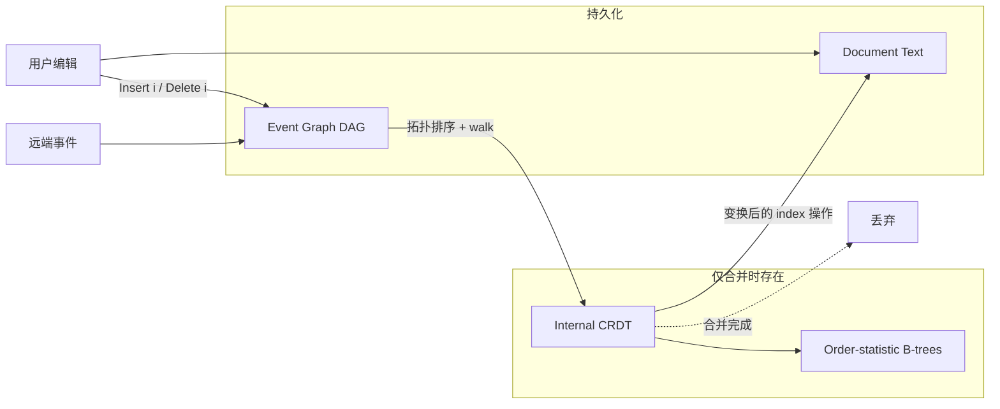

## 日常类比：Git 分支合并，但不用背整本字典

你和同事在改同一份稿子。最土的做法是**抢锁**：谁拿到锁谁改，别人等着——像会议室里只有一支马克笔。

**Google Docs** 像**魔法白板**：你插一个字、对方插一个字，最后板上自动变成合理结果。背后常用 **OT（Operational Transformation，操作变换）**：收到别人的操作时，按规则「平移」插入位置。两人各改一处时很快；但若你们**各自离线写了一万字**再合并，OT 要把你的每个操作和对方的每个操作两两变换，复杂度往往 **O(n²)** 甚至更差——论文里有一个真实 trace，OT 合并要 **1 小时**，而 Eg-walker 只要 **24 ms**。

**Yjs / Automerge** 这类 **CRDT** 像给每个字符发**永久身份证**：并发插入不靠整数下标，靠 ID 排序，合并时不用 OT 那种两两变换。代价是：身份证和墓碑（已删字符的元数据）要**一直留在内存和磁盘里**。打开一篇长文，CRDT 可能比纯文本多占 **10 倍以上** 内存——所以 Google Docs、Overleaf 仍选 OT。

**Eg-walker**（Event Graph Walker，事件图漫步者）想兼得两边优点：

- **平时**：内存里只有**纯文本**（像 OT），没有 CRDT 元数据；
- **合并并发分支时**：临时启动内部 CRDT，算完就**扔掉**（像「只借一次字典」）；
- **历史**：用**事件图（DAG）** 记录谁何时做了什么，磁盘上可高度压缩。

作者 Joseph Gentle 与 Martin Kleppmann（[[crdt-json]] 合著者之一）在 **EuroSys 2025** 发表此文，获 **Gilles Muller Best Artifact Award**；实现与 benchmark 见 [egwalker-paper](https://github.com/josephg/egwalker-paper)。

## 是什么

Eg-walker 是一种**纯文本协同编辑算法**，保证：

1. 多副本最终看到**相同字符序列**（强 eventual consistency）；
2. 并发插入在语义上满足 **maximally non-interleaving**（同位置并发插入不会乱交错成 `a1b2` 这种「拉链」）；
3. 不依赖中心服务器，可用于 **P2P**（飞机舱内、野外科考、断网协作等场景）。

每个副本持久化三块状态中的两块：

| 状态 | 内容 | 是否持久化 |
|------|------|------------|
| **Event graph** | 插入/删除操作的 DAG，带 parent 指针 | 是（紧凑二进制格式） |
| **Document state** | 当前可见文本（rope / piece table 等） | 是（可当纯文本文件） |
| **Internal state** | 临时 CRDT + 双版本 B 树 | **否**（合并完可丢弃） |

这与 [[zed-editor-collaborative]] 等「CRDT 常驻内存」的路线形成鲜明对比：Zed 把 CRDT 当一等公民；Eg-walker 把 CRDT 当**合并时的临时工**。

## 为什么重要

不懂 Eg-walker，下面问题很难答清：

1. **OT 和 CRDT 的二选一是不是永恒的？** —— 论文证明可以 hybrid：索引式操作 + 按需 CRDT。
2. **为什么 local-first / 离线写作 + Git 式分支** 在 OT 编辑器里很难做？ —— 大 divergence 下 OT 合并太慢；Eg-walker 针对 DAG 合并做到 **O(n log n)** 量级。
3. **打开 10 万字文档为何 CRDT 编辑器卡顿？** —— 要加载全部字符 ID 与墓碑；Eg-walker 稳态内存接近纯文本。
4. **和 Kleppmann 之前工作什么关系？** —— 同一「事件图 + 纯函数 replay」脉络，但 Eg-walker 是**首个**在文本上同时击败 OT（大分支）与 CRDT（内存/加载）主流弱点的实用算法。

## 架构全景



## 核心概念

### 1. 操作与事件图

基本操作（可压缩为连续 run）：

- `Insert(i, c)` — 在零基下标 `i` 插入字符 `c`
- `Delete(i)` — 删除下标 `i` 处的字符

每个操作包装成 **event**：含唯一 ID、`parents`（生成时本副本已知的 frontier 事件集）、原始 index 操作。所有 event 构成 **DAG**：

- `a → b`：a 发生在 b 之前（因果序）
- `a ∥ b`：并发，互不前驱

**Frontier（版本）** = 当前图中「没有子节点」的事件集合，可看作逻辑时钟：「我此刻认定世界长什么样」。

Figure 1 经典例子：两人从 `Helo` 出发，一人 `Insert(3,"l")`，另一人 `Insert(4,"!")`。在 User 1 侧，后到的 `Insert(4,"!")` 必须变成 `Insert(5,"!")` 才得到一致的 `Hello!`。

### 2. replay 抽象

协同算法可统一写成纯函数：

```text
doc = replay(event_graph)
```

给定已有图 `G` 与当前文档 `doc`，新事件 `e` 的增量更新是：求出一个 **index 操作** `op'`，使得 `apply(doc, op') = replay(G ∪ {e})`。OT 和 CRDT 都是求这个 `op'` 的不同实现；Eg-walker 用 **walk + 临时 CRDT** 求。

### 3. prepare 版本 vs effect 版本

内部状态同时跟踪两个「文档版本」：

- **prepare version**：解释**当前 event 原始下标**时所处的文档快照（= event 的 parents 所定义的版本）
- **effect version**：**所有已处理 event** 生效后的文档

对应三个原语（论文 Section 3.2）：

- `apply(e)` — prepare 已对齐 `e.parents` 时，把 e 纳入两版本并输出变换后的操作
- `retreat(e)` — 从 prepare 版本**撤销** e 的效果（effect 不变）
- `advance(e)` — 把已在 effect 中的 e **加回** prepare

遍历 DAG 时，常在分支间切换：先 `retreat` 掉与下一 event 并发的操作，再 `apply` 新分支，必要时 `advance` 共同祖先。这就像 Git rebase 时在多个 branch 间切来切去，但对象是**字符级操作**而非 commit。

### 4. 内部 CRDT 与双状态位

每个字符一条 record，含：

- 插入 event 的 ID
- `s_p`：prepare 中可见性（`NotInsertedYet` / `Ins` / `Del 1` / `Del 2` / …）
- `s_e`：effect 中可见性（`Ins` / `Del`）

并发插入的顺序由内部 list CRDT（实现采用 Yjs/YATA 变体）决定。`retreat`/`advance` 只改 `s_p`；`apply` 更新 `s_e` 并可能输出对**当前纯文本**的 Insert/Delete。

为 O(log n) 找「第 i 个可见字符」，论文用 **order-statistic B-tree** 维护子树内 `s_p=Ins` / `s_e=Ins` 的计数；另有一棵 **event ID → record** 的 B-tree 支持按 ID 做 retreat/advance。

### 5. Critical version 与部分 replay

**Critical version** `V`：把事件图切成 `G1 = Events(V)` 与 `G2 = G - G1`，且 `G1` 中每个事件都发生在 `G2` 每个事件之前。直观理解：**一次「全员同步点」**，之后没有与之前并发的编辑。

关键优化：

- 到达 critical version 时可**清空 internal state**；
- 若 event 与其 parent 都在 critical version 上，**无需变换**，原样输出；
- 增量合并新事件时，只需从**最近 critical version 之后**的子图 replay，前面用 **placeholder** 代表「未知长度的旧文档」。

因此典型「轮流写、很少并发」的论文/代码 trace，绝大部分 event 走**零变换快路径**；只有并发簇附近才付 CRDT 成本。

### 6. 与 OT / CRDT 的复杂度对照

| 场景 | OT | 常驻 CRDT | Eg-walker |
|------|-----|-----------|-----------|
| 在线小编辑（n 小） | 快 | 元数据常驻 | 快（常无 internal state） |
| 两分支各 n 个离线 op 合并 | O(n²)+ | O(n) 但带大常数 | **O(n log n)** |
| 稳态内存 | ~纯文本 | 文本 + ID/墓碑 | **~纯文本** |
| 打开文档 | 快 | 慢（加载 CRDT） | **快**（主要加载文本 + 压缩事件图） |
| P2P / 无服务器 | 部分 OT 受限 | 可以 | **可以** |

最坏情况下 Eg-walker 合并性能与最好 CRDT 相当；最好情况下比 CRDT 省 **1–2 个数量级**内存，比 OT 快**数个数量级**。

## 代码示例

### 示例 1：事件结构与并发插入（教学用 TypeScript）

下面不是论文官方代码，但忠实于论文 Figure 1–2 的建模方式：

```typescript
type Op =
  | { kind: "insert"; index: number; char: string }
  | { kind: "delete"; index: number };

interface Event {
  id: string;
  parents: string[]; // frontier at creation time
  op: Op;
}

// 两人从 "Helo" 并发编辑
const e3: Event = {
  id: "e3",
  parents: ["e2"], // 已知 ...Hel
  op: { kind: "insert", index: 3, char: "l" },
};

const e4: Event = {
  id: "e4",
  parents: ["e2"], // 同样基于 ...Hel，与 e3 并发
  op: { kind: "insert", index: 4, char: "!" },
};

// replay 后两边都应是 "Hello!"
// User1 侧：先应用 e3 → "Hell"，收到 e4 需变换为 Insert(5,"!")
// Eg-walker 在 walk 时通过 prepare/effect 版本自动完成该变换
```

要点：**event 里永远存原始 op**；变换只发生在应用到本地 `doc` 时，不篡改历史。

### 示例 2：prepare 版本切换（retreat / advance 骨架）

对应论文 Figure 4（`hi` → 一路径变 `hey`，另一路径变 `Hi`，最后加 `!`）的简化控制流：

```typescript
type Walker = {
  prepare: Set<string>; // event ids in prepare version
  effect: Set<string>;  // event ids in effect version
};

function movePrepare(w: Walker, targetParents: Set<string>, topo: string[]) {
  const oldEvents = expandTransitive(w.prepare);
  const newEvents = expandTransitive(targetParents);

  // 先 retreat：old - new，逆拓扑序
  for (const id of topo.filter((id) => oldEvents.has(id) && !newEvents.has(id)).reverse()) {
    retreat(id); // 更新内部 CRDT 的 s_p
    w.prepare.delete(id);
  }

  // 再 advance：new - old，拓扑序
  for (const id of topo.filter((id) => newEvents.has(id) && !oldEvents.has(id))) {
    advance(id);
    w.prepare.add(id);
  }
}

function applyEvent(w: Walker, e: Event, topo: string[]): Op {
  movePrepare(w, new Set(e.parents), topo);
  const transformed = internalApply(e); // index 从 prepare 映到 effect
  w.effect.add(e.id);
  w.prepare.add(e.id);
  return transformed;
}
```

真实实现还要维护 B 树计数、placeholder 分段、run-length 压缩等；但**控制流核心**就是：在应用每个 event 前，把 prepare 版本**精确对齐**到 `e.parents`。

### 示例 3：判断 critical version（概念代码）

```typescript
function isCriticalVersion(events: Map<string, Event>, version: Set<string>): boolean {
  const g1 = expandTransitive(version);
  const g2 = new Set([...events.keys()].filter((id) => !g1.has(id)));
  for (const a of g1) {
    for (const b of g2) {
      if (!happensBefore(events, a, b)) return false;
    }
  }
  return true;
}

// 若 isCriticalVersion 为真，可安全：
// - 丢弃 internal CRDT
// - 后续 replay 仅从该 version 之后开始
```

人类写作 trace 里 critical version 很常见（例如一次 merge 点、一次全员 sync），这是 Eg-walker **日常接近 OT 内存 footprint** 的原因。

## 存储与网络

论文 Section 3.8 描述事件图磁盘格式：利用人类编辑「连续插入/删除成 run」的特点，大量线性链可极度压缩。网络上只广播 **event**（含 parent IDs 与 op），**从不**同步 internal CRDT 状态——与 Automerge 二进制快照形成对比。

可靠广播 + 因果交付即可：若 event 的 parent 未到，先缓冲（标准 causal broadcast）。

## 评测与 artifact

作者发布 **真实编辑 trace** 套件（论文、小说、代码等），测量：

- 加载文档 CPU 时间
- 合并远端副本 CPU 时间
- 内存占用
- 磁盘文件大小

对比对象包括多种文本 CRDT 与 OT 实现。结论：Eg-walker 在「大分支合并」「打开大文档」「稳态内存」上常有好几个数量级优势；极端全并发 trace 下与最快 CRDT 同量级。

## 局限与后续

- 本文聚焦**纯文本**；富文本、表格、图形需推广（作者认为框架可扩展）。
- Internal list CRDT 的 formal non-interleaving 证明留作后续工作。
- 与生产级 Yjs/Automerge 生态的**工程整合**仍在早期（论文偏算法 + artifact，而非完整编辑器产品）。

## 与相关笔记的对照

| 笔记 | 关系 |
|------|------|
| [[crdt-json]] | 同一作者 Kleppmann 的 CRDT 理论脉络；Eg-walker 把 CRDT **降级为合并工具** |
| [[zed-editor-collaborative]] | Zed 选择常驻 CRDT buffer；Eg-walker 代表「元数据按需」的另一极 |
| [[monaco-editor-2016]] / [[codemirror-6-architecture]] | 浏览器编辑器通常外接 Yjs；若 Eg-walker 成熟，可能改变协同层选型 |

## 小结

Eg-walker 的核心洞察可以用一句话记住：

> **历史用事件图持久化，日常只保纯文本；只有遇到并发 DAG 时，才临时请 CRDT 当翻译，翻完就下班。**

它把 OT 的「轻量稳态」和 CRDT 的「任意 DAG 合并」缝在一起，并用 **critical version** 把常见「顺序写作」快路径做到极致。对想做 **离线优先、P2P、长分支合并** 的写作/代码工具，这篇 EuroSys 2025 论文值得精读原文 Appendix（正确性证明）并跑一遍 [官方 benchmark 仓库](https://github.com/josephg/egwalker-paper)。

## 延伸阅读

- 论文 PDF：[arXiv:2409.14252](https://arxiv.org/abs/2409.14252)
- 作者博文：[Martin Kleppmann — Eg-walker](https://martin.kleppmann.com/2025/04/02/eg-walker-collaborative-text.html)
- 实现与 trace：[josephg/egwalker-paper](https://github.com/josephg/egwalker-paper)
- OT 经典：[Google Docs 使用的 Jupiter OT](https://docs.google.com/)（Day-Richter, 2010 技术分享）
- List CRDT 背景：RGA、YATA、Yjs
