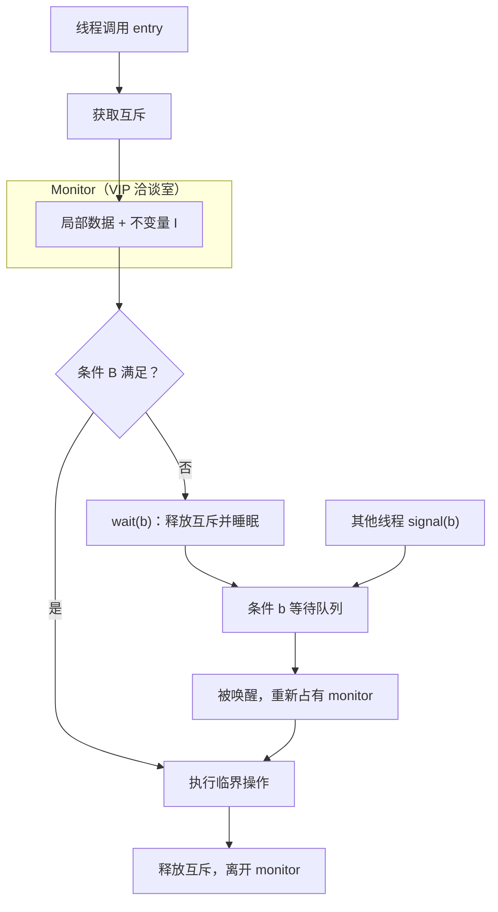

## 日常类比：银行 VIP 室，不是抢号机

想象一家银行里有一间 **VIP 洽谈室**（monitor），里面放着一本 **共享账本**（monitor 的局部数据）和一位 **客户经理**（monitor 里的过程/方法）。

规则很简单：

1. **同一时间只允许一位客户进门办事**——这就是 **互斥（mutual exclusion）**。
2. 客户进门后可以说：「我要换 100 美元，但金库暂时没现钞。」客户经理不会让客户在柜台前干瞪眼占着位子（那叫 **忙等 / spin-wait**，浪费大家时间），而是让客户 **到等候区坐下**（`wait`），并 **把 VIP 室钥匙让出来**，让下一位客户进来 **释放资源或改变状态**。
3. 当金库补好了，正在办事的客户或经理喊一声：「现钞有了！」（`signal`），等候区里 **恰好一位** 客户被叫回洽谈室继续办业务。

Hoare 在 1974 年发表的 [Monitors: An Operating System Structuring Concept](https://dl.acm.org/doi/10.1145/355620.361161)（*Communications of the ACM*，Vol. 17 No. 10，pp. 549–557）要做的，就是把这种「**数据 + 操作 + 互斥 + 有条件地睡觉与叫醒**」打包成操作系统里 **结构化并发** 的基本模块。论文在 Per Brinch Hansen 提出 monitor 雏形的基础上，形式化了 **条件变量（condition variable）** 上的 `wait` / `signal`，给出了 **基于信号量的实现思路** 和 **霍尔式证明规则**，并用有界缓冲区、闹钟、磁盘调度、读者写者等经典问题示范。

一句话：**monitor 不是又一种锁，而是「把共享状态和它该遵守的规则锁在同一个房间里」的架构手法。**

## 这篇论文在说什么

| 维度 | 内容 |
|------|------|
| 作者 | **C. A. R. Hoare**（当时 Queen's University of Belfast） |
| 发表 | CACM，**1974 年 10 月** |
| DOI | [10.1145/355620.361161](https://dl.acm.org/doi/10.1145/355620.361161) |
| 前驱 | Brinch Hansen 的 monitor 与 **Concurrent Pascal** |
| 后继影响 | Modula、C# `lock`、Java `synchronized` + `wait`/`notify`、POSIX `pthread_mutex` + `pthread_cond` |
| CR 分类 | 4.31, 4.22（操作系统、并发） |

论文要解决的核心痛点：早期多道程序用 **临界区散落各处**（Dijkstra 的 critical region 思想）或裸 **信号量**，程序员容易写出 **时间依赖 bug**——代码「偶尔能跑」取决于调度顺序。Hoare 主张：**把「保护谁」和「在什么条件下等待」写进一个文本上相邻的模块**，让不变量（invariant）可见、可证。

## 核心概念

### 1. Monitor 的组成

一个 monitor 包含：

| 部分 | 作用 |
|------|------|
| **局部变量** | 描述资源状态（如「空闲缓冲区个数」「磁盘头方向」） |
| **过程（entries）** | 外界唯一能合法改动这些变量的入口 |
| **互斥** | 任意时刻 **最多一个** 线程在执行 monitor 内代码 |
| **条件变量** | 多种「等不及了」的原因分开排队 |

调用 monitor 过程 ≈ 先拿锁进门，办完出门放锁。过程 **不应读写 monitor 外的全局变量**（否则又回到时间依赖泥潭）。

### 2. 不变量 I（monitor invariant）

程序员为 monitor 关联断言 **I**：当 **没有线程在 monitor 内执行** 时，I 必须为真。

例如有界缓冲区 monitor 里，若 `count` 是当前元素个数、`N` 是容量，则：

\[
0 \le count \le N
\]

每次 `wait` 或 `signal` **之前**，当前线程必须重新建立 I；`wait` 会暂时离开 monitor，因此 **离开前 I 必须成立**，否则别的线程进门看到烂状态。

### 3. wait 与 signal（Hoare 语义）

对条件变量 `b`，程序员关联断言 **B**（「我等的就是 B 为真」）。

**wait(b)**（在 monitor 过程内调用）：

1. 断言 **I ∧ B** 已成立；
2. 调用者 **阻塞** 并进入 `b` 的等待队列；
3. **释放 monitor 互斥**，让其他线程能 `signal` 或调用别的过程。

**signal(b)**：

1. 调用前须保证 **I ∧ B**（你要叫醒的人等的就是 B）；
2. 若 `b` 上有人等，**立刻** 唤醒其中一个（Hoare 原论文：**被唤醒者优先**，signal 方暂停，把 monitor 占有权交给被唤醒者）；
3. 若无人等，`signal` **空操作**。

这与后来 Mesa/Java 常用的语义不同：Mesa 里 `signal` 后 **唤醒者只是「有资格竞争锁」**，醒来后要 **while 重查条件**（spurious wakeup）。学 Hoare 论文时务必分清 **Hoare semantics vs Mesa semantics**。

### 4. 霍尔证明规则（论文亮点）

论文给出对称的公理化规则，便于用 **谓词演算** 推理 monitor 正确性：

| 操作 | 前置条件 | 后置条件 |
|------|----------|----------|
| `b.wait` | **I ∧ B** | （线程离开 monitor，I 已恢复） |
| `b.signal` | **I ∧ B** | **I**（B 可能被唤醒者改假，故只保留 I） |

记忆口诀：**wait 带着「不变量 + 我等什么」进去睡；signal 带着「不变量 + 条件已真」去叫人，叫完只敢保证不变量还在。**

### 5. 优先级 wait（scheduled wait）

FCFS 不够用时（如 **闹钟**：谁该先响取决于「期望唤醒时刻」），Hoare 引入带优先级参数的 wait，例如 `busy.wait(p)`：`signal` 时唤醒 **p 最小** 的等待者。论文用 **alarm clock monitor** 示范——操作系统里「到点叫醒进程」的雏形。

### 6. 与信号量的关系

论文说明 monitor **可用二元信号量实现**，与 P/V 操作 **表达能力等价**；但 monitor 在 **源码结构** 上更利于人类推理和操作系统分层（每个资源一类 monitor：缓冲区、磁盘、打印机…）。



## 代码示例 1：单资源调度（acquire / release）

最简单的 monitor 像 **二元信号量**：资源空闲与否用布尔变量 `busy` 表示。

```pascal
monitor ResourceScheduler;
  var busy: boolean;

  procedure acquire;
  begin
    if busy then
      wait(busy);   { 等「资源空闲」条件；论文里条件名与断言关联 }
    busy := true;
  end;

  procedure release;
  begin
    busy := false;
    signal(busy);   { 叫醒一位等资源的线程 }
  end;

begin   { monitor 初始化 }
  busy := false;
end;
```

使用前：`busy = false` ⇒ **I** 成立（资源可用状态一致）。`acquire` 在 `busy` 为真时 wait；`release` 置 `busy := false` 并 signal。注意：**if busy then wait** 在 Hoare 论文风格里常见；现代写法更倾向 **`while not B do wait(b)`**（Mesa），防止虚假唤醒。

## 代码示例 2：有界缓冲区（生产者—消费者）

论文用 **bounded buffer** 展示 **多个条件变量** 共用一个 monitor：生产者等「非满」，消费者等「非空」。

```pascal
monitor BoundedBuffer;
  const N = 10;
  var buffer: array[1..N] of Item;
      count, in, out: integer;
      notFull, notEmpty: condition;

  procedure put(x: Item);
  begin
    if count = N then
      wait(notFull);      { B: count < N }
    buffer[in] := x;
    in := in mod N + 1;
    count := count + 1;
    signal(notEmpty);     { 可能唤醒等数据的消费者 }
  end;

  procedure get(var x: Item);
  begin
    if count = 0 then
      wait(notEmpty);     { B: count > 0 }
    x := buffer[out];
    out := out mod N + 1;
    count := count - 1;
    signal(notFull);      { 可能唤醒等空位的生产者 }
  end;

begin
  count := 0; in := 1; out := 1;
end;
```

**不变量 I**：`0 ≤ count ≤ N`，且 `in`、`out` 在环形数组语义下一致。`put` 在满时等 `notFull`；`get` 在空时等 `notEmpty`——**两种「睡不着」的原因分开排队**，比用一个条件变量 + 复杂判断清晰得多。

## 代码示例 3：Java 里的 monitor 后裔（对比阅读）

Java 每个对象自带一把锁；`synchronized` 方法 ≈ monitor entry，`wait`/`notify` ≈ 条件变量（实际是 **Mesa 语义**）：

```java
class BoundedBuffer {
    private final Object[] buf = new Object[10];
    private int count, in, out;

    public synchronized void put(Object x) throws InterruptedException {
        while (count == buf.length)   // Mesa：必须用 while 重查
            wait();
        buf[in] = x;
        in = (in + 1) % buf.length;
        count++;
        notifyAll();                  // 唤醒可能等在 notEmpty 上的消费者
    }

    public synchronized Object get() throws InterruptedException {
        while (count == 0)
            wait();
        Object x = buf[out];
        out = (out + 1) % buf.length;
        count--;
        notifyAll();
        return x;
    }
}
```

`wait()` 释放 **this** 上的监视器锁；`notify` 不保证立即把 CPU 交给被唤醒线程——这是学 Hoare 1974 后读 Java 源码时最常踩的 **语义落差**。

## 论文中的其他示范（知道名字即可）

| 例子 | 说明 |
|------|------|
| **Alarm clock** | 按唤醒时间优先级排队；tick 过程周期性 signal |
| **Buffer pool** | 比简单有界缓冲更复杂的消息块分配 |
| **Disk head optimizer** | 减少磁头换向；展示 monitor 组织 I/O 策略 |
| **Readers / writers** | 「公平」读者写者版本；说明 monitor 也能表达复杂调度策略 |

这些例子共同说明：Hoare 关心的不只是「互斥」，而是 **把操作系统里一类资源的策略封装成可验证模块**。

## 常见误区

| 误区 | 正解 |
|------|------|
| 「有 `mutex` 就够了」 | 还需要 **条件变量** 表达「等某个谓词为真」，否则只能忙等或复杂轮询 |
| `signal` 之后条件一定仍真 | 被唤醒者往往要 **重新检查 B**；signal 方只保证调用瞬间 **I ∧ B** |
| monitor 自动防死锁 | **不防**。多 monitor、锁顺序错误仍会死锁；论文明确这是程序员责任 |
| Hoare 与 Mesa 一样 | Java/pthread 多为 Mesa；教材画 Hoare 优先唤醒图时要分清 |
| monitor 已过时 | 思想活在 **Rust `Mutex` + `Condvar`**、`std::sync`、Go 里 channel 背后的设计讨论中 |

## 与前后文献的关系

```text
Dijkstra (1965) 信号量
       ↓
Brinch Hansen (1970s) monitor 雏形 + Concurrent Pascal
       ↓
Hoare (1974) 本文 — 条件变量、证明规则、OS 结构化
       ↓
Mesa/Cedar (1980) signal 语义调整 → 影响 Java
       ↓
现代：pthread、C++、Rust、C# lock + Monitor 类
```

同一时期的 **Lamport (1974)** 面包店算法、**Coffman (1971)** 死锁条件等，与 monitor 一起构成操作系统并发课的「经典三角」。

## 读懂论文的抓手

1. **先画不变量 I**：monitor 外（无人 inside）什么必须为真？
2. **每个条件变量写清 B**：`notFull` ⇔ `count < N`，`notEmpty` ⇔ `count > 0`。
3. **标出 wait 前是否已建立 I∧B**；signal 前是否已让 B 对等待者成立。
4. **问自己用的是 Hoare 还是 Mesa**：实现不同，伪代码里的 `if` vs `while` 就不同。

## 延伸阅读

- 原文 PDF：[Hoare, CACM 1974](https://dl.acm.org/doi/10.1145/355620.361161)（机构订阅）；技术报告 [Stanford CS-TR-73-401](http://i.stanford.edu/pub/cstr/reports/cs/tr/73/401/CS-TR-73-401.pdf)
- 概念综述：[Wikipedia — Monitor (synchronization)](https://en.wikipedia.org/wiki/Monitor_(synchronization))
- Brinch Hansen, *The Architecture of Concurrent Programs* (1977) — monitor 在语言里的落地
- Hoare, *Communicating Sequential Processes* (CSP, 1978) — 另一条并发哲学路线
- Andrews & Schneider, *Concepts and Notations for Concurrent Programming* (1983) — 统一 monitor / message / remote procedure 术语

## 小结

Hoare 1974 把 **「共享数据 + 互斥入口 + 条件等待」** 从操作系统黑客经验提炼成 **可证明的结构化原语**。你不必手写 Pascal monitor 才能在工程里受益：理解 **不变量、条件变量、wait/signal 契约**，就能读懂今天代码里的 `synchronized`、`pthread_cond_wait`、以及为什么 **「先改状态再 signal」** 几乎是并发模块的默认纪律。这篇论文的价值，在于它教会我们 **把并发控制当成模块设计问题，而不是到处打补丁的锁补丁。**
