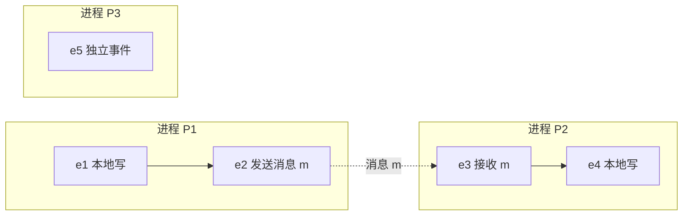

## 日常类比：三个城市里的侦探，没有统一的「现在」

想象三位侦探分别在北京、上海、广州办案。他们**没有共享一块挂钟**——各自手表每天会快或慢几秒，电话和快递也要几小时才到。

某天发生了一桩连环案：

1. 北京侦探在 9:00 发现线索 A，立刻发电报给上海；
2. 上海侦探在 8:55（自己的表）收到电报——按他的表，**收信比发信还早**；
3. 广州侦探全程没跟任何人联系，在 9:10 独立发现了线索 B。

你能说「A 一定发生在 B 之前」吗？**不能**——北京和广州从未交换过信息，他们的发现可能是**真正同时、互不相干**的。你只能确定：

- 在同一位侦探的笔记本里，**先写的页码一定在前**；
- **发电报这件事，一定发生在对方收电报之前**（消息把因果链串起来）；
- 若 A 影响 B、B 影响 C，则 A 间接影响 C（传递性）。

Leslie Lamport 在 1978 年发表的 [Time, Clocks, and the Ordering of Events in a Distributed System](https://lamport.azurewebsites.net/pubs/time-clocks.pdf)（CACM，8 页）做的，就是把这种**侦探式推理**变成计算机里可运行的规则：在分布式系统里**放弃「绝对同时」**，改用 **happened-before（先发生于）** 描述因果，再用 **逻辑时钟** 给事件编号，最后把偏序**拉直成全局总序**——这是 Kafka、Raft、Git、Spanner 等系统时间观的共同祖先。

Lamport 本人后来回忆：灵感来自狭义相对论——**没有所有观察者都同意的全局时间**，只有与因果相容的偏序；Johnson & Thomas 的副本同步笔记提供了「用时间戳排序消息」的雏形，他把它形式化并修正了会破坏因果的漏洞。

## 是什么

**分布式系统**（论文定义）：多个空间上分离的进程，靠**交换消息**通信；当消息延迟与进程内事件间隔**不可忽略**时，就是「分布式的」。单机多核、多进程也算——因为调度顺序不可预测。

论文回答四个层层递进的问题：

| 层次 | 问题 | 论文给出的工具 |
|------|------|----------------|
| 1 | 两个事件谁在先？ | **Happened-before（→）** 偏序 |
| 2 | 如何用数字标记先后？ | **逻辑时钟**（Lamport 时间戳） |
| 3 | 算法需要「任意两事件都能比大小」怎么办？ | **全序（⇒）**：时间戳 + 进程 ID 打破平局 |
| 4 | 用户眼里「真实时间」和逻辑序冲突怎么办？ | **物理时钟同步** + 漂移上界 |

一句话：**不是让全世界的钟对齐，而是让「因果上必须先发生的事件」在编号上永远更小。**

## 核心概念

### 1. Happened-before（→）：因果偏序

对系统中任意事件 `a`、`b`，定义 `a → b`（a happens-before b）当且仅当：

1. **同一进程内**：若 `a` 在 `b` 之前发生，则 `a → b`；
2. **消息传递**：若 `a` 是某条消息的发送，`b` 是该消息的接收，则 `a → b`；
3. **传递性**：若 `a → b` 且 `b → c`，则 `a → c`。

若 `a ↛ b` 且 `b ↛ a`，则 `a` 与 `b` **并发（concurrent）**，记作 `a ∥ b`——**谁也没法单凭本地信息断定先后**。



上图中：`e1 → e2 → e3 → e4`；`e5` 与 `e1…e4` 中任一事件都可能是并发的。

### 2. 逻辑时钟：给事件贴递增编号

每个进程 `P_i` 有一个逻辑时钟 `C_i`（可以只是内存里的整数计数器，**不必接真实硬件钟**）。

**时钟条件（Clock Condition）**：若 `a → b`，则 `C(a) < C(b)`。

保证该条件的两条实现规则（论文 IR1、IR2）：

- **IR1**：进程每发生一个事件，先把本地时钟 `C_i` **加 1**，再给该事件打上当前值；
- **IR2**：进程 `P_i` 发送消息时，把当前 `C_i` **附在消息上**；`P_j` 收到后设  
  `C_j := max(C_j, 消息时间戳) + 1`，再处理该接收事件。

注意：**`C(a) < C(b)` 推不出 `a → b`**——并发事件的时间戳也可能一大一小，这是工程里「幽灵因果」误判的根源。

### 3. 全序（⇒）：时间戳 + 进程 ID

互斥、状态机复制等算法需要**任意两事件都能比较**。定义全序 `a ⇒ b`：

- 若 `C(a) < C(b)`，则 `a ⇒ b`；
- 若 `C(a) = C(b)`，则 **进程 ID 更小** 的事件排前。

全序与 `→` **一致**：若 `a → b`，则必有 `a ⇒ b`。

### 4. 应用：分布式互斥（论文 Section 3）

论文用全序实现了一个**分布式资源锁**（假设消息可靠、进程不故障）：

1. 想进临界区的进程广播带时间戳的 `REQUEST`；
2. 本地把请求放入按 `⇒` 排序的队列；
3. 对队列中**排在最前的自己的请求**，若已从**所有其他进程**收到时间戳**更大**的消息（说明已「见过」更晚的请求），则获得锁；
4. 退出时广播 `RELEASE`。

关键洞见：**全序让多副本按同一顺序回放命令**——这就是后来 **State Machine Replication（SMR）** 与 [[paxos]]、[[raft]] 的思想源头。

### 5. 物理时钟（论文后半部分）

若系统事件还包含**电话、用户口头通知**等带外（out-of-band）因果，纯逻辑序可能与用户感知的真实时间矛盾——论文称为 **anomalous behavior**。

于是引入物理时钟，要求更强的 **Strong Clock Condition**：对所有可能被带外渠道关联的 `a → b`，有 `C(a) < C(b)`。在时钟精度 `ρ`、消息最小传输时间 `μ` 等假设下，论文推导了时钟漂移的**上界**——这是后来 **NTP**（[[ntp-mills-1991]]）等协议的理论远亲。

## 代码示例 1：逻辑时钟（IR1 + IR2）

下面用 Python 模拟两个进程的逻辑时钟；`send` / `recv` 代表消息传递。

```python
class LamportClock:
    def __init__(self, pid: int):
        self.pid = pid
        self.time = 0

    def local_event(self) -> tuple[int, int]:
        """IR1：本地事件前时钟 +1"""
        self.time += 1
        return (self.time, self.pid)

    def send(self) -> tuple[int, int]:
        self.time += 1
        return (self.time, self.pid)  # 时间戳随消息发出

    def recv(self, msg_ts: int) -> tuple[int, int]:
        """IR2：接收时对齐并 +1"""
        self.time = max(self.time, msg_ts) + 1
        return (self.time, self.pid)

    @staticmethod
    def total_order(a: tuple[int, int], b: tuple[int, int]) -> int:
        """全序：先比时间戳，再比 pid"""
        if a[0] != b[0]:
            return -1 if a[0] < b[0] else 1
        if a[1] != b[1]:
            return -1 if a[1] < b[1] else 1
        return 0


# 模拟：P0 发消息给 P1
p0, p1 = LamportClock(0), LamportClock(1)
t_send = p0.send()           # P0: (1, 0)
t_recv = p1.recv(t_send[0])  # P1: max(0,1)+1 = 2 → (2, 1)
assert t_send[0] < t_recv[0]  # 发送 happens-before 接收 ⇒ 时间戳严格递增
```

**读代码时记住**：`recv` 里的 `max` 把「对方已经走过的因果历史」合并进本地计数器，就像侦探收到电报后，把对方笔记本上的页码也对齐到自己的台账里。

## 代码示例 2：用全序实现简化的分布式请求队列

下面演示论文互斥算法的**排序核心**（省略网络广播与 ACK 细节）：每个进程维护全局请求队列，按 `(lamport_ts, pid)` 排序，队首且已「同步」的请求获得锁。

```python
from dataclasses import dataclass, field
import heapq

@dataclass(order=True)
class Request:
    ts: int
    pid: int
    kind: str = field(compare=False)  # "REQ" | "REL"

class MutexNode:
    def __init__(self, pid: int, n_peers: int):
        self.pid = pid
        self.clock = LamportClock(pid)
        self.queue: list[Request] = []
        self.last_seen_from = [0] * n_peers  # 从各 peer 见过的最大时间戳

    def request_lock(self):
        ts, _ = self.clock.local_event()
        heapq.heappush(self.queue, Request(ts, self.pid, "REQ"))

    def on_message(self, sender: int, msg_ts: int, kind: str):
        self.last_seen_from[sender] = max(self.last_seen_from[sender], msg_ts)
        self.clock.recv(msg_ts)
        if kind == "REQ":
            heapq.heappush(self.queue, Request(msg_ts, sender, "REQ"))
        elif kind == "REL":
            # 简化：释放时从队列移除该进程最早 REQ
            self.queue = [r for r in self.queue if not (r.pid == sender and r.kind == "REQ")]
            heapq.heapify(self.queue)

    def can_enter(self) -> bool:
        if not self.queue or self.queue[0].pid != self.pid:
            return False
        my_ts = self.queue[0].ts
        # 已从所有其他进程收到时间戳 > my_ts 的消息 ⇒ 没有更早的未知请求
        for i, seen in enumerate(self.last_seen_from):
            if i == self.pid:
                continue
            if seen <= my_ts:
                return False
        return True
```

生产系统（[[kafka-2011]] 单 partition、[[raft]] log index）不会照抄这个互斥，但**「单调序号 + 稳定 tie-breaker + 全序回放」**的结构完全相同。

## 时空图：一眼看懂「并发」

论文用 **space-time diagram**（时空图）画进程为竖线、消息为斜线。沿竖线向上是同一进程内的时间；斜线连接 send 与 receive。

```
P1:  ●───a───●───send───●───b───●
              \         /
P2:  ●───c───●───recv───●───d───●

P3:  ●───e───●───f───●
```

- `a → send → recv → d`（因果链）
- `c` 与 `a` 可能并发，除非有消息相连
- `e`、`f` 与 P1、P2 上所有事件都可能并发

**零基础要点**：图上看不出谁左谁右的并列圆点，就是 concurrent——别用 wall clock 硬排。

## 与相关工作的关系

| 机制 | 能做什么 | 不能做什么 | 代表 |
|------|----------|------------|------|
| Lamport 时钟 | `a→b ⇒ C(a)<C(b)`；O(1) 空间 | 不能判定 `a∥b` | 本篇 |
| Vector clock | 精确检测并发 | O(N) 空间与消息开销 | [[fidge-1988]]、[[mattern-1989]] |
| HLC | 因果 + 贴近物理时间 | 仍不能精确检测并发 | [[hlc-2014]] |
| TrueTime | 强外部一致性 + 物理时间界 | 需特殊硬件 / 基础设施 | [[spanner-2012]] |

## 常见误区

1. **把逻辑时间戳当成物理时间**：时间戳 100 和 101 之间可能隔 1 微秒，也可能隔 1 天。
2. **用 `C(a) < C(b)` 推断因果**：错。只有 [[vector clock]] 类结构才能回答「是否并发」。
3. **忽略带外因果**：用户打电话协调、运维手动改库，逻辑时钟看不见——要么纳入物理钟同步，要么在业务层显式建模。
4. **tie-breaker 不稳定**：用随机 `uuid` 打破平局会破坏全序的可复现性；应用**固定进程 rank**（如 [[raft]] 的 term + index）。

## 为什么 fifty 年后仍在教

- **认识论层面**：分布式里没有全局「现在」，只有因果与并发——这比任何具体算法都重要。
- **工程层面**：两条规则 IR1/IR2，每个进程 O(1) 状态，至今是消息系统、协作编辑、日志复制的默认积木。
- **理论层面**：偏序 → 逻辑钟 → 全序 → SMR 的链条，直接通向 [[paxos]]、[[chubby]]、[[kafka-2011]]。

论文仅 8 页，建议阅读顺序：Section 1（模型）→ Section 2（→）→ Section 3（逻辑钟 + 互斥）→ 有余力再读物理钟部分。

## 延伸阅读

- 原文 PDF：[time-clocks.pdf](https://lamport.azurewebsites.net/pubs/time-clocks.pdf)
- 作者回顾：[Microsoft Research 页面](https://www.microsoft.com/en-us/research/publication/time-clocks-ordering-events-distributed-system/)
- 同作者后续：[[paxos-simple-2001]]、[[chandy-lamport-1985]]
- 本库简版条目：[[lamport-1978]]（legacy 迁移，可与本篇对照）
- 视频：Martin Kleppmann 分布式课程中 happens-before 一讲

## 关联

- [[lamport-1978]] — 同一论文的 legacy 短笔记
- [[raft]] — log index 是稳定化的 Lamport 式全序
- [[paxos]] — 用共识实现 SMR 的后续里程碑
- [[kafka-2011]] — 单 partition offset 即单进程逻辑钟
- [[hlc-2014]] — 逻辑钟与物理钟的折中
- [[spanner-2012]] — 用 TrueTime 把物理时间拉回一致性
- [[chandy-lamport-1985]] — 同一作者，分布式快照
- [[fidge-1988]] — 向量钟，补「检测并发」
- [[sequential-consistency-1979]] — 多处理器内存序的相邻问题
