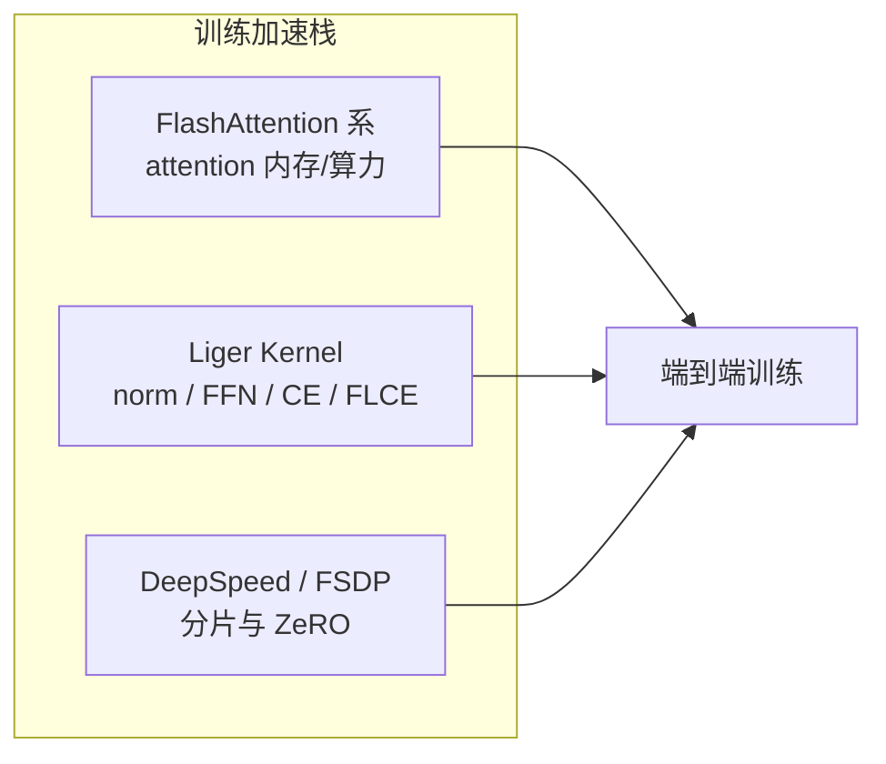

## 从日常类比开始：FlashAttention 修好了高速公路，Liger 把收费站也拆了

训练大语言模型（LLM）时，很多人已经知道 [[flash-attention]] / [[flashattention-2]]：它像把 attention 这条**最堵的高速公路**改成了单行隧道——不再把整张 N×N 分数表写进显存，吞吐立刻上去。

但车开完全程，还要过一堆**小收费站**：RMSNorm、RoPE、SwiGLU、最后的 Linear + CrossEntropy……每个站都要：

1. 把数据从 GPU 显存（HBM）搬进片上 SRAM；
2. 算完；
3. 再搬回 HBM；
4. 有时还要**额外租一块巨大的临时仓库**（比如 vocab=256k 时的 logits 张量）。

LinkedIn 在 2024 年开源的 **Liger Kernel**（[arXiv:2410.10989](https://arxiv.org/abs/2410.10989)，[GitHub](https://github.com/linkedin/Liger-Kernel)）干的事，就是把这些「小收费站」也用 [[triton-llm]] 重写成**融合 kernel**：

- **算子融合（kernel fusion）**：多步合成一次 GPU launch，少来回搬货。
- **原地梯度（in-place gradient）**：算完直接把输入缓冲区覆写成梯度，不另开一张大表。
- **分块计算（input chunking）**：尤其是最后一层 `Linear + CrossEntropy`，按 chunk 流式投影，**永远不把完整 logits 物化出来**。

论文与官方 benchmark 的典型收益（相对 Hugging Face 默认实现）：

| 指标 | 典型提升 |
|------|----------|
| 多卡训练吞吐 | 平均约 **+20%**（Llama3-8B 微调最高约 **+42.8%**） |
| GPU 峰值显存 | 平均约 **-60%**（部分模型 batch 可到原来 2× 以上） |
| 单 kernel | CrossEntropy 约 **3×** 更快、**5×** 更省显存；RMSNorm 约 **7×** 更快 |

依赖极简：只要 **PyTorch + Triton**，能与 FlashAttention、FSDP、DeepSpeed ZeRO / ZeRO++ 共存。

---

## 是什么

**Liger Kernel: Efficient Triton Kernels for LLM Training**（Pin-Lun Hsu 等，LinkedIn，2024 年 10 月 arXiv，2025 年 ICML CODEML workshop）是一套**专为 LLM 训练定制的 Triton GPU kernel 库**，不是新模型架构，而是**替换训练路径上的「慢且费显存」算子实现**。

| 项目 | 内容 |
|------|------|
| 作者团队 | Pin-Lun Hsu, Yun Dai, Vignesh Kothapalli 等（LinkedIn） |
| 实现语言 | [Triton](https://github.com/triton-lang/triton)（见 [[triton-2019]]） |
| 覆盖算子 | RMSNorm、LayerNorm、RoPE、SwiGLU、GeGLU、CrossEntropy、**FusedLinearCrossEntropy (FLCE)** 等 |
| 后训练扩展 | DPO、ORPO、CPO、SimPO、JSD 等 alignment / distillation loss 的融合 kernel |
| 集成方式 | Hugging Face `Trainer` / TRL `SFTTrainer`、Axolotl、LLaMA-Factory 等，常只需 `use_liger=True` |
| 许可证 | 宽松开源（BSD-2-Clause） |

一句话：**FlashAttention 优化 attention；Liger 优化 attention 之外、每层都会跑、且常被忽视的「配角算子 + 损失层」。**

---

## 为什么重要

### 1. 大词表时代的显存杀手：logits 张量

现代 LLM 词表动辄 128k–256k。最后一层要把 hidden state `H ∈ R^{B×T×d}` 投影成 `logits ∈ R^{B×T×V}`。

以 Gemma 为例（论文数字）：单卡、`batch=8`、`seq=4096`、`V=256k`、bf16 时，**仅 logits 就要约 16.8 GB**。而训练峰值显存往往出现在 forward 末尾、backward 释放 activation 之前——**这一块直接把 batch size 和 context length 卡死**。

Liger 的 **FusedLinearCrossEntropy (FLCE)** 从不物化完整 logits，是整套库最具「质变感」的 kernel。

### 2. 训练栈的「第二梯队」瓶颈

在 attention 已被 FlashAttention 优化后，profiler 上常见剩余热点：

- 每层一次的 **RMSNorm / RoPE**（launch 开销 + 内存带宽）；
- **SwiGLU / GeGLU** FFN（前向要存中间激活，反向占显存）；
- **CrossEntropy**（softmax + log + 大 vocab 临时缓冲）。

这些算子单次不算最贵，但**层数 × 步数**累积后，足以吃掉 10–20% 端到端时间，并抬高峰值显存。

### 3. 低门槛、可组合

新手：`apply_liger_kernel_to_llama(model)` 或 `use_liger=True` 一行启用。

进阶：单独 import `LigerRMSNorm`、`LigerFusedLinearCrossEntropyLoss` 拼自定义模型。

这与 [[triton-llm]] 倡导的「tile 级 DSL + autotune」路线一致，降低了写高性能 kernel 的门槛。

---

## 核心概念

### 1. Kernel 融合（Operator Fusion）

PyTorch 默认路径里，一个「逻辑操作」往往对应**多个 CUDA kernel launch**，每 launch 一次就要完整读写一遍 HBM。

Liger 把例如 RMSNorm 的「求 RMS → 归一化 → 乘 γ」合成**单个 Triton kernel**；前向时缓存 RMS 等统计量供反向使用，避免重复扫描张量。

类比：原本「称重 → 贴标签 → 打包」三道工序各跑一趟仓库；融合后**一条流水线干完**。

### 2. 原地梯度（In-place Gradient Replacement）

CrossEntropy 的梯度对 logits 有简洁闭式：

```
∇_x L = softmax(x) − one_hot(target)
```

Liger CE kernel 在 forward 里就算出该梯度，并**直接写回原来存放 logits 的缓冲区**，不再同时保留「logits + grad_logits」两份大数组。

配合 **online softmax**（流式维护 max 与 sum，不物化完整 softmax 向量），进一步省显存、提速度。

### 3. Fused Linear Cross Entropy（FLCE）与分块

标准训练最后两步：

```
logits = H @ W^T          # H: (B·T, d), W: (V, d) → logits (B·T, V)
loss = CrossEntropy(logits, targets)
```

FLCE 把两步合并，并对 `H` **按 chunk 切片**：

```
for each chunk h of H:
    x = h @ W^T                    # 只物化 (chunk_size, V) 的 logits
    partial_loss, ∇x = CE(x, targets_chunk)
    accumulate ∇h, ∇W
```

chunk size 按 `BT`、隐藏维 `H`、词表 `V` 动态选取，在**显存峰值**与 **GPU 利用率**之间折中。论文给出启发式：接近 hidden dim 时常更平衡。

对 **Medusa** 等多解码头训练尤其关键：每个头都要投影到 vocab，若各物化一份 logits 极易 OOM；FLCE 让多头顶训练可行。

### 4. 反向重计算（Recomputation in Backward）

SwiGLU / GeGLU 前向要算 `SiLU(x₁) ⊙ x₂`（或 GELU 变体）。默认实现为反向保存 `SiLU(x₁)` 等中间结果。

Liger 在 backward **用存下来的 x₁、x₂ 重算激活**，以额外算力换显存（与 checkpointing 思想同源）。论文中 seq=16384 时 SwiGLU/GeGLU 峰值显存约降 **1.6×**，速度基本持平。

### 5. 正确性工程：不是「快就行」

论文专章讨论测试实践：

- 与 Hugging Face 参考实现对比，fp32 / bf16 设不同 atol/rtol；
- **收敛测试**：小模型完整训练，比对 loss 曲线与权重；
- **连续性（contiguity）**：Triton 直接操作物理内存，非 contiguous 张量会导致 RoPE 等 kernel 静默错误——接入前常需 `.contiguous()`；
- **大维度 int32 溢出**：`program_id * stride` 超 2³¹ 时要转 int64。

---

## 代码示例

### 示例 1：一行给 Hugging Face 模型打补丁（最常用）

```python
from transformers import AutoModelForCausalLM
from liger_kernel.transformers import apply_liger_kernel_to_llama

model = AutoModelForCausalLM.from_pretrained(
    "meta-llama/Meta-Llama-3-8B-Instruct",
    torch_dtype=torch.bfloat16,
    device_map="auto",
)

# 原地替换 RMSNorm、RoPE、SwiGLU、CE、FLCE 等为 Liger Triton 实现
apply_liger_kernel_to_llama(model)

# 之后用普通 Trainer / DeepSpeed / FSDP 训练即可
```

等价的 TRL 开关：

```python
from trl import SFTConfig, SFTTrainer

trainer = SFTTrainer(
    model="meta-llama/Meta-Llama-3-8B",
    train_dataset=dataset,
    args=SFTConfig(
        output_dir="./out",
        per_device_train_batch_size=4,
        use_liger=True,   # 自动加载 AutoLigerKernelForCausalLM
    ),
)
trainer.train()
```

### 示例 2：手写小模型，单独使用 FLCE（理解分块融合）

```python
import torch
import torch.nn as nn
from liger_kernel.transformers import LigerFusedLinearCrossEntropyLoss

# 语言模型头：d=128 维隐藏态，vocab=256
head = nn.Linear(128, 256, bias=False).cuda()
loss_fn = LigerFusedLinearCrossEntropyLoss()

# batch=4 个 token 的隐藏向量（已是 lm_head 输入）
hidden = torch.randn(4, 128, requires_grad=True, device="cuda", dtype=torch.bfloat16)
targets = torch.randint(0, 256, (4,), device="cuda")

# 内部：分 chunk 做 hidden @ W^T，立刻算 CE，不保留完整 logits
loss = loss_fn(head.weight, hidden, targets)
loss.backward()

# head.weight.grad 与 hidden.grad 已就绪，峰值显存远低于先 materialize logits
```

对比朴素写法（**不要在大词表生产路径上用**）：

```python
# 朴素路径：logits (B, T, V) 完整落盘 —— V=256k 时灾难性
logits = hidden @ head.weight.T          # 巨大张量
loss = torch.nn.functional.cross_entropy(logits, targets)
loss.backward()
```

### 示例 3：Triton 风格 — 简化版 Fused RMSNorm 思路（教学用）

下面不是 Liger 源码，而是帮助理解「融合 + 缓存统计量」的伪 Triton 结构（与 [[triton-llm]] 教程同构）：

```python
import triton
import triton.language as tl

@triton.jit
def rms_norm_fwd_kernel(x_ptr, y_ptr, rms_ptr, weight_ptr, n_cols, eps, BLOCK: tl.constexpr):
    row = tl.program_id(0)
    cols = tl.arange(0, BLOCK)
    mask = cols < n_cols

    x = tl.load(x_ptr + row * n_cols + cols, mask=mask, other=0.0).to(tl.float32)
    rms = tl.sqrt(tl.sum(x * x, axis=0) / n_cols + eps)
    tl.store(rms_ptr + row, rms)   # 反向复用，避免第二遍扫描

    w = tl.load(weight_ptr + cols, mask=mask, other=1.0)
    y = (x / rms) * w
    tl.store(y_ptr + row * n_cols + cols, y, mask=mask)
```

Liger 的生产 kernel 还处理多维 stride、bf16/fp32 混合精度、与 Transformer 布局对齐等细节；**思想**是：一次 kernel 完成归一化，并把 RMS **缓存给 backward**。

---

## 端到端 benchmark 怎么读

论文在 4×A100 上对 Alpaca 微调多款 7B–8B 模型（seq=512，bf16，AdamW）。摘录代表性数字：

| 模型 | batch | 吞吐变化 | 峰值显存变化 |
|------|-------|----------|--------------|
| LLaMA 3-8B | 64 | **+42.8%** | **−54.8%** |
| Qwen2 | 48 | **+25.5%** | **−56.8%** |
| Gemma 7B | 48 | **+11.9%** | **−51.8%** |
| Mistral 7B | 128 | **+27%** | **−21%** |
| Phi-3 | 128 | **+17%** | **−13%** |

解读要点：

- 收益与**基线实现质量**有关：HF 路径越「碎」、中间张量越多，Liger 优势越大。
- 显存省下后，可把 batch 或 seq **再往上推**，吞吐二次受益。
- 与 FlashAttention 正交：一个管 attention，一个管 norm/FFN/loss；应同时开启。

---

## 与相关工作的关系



| 对比对象 | 关系 |
|----------|------|
| [[flash-attention]] / [[flashattention-2]] | 互补；Liger 明确支持与 FlashAttention 共存 |
| PyTorch `torch.compile` / Inductor | 都追求融合；Liger 是**手工调优的 domain-specific kernel**，对大词表 CE 等场景更成熟 |
| `efficient_cross_entropy` 等社区方案 | FLCE 的 chunking 思路受其启发（论文致谢 GitHub discussion） |
| CUDA 手写 kernel | Triton 更易维护、跨 GPU autotune；Liger 选择 Triton 换开发效率 |

---

## 踩坑与最佳实践

1. **先确认张量 contiguous**：尤其 RoPE 接 `scaled_dot_product_attention` 后，layout 可能非连续，loss 会「能跑但不对」。
2. **bf16 收敛测试**：kernel 级 atol/rtol 放宽后，仍建议跑几百 step 看 loss 曲线是否与 baseline 重合。
3. **不要指望推理加速**：Liger 面向**训练**路径；推理瓶颈通常在 decode attention 与 KV cache（见 [[paged-attention-vllm]]），不是 RMSNorm 融合。
4. **词表越大，FLCE 越值得开**：7B + 32k vocab 可能「有感但不夸张」；128k/256k + 长上下文时往往是**能不能训下去**的分水岭。
5. **分布式兼容性**：官方测试覆盖 FSDP、DeepSpeed ZeRO；升级 PyTorch/TRL 后留意 patch 函数是否与模型类名匹配。

---

## 适用 vs 不适用

| 场景 | 建议 |
|------|------|
| HF/TRL 上微调 Llama、Qwen、Gemma、Mistral 等 | **强烈推荐** `use_liger=True` 或对应 `apply_liger_kernel_to_*` |
| 超大词表预训练 / SFT | **必看 FLCE** |
| Medusa 等多解码头训练 | **强烈推荐**（避免多头 logits OOM） |
| 自定义 nn.Module、自研训练栈 | 可单独引入 `LigerRMSNorm`、`LigerFusedLinearCrossEntropyLoss` 等 |
| 只做推理部署 | 通常**不需要** |
| 极小模型 / 教学 demo | 收益有限，复杂度不划算 |

---

## 小结

Liger Kernel 的核心贡献不是新算法，而是**把 LLM 训练里「每层都跑、却长期被忽视」的算子，用 Triton 做成融合、省显存、易集成的工业级实现**：

1. **Kernel fusion** 减少 HBM 往返与 launch 开销；
2. **In-place gradient + online softmax** 压缩 CrossEntropy 显存；
3. **FusedLinearCrossEntropy + chunking** 解决大词表 logits 物化问题；
4. **模块化 API** 让新手一行启用、专家可拆 kernel 组装。

若你已用上 FlashAttention，却仍在训练时撞显存或吞吐不理想，下一步很值得检查：**最后一层 CE 与各类 Norm/FFN 是否还在走 PyTorch 默认的「多趟收费站」路径**。

---

## 延伸阅读

- 论文：[arXiv:2410.10989](https://arxiv.org/abs/2410.10989)
- 代码：[github.com/linkedin/Liger-Kernel](https://github.com/linkedin/Liger-Kernel)
- 文档：[linkedin.github.io/Liger-Kernel](https://linkedin.github.io/Liger-Kernel/)
- Triton 背景：[[triton-2019]]、[[triton-llm]]
- Attention 优化：[[flash-attention]]、[[flashattention-2]]
- 推理侧 KV 管理：[[paged-attention-vllm]]
