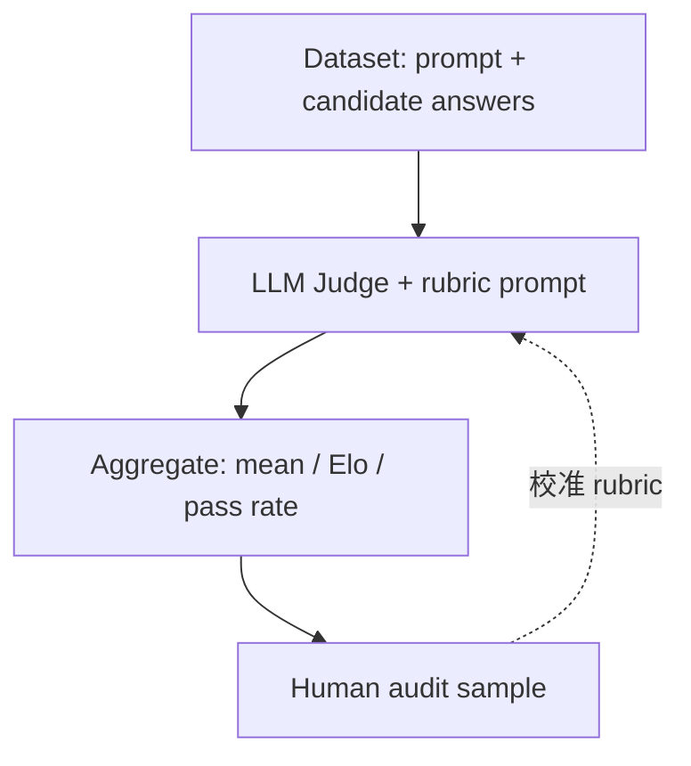

## 日常类比：米其林试吃员，但不是上帝

想象两家餐厅要决出「谁更好吃」：

- **传统做法**：请 100 位食客盲评，统计满意度——贵、慢，但是金标准。
- **LLM-as-a-Judge**：雇一位**读过海量食评、能按 rubric 打分的资深试吃员**（大模型），对两份「菜品」（模型回答）做 **pairwise** 或 **single** 评分。

[Zheng et al., 2023](https://arxiv.org/abs/2306.05685) 系统论证：在 MT-Bench、Chatbot Arena 等场景，强模型作 Judge 与人类偏好的一致性**可达可用水平**，但存在**位置偏见、冗长偏见、自偏好**等系统性缺陷——试吃员会偏先上桌的菜、偏篇幅长的摆盘、偏自己熟悉的菜系。

这篇笔记面向零基础读者：弄清 **为什么需要 Judge**、**怎么写 prompt**、**如何与人工/规则指标并用**，并给出可运行的评测片段。

---

## 问题：开放域回答没有唯一标准答案

分类任务的 accuracy 不够用：同一问题常有多种正确表述，人工逐条打分成本随模型迭代指数上升。工业界需要：

1. **可扩展**： nightly 评 thousands 条  
2. **可解释**： 最好有维度分（有用 / 诚实 / 无害）  
3. **可对齐人类**： 与抽检或 Arena 投票相关  

LLM-as-a-Judge 用**另一个 LLM** 读 `(question, answer[, reference])`，输出分数或 A/B 胜负，充当 **自动标注器** 或 **离线 reward proxy**。

---

## 核心概念

### 1. Single answer grading（单答案打分）

Judge 对**一个**回答打 Likert 分或 pass/fail。适合有 rubric 的维度分（helpfulness 1–7）。

### 2. Pairwise comparison（成对比较）

同一问题下比较 `answer_A` vs `answer_B`，输出 `A` / `B` / `tie`。Chatbot Arena 的 Elo 即建立在大量 pairwise 上；论文指出 pairwise 往往比绝对分更稳，因为模型更擅长**相对判断**。

### 3. Reference-guided vs reference-free

- **有参考答案**： 对照 gold 评事实性与覆盖度（类似 [[mira-rubric|MIRA]] 的约束项）  
- **无参考**： 只凭问题与 rubric（开放对话、创意写作）

### 4. 评测维度（MT-Bench 常见）

| 维度 | 含义 | 典型量表 |
|------|------|----------|
| **Helpfulness** | 是否解决问题、信息是否够用 | 1–7 Likert |
| **Honesty / Truthfulness** | 是否胡编、是否承认不知道 | 二元或 1–5 |
| **Harmlessness** | 毒性、偏见、危险建议 | 规则 + 模型 |
| **Instruction following** | 格式、约束、多步是否遵守 | 规则检查 + 模型 |
| **Coherence / Fluency** | 可读性（常与 helpfulness 混评） | 1–5 |

论文在 **§3.2** 还强调：同一 rubric 下，**pairwise** 与 **single** 的分数分布、与人类的 Spearman 相关并不相同；生产里若混用两种接口，仪表盘上的「胜率」与「均分」不可直接对比。

### 5. 已知偏见与缓解

| 偏见 | 表现 | 缓解 |
|------|------|------|
| **位置偏见** | 成对比较时更倾向第一个或第二个答案 | 交换 A/B 顺序，各评一次再聚合 |
| **自偏好** | 同系列模型更偏爱自己生成的文风 | 换用不同家族的 Judge；或 blind 去标识 |
| **长度偏见** | 更长答案常被判更好（即使更空） | 长度归一化提示；或截断到相近 token |
| **表面相似** | 与参考答案字面重叠高即高分 | 语义指标 + 人工 spot check |
| **锚定与 rubric 漂移** | 示例分数带偏后续判断 | 固定 few-shot 示例集；定期重标定 |

Zheng 等报告：在 **MT-Bench** 上，GPT-4 作 Judge 与人类偏好的一致率可达约 **80%** 量级（随题型与子集变化），但仍显著低于理想「可替代人工」线；**Chatbot Arena** 上 Elo 与 Judge 排序的相关性更高，说明**开放式对话**里 pairwise 聚合比单点 Likert 更稳——这与 [[MIRA|MIRA]] 强调「多轮、多约束」评测的设计一致。

---

## 架构：把 Judge 放进评测流水线



与 [[opik|Opik]] 一类 LLMOps 工具的关系：Judge 是 **metric 函数**；trace 提供上下文；experiment 对比不同模型/prompt 版本。

---

## 例子 A：Pairwise Judge（交换顺序消位置偏见）

```python
import os
from openai import OpenAI

client = OpenAI(api_key=os.environ["OPENAI_API_KEY"])

PAIRWISE_TEMPLATE = """You are a fair judge. Compare two assistants' answers to the user question.
Choose the better one for: helpfulness, correctness, and following instructions.
Reply with exactly one token: A, B, or tie.

[User Question]
{question}

[Assistant A]
{answer_a}

[Assistant B]
{answer_b}
"""

def pairwise_once(question: str, a: str, b: str) -> str:
    msg = PAIRWISE_TEMPLATE.format(question=question, answer_a=a, answer_b=b)
    r = client.chat.completions.create(
        model="gpt-4o-mini",
        messages=[{"role": "user", "content": msg}],
        temperature=0,
        max_tokens=4,
    )
    return (r.choices[0].message.content or "").strip().upper()

def pairwise_debiased(question: str, a: str, b: str) -> str:
    v1 = pairwise_once(question, a, b)
    v2 = pairwise_once(question, b, a)  # swap positions
    # Map swapped result back
    flip = {"A": "B", "B": "A", "TIE": "tie"}
    v2 = flip.get(v2, v2)
    if v1 == v2:
        return v1
    if v1 == "TIE" or v2 == "TIE":
        return "tie"
    return "tie"  # disagree -> conservative tie
```

生产环境应记录 **Judge 模型版本、prompt hash、temperature**，否则不可复现。

---

## 例子 B：Single-answer 多维度 rubric（JSON 输出）

```python
import json

SINGLE_TEMPLATE = """Score the assistant answer on each dimension 1-7 (7 best).
Return JSON only: {"helpfulness": int, "honesty": int, "instruction_following": int, "brief_reason": str}

[Question]
{question}

[Reference answer optional]
{reference}

[Assistant answer]
{answer}
"""

def grade_single(question: str, answer: str, reference: str = "") -> dict:
    msg = SINGLE_TEMPLATE.format(
        question=question, answer=answer, reference=reference or "(none)"
    )
    r = client.chat.completions.create(
        model="gpt-4o",
        messages=[{"role": "user", "content": msg}],
        temperature=0,
        response_format={"type": "json_object"},
    )
    return json.loads(r.choices[0].message.content)

# 批量评测 + 简单聚合
rows = [
    {"q": "Explain CAP theorem in 3 bullets.", "ans": "..."},
]
scores = [grade_single(r["q"], r["ans"]) for r in rows]
avg_help = sum(s["helpfulness"] for s in scores) / len(scores)
```

对 **JSON 约束**类任务，应叠加 **规则检查**（`json.loads` 是否成功、schema 校验），避免 Judge 单独「脑补合规」。

---

## 例子 C：与 [[opik|Opik]] 的 `evaluate()` 衔接（概念）

Opik 内置 `AnswerRelevance`、`Hallucination` 等 **LLM metric**，本质仍是 Judge + 固定 rubric。自定义 Judge 可继承 `BaseMetric`：

```python
# 概念片段 — 以 Opik 文档为准调整 import
from opik.evaluation.metrics import base_metric

class HelpfulnessJudge(base_metric.BaseMetric):
    def __init__(self, name: str = "helpfulness_judge", model: str = "gpt-4o-mini"):
        self.name = name
        self.model = model

    def score(self, input: str, output: str, **kwargs):
        # 调用例子 B 的 grade_single，返回 score + reason
        g = grade_single(input, output)
        return {"value": g["helpfulness"] / 7.0, "reason": g["brief_reason"]}
```

这样 **LLM-as-a-Judge** 与 **实验对比、trace 回溯** 在同一平台闭环。

---

## 与 RLHF / 红队 / 产品指标的关系

- **RLHF / DPO**：Reward model 本质是「学出来的 Judge」；LLM-as-a-Judge 常作 **cheap proxy** 或 **数据标注器**（见 [[ppo|ppo]]、[[dpo|dpo]]）。论文 §5 讨论：用 GPT-4 Judge 标 preference 再训 RM，存在 **误差传播**——Judge 的系统偏见会变成策略的「合法目标」。
- **红队**：Harmlessness 维度可用 Judge 批量筛候选攻击成功率（见 [[chaos-engineering-netflix-2016|混沌工程]] 式「持续加压」思路）。
- **A/B 与在线指标**：Judge 分数适合 **离线回归**；线上仍以留存、任务完成为准，避免「刷 Judge 分」。
- **可观测闭环**：[[opik|Opik]]、[[wandb|W&B]] 等把 trace → experiment → metric 串起来时，LLM Judge 宜作为 **一层 scorer**，而非唯一 ground truth（见 [[opik-agent-optimization|Opik Agent Optimization]]）。

---

## 实践清单（从零搭一套 Judge）

1. **定 rubric**： 每维度写清 1 分与 7 分的行为锚点（可参考 MT-Bench 题型）。  
2. **抽 50–100 条人工金标**： 算 Judge 与人类的 Cohen's κ / Spearman。  
3. **默认 pairwise + 交换顺序**： 排序类任务优先。  
4. **Judge 与考生分离**： 避免同模型自评（除非研究自偏好）。  
5. **分层成本**： 小 Judge 筛 → 大 Judge 裁 → 人工审边界 case。  
6. **版本冻结**： `prompt_v3` + `gpt-4o-2024-08-06` 写入 dataset 元数据。

---

## 局限与诚实边界

- Judge **不是 ground truth**；法律、医疗、合规场景仍需专家签核。
- **多语言**：英文 Judge 评中文回答常有文化与安全盲区；论文实验以 **英文 MT-Bench / Vicuna** 为主，外推需自建 locale 黄金集。
- **成本**：GPT-4 级 Judge 全量评百万条仍贵；需分层（小模型筛 + 大模型裁）。
- **可复现性**：temperature、prompt 版本、模型快照必须写入实验元数据。
- **对抗性**：模型可学会 **迎合 Judge 文风**（冗长、列表化、道歉套话），与人类「少废话、准答案」偏好背离——这与 [[compositional-incoherence|组合不相干]] 类「指标优化了、行为没对齐」是同一族问题。

---

## 小结

**LLM-as-a-Judge** 把「谁更好」从纯人工搬到可自动化的相对判断与维度打分，是 Chatbot Arena、MT-Bench 及现代 LLMOps 评测的核心技巧。可用前提是：**显式 rubric、偏见缓解、人工校准、与规则指标混用**。把它当成**加速抽检的试吃员**，而不是取代整个食品安全体系。

---

## 参考资料

- 论文 PDF：[arXiv:2306.05685](https://arxiv.org/abs/2306.05685)（v3 修订约 2023-12）
- 项目页与数据：[lmarena.ai](https://lmarena.ai)（Chatbot Arena）、[MT-Bench 评测脚本](https://github.com/lm-sys/FastChat/tree/main/fastchat/llm_judge)
- 相关：[[mira-rubric|MIRA]]（多维度 rubric）、[[opik|Opik]]（评测流水线）、[[dwork-differential-privacy-2006|差分隐私]]（发布评测集时的隐私）、[[noise-explorer-2018|Noise Explorer]]（ε 选型思维可类比 Judge 阈值选型）
