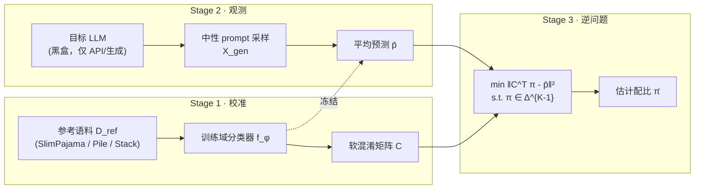

## 从日常类比开始：体检报告 vs 逐粒验沙

想象你要判断一个人长期吃什么，但对方不给你看菜谱，也不让你进厨房。你只有两个工具：

- **Membership Inference Attack（MIA，成员推断）**：像用显微镜检查「这一粒米是不是从他碗里来的」。对单条文本问「这条训练数据进过模型吗？」——微观、逐样本，很精细，但把百万次「是/否」简单加总，很难还原整桌菜的**比例**（Web 占 80% 还是 20%？）。
- **LLMSurgeon 做的事**：像根据此人**日常说话习惯**反推饮食结构——他聊代码像 GitHub 流、写百科像 Wikipedia、讲段子像 Reddit。你不数每一粒米，而是：**先训练一个「菜系分类器」**，再让他用**中性话题**自由发挥写一段话，统计「听起来像哪类语料」，最后用数学把分类器的**系统性误判**校正回来，得到预训练混合比的估计。

论文把这件事正式命名为 **Data Mixture Surgery（DMS，数据混合诊断）**：**只给目标 LLM 的生成文本**，在预先定义好的领域 taxonomy 下，估计其预训练语料的**域级分布**。预训练配比被作者称为模型的 **「digital DNA（数字 DNA）」**——决定能力边界、偏见来源和失败模式，却极少被公开披露。

---

## 是什么

**LLMSurgeon**（Luo et al., ACL 2026 / arXiv:2605.30348，MBZUAI VILA Lab）是一个 **post-hoc（事后）审计框架**：

| 输入 | 输出 | 不需要 |
|------|------|--------|
| 目标 LLM 在中性 prompt 下生成的文本 | 各数据域占比向量 \(\hat{\pi}\) | 训练数据、模型权重、内部 logit |

与 MIA 的对比：

| 维度 | MIA | LLMSurgeon / DMS |
|------|-----|------------------|
| 粒度 | 单样本是否见过 | 全局域比例 |
| 信号 | loss、logit、邻居对比等 | 外部域分类器 + 标签偏移逆问题 |
| 典型准确率（LLMScan 粗粒度） | 基线 ~35–48% overlap | LLMSurgeon ~94–95% |

配套 benchmark **LLMScan** 包含 8 个开源 LLM（1B–65B），训练 recipe 公开可核对，分三档粒度：

- **Coarse（K=6）**：LLaMA-1、OLMo、Amber — Web / GitHub / Wikipedia 等
- **Mid（K=17）**：Pythia、GPT-Neo — The Pile 子域
- **Fine（K=87）**：StarCoder — The Stack 编程语言

---

## 为什么重要

1. **透明度与治理**：闭源模型不披露训练集，外部无法审计版权、偏见、毒性暴露 — LLMSurgeon 提供不依赖厂商配合的**分布级**探针。
2. **问题定义升级**：从「这条进训练集了吗？」到「训练集整体长什么样？」——更接近监管者和研究者真正关心的问题。
3. **与数据混合优化正交**：DoReMi、Data-Juicer 等做 **pre-hoc** 调配比；LLMSurgeon 做 **post-hoc** 推断，适用于已训练好的黑盒模型。
4. **安全分诊**：论文展示在 GPT-2 中注入 5%–20% 毒性语料后，估计毒性占比单调上升（误差约 2–3 个百分点），可用于 checkpoint 优先级排序。

---

## 核心概念

### 1. 混合模型与生成先验

预训练语料视为 \(K\) 个域的混合：

\[
p_{\alpha}(x) = \sum_{i=1}^{K} \alpha_i \, p(x \mid y=i)
\]

其中 \(\alpha \in \Delta^{K-1}\) 是**真实训练配比**（ground truth，通常未知）。

模型在中性采样下产生的文本来自：

\[
q_{\pi}(x) = \sum_{i=1}^{K} \pi_i \, p(x \mid y=i)
\]

\(\pi\) 是**有效潜先验（latent effective prior）**——模型行为所编码的域混合，可能与 \(\alpha\) 略有偏差（优化动态、欠拟合、温度等），但 DMS 的目标是估计 \(\pi\)。

### 2. Label Shift（标签偏移）假设

核心假设：域的**边际比例**可以从训练变到生成（\(\alpha \to \pi\)），但**每个域内的语言特征**不变：

\[
q(x \mid y=i) \approx p(x \mid y=i)
\]

直觉：模型写 Code 时，统计上仍像训练见过的 Code；只是「写 Code 的频率」可能和训练时不同。若 prompt 风格过强（instruction、coding-only），会破坏该假设 — 论文实验表明 **Neutral 采样**最稳健。

### 3. 软混淆矩阵（Soft Confusion Matrix）

外部代理分类器 \(f_\phi: \mathcal{X} \to \Delta^{K-1}\) 不可能完美 — 会把 C 误判成 C++，Common Crawl 误判成 C4。

在带标签的参考集 \(\mathcal{D}_{\text{ref}}\) 上估计：

\[
C_{ij} = \mathbb{E}_{x \sim p_i}\big[f_\phi(x)_j\big]
\]

\(C\) 的第 \(i\) 行 = 「真域 \(i\) 的样本，分类器输出各域概率的期望」。非对角元 = **系统性混淆**。

### 4. 约束逆问题（Constrained Inverse Problem）

对目标模型生成集 \(X_{\text{gen}}\)，先算经验平均预测：

\[
\bar{\mathbf{p}} = \frac{1}{N}\sum_{n=1}^{N} f_\phi(x_n)
\]

由期望线性性：\(\mathbb{E}[f_\phi(x)] = C^\top \pi\)，故 \(\bar{\mathbf{p}} \approx C^\top \pi\)。

**LLMSurgeon 的「手术」** 即解：

\[
\hat{\pi} = \arg\min_{\pi \in \Delta^{K-1}} \ \|C^\top \pi - \bar{\mathbf{p}}\|_2^2
\quad \text{s.t.} \ \sum_k \pi_k = 1,\ \pi_k \geq 0
\]

这比 naive 地 \(\hat{\pi} = \bar{\mathbf{p}}\)（直接平均分类结果）或把 MIA 分数逐条聚合要稳得多 — 在 LLaMA-7B 上 overlap accuracy 从 ~93%（无逆校正）提到 ~95%，粗粒度上对 MIA 基线则是 **+46~55 个百分点** 量级。

**直觉：矩阵乘法在「搅浑水」**

把 \(C\) 想成一杯调色盘：真实配比 \(\pi\) 是原色比例，\(\bar{\mathbf{p}} = C^\top \pi\) 是搅完后的颜色。若你只看到搅完的颜色（分类器输出），直接当原色会偏；LLMSurgeon 做的是**已知调色规则 \(C\)** 下的**反解**——类似去模糊（de-blur），而不是再搅一遍 MIA 的噪声计数。

### 5. 三阶段流水线

```text
Stage 1: 在参考语料上训练域分类器 f_φ，估计校准混淆矩阵 C
Stage 2: 用中性 prompt 采样目标 LLM 输出 X_gen，算 p̄
Stage 3: 在概率单纯形上解逆问题，得到 π̂
```

用流程图看更直观（论文 Figure 2）：



**实现细节（论文默认）**：每域从参考池抽 **5000** 文档训练分类器；分类器 backbone 为 **fine-tuned DistilBERT**；生成侧用 **neutral prompts**（避免 instruction 风格把 label shift 假设打破）；粗/中/细三档分别用 SlimPajama-627B-DC（K=6）、The Pile（K=17）、The Stack（K=87）作参考域定义。

### 6. 评估指标：Overlap Accuracy

\[
\text{Overlap Acc} = 1 - \tfrac{1}{2}\sum_{k=1}^{K} |\alpha_k - \hat{\pi}_k|
\]

即预测分布与真值之间的 **Total Variation 距离** 的一半，100% 表示完全一致。

---

## 代码示例 1：玩具版 LLMSurgeon（NumPy）

下面用 3 个域的玩具数据演示「混淆 + 逆校正」全流程。真实代码见 [github.com/yaxin9luo/llmsurgeon](https://github.com/yaxin9luo/llmsurgeon)。

```python
import numpy as np
from scipy.optimize import minimize

# 真实生成先验 π（未知，待恢复）
pi_true = np.array([0.70, 0.20, 0.10])

# 软混淆矩阵 C：行=真域，列=预测域
# 域1(Web) 常被误判成域2(C4)；域3(Code) 较干净
C = np.array([
    [0.85, 0.12, 0.03],
    [0.10, 0.80, 0.10],
    [0.05, 0.05, 0.90],
])

# 模拟：分类器在生成文本上的平均输出 p̄ ≈ C^T π
p_bar = C.T @ pi_true
# 加少量噪声模拟有限样本
p_bar += np.random.default_rng(0).normal(0, 0.01, size=3)
p_bar = np.clip(p_bar, 1e-6, None)
p_bar /= p_bar.sum()

def recover_mixture(p_bar, C):
    K = len(p_bar)

    def objective(pi):
        return np.sum((C.T @ pi - p_bar) ** 2)

    cons = [{"type": "eq", "fun": lambda pi: np.sum(pi) - 1.0}]
    bounds = [(0.0, 1.0)] * K
    x0 = np.ones(K) / K

    res = minimize(objective, x0, method="SLSQP", bounds=bounds, constraints=cons)
    return res.x

pi_hat = recover_mixture(p_bar, C)

overlap = 1 - 0.5 * np.abs(pi_true - pi_hat).sum()
print("π true :", np.round(pi_true, 3))
print("π hat  :", np.round(pi_hat, 3))
print(f"Overlap accuracy: {overlap * 100:.1f}%")
# 典型输出：Overlap > 95%（玩具设定下）
```

**要点**：若直接用 `p_bar` 当估计，Web 占比会被 C4「抢走」；逆问题把混淆「去模糊（de-blur）」后更接近 `pi_true`。

**对照实验**：在同一玩具设定下，`pi_naive = p_bar` 的 overlap 往往只有 ~85%，而 `pi_hat` 可回到 95%+ — 逆校正不是锦上添花，而是 DMS 的核心。

---

## 代码示例 2：从 HuggingFace 生成文本到域分布（概念脚本）

论文默认用 **fine-tuned DistilBERT** 作 \(f_\phi\)，在 SlimPajama-DC / The Pile / The Stack 上各域采样 5000 文档训练。下面是贴近官方 pipeline 的**概念级**脚本骨架：

```python
from transformers import AutoTokenizer, AutoModelForSequenceClassification, pipeline
import torch

DOMAINS = ["web", "github", "wikipedia", "books", "arxiv", "stackexchange"]
CLASSIFIER = "path/to/finetuned-distilbert-domain-clf"  # 论文默认 backbone

clf = pipeline(
    "text-classification",
    model=CLASSIFIER,
    tokenizer=AutoTokenizer.from_pretrained(CLASSIFIER),
    top_k=len(DOMAINS),
    device=0 if torch.cuda.is_available() else -1,
)

NEUTRAL_PROMPTS = [
    "Continue the following passage:",
    "Complete this text naturally:",
    "Write the next paragraph:",
]  # 论文：neutral 风格对通用模型最稳

def sample_generations(llm, tokenizer, prompts, n_per_prompt=200, max_new_tokens=256):
    texts = []
    for prompt in prompts:
        for _ in range(n_per_prompt):
            inputs = tokenizer(prompt, return_tensors="pt").to(llm.device)
            out = llm.generate(**inputs, max_new_tokens=max_new_tokens, do_sample=True, temperature=0.8)
            texts.append(tokenizer.decode(out[0], skip_special_tokens=True))
    return texts

def mean_soft_predictions(texts, clf, batch_size=32):
    sums = torch.zeros(len(DOMAINS))
    for i in range(0, len(texts), batch_size):
        batch = texts[i : i + batch_size]
        for item in clf(batch):
            # item: list of {label, score} for top_k
            for d in item:
                j = DOMAINS.index(d["label"])
                sums[j] += d["score"]
    return (sums / len(texts)).numpy()

# --- 离线预计算（Stage 1）---
# C[i,j] = E_{x~domain_i}[ f_φ(x)_j ]，在参考集上按真标签分组求均值
# 保存为 confusion_matrix.npy

# --- 在线审计（Stage 2–3）---
# texts = sample_generations(target_llm, target_tok, NEUTRAL_PROMPTS)
# p_bar = mean_soft_predictions(texts, clf)
# pi_hat = recover_mixture(p_bar, C)  # 复用示例 1 的函数
```

安装与复现：

```bash
git clone https://github.com/yaxin9luo/llmsurgeon
cd llmsurgeon
pip install -e .
# 详见仓库 README：LLMScan 数据、分类器 checkpoint、生成协议
```

---

## 代码示例 3：从参考语料估计软混淆矩阵 \(C\)

Stage 1 的关键是：在**带真标签**的参考集上，按域分组统计分类器输出的**平均 soft label**。下面演示论文 Eq.(4) 的估计方式：

```python
import numpy as np
from collections import defaultdict

def estimate_confusion_matrix(texts, true_labels, clf, K):
    """
    texts: 参考语料片段列表
    true_labels: 与 texts 等长的域 id，取值 0..K-1
    clf: 返回每段文本的 soft 概率向量 f_φ(x) ∈ R^K
    """
    sums = np.zeros((K, K))  # C[i,j] 累加器
    counts = np.zeros(K)

    for x, i in zip(texts, true_labels):
        probs = clf(x)  # shape (K,), 已 softmax
        sums[i] += probs
        counts[i] += 1

    C = np.zeros((K, K))
    for i in range(K):
        if counts[i] > 0:
            C[i] = sums[i] / counts[i]  # 行 i = 真域 i 上的平均预测分布
    return C

# 玩具：域 0 的样本有 12% 被预测成域 1
# C[0] ≈ [0.85, 0.12, 0.03] 与示例 1 一致
```

论文默认每域 **5000** 条参考文档训练 DistilBERT 分类器；\(N=100\) 时 StarCoder 上 overlap 仅 ~20%，\(N=5000\) 饱和 — 参考集规模直接影响 \(C\) 的校准质量。

---

## 毒性语料注入实验（安全分诊）

论文在 GPT-2 上做了**可控污染**实验：向训练混合中注入 5%–20% 的毒性域（RealToxicityPrompts），再对 checkpoint 跑 LLMSurgeon。

| 注入比例 | 估计毒性占比 | 误差 |
|----------|-------------|------|
| 5% | ~7% | ~2 pp |
| 10% | ~12% | ~2 pp |
| 20% | ~22% | ~2 pp |

估计值随注入量**单调上升**，说明 DMS 不仅能看「吃了多少 Wikipedia」，还能做**风险域占比**的粗粒度雷达 — 适合在大量开源 checkpoint 里优先审计可疑模型。

---

## 实验结果速览

### LLMScan 主结果（Overlap Accuracy %）

| 设置 | 代表模型 | LLMSurgeon | 最强 MIA 类基线 |
|------|----------|------------|-----------------|
| Coarse | LLaMA-1 7B | **95.14** | Recall ~35 |
| Coarse | OLMo 1B | **94.46** | Neighbor ~42 |
| Coarse | Amber 13B | **78.87** | Recall ~41 |
| Coarse | LLaMA-1 65B | **94.26** | GradNorm ~47 |
| Mid | Pythia 12B | **65.98** | ~52–55 |
| Fine | StarCoder 15.5B | **30.37** | GradNorm ~28 |

**解读**：

- 粗粒度（6 域）在 LLaMA-1 / OLMo 上 overlap **>94%**，\(R^2 \approx 0.99\)；Amber-13B 因训练动态更波动约 **79%**，仍远高于 MIA 聚合基线。
- 细粒度（87 种语言）语义重叠严重，逆问题病态，绝对精度低 — 但 MAE 仍小，**宏观审计**仍有价值。
- 把语义不可分的 C4 与 Common Crawl **强行分开**会导致 overlap 从 99% 暴跌到 42%；合并后恢复 — taxonomy 设计是关键。

### 消融要点

| 因素 | 发现 |
|------|------|
| 分类器 backbone | Fine-tuned DistilBERT > Transformer-from-scratch > TF-IDF > MLP |
| 参考样本量 | 每域 5000 文档饱和；100 样本明显不够 |
| 采样风格 | Neutral 最稳（LLaMA-7B ~95%）；Expository 在 OLMo 上暴跌至 22.7%；Instruction 会系统性抬高某些域 |
| 训练动态 | Amber checkpoint 轨迹呈「波动后收敛」；OLMo 更平稳 — 可监控 curriculum / 分阶段加料 |
| 逆校正 | 去掉 Eq.7 仍 ~93%，但 StarCoder 等 hard case 增益 ~15% 相对提升 |
| 训练 checkpoint | 对 Amber/OLMo 中间 checkpoint 可追踪域比例随 step 的演变 |

---

## 与相关工作的关系

```text
                    需要训练数据访问？
                    是                    否
              ┌──────────────┐      ┌──────────────────┐
   单样本     │ 经典 MIA     │      │ 黑盒 MIA 变体     │
              └──────────────┘      └──────────────────┘
              ┌──────────────┐      ┌──────────────────┐
   分布级     │ DoReMi 等    │      │ LLMSurgeon (DMS) │
              │ 数据混合优化  │      │ DUCI (单数据集占比)│
              └──────────────┘      └──────────────────┘
```

- **DUCI**：估计「某个已知数据集占训练多少」— 需要候选数据集本身；DMS 在固定 taxonomy 下恢复**多域混合**，无需训练集访问。
- **MIA 聚合**：把逐样本 membership 计数当比例 — 域相关 bias + 误差累积，LLMScan 上普遍 <55%。

---

## 局限与使用注意

1. **Label shift 可能被破坏**：RLHF / 强 instruction tuning 会改变输出分布；估计的是「生成行为中的有效先验」，不一定等于原始 \(\alpha\)。
2. **Closed-world**：只能估计 taxonomy 内的 \(K\) 个域，发现不了训练了但分类器没见过的域。
3. **Taxonomy 质量**：语义重叠的域（C vs C++、C4 vs CC）使 \(C\) 病态 — 需合并或分层推断。
4. **专用模型 + Neutral prompt**：StarCoder 等需要能**激活**代码域的 prompt；Neutral 对通用模型最优，对代码专用模型未必。
5. **伦理双面性**：利于审计偏见与毒性；也可能被用来逆向推测 proprietary data recipe — 论文强调这是**分布级**审计，非提取单条训练样本。

---

## 自测题（零基础检验）

1. DMS 的输入输出是什么？与 MIA 的本质区别？
2. 为什么 \(\bar{\mathbf{p}} \neq \pi\)？\(C\) 矩阵如何编码这种偏差？
3. 写出 LLMSurgeon 优化的目标函数及约束。
4. 为何论文强调 Neutral sampling？举一个会破坏 label shift 的反例。
5. LLMScan 三档粒度分别测什么？Fine-grained 为什么难？

<details>
<summary>参考答案（先自己做）</summary>

1. 输入：目标 LLM 生成文本；输出：域比例 \(\hat{\pi}\)。MIA 问单样本 membership；DMS 问全局混合。
2. 分类器系统性混淆相似域；\(C_{ij}\) = 真域 \(i\) 被预测为 \(j\) 的平均概率。
3. \(\min \|C^\top\pi - \bar{p}\|_2^2\)，s.t. \(\pi \in \Delta^{K-1}\)。
4. Neutral 减少风格偏置；例如全程「写 Python 函数」prompt 会抬高 code 域估计。
5. Coarse 6 域 / Mid 17 Pile 子域 / Fine 87 语言；Fine 域边界语义太近，\(C\) 近似奇异。

</details>

---

## 进一步阅读

- 论文 HTML：[arxiv.org/html/2605.30348v1](https://arxiv.org/html/2605.30348v1)
- 代码与数据：[github.com/yaxin9luo/llmsurgeon](https://github.com/yaxin9luo/llmsurgeon)
- 背景：Label shift / prior shift（Saerens et al.）；MIA 综述（Shi et al., 2023）；SlimPajama-DC 数据组合分析（Shen et al., 2023）

---

## 一句话总结

**LLMSurgeon 把「预训练吃了什么」从不可审计的黑盒，转成一个可操作的逆问题：用中性生成 + 校准混淆矩阵，在概率单纯形上解出域混合比 — 不碰权重、不碰训练集，却能近似恢复模型的 digital DNA。**
