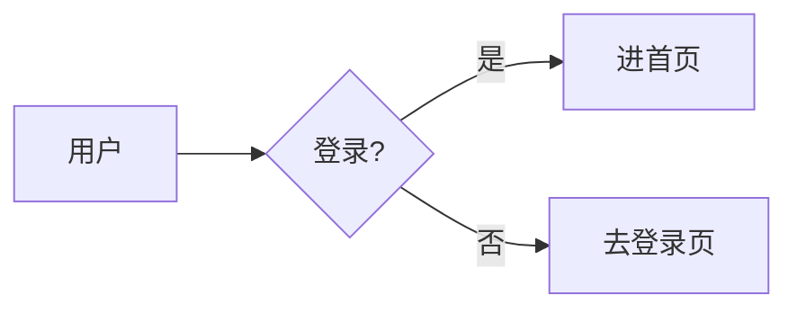

## 是什么

Mermaid 是一套**用纯文本写图**的语法。日常类比：以前画图你要打开 PowerPoint 拖框框、连箭头，存出来是一个 `.pptx` 二进制文件。Mermaid 让你**用一段类似代码的文字描述图**，渲染器替你把它画成 SVG。

你写：

````markdown

````

GitHub README 里粘上面这段，刷新页面就看到一张真实的流程图——不需要你画、不需要你上传图片。

这是 2014 年瑞典开发者 Knut Sveidqvist 起的项目，2022 年 2 月起 GitHub 在 Markdown 渲染器里**原生支持** mermaid 代码块，从此被广泛接受。

## 为什么重要

不用 Mermaid 时画图有四个老问题：

- 二进制存储 → **代码评审看不到 diff**，改了图等于黑箱
- 工具锁定 → 别人没装同款软件就改不动
- 维护成本 → 文档写的代码改了，旁边的图忘记同步
- 协作摩擦 → 多人改同一张图，merge 时只能挑一个赢家

Mermaid 把图变成纯文本，**git 能 diff、code review 能评论某一行、PR 能合并冲突**。这是它和 draw.io / Visio / Excalidraw 这些可视化工具最根本的差别。

## 核心要点

**一个心智模型**：图 = 一段领域专用语言（DSL）。Mermaid 内置 11 种 DSL，每种对应一类图。

**最常用的三种**：

1. **flowchart**（流程图 / 架构图）：节点 + 箭头 + 分支
2. **sequenceDiagram**（时序图）：参与者之间的消息往来，按时间从上往下
3. **stateDiagram-v2**（状态机）：状态 + 转移条件，画状态流转最清楚

**支持但用得少的**：classDiagram（类图）、erDiagram（数据库 ER）、gantt（甘特图）、pie（饼图）、journey（用户旅程）、gitGraph（git 分支图）、mindmap（思维导图）、timeline（时间线）。

**核心语法三件套**：

- 方向：`flowchart TD`（top-down 上下）/ `LR`（left-right 左右）
- 节点形状：`A[方框]` / `B(圆角)` / `C((圆))` / `D{菱形决策}`
- 箭头：`-->` 实线 / `-.->` 虚线 / `==>` 粗线 / `-->|带文字|`

## 实践案例

### 案例 1：登录流程的流程图

```
flowchart LR
    A[访问首页] --> B{有 token?}
    B -->|有| C[展示数据]
    B -->|没有| D[跳登录页]
    D --> E[输入账号密码]
    E --> F{校验通过?}
    F -->|是| C
    F -->|否| D
```

读法：箭头方向就是流程方向，`{}` 里的是判断节点，`|文字|` 是条件标签。

### 案例 2：API 请求的时序图

```
sequenceDiagram
    participant U as 浏览器
    participant S as 服务端
    participant D as 数据库
    U->>S: GET /api/user
    S->>D: SELECT * FROM users
    D-->>S: 用户数据
    S-->>U: JSON 响应
```

时序图特点：**纵轴是时间**（从上往下），横轴是参与者。`->>` 是发送、`-->>` 是返回。这种图在画分布式系统、画前后端协作时特别清楚。

### 案例 3：订单状态机

```
stateDiagram-v2
    [*] --> 待支付
    待支付 --> 已支付: 用户付款
    待支付 --> 已取消: 超时 / 主动取消
    已支付 --> 已发货: 商家发货
    已发货 --> 已完成: 用户确认收货
    已完成 --> [*]
```

`[*]` 表示开始/结束的伪状态。状态机用 mermaid 写完直接可以塞进 PRD 里给产品看，比文字描述清楚 10 倍。

## 踩过的坑

1. **节点文字带空格或特殊字符要加引号**：`A[我 的 节点]` 可能渲染怪，写成 `A["我的节点"]` 更稳。中括号、圆括号、引号自身要转义。

2. **flowchart 和 graph 是同义词但版本敏感**：v8 推荐 `graph`，v10+ 推荐 `flowchart`。新文档统一用 `flowchart`，老 README 看到 `graph` 不要改也能跑。

3. **渲染失败静默无声**：写错语法的话 GitHub 会显示一个友好的报错框，但很多自建文档站（旧版 docusaurus 等）只在浏览器 console 里报错，页面一片空白。**先在 [mermaid.live](https://mermaid.live) 编辑器里调通再粘进去**。

4. **节点 100 个以上渲染卡**：Mermaid 内部用 dagre 做布局，复杂图算位置慢，浏览器可能卡 1-2 秒。超大架构图建议拆成多张子图。

5. **中文渲染字体**：默认字体不一定有完整中文字符集，部分笔记软件会把生僻字显示成方块。文档站可在 mermaid 配置里改 `fontFamily`。

## 适用 vs 不适用场景

**适用**：

- README / 技术文档里的架构图、流程图、时序图
- code review 里讨论流程变更（PR 描述里贴 mermaid，reviewer 直接评论某一行）
- 笔记软件（Obsidian / Notion / Typora 全部内置）画思路图
- 状态机 / 协议握手 / 工作流这种**结构化但不需要美工的图**

**不适用**：

- 像素级控制布局（要某个框正好在右上角 200px）→ 用 Figma / draw.io
- 数据可视化（柱状图、折线图、热力图）→ 用 D3 / ECharts / Chart.js
- 超大型架构图（节点几百个）→ 用 Excalidraw / drawio，或拆图
- 需要插入图片、自定义图标 → Mermaid 限制多，PlantUML 在这点更灵活

## 历史小故事（可跳过）

- **2014 年**：瑞典程序员 Knut Sveidqvist 受不了"文档里的图无法 diff"，写了第一版 Mermaid，灵感来自更早的 PlantUML（2009，Java 系）和 Graphviz/dot（1991，贝尔实验室）。
- **2019 年**：JavaScript Open Source Award 颁给 Mermaid，"最激动人心的技术应用"奖。
- **2022 年 2 月**：GitHub 宣布 Markdown 原生支持 mermaid 代码块。这一天起，Mermaid 不再是"小众工具"，所有 GitHub 用户默认能看到它的渲染结果。
- **现在**：70k+ stars，GitLab / Notion / Obsidian / Astro Starlight 几乎所有现代文档/笔记工具都内置了 mermaid 支持。

## 学到什么

1. **文本化是一切工程协作的前提**：能 diff、能 review、能 merge 才算"工程化"。Markdown 文本化了排版、Mermaid 文本化了图、IaC 文本化了基础设施，路径是同一条。
2. **DSL 不一定是编程语言**：Mermaid 的语法不能跑、不能赋值、不能循环——它只是描述。但够用就赢了。
3. **降低门槛比增强能力更重要**：Mermaid 比 PlantUML 功能弱，但**不需要装 Java + Graphviz**，浏览器里就跑。这是它越过 PlantUML 的核心原因。
4. **平台原生支持是引爆点**：2022 年 GitHub 那一次原生集成，几乎是 Mermaid 用户量翻倍的拐点。生态绑定大于功能优势。

## 延伸阅读

- 在线编辑器：[mermaid.live](https://mermaid.live) — 调试 mermaid 语法的官方 playground
- 官网文档：[mermaid.js.org](https://mermaid.js.org) — 11 种图全部语法
- GitHub 仓库：[github.com/mermaid-js/mermaid](https://github.com/mermaid-js/mermaid)
- GitHub 官方公告：[GitHub Blog 2022-02-14](https://github.blog/developer-skills/github/include-diagrams-markdown-files-mermaid/) — 解释为什么集成 mermaid

## 关联

- [[wadler-prettier]] —— 同样用"文本 → 漂亮输出"的思路，Prettier 之于代码、Mermaid 之于图
- [[graphviz]] —— Mermaid 的精神祖先，1991 年的文本画图工具
- [[starlight]] —— Astro 文档主题，原生支持 mermaid 代码块

## 反向链接

<!-- 由 scripts/regen-backlinks.mjs 自动生成 -->

（暂无反向链接）
