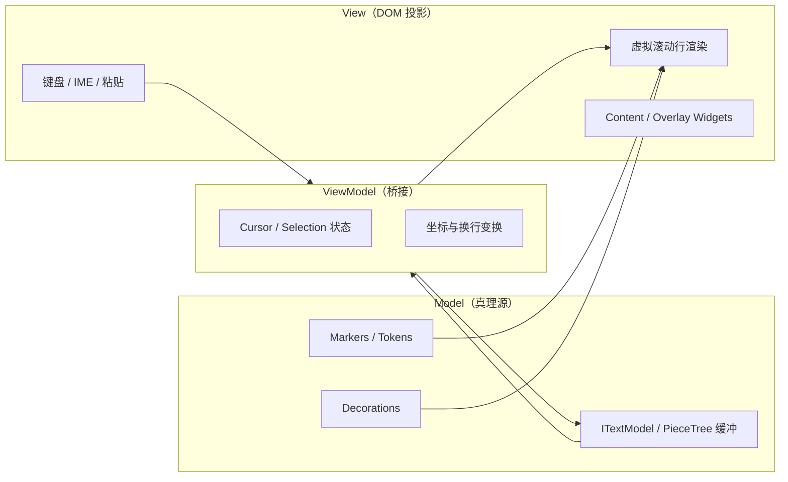

## 日常类比：发动机 vs 整车

想象你要在自家网站里放一个「能写代码的输入框」。最土的做法是 `<textarea>`——像记事本，能打字，但没有语法颜色、没有补全、没有红线报错。

**Monaco Editor** 是 Microsoft 从 Visual Studio Code 里拆出来的**编辑器发动机**：不是仿 VS Code 的 UI 皮肤，而是 VS Code 每天数百万人在用的那一颗 `src/vs/editor` 内核，重新打包成可在任意网页里 `npm install` 的 JavaScript 库。

日常类比可以分三层：

| 层次 | 类比 | Monaco 对应物 |
|------|------|----------------|
| 整车 | 完整 VS Code 桌面应用 | `code` 可执行文件 + Workbench |
| 发动机 | 可单独安装的编辑器库 | `monaco-editor` npm 包 |
| 轮胎 | 只读高亮展示 | Shiki / Prism（不是编辑器） |

2016 年前后，Monaco 以独立包形式发布，宣告「浏览器也能跑 VS Code 级编辑体验」。今天 GitHub.dev、StackBlitz、Replit、CodeSandbox、Theia 等产品里的代码区，底层常见的就是这颗发动机。

## 是什么

**Monaco Editor**（常简称 Monaco）是：

- 运行在浏览器里的**代码编辑器 SDK**
- VS Code 仓库中 `src/vs/editor/` 子树的 **standalone 构建**
- 提供 `monaco.editor.create()`、`monaco.languages.*` 等与桌面扩展几乎同形的 API

它**不是**富文本编辑器（不做 Word 式排版），也**不是**完整 IDE（没有内置文件树、终端、调试面板——那些属于 Workbench 层，需你自己或用 Theia / code-server 拼装）。

官方入口：[microsoft.github.io/monaco-editor](https://microsoft.github.io/monaco-editor/)  
Playground 可在线试 API：[monaco-editor playground](https://microsoft.github.io/monaco-editor/playground.html)

## 为什么重要

不理解 Monaco，以下几类问题很难答清：

1. **为什么网页里写 TypeScript 能像桌面一样立刻报类型错？** —— 内置 TS/CSS/JSON/HTML 语言服务跑在 Web Worker，主线程只收结果。
2. **为什么 bundle 动辄 1MB+ 仍被广泛采用？** —— 买的是整套 IDE 语义协议（补全、hover、诊断、跳转），不是换一个彩色 textarea。
3. **为什么 VS Code 扩展和 Monaco 扩展 API 长得像？** —— 同源代码；`registerCompletionItemProvider` 在两边是同一套契约。
4. **为什么大文件时高亮会突然变弱？** —— 有明确的性能降级阈值（超长行、超大文件会关 token、括号匹配等）。

和 [[codemirror-6-architecture]] 对照：CodeMirror 6 走「小核心 + 扩展 Facet」的函数式组合；Monaco 走「桌面编辑器整块复用 + Worker 语言服务」——体积更大，但开箱即用的 IDE 能力更强。

## 架构全景：MVVM + 分层目录

Monaco 内部采用 **Model – ViewModel – View** 分离（官方设计文档用语），与 VS Code 编辑器层一致：



**关键规则**：扩展和语言服务**不直接摸 View**，只通过 Model 与 Provider 注册表交互。这样虚拟滚动、IME 组合输入、撤销重做时，不会出现「DOM 和真值各写各的」撕裂。

源码目录（摘自 VS Code `src/vs/editor/`）：

| 目录 | 职责 |
|------|------|
| `common/` | 文本模型、选区、语言特性接口、核心服务 |
| `browser/` | DOM 渲染、输入控制器、编辑器 widget |
| `contrib/` | Find、Hover、Suggest、折叠等 60+ 内置贡献点 |
| `standalone/` | 打包成 `monaco-editor` 时的浏览器入口 |

在 VS Code 整体分层里，Editor 层坐在 Platform 之上、Workbench 之下——Monaco 只导出 Editor 层，不带 Workbench。

## 核心概念

### 1. Model 与 Editor 分离

- **`ITextModel`**：文件内容的真理源（基于 **Piece Tree** 文本缓冲，支持大文件与频繁编辑）。
- **`ICodeEditor`**：用户看到的编辑表面，持有（或切换）一个 model。
- 多个 editor 可**共享同一个 model**（例如左右分屏编辑同一文件）。

读内容、订阅变化应走 model API，**不要读 DOM**：虚拟滚动下 DOM 只渲染可见行。

### 2. URI + version 的异步契约

语言服务（补全、诊断）在 Worker 里算，结果回到主线程时可能已过期。Monaco 用 `model.uri` 标识文件、`model.getVersionId()` 标识版本——**过期结果直接丢弃**，避免把旧补全写回新文档。这是「多线程编辑器」比 try/catch 更根本的防线。

### 3. Web Worker 语言服务

TypeScript、JSON、CSS、HTML 等内置语言默认在独立 Worker 中运行编译器/解析器，避免阻塞输入。主线程通过 `postMessage` 同步 model 镜像并请求语义结果。自定义语言可注册轻量 provider，或通过 [monaco-languageclient](https://github.com/TypeFox/monaco-languageclient) 接远程 LSP。

### 4. Provider 扩展模型

语言能力通过**注册表**注入，而非改内部类：

- `registerCompletionItemProvider` — 补全
- `registerHoverProvider` — 悬浮提示
- `registerDefinitionProvider` — 跳转定义
- `registerDocumentFormattingEditProvider` — 格式化

这与 VS Code 的 `vscode.languages.*` 同构，降低「网页插件 ↔ 桌面扩展」的双端成本。

### 5. 虚拟滚动与性能降级

只把视口内的行挂到 DOM；滚动时复用节点。超过阈值（如单行极长、文件极大）会主动关闭部分语言特性以保证编辑器仍可用——表现为「突然不高亮了」，属于设计行为而非 bug。

### 6. Diff Editor

`monaco.editor.createDiffEditor()` 同时展示 original / modified 两个 model，内置并排 diff 视图，适合 PR 审查、配置对比、教程「改前/改后」展示。

## 代码示例 1：最小可运行编辑器

下面是在现代 bundler（Vite / webpack）里最常见的嵌入方式。`language` 决定加载哪套内置语言服务；`theme` 使用 VS Code 同款配色名。

```html
<div id="editor" style="height: 480px; border: 1px solid #333;"></div>
<script type="module">
  import * as monaco from 'monaco-editor'

  const editor = monaco.editor.create(document.getElementById('editor'), {
    value: [
      '// Monaco: VS Code 编辑器作为库',
      'function greet(name: string) {',
      '  return `Hello, ${name}!`',
      '}',
      '',
      'greet("world")',
    ].join('\n'),
    language: 'typescript',
    theme: 'vs-dark',
    automaticLayout: true, // 容器尺寸变化时自动 layout
    minimap: { enabled: false },
  })

  // 真值在 model 上，不在 DOM 上
  editor.getModel()?.onDidChangeContent(() => {
    console.log('version', editor.getModel()?.getVersionId())
  })
</script>
```

**要点**：

- `automaticLayout: true` 在 SPA 里几乎必备，否则侧栏折叠后编辑器空白。
- Worker 脚本路径需 bundler 正确配置（`MonacoWebpackPlugin` 或 Vite 官方 sample），否则语言服务 404。

## 代码示例 2：自定义补全 Provider

官方 Playground 有完整示例；下面演示为 `markdown` 注册 `/` 触发的片段补全（与 [[projects/monaco-editor]] 中案例同构，此处强调 **range** 必须对齐当前词边界）：

```javascript
import * as monaco from 'monaco-editor'

monaco.languages.registerCompletionItemProvider('markdown', {
  triggerCharacters: ['/'],
  provideCompletionItems(model, position) {
    const word = model.getWordUntilPosition(position)
    const range = {
      startLineNumber: position.lineNumber,
      endLineNumber: position.lineNumber,
      startColumn: word.startColumn,
      endColumn: word.endColumn,
    }
    return {
      suggestions: [
        {
          label: 'todo-snippet',
          kind: monaco.languages.CompletionItemKind.Snippet,
          documentation: '插入 TODO 占位片段',
          insertText: 'TODO: ${1:描述}',
          insertTextRules:
            monaco.languages.CompletionItemInsertTextRule.InsertAsSnippet,
          range,
        },
      ],
    }
  },
})
```

**踩坑提示**：若注册 `registerCompletionItemProvider('csharp', …)` 后**本地变量补全消失**，常与 provider 评分/合并策略有关；社区常见做法是对特定语言用 `'*'` 注册并在回调里判断 `model.getLanguageId()`，或与内置 word completion 并存——详见 [VS Code issue #21611](https://github.com/microsoft/vscode/issues/21611) 讨论。

使用 Vite 时若补全菜单完全不出现，检查是否打包了 `contrib/suggest` 模块（仅 `import 'monaco-editor'` 有时不包含全部 contrib）。

## 代码示例 3：Diff Editor（改前 / 改后）

```javascript
import * as monaco from 'monaco-editor'

const diffEditor = monaco.editor.createDiffEditor(
  document.getElementById('diff-root'),
  { renderSideBySide: true, readOnly: false }
)

const original = monaco.editor.createModel('const x = 1\n', 'javascript')
const modified = monaco.editor.createModel('const x = 2\n', 'javascript')

diffEditor.setModel({ original, modified })
```

Diff 两侧仍是独立 model，可分别 `onDidChangeContent`；合并结果需你自己从 `modified` 读取。

## 与 VS Code 的关系

| 维度 | VS Code 桌面 | Monaco 库 |
|------|-------------|-----------|
| 代码来源 | `src/vs/editor` + Workbench |  mainly `standalone` 构建的 editor |
| 扩展宿主 | Extension Host 进程 | 网页内 JS，无完整扩展市场 |
| 文件系统 | 真实磁盘 | 需应用自建（常是虚拟 FS） |
| 语言服务 | 内置 + 扩展 LSP | 内置 Worker + 可选 monaco-languageclient |

Monaco **不是** VS Code 的阉割骗局，而是**故意只导出编辑器层**；要「浏览器里完整 VS Code」，看 [[code-server]] / [[openvscode-server]]。

## 适用 vs 不适用

**适用**：

- 在线 IDE、教程沙箱、JSON/YAML 配置面板、低代码脚本区
- 需要补全、诊断、格式化、hover 的**代码**场景
- 希望与桌面 VS Code 共享语言扩展思路的团队

**不适用**：

- 富文本（标题、图片）→ [[prosemirror]] / [[lexical]]
- 极致小包体（<200KB gzip）→ [[codemirror-6-architecture]]
- 只读展示、无交互 → Shiki / highlight.js
- 移动端为主 → Monaco 为桌面浏览器输入模型优化

## 常见坑

1. **忘记 dispose**：`editor.dispose()` 后，若 model 无其他引用，应 `model.dispose()`，否则 SPA 路由切换泄漏内存。
2. **Worker 路径**：生产构建必须显式配置 worker entry，开发环境「能跑」、上线 404 是经典事故。
3. **用 CSS 硬改内部 class**：行高/光标由内部测量决定，应优先 `monaco.editor.defineTheme()`。
4. **超大单文件**：超过内置阈值会降级语言特性，需分片或截断，别当成「坏了」。

## 历史时间线（简）

- **2011**：Microsoft 内部「Monaco」代号，服务 Azure 网页编辑场景。
- **2015**：VS Code 发布，编辑器以 TypeScript 实现在 `src/vs/editor`。
- **2016**：`monaco-editor` 独立 npm 包，API 与 Playground 公开，社区开始写自定义 completion provider（如 [issue #241](https://github.com/microsoft/monaco-editor/issues/241)）。
- **2018+**：Piece Tree 缓冲重写、Codespaces 类产品推动「浏览器 = 一等 IDE 环境」。
- **现在**：与 VS Code 主仓库持续同步；React 集成常用 [@monaco-editor/react](https://www.npmjs.com/package/@monaco-editor/react)。

## 学到什么

1. **真理源在 Model，View 只是投影** —— 一切语言特性围绕 `ITextModel`，不是围绕 DOM。
2. **Worker 是一等公民** —— 不是事后优化，而是架构边界。
3. **库 vs 应用** —— Monaco 卖发动机；Workbench 要另买或自建。
4. **Provider 协议的价值** —— 扩展点稳定比内部类继承更重要。
5. **体积是能力定价** —— 1MB+ 买的是 IDE 语义，不是 CSS 高亮。

## 延伸阅读

- 官方文档与 API typings：[monaco-editor docs](https://microsoft.github.io/monaco-editor/docs.html)
- 交互 Playground：[Extending language services – completion](https://microsoft.github.io/monaco-editor/playground.html#extending-language-services-completion-provider-example)
- 编辑器设计（MVVM）：[VS Code Wiki – Code Editor Design Doc](https://github.com/microsoft/vscode/wiki/%5BWIP%5D-Code-Editor-Design-Doc)
- Piece Tree 缓冲：[Text Buffer Reimplementation](https://code.visualstudio.com/blogs/2018/03/23/text-buffer-reimplementation)（VS Code 博客）
- 接 LSP：[TypeFox/monaco-languageclient](https://github.com/TypeFox/monaco-languageclient)
- Vite + React 官方 sample：[monaco-editor/samples/browser-esm-vite-react](https://github.com/microsoft/monaco-editor/tree/main/samples/browser-esm-vite-react)

## 关联

- [[projects/monaco-editor]] — 本仓库中的项目向笔记（案例与踩坑更偏工程）
- [[codemirror-6-architecture]] — 另一套 Web 代码编辑器架构对照
- [[language-server-protocol-spec]] — Monaco 可通过 language client 对接 LSP
- [[vscode]] — Monaco 的「整车」出处
- [[theia]] — 用 Monaco 作默认编辑器的云 IDE 框架
- [[shiki]] — 只读染色；与 Monaco 互补而非竞争

## 反向链接

<!-- 由 scripts/regen-backlinks.mjs 自动生成 -->
