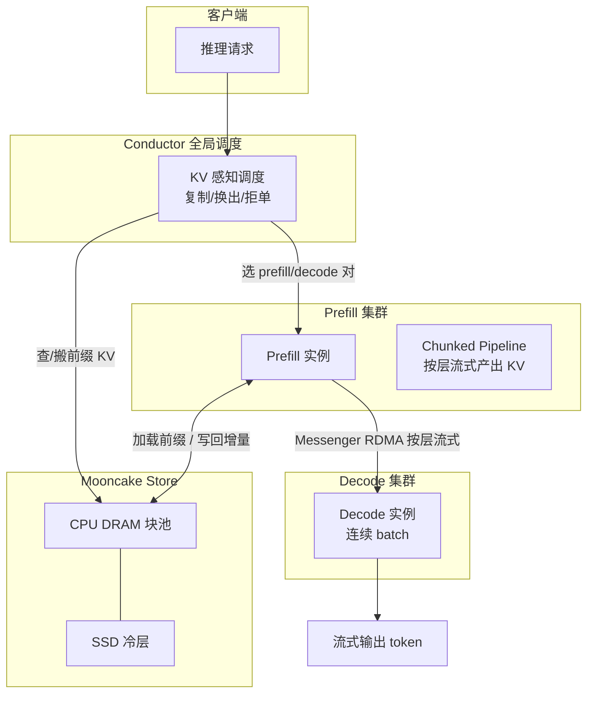

## 从日常类比开始：中央厨房 + 半成品冷库

想象你经营一家连锁火锅外卖（**Kimi 这样的在线 LLM 服务**）。每个订单分两段：

1. **备菜（prefill）**：顾客送来一大袋食材（长 prompt，几千 token）。厨房要一次性把底料、配菜全部切好、码盘——**算力密集**，客人等的是「第一口能下锅」的时间（**TTFT，首 token 延迟**）。
2. **上桌（decode）**：之后每 30 秒只加一片肉、一勺汤（**自回归**，每次只生成 1 个 token）。灶台要稳定、不能忽快忽慢——客人感知的是**相邻两勺之间的间隔**（**TBT / TPOT，token 间延迟**）。

传统做法像**每家分店一个小厨房**：备菜和上菜抢同一口锅——来一单 8000 token 的大备菜，所有正在吃的桌全停；或者为了上菜流畅，大订单备菜只能排队。

**DistServe 类方案**进一步把「备菜间」和「上桌间」拆到不同屋子（**prefill 集群 / decode 集群**），但还缺一块：**半成品怎么存、怎么搬、怎么复用**。

**Mooncake**（Moonshot AI，arXiv [2407.00079](https://arxiv.org/abs/2407.00079)，FAST 2025 Best Paper）的核心思想是：**整家店围绕「半成品（KV cache）」来调度**，而不是围绕「哪台 GPU 空闲」来调度。

- 很多顾客点同一款锅底（相同 system prompt、RAG 文档前缀）→ 锅底只熬一次，挂到**分布式冷库（Mooncake Store）**，下次直接端半成品。
- 冷库不只占 GPU 显存，还把集群里闲置的 **CPU、DRAM、SSD** 拼成**分级 KV 池**——用更多存储换更少重复计算（论文副标题：*Trading More Storage for Less Computation*）。
- 全局调度员 **Conductor** 决定：这单去哪个备菜间、哪个上桌间、从冷库搬多少前缀、要不要提前拒单（过载时）。

一句话：**Mooncake = prefill/decode 物理拆分 + 跨机 KV 池化 + 以 KV 复用率为核心的全局调度。**

---

## 是什么

| 项目 | 内容 |
|------|------|
| 论文 | *Mooncake: A KVCache-centric Disaggregated Architecture for LLM Serving* |
| 作者 | Ruoyu Qin, Zheming Li, Weiran He 等（Moonshot AI / 清华） |
| 发表 | arXiv 2024；**FAST 2025 Best Paper** |
| 生产 | Kimi 主服务栈；数千节点、**日均 100B+ token** |
| 开源 | [github.com/kvcache-ai/Mooncake](https://github.com/kvcache-ai/Mooncake)（Transfer Engine、Mooncake Store、trace） |
| 集成 | vLLM MooncakeConnector、SGLang 分层 KV、LMCache 等 |

论文要解的优化问题可以写成：

> **最大化有效吞吐（goodput）**，约束是 **TTFT**、**TBT** 等 SLO；在 GPU 供应紧张、**长期过载**时，还要决定**接不接单**——接了却做不完，prefill 算力全白费。

---

## 为什么重要

不理解 Mooncake，下面几件事很难讲清：

- 为什么 **vLLM 解决了 KV 显存碎片**、**DistServe 拆了 prefill/decode**，长上下文线上还要再叠一层——**跨请求、跨节点的 KV 复用**才是 Kimi 类产品的主战场
- 为什么 **prefix caching** 从「单机优化」变成 **RDMA 池化**——输入平均 **~7590 token**、输出 ~182 token 时，复用 1% 的计算就能省大量 prefill
- 为什么过载时要 **提前拒单（early rejection）**——goodput 只统计**完整跑完**的请求；prefill 做完 decode 没槽位，前面 token 全作废
- 为什么 2024–2025 工业栈（**NVIDIA Dynamo、DeepSeek 服务、vLLM xPyD**）都在往 **KV-centric disaggregation** 收敛

和邻近工作的关系：

| 工作 | 侧重点 | 与 Mooncake |
|------|--------|-------------|
| [[paged-attention-vllm]] | KV 物理块、连续 batch | Mooncake 的块存储可建立在分页 KV 之上 |
| [[distserve]] | prefill / decode 拆集群 | Mooncake 继承拆分，并加上**全局 KV 池 + Conductor** |
| [[sglang-radixattention]] | 单机 Radix 前缀树 | 思路互补；Mooncake 做**跨机**池化与搬运 |
| Splitserve / Sarathi | 混批或 chunk prefill | Mooncake 坚持**独立 prefill 池** + 长上下文 CPP |

---

## 核心概念

### 1. Prefill vs Decode：两种「病」

| 阶段 | 计算特征 | 主要 SLO | 优化方向 |
|------|----------|----------|----------|
| **Prefill** | 输入 token **并行**处理；attention 随长度**超线性**变重 | **TTFT** | 复用 KV、chunk 流水线、多卡 CPP |
| **Decode** | 每步 **1 token**；受 KV 读带宽限制 | **TBT** | 连续 batch、尽量堆大 batch 提 MFU |

混在同一批 GPU 上，两者互相抢资源——这是 **disaggregation** 的动机（与 DistServe 相同观察）。

### 2. KVCache 块与前缀哈希

Mooncake Store 在 **CPU DRAM**（可延伸到 SSD）里按**固定大小块**存 KV（类似分页）。每个块带 **prefix hash**：当前块 token 的哈希 **加上** 前面所有块，形成全局可去重的 ID。

论文 trace 里 `hash_ids` 示例：前 12 个 ID 相同 → 前 `12 × 512 = 6144` token 的 KV **可直接复用**，无需重算 attention。

块热度极不均匀：**>50% 块几乎不被访问**，少数热点块被访问数万次 → 需要**复制热点块**到多节点，避免 RDMA 拉取拥塞。

### 3. 架构组件



| 组件 | 职责 |
|------|------|
| **Conductor** | 为每个请求选 prefill + decode 实例；平衡 KV 复用、负载、SLO；热点块复制、冷块换出 |
| **Prefill 池** | 增量 prefill；超长输入走 **CPP（分块流水线并行）**；**按层**把新 KV 流式推到 decode |
| **Mooncake Store** | 分布式 KV 池；LRU/LFU 等淘汰；**Transfer Engine** 做 GPUDirect RDMA |
| **Messenger** | 每节点独立进程，异步跨机搬 KV，与计算重叠 |
| **Decode 池** | 收齐 KV 后加入 continuous batch；本地调度**二次检查** TBT，可能拒单 |

### 4. 单请求四步工作流

1. **KVCache Reuse**：prefill 节点按 `prefix block IDs` 从远端 CPU 内存 **bootstrap**；无缓存则跳过。
2. **Incremental Prefill**：对未缓存部分做 prefill；超过 `prefill_chunk`（通常 **>1000 token**）则 **分 chunk 流水线**执行。
3. **KVCache Transfer**：每层算完即通过 Messenger **流式**推到 decode 节点 CPU DRAM（与上一步重叠）。
4. **Decoding**：KV 到齐后进入连续 batch；若负载超预期，**本地拒单**（此前 prefill 成本沉没）。

### 5. KV -centric 调度的张力

两个提升吞吐的杠杆往往**伤害延迟**：

- **多复用远程 KV** → 等 RDMA / 等冷库 → TTFT 变差
- **decode 批越大** → MFU 越高 → TBT 变差

Conductor 在「复用多少」「批多大」「要不要等冷库」之间做**多目标权衡**；过载时还要预测**短期负载**和**生成长度**，决定 early reject。

### 6. 过载与 Early Rejection

与多数学术工作「假设资源够、全接单」不同，Kimi 在峰值**长期过载**。Mooncake 的 goodput 定义：**只有完整完成的请求才算**。

朴素拒单会导致负载**抖动**（一会儿全拒、一会儿全接）。论文用**预测未来 decode 槽位 + 生成长度**做更稳的拒单策略，避免「prefill 白算」。

### 7. 实测结论（论文）

| 场景 | 结果 |
|------|------|
| 模拟长上下文 | 相对基线吞吐最高 **+525%**，仍满足 SLO |
| 真实 Kimi 负载 | 多处理 **75%** 请求（arXiv）；FAST 版 A800/H800 上约 **+115% / +107%** |
| Trace 特征 | 平均输入 **7590** token，输出 **182** token；缓存从 1k→5 万块，命中率约 **30%→50%** |

---

## 代码示例 1：解析 Mooncake 开源 trace，估算前缀可复用 token

论文在 [kvcache-ai/Mooncake FAST25-release/traces](https://github.com/kvcache-ai/Mooncake) 公开了脱敏 trace。下面用 Python 读取一条记录，计算与上一条请求的**公共前缀长度**（理解 `hash_ids` 为何能驱动调度）：

```python
#!/usr/bin/env python3
"""Mooncake trace：用 hash_ids 估算两条请求可复用的 prompt token 数。"""
import json
from pathlib import Path

BLOCK_SIZE = 512  # 论文默认块大小

def shared_prefix_tokens(a: list[int], b: list[int]) -> int:
    n = 0
    for x, y in zip(a, b):
        if x != y:
            break
        n += 1
    return n * BLOCK_SIZE

def load_trace(path: Path) -> list[dict]:
    rows = []
    for line in path.read_text().splitlines():
        line = line.strip()
        if line:
            rows.append(json.loads(line))
    return rows

# Listing 1 中的两条样本（论文原文）
samples = [
    {
        "timestamp": 27482,
        "input_length": 6955,
        "output_length": 52,
        "hash_ids": [46, 47, 48, 49, 50, 51, 52, 53, 54, 55, 56, 57, 2353, 2354],
    },
    {
        "timestamp": 30535,
        "input_length": 6472,
        "output_length": 26,
        "hash_ids": [46, 47, 48, 49, 50, 51, 52, 53, 54, 55, 56, 57, 2366],
    },
]

shared = shared_prefix_tokens(samples[0]["hash_ids"], samples[1]["hash_ids"])
print(f"共享块数: {shared // BLOCK_SIZE}, 可复用约 {shared} tokens")
# → 12 块, 6144 tokens；第二条只需 prefill 剩余 ~328 token 的增量部分
```

对 Conductor 来说：**复用越长，越应把两条请求调度到「已有这些块」的 prefill 节点，或从 Store 拉块**，而不是随机分配。

---

## 代码示例 2：简化版 Conductor 调度打分（prefill 实例选择）

真实 Conductor 要同时看网络、DRAM、热点复制、SLO 预测。下面用**教学用伪代码**展示「KV 感知」如何压过纯负载均衡：

```python
from dataclasses import dataclass

@dataclass
class PrefillNode:
    name: str
    load: float          # 0~1，当前队列压力
    local_blocks: set[int]  # 本机 / 本池已缓存的 hash block id

@dataclass
class Request:
    prefix_blocks: list[int]  # 由 tokenizer 分块哈希得到
    uncached_tokens: int
    ttft_budget_ms: float

def score_prefill_node(req: Request, node: PrefillNode) -> float:
    """
    分数越高越优先。权重仅为示意；生产系统用实测标定。
    """
    hit = sum(1 for b in req.prefix_blocks if b in node.local_blocks)
    hit_ratio = hit / max(len(req.prefix_blocks), 1)

    # 复用收益：少算的 prefill 算力（粗估与 uncached 成反比）
    reuse_gain = hit_ratio * req.uncached_tokens

    # 负载惩罚：过载节点 TTFT 风险高
    load_penalty = node.load * 1000

    # 无命中且负载已高 → 强烈不选
    if hit_ratio == 0 and node.load > 0.85:
        return -1e9

    return reuse_gain - load_penalty

def pick_prefill(req: Request, nodes: list[PrefillNode]) -> PrefillNode:
    ranked = sorted(nodes, key=lambda n: score_prefill_node(req, n), reverse=True)
    best = ranked[0]
    if score_prefill_node(req, best) < 0:
        raise RuntimeError("early_reject: 无节点可在 TTFT 内完成 prefill")
    return best

# 示例：请求带 12 个已知前缀块
req = Request(
    prefix_blocks=list(range(46, 58)),
    uncached_tokens=6472 - 12 * 512,
    ttft_budget_ms=800.0,
)
nodes = [
    PrefillNode("prefill-a", load=0.3, local_blocks=set(range(46, 58))),
    PrefillNode("prefill-b", load=0.2, local_blocks=set()),  # 更空但无缓存
]
chosen = pick_prefill(req, nodes)
assert chosen.name == "prefill-a"  # KV 复用战胜略低的负载
```

第二段选完 prefill 后，Conductor 还要配对 **decode 节点**（看 batch 深度、KV 能否放进 VRAM、TBT 预测），并在 Messenger 上发起 **按层 RDAM 传输**——逻辑与 vLLM 的 `MooncakeConnector` 一致：把 KV 当作**一等公民的数据面**，而不是推理后的副产品。

---

## 代码示例 3（补充）：Early Rejection 的直觉实现

```python
def should_accept(
    *,
    predicted_decode_slots: int,
    predicted_output_tokens: int,
    queue_prefill_cost_tokens: int,
    slo_decode_capacity: int,
) -> bool:
    """
    若预测 decode 阶段没有足够槽位完成整单，则在 prefill 前拒单，
    避免「prefill 算完却无处 decode」的沉没成本。
    """
    need = predicted_output_tokens + queue_prefill_cost_tokens
    return predicted_decode_slots >= need and need <= slo_decode_capacity

# 过载：预测槽位不足 → 拒单，保护 goodput
assert should_accept(
    predicted_decode_slots=50,
    predicted_output_tokens=200,
    queue_prefill_cost_tokens=8000,
    slo_decode_capacity=100,
) is False
```

---

## 设计细节速览

### Chunked Pipeline Parallelism（CPP）

超长 prompt 单卡 prefill TTFT 过长。Mooncake 用 **CPP** 把单个请求拆到多 prefill 节点流水线，比传统 sequence parallelism **省网络、少弹性扩缩**。配合 **layer-wise** 传 KV，传输与计算重叠。

### 何时不拆 prefill？

若请求**足够短**、能 inline 进 decode batch 且**不破坏 TBT**，Mooncake 仍可能走混合路径——但长上下文主力仍走独立 prefill 池。

### Mooncake Store 与 Transfer Engine

- **Store**：分布式 KV 引擎，目标是在集群任意位置存**可复用** KV。
- **Transfer Engine**：开源 RDMA 传输层；vLLM/SGLang 通过 connector 接入，做 **disaggregated prefill** 与 **KV 跨实例搬运**。

---

## 踩坑与限制

1. **基础设施门槛**：依赖 **RDMA / GPUDirect**；普通以太网上 KV 搬运可能吃掉收益。
2. **短 prompt 收益有限**：复用少、搬运固定开销占比大。
3. **调度复杂度高**：Conductor 是单点「大脑」，策略错误比单机 vLLM 更难调试。
4. **拒单的产品语义**：提高 goodput 不等于提高用户满意度——需分级优先级、排队策略配合。
5. **缓存一致性**：块复制、换出、多副本之间要保证 hash / 版本一致，否则 attention 结果错误。
6. **与学术假设的差异**：论文强调**过载**；实验室小规模 benchmark 可能看不出 early reject 的价值。

---

## 自测题

1. Mooncake 的「KVCache-centric」和 vLLM 的「PagedAttention-centric」差在哪一层？
2. 为什么热点 KV 块要**复制**而不是只放一台 Store 节点？
3. 画出一条请求的四个阶段，标出 TTFT 主要消耗在哪几步。
4. 若 `hash_ids` 前 8 块相同、块大小 512，第二条请求 `input_length=5000`，大约还要 prefill 多少 token？
5. 朴素 early rejection 为何会导致负载波动？

<details>
<summary>参考答案</summary>

1. PagedAttention 管**单实例内** KV 如何分页、少碎片；Mooncake 管**跨实例/跨机** KV 存哪、搬哪、复用多少、与 prefill/decode 集群如何配对。
2. 否则大量请求同时 RDMA 拉同一热点块会造成**网络拥塞**，反而拉高 TTFT。
3. Reuse（可能等网络）→ Incremental Prefill（计算）→ Transfer（网络，可与 prefill 重叠）→ Decode；TTFT 主要受 reuse 等待 + prefill 计算 + 首段传输影响。
4. 已覆盖 `8×512=4096`，约 `5000-4096=904` token（未计最后不足一块的尾巴，工程上按块对齐）。
5. 瞬时全拒 → 负载骤降 → 随后又全接 → 再次过载；需要**预测性**拒单平滑流量。

</details>

---

## 延伸阅读

- 论文 PDF：[arXiv:2407.00079](https://arxiv.org/abs/2407.00079) / [FAST 2025](https://www.usenix.org/conference/fast25/presentation/qin)
- 文档与集成：[kvcache-ai.github.io/Mooncake](https://kvcache-ai.github.io/Mooncake/)
- 本仓库：[[distserve]]、[[paged-attention-vllm]]、[[sglang-radixattention]]、[[flash-attention]]

---

## 一句话总结

**Mooncake 把 LLM 服务从「GPU 上跑模型」升级为「围绕 KV cache 的分布式数据系统」：prefill/decode 分家、CPU/SSD 当冷库、Conductor 按块复用调度，并在过载时用预测性拒单换更高的有效吞吐——这是 Kimi 长上下文场景能 scale 的关键工程底座。**
