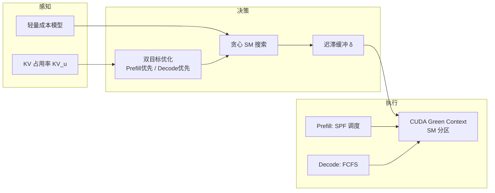

## 从日常类比开始：一家餐厅的两条流水线

想象你经营一家**同时做「现炒大锅菜」和「小火慢炖续汤」**的餐厅（一块 GPU）。每位顾客点菜分两步：

1. **Prefill（现炒）**：把整份食材（prompt）一次性下锅翻炒，出第一口菜（第一个 token），同时把味道记进「配方本」（KV cache）。这一步**重火力、重灶台**——像大矩阵乘法，吃 **算力（SM）**。
2. **Decode（续汤）**：之后每来一位客人要一勺，你就从配方本里翻旧料、加一小撮新料，**每次只加一勺**（每步 1 token）。这一步**火力不大，但不停翻账本、搬罐子**——像读全量权重 + 越来越长的 KV cache，吃 **显存带宽**。

传统 LLM 服务有三种摆法：

| 摆法 | 日常类比 | 优点 | 缺点 |
|------|----------|------|------|
| **单体 + Chunked Prefill** | 大锅菜和续汤**混在同一口锅、同一批火**炒 | 灶台不闲着 | 大锅一炒，续汤就得等——**相位干扰**，客人觉得「一个字一个字蹦得太慢」（TBT 飙高） |
| **跨 GPU PD 分离** | 一楼专门现炒、二楼专门续汤，用电梯搬配方本 | 互不打扰，TTFT/TBT 都稳 | 要**两整层楼**（两套完整模型副本），电梯排队、空楼浪费 |
| **Nexus（单 GPU 内分离）** | **同一层楼**，但用隔断把 40% 灶台给现炒、60% 给续汤，且**根据排队情况每分钟重划** | 只要一层楼，又尽量互不挡 | 要算清楚「划多少火」才不会浪费或抢带宽 |

Nexus 的核心洞察：**算力给多了会饱和**（边际收益递减），所以不必把整口锅都给某一阶段；**带宽会在两阶段同时运行时打架**，所以划分必须**动态、主动（proactive）**调整，而不是等慢了再补救。

---

## 这篇论文在解决什么问题

### 1. LLM 推理的两阶段不对称

| 阶段 | 在算什么 | 瓶颈 | 影响的指标 |
|------|----------|------|------------|
| **Prefill** | 一次处理 prompt 里 $n$ 个 token，填 KV cache | **Compute-bound**（FFN、QKV 大 GEMM） | **TTFT**（Time-To-First-Token） |
| **Decode** | 每步只算 1 个新 token，attend 全部历史 KV | **Memory-bound**（读权重 + 读 KV） | **TBT**（Time-Between-Tokens，token 间隔） |

用户体感：TTFT 决定「多久开始说话」，TBT 决定「说话是否卡顿」。两者要的资源形态不同，**混批就会互相拖后腿**。

### 2. 现有路线的两难

论文用 Qwen2.5-3B、单张 NVIDIA L20 做了微观测量（Poisson 到达 2.5 req/s）：

- **纯 decode batch**：平均迭代 ~15 ms
- **纯 prefill batch**：~132 ms
- **混合 batch（Chunked Prefill 典型）**：~251 ms —— decode 被拖慢 **8–10×**

94% 的迭代落在「混合 batch」里。根因是：prefill 的大 kernel 占满 SM / 带宽时，轻量 decode kernel **只能排队等同批 prefill 算完**，TBT 暴涨。

**跨引擎 PD 分离**（DistServe、Splitwise、vLLM-P/D）能消除干扰，但：

- 需要**多套完整模型权重**（prefill 机 decode 机各一份）
- KV 跨卡传输、协调、缓存驱逐会带来额外延迟与复杂度
- decode 侧 GPU 常常**利用率偏低**

### 3. Nexus 的问题设定

> 能不能在**单个 serving engine（通常 = 单 GPU 或一组 TP GPU 的一份模型副本）**里，逻辑上把 prefill 和 decode **拆开并发跑**，又不必多买一整张卡？

关键词是 **Intra-GPU / Intra-engine disaggregation**：空间上分区 SM，时间上两路 coroutine 各跑各的 batch，再用**成本模型 + 贪心搜索**主动调分区比例。

---

## 核心概念

### 1. Serving engine 与三种架构演进

论文把 **serving engine** 定义为：管理**恰好一份**完整模型权重的一组 GPU。

```text
(a) Monolithic     — 同一引擎、同一 batch 混跑 prefill chunk + decode
(b) PD Disagg.     — prefill 引擎 || decode 引擎，中间搬 KV
(c) Nexus          — 同一引擎内两路 batch 并发，SM 按比例切开
```

Nexus 目标：**同时拿到 (b) 的低干扰**和 **(a) 的高利用率**，且**不增加 GPU 数量**。

### 2. 边际收益递减（Diminishing Returns）

单独跑纯 prefill 或纯 decode，逐渐增加 SM 占比时：

- Prefill：30%→40% SM 可降延迟 25%+；70%→80% 只剩 ~10%；FFN 最吃算力，KQV 更早饱和
- Decode：30%→40% 只改善 ~10%；**超过 50% SM 后每加 10% 改善 <3%** —— 典型 memory-bound

推论：**整卡都给 decode 是浪费；整卡都给 prefill 也浪费**。最优往往在曲线「膝部」附近，且随负载变化。

### 3. 内存带宽争用（Memory Bandwidth Contention）

即使 SM 比例固定，**prefill 的 KV 读写**会与 **decode 的 attention 访存**抢 DRAM 带宽。论文观测：prefill KV 长度从 2000→10000，**同样 decode batch 延迟 +36%**。且 prefill 内存流量**随时间剧烈波动**，静态 60/40 切分不够。

### 4. Nexus 三大机制



#### 4.1 动态 SM 分区 + 成本模型

每个算子 $o$ 的延迟取 compute / memory 的 **max**（类似 roofline）：

$$
T_{\text{prefill}} = \sum_{i \in \text{PrefillOps}} \max(T_i^{\text{compute}}, T_i^{\text{mem}})
$$

$$
T_{\text{decode}} = \sum_{j \in \text{DecodeOps}} \max(T_j^{\text{compute}}, T_j^{\text{mem}})
$$

算力项用**两段饱和-衰减曲线**（阈值 $R_{\text{sat}}$，衰减系数 $\lambda$）拟合「SM 越多越快，但越快越不明显」。

内存项重点建模 **decode attention 与 prefill 重叠的概率** $P_{\text{attn}}$，推算 decode 有效带宽 $B_{\text{decode}}$，从而把「prefill 多占 SM → prefill 变快 → 重叠变短 → decode 反而少被挡」的反馈写进模型。

**双目标优化**（不能同时最小化两者，故带约束）：

- **Decode-prioritized**：$\min T_{\text{decode}}$，约束 $T_{\text{prefill}} \leq \alpha \cdot T_{\text{prefill}}^{\min}$
- **Prefill-prioritized**：$\min T_{\text{prefill}}$，约束 $T_{\text{decode}} \leq \beta \cdot T_{\text{decode}}^{\min}$

**运行时切换**：当 KV 占用 $KV_u \leq KV_{\text{switch}}$（实现里约为可用 KV 的 70%）→ 优先 prefill，多接 prompt；否则优先 decode，多完成生成、释放 KV。

**贪心搜索**：从当前 $R_p:R_d$ 出发，通常 **2–4 次**成本模型查询即收敛，适合亚秒级推理循环。

**迟滞（Hysteresis）**：仅当 $|R_p^{\text{new}} - R_p^{\text{cur}}| \geq \delta$ 才真正切换分区，避免抖动。

#### 4.2 分阶段调度

| 阶段 | 策略 | 原因 |
|------|------|------|
| **Prefill** | **SPF**（Shortest Prompt First）+ 防饿死年龄项 | 缩短 TTFT，缓解长 prompt 挡短 prompt（HoL blocking） |
| **Decode** | **FCFS** | 每请求每步只贡献 1 token，公平且开销低 |

SPF 打分：$\text{score}(r) = l_i - \gamma \cdot (t - a_i)$，$l_i$ 为剩余 prompt 长度，$a_i$ 到达时间。

#### 4.3 实现要点（基于 vLLM v1-0.8.1）

- prefill / decode **独立 coroutine、独立 CUDA stream、独立调度队列**
- 用 **CUDA Green Context** 做 SM 逻辑隔离（~150 行 CUDA 扩展暴露给 Python）
- 启动时**预实例化所有分区布局**，运行时切换，避免重配开销
- $\lambda$ 等曲线参数按**模型 + workload 离线 profiling** 一次标定

---

## 代码示例

### 示例 1：用饱和曲线理解「SM 分给 decode 的边际收益」

下面用论文 §3.2 的直觉写一个**玩具成本模型**：SM 比例 $r$ 从 0.1 到 1.0，看 prefill / decode 延迟如何「变平」。

```python
import numpy as np

def saturated_latency(flops: float, r: float, peak_tflops: float,
                      r_sat: float = 0.6, lam: float = 0.5) -> float:
    """两段饱和-衰减：r <= r_sat 时 ~ 1/r；之后边际收益快速变小。"""
    cap = peak_tflops * 1e12
    if r <= r_sat:
        return flops / (r * cap)
    base = flops / (r_sat * cap)
    return base * (1.0 + lam * (r - r_sat))

# 玩具 FLOPs：prefill 一次 chunk 远大于 decode 一步
prefill_flops = 8e10   # 重 GEMM + FFN
decode_flops = 2e9     # 单 token，但 memory-bound 在真实系统里更早饱和

peak = 30.0  # TFLOPS，示意 L20 量级
rs = np.linspace(0.1, 1.0, 10)

print("r\tprefill_ms\tdecode_ms")
for r in rs:
    tp = saturated_latency(prefill_flops, r, peak, r_sat=0.65, lam=0.4) * 1e3
    td = saturated_latency(decode_flops, r, peak, r_sat=0.45, lam=0.8) * 1e3
    print(f"{r:.1f}\t{tp:8.1f}\t{td:8.1f}")

# 若整卡(r=1.0)都给 decode，相比 r=0.5 往往只快一点点 —— 这就是「不必整卡 decode」的依据
```

运行后你会看到：**decode 曲线在 r>0.5 后几乎变平**，而 prefill 在 r=0.6–0.8 仍有一定收益——Nexus 会把「多出来的 SM」优先留给还在吃算力的那一相。

### 示例 2：模拟 Nexus 的 KV 驱动目标切换 + 贪心分区

```python
from dataclasses import dataclass

@dataclass
class WorkloadState:
    kv_used: float      # 当前 KV 占用（GB）
    kv_capacity: float  # 总 KV 容量（GB）
    queue_prefill: int  # 等待 prefill 的请求数
    queue_decode: int   # 正在 decode 的请求数

KV_SWITCH_RATIO = 0.70   # 论文：KV_switch ≈ 70% 可用 KV
ALPHA = 1.3              # prefill-prioritized 时 decode 可容忍放慢倍数
BETA = 1.1               # decode-prioritized 时 prefill 可容忍放慢倍数（实现偏紧）
DELTA = 0.05             # 迟滞：SM 占比变化 <5% 则不切换

# 简化 latency 表：rp = prefill 分到的 SM 比例（0~1）
def latency_table():
    """键 (phase, rp) -> 毫秒；phase in {'prefill','decode'}，decode 用 1-rp。"""
    table = {}
    for rp in [i / 20 for i in range(1, 21)]:
        rd = 1.0 - rp
        # 玩具曲线：prefill 喜多 SM；decode 在 rd>0.5 后收益很小，且受带宽惩罚
        bw_penalty = 1.0 + 0.3 * max(0.0, rp - 0.5)  # prefill 太大时 decode 被带宽拖慢
        table[("prefill", rp)] = 120.0 / max(rp, 0.05)
        table[("decode", rp)] = (18.0 / max(rd, 0.05)) * bw_penalty
    return table

TABLE = latency_table()

def cost(phase: str, rp: float) -> float:
    rp = round(rp * 20) / 20
    return TABLE[(phase, rp)]

def choose_mode(state: WorkloadState) -> str:
    if state.kv_used / state.kv_capacity <= KV_SWITCH_RATIO:
        return "prefill-prioritized"
    return "decode-prioritized"

def greedy_partition(rp_cur: float, mode: str) -> float:
    """对齐论文 Algorithm 1 的两段贪心：先满足约束，再尽量优化主目标。"""
    slack = BETA if mode == "prefill-prioritized" else ALPHA
    primary = "prefill" if mode == "prefill-prioritized" else "decode"
    other = "decode" if primary == "prefill" else "prefill"

    opt_other = min(cost(other, rp) for rp in [i/20 for i in range(1, 21)])
    r = round(rp_cur * 20) / 20

    # Phase 1: 缩小 primary 份额直到 other 满足 slack
    while cost(other, r) > slack * opt_other and r > 0.05:
        r -= 0.05

    # Phase 2: 增大 primary 份额直到约束即将违反
    while r < 0.95:
        r_next = round((r + 0.05) * 20) / 20
        if cost(other, r_next) > slack * opt_other:
            break
        r = r_next
    return r

def nexus_step(state: WorkloadState, rp_cur: float) -> float:
    mode = choose_mode(state)
    rp_new = greedy_partition(rp_cur, mode)
    if abs(rp_new - rp_cur) < DELTA:
        return rp_cur
    return rp_new

# 模拟：KV 从空闲逐渐填满
rp = 0.55
for kv_gb in [5, 20, 28, 38, 42]:
    st = WorkloadState(kv_used=kv_gb, kv_capacity=48.0,
                       queue_prefill=12, queue_decode=40)
    rp = nexus_step(st, rp)
    print(f"KV={kv_gb:2d}GB mode={choose_mode(st):22s} -> R_prefill={rp:.2f}")
```

输出会展示：**KV 低**时系统倾向把更多 SM 给 prefill（压低 TTFT）；**KV 逼近容量**时转去照顾 decode（降低 TBT、促进 KV 回收）。这就是论文所说的 **proactive**——根据**即将发生的内存压力**切换目标，而不是等 OOM 或超时再反应。

### 示例 3：SPF 预fill 调度（Algorithm 2 简化版）

```python
from dataclasses import dataclass
from typing import List

@dataclass
class Request:
    req_id: str
    prompt_len: int
    prefilled_len: int
    arrival_time: float

def spf_batch(requests: List[Request], token_budget: int,
              now: float, gamma: float = 15.0) -> List[Request]:
    """Shortest Prompt First：优先短 prompt，年龄大则加分防饿死。"""
    scored = []
    for r in requests:
        remaining = r.prompt_len - r.prefilled_len
        age = now - r.arrival_time
        score = remaining - gamma * age  # 等越久 score 越小 → 越优先
        scored.append((score, remaining, r))
    scored.sort(key=lambda x: x[0])

    batch, total = [], 0
    for _, rem, r in scored:
        if total + rem <= token_budget:
            batch.append(r)
            total += rem
        else:
            break
    return batch

queue = [
    Request("A", 8000, 0, arrival_time=0.0),
    Request("B", 400, 0, arrival_time=0.1),
    Request("C", 200, 0, arrival_time=0.2),
]
picked = spf_batch(queue, token_budget=1024, now=0.3)
print([r.req_id for r in picked])  # 典型：['C', 'B'] 先于超长 A
```

在单体 FCFS 下，A 会把 B、C 挡在队首；SPF 让短请求先出第一 token，**TTFT 分布**显著改善——论文 ablation 里仅 SPF 就能比 naive intra-engine PD **TTFT 降 90%**（但若无动态 SM，TBT 仍会因争用变差）。

---

## 实验结果（论文摘要）

**环境**：Intel Xeon Platinum 8457C，2× NVIDIA L20 48GB，CUDA 12.8，PyTorch 2.6；模型 Qwen2.5-3B / Llama-3.1-8B / Qwen2.5-14B；Poisson 到达。

**工作负载**：

| 数据集 | 特点 |
|--------|------|
| Long Data Collections | 长输入、中等输出 |
| ArXiv Summarization | 长输入、短输出 |
| Mixed（60% ShareGPT + 40% Long） | 长短混杂，调度压力大 |

**相对 vLLM v1.0.8.1（单卡）**：

- 吞吐最高 **2.2×**（14B 双卡 Mixed）
- TTFT 最高 **20×** 降低
- TBT 最高 **2.5×** 降低

**相对 SGLang**：吞吐最高 **2×**，TTFT **2×**，TBT **1.7×**。

**相对 vLLM-P/D（双卡分离）**：Nexus **单卡**在 Mixed 上吞吐仍高 **1.4×**；Long/ArXiv 上 TTFT 与双卡分离相差 **<10%**。

**排队延迟**：Mixed 负载下等待时间比 vLLM **5×** 低、比 vLLM-P/D **2×** 低——增益主要来自 **SPF + 动态 SM**，而非微优化 kernel。

**消融**：

| 配置 | 现象 |
|------|------|
| 仅 intra-engine 分离 + FCFS | HoL + 争用，TTFT/TBT 都差 |
| + 动态 SM | TBT **-14%**，但 TTFT **+30%**（decode 挤占 prefill） |
| + SPF，无动态 SM | TTFT 大降，TBT 变差 |
| **完整 Nexus** | TTFT 再 **-23%**，TBT **-26%**，两者兼得 |

---

## 与相关系统的关系

| 系统 / 论文 | 与 Nexus 的关系 |
|-------------|-----------------|
| **vLLM + PagedAttention** | Nexus **实现底座**；解决 KV 存哪，Nexus 解决 **算力/带宽在 prefill/decode 间怎么分** |
| **Sarathi / Chunked Prefill** | 提高利用率但引入 **混合 batch 干扰** —— Nexus 的对照组问题来源 |
| **DistServe / Splitwise / vLLM-P/D** | **跨引擎** PD 分离；Nexus 追求相近 SLO，**一半 GPU** |
| **FastServe (MLFQ)** | 缓解 HoL，但论文中 tail TTFT 差、高负载需 recompute |
| **SGLang (RadixAttention)** | 前缀复用优化；Nexus 在 Mixed 负载吞吐仍显著领先 |

可组合理解：**PagedAttention 管内存布局，Nexus 管同卡上的相位隔离与资源比例**——正交两层优化。

---

## 实践启示（给工程师的 checklist）

1. **先量相位干扰**：若 profile 里 mixed batch 占比高、decode kernel 在 mixed 下延迟数倍 → 值得看 PD 分离类方案。
2. **分离不必等于加卡**：单卡 SM 分区 + 双队列可能是 **成本敏感部署** 的甜点位。
3. **动态比静态重要**：带宽争用随 KV 长度波动，**70% KV 阈值切目标** 这类信号比固定 50/50 更稳。
4. **调度与资源要配对**：单独 SPF 或单独动态 SM 都不够；论文 ablation 已经量化。
5. **部署依赖**：CUDA Green Context、较新驱动（论文 570.124.04）；需 offline profiling 标定 $\lambda, R_{\text{sat}}$。
6. **尾延迟 trade-off**：prompt 长度极度多样时，P95 TTFT 可能仍逊于专门优化尾部的系统——要按 SLO 选 $\gamma, \alpha, \beta$。

---

## 踩过的坑（读论文时容易误解的点）

1. **「Intra-GPU」不等于「单卡只能跑一个请求」** —— 仍是连续批处理，只是 **prefill batch 与 decode batch 分路**。
2. **不是改 attention kernel** —— 论文强调 **无 kernel 修改**，靠 SM 分区 + 调度 + 成本模型。
3. **Proactive ≠ 预测未来流量** —— 主要指用 **成本模型前向估算** + **KV 占用趋势** 选分区，而非 ML 预测 arrival。
4. **整卡 PD 分离在曲线最右端** —— 整张 L20 Dedicated decode 已在 diminishing returns 区，**浪费 SM**。
5. **与 Chunked Prefill 正交** —— Nexus 仍可 chunk 长 prompt，但 chunk 在 **prefill 通道** 里跑，不与 decode token 混同一 batch。

---

## 自测题

1. 为什么 Chunked Prefill 提升利用率却可能恶化 TBT？
2. 画一条「decode 延迟 vs SM 比例」草图，标出饱和区。
3. $KV_u > KV_{\text{switch}}$ 时 Nexus 为什么转 Decode-prioritized？
4. SPF 里 $\gamma$ 变大，对长 prompt 公平性有何影响？
5. 若你只能实现 Nexus 的一个组件，先做动态 SM 还是 SPF？为什么（结合 ablation）？

---

## 参考资料

- 论文：[arXiv:2507.06608](https://arxiv.org/abs/2507.06608)（v5 HTML 全文）
- 作者：Xiaoxiang Shi, Colin Cai, Junjia Du, Zhihao Jia（CMU / Berkeley / NTU 等）
- 底座：[vLLM](https://github.com/vllm-project/vllm) — 见本站 [[paged-attention-vllm]]
- 背景：[[llm-serving-needs-math]]（prefill/decode 数学与调度）、[[hexagent-agentic-scheduling]]（跨阶段 Agent 调度）
- NVIDIA：[CUDA Green Context](https://docs.nvidia.com/cuda/cuda-c-programming-guide/index.html)（SM 逻辑分区能力，具体 API 随驱动演进）

---

## 一句话总结

**Nexus 把「跨 GPU 的 Prefill/Decode 分离」压缩进「单 GPU 内的 SM 动态分区」：用可解释的饱和成本模型主动决定算力切分，用 SPF/FCFS 分相调度，在不多买卡的前提下同时压低 TTFT、TBT 并提高吞吐。**
