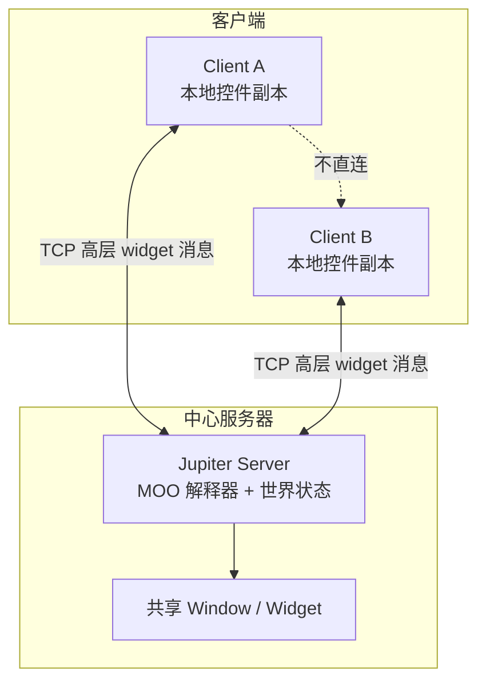

## 日常类比：卫星电话时代的共享白板

想象你和同事隔着半个地球，用**很慢的卫星链路**一起改同一块电子白板：拖一下滑块要 300 毫秒对方才看见，拨号上网时更糟。

最笨的做法像老式 **X11 远程桌面**：你每动一下鼠标、每敲一个键，都要把原始事件发到服务器，等回包再画——像隔着卫星电话**逐字报坐标**，带宽和往返次数都吃不消。

Jupiter（1995，Xerox PARC）换了一种思路，像**共享一份「智能表单」**：

- 你们改的不是像素，而是**滑块数值、文本段落、按钮状态**这类「控件级」消息；
- 你一动滑块，**本地立刻更新**（乐观并发），不用等服务器点头；
- 若你和服务器同时改了同一控件，双方用 **`xform` 变换函数**把冲突操作「改写成能合到一起的版本」——像两个人同时删文档里不同位置的字母，系统自动把「删第 4 个」改成「删第 3 个」，最后都看到 `ACE`。

论文全名 *[High-Latency, Low-Bandwidth Windowing in the Jupiter Collaboration System](https://dl.acm.org/doi/10.1145/215585.215706)*（UIST 1995，Nichols / Curtis / Dixon / Lamping）。它既是早期 **CSCW 虚拟世界** 的工程报告，也是 **OT（操作变换）工业化** 的关键一步：把 Ellis & Gibbs 的分布式 dOPT 简化成 **client ↔ 中心 server** 的两方同步，再由此扩展到 N 人共享控件。Google Wave、后来的协同编辑路线都直接或间接继承这套思想。

## 是什么

**Jupiter** 是一个多用户、多媒体的**持久化虚拟世界**（运行在 LambdaMOO 服务器上），支持：

- 共享文档与工具（白板 `StrokeEdit`、富文本 `TextEdit`、滑块 `Numeric` 等）；
- 可选的音视频（`VideoPane`）；
- 用户用内部脚本语言扩展新工具，**默认控件就是多人共享的**。

本篇论文聚焦**窗口工具包底层的 client-server 通信**：如何在**高延迟、低带宽**链路上，仍让用户感觉「跟本地软件一样跟手」。

核心设计选择可以概括成一张表：

| 维度 | Jupiter 的选择 | 带来的效果 |
|------|----------------|------------|
| 通信抽象 | 高层 **widget 状态**，不是键盘/鼠标原语 | 消息少、往返少 |
| 并发模型 | **乐观**：本地先应用，再通知对方 | 不等 RTT，交互跟手 |
| 拓扑 | **中心化 server** 存世界状态、跑应用代码 | 序列化简单，易做 N 路广播 |
| 冲突解决 | 源自 dOPT 的 **OT + `xform`** | 两方路径最终收敛到同一控件值 |
| 客户端 | Tcl/Tk、Windows 等，只管 I/O | 平台无关 |

一句话：**Jupiter = 高层共享控件 + 乐观 OT + 中心 server 串行广播**，专为「慢网」上的协同 UI 而生。

## 为什么重要

不懂这篇论文，很难解释下面几件事：

1. **为什么 Google Docs 可以「边打字边同步」而不锁文档？** —— 工业 OT 几乎都走 Jupiter 式 **client-server 变换**，不是 1989 年原版对等 dOPT。
2. **为什么远程协作不直接流式传输 X11？** —— 逐事件协议在慢网上会饿死；Jupiter 用 **widget 级增量**（如 `Replace` 一段文本）换带宽。
3. **OT 和 CRDT 的分叉点在哪？** —— Jupiter/OT 依赖**变换函数**和中心序列化；[[yjs-crdt-overview]] 等 CRDT 路线用数学可合并结构，更适合 P2P / 离线。两条路从 90 年代就并存。
4. **「两个计数器」为什么够用？** —— 每个 client 只跟 server 同步，用 `(myMsgs, otherMsgs)` 标记在状态格里的位置，不必维护 N 维状态向量。

论文被引 100+ 次，是 [[ot-1989]] 之后协同编辑工程化的里程碑；与 [[zed-editor-collaborative]]、[[eg-walker-collab-text-2024]] 等现代方案对比时，Jupiter 代表 **OT + 中心化** 的经典范式。

## 系统架构



要点：

- **Server** 持有权威状态，执行用户写的 Jupiter 应用逻辑。
- **Client** 维护控件副本，用户操作时**立即改本地副本**，并发出状态更新消息。
- **Client 之间不通信**；server 收到某 client 的变更后，按 Figure 9 算法**广播给其他 client**。
- 应用界面用 **S-expression** 描述（类似 FormsVBT），例如垂直 `VBox` 里放 `TextEdit %contents`。

## 核心概念

### 1. 高层 widget 协议（省带宽）

与 X Remote / LBX 等「压缩像素流」不同，Jupiter 在链路上只传：

- 创建窗口的 S-expression；
- `Numeric` / `Boolean` 的**完整新值**（滑块松手后才发，拖动过程不发中间帧）；
- `TextEdit` 的 **`Replace(区域, 文本)`** 增量；
- `StrokeEdit` 的笔画创建/移动/删除等（见论文 Table 2）。

这样**一次用户意图 = 一条语义消息**，避免「每个按键一次往返」。

### 2. 乐观并发 + 中心化

- **悲观**方案：改数据前先要锁或 floor control → 慢网上用户干等。
- **Jupiter**：client **先本地应用**，再发消息；冲突靠 OT 修复。
- 因为已有中心 server 存持久世界，**只在每条 client-server 链路上做两方 OT**，server 端把各 client「看成已与 server 同步」，再用简单 echo 实现 **N 路一致**。

### 3. 状态格 `(clientMsgs, serverMsgs)`

双方每处理一条消息，就在二维格子里前进一步。无冲突时走同一路径；冲突时分叉，靠 `xform` 在汇合时对齐。

论文 Figure 3 经典例子：文本 `"ABCDE"`，client 删第 4 字符 `D`，server 删第 2 字符 `B`：

- 无变换 → client 得 `ACE`，server 得 `ACD`（不一致）；
- `xform(del 4, del 2)` → client 消息改为 `del 3` → 双方都得到 `ACD`。

### 4. `xform(c, s) → {c', s'}`

对**从同一起点状态**发出的 client 消息 `c` 与 server 消息 `s`，返回变换后的 `c'`、`s'`，使得：

- client 执行 `c` 再执行 `s'`；
- server 执行 `s` 再执行 `c'`；

最终控件值相同。

删除操作的规则（论文直接给出）：

```
xform(del x, del y) =
  { del x-1, del y }  if x > y
  { del x, del y-1 }  if x < y
  { no-op, no-op }    if x = y
```

### 5. 出站队列与「假想操作」`c'`

若 client 与 server **错开超过一步**（Figure 5），不能直接用 `xform(c, s2)`，因为 `c` 与 `s2` 起点不同。Jupiter 的修复：

1. 处理 `s1` 时保存 `xform(c, s1)` 返回的 **`c'`**（「若从 server 当时状态出发，client 本会发什么」）；
2. 收到 `s2` 时用 **`xform(c', s2)`** 继续对齐。

这是对 dOPT 的改进：dOPT 在多方、深度分叉时对**已保存消息**变换不足；Jupiter 在**有序 TCP + 仅两方链路**前提下补全了这一点。

### 6. 消息序号与窗口锁

应用改控件前需持有** per-window 锁**。若 B 窗消息因锁延迟处理，A 窗的回复却提前 ack 了 B 的消息，序号会误导双方「以为不冲突」。因此：

- **未处理的消息不能 ack**；
- 序号粒度至少细到**锁的粒度**（Jupiter 用 per-window 计数器）。

### 7. 选择变换函数的工程权衡（Section 7）

Jupiter 约有 19 种 client 消息、24 种 server 消息；同一 widget 内才需变换，实际约 **41 类**冲突对。设计原则：

- 变换集合对操作类型**封闭**；
- **尽量不丢用户输入**；
- **别让应用层收到语义过时的回调**（如列表已换，仍上报旧下标）。

具体策略举例：

| 控件 | 冲突策略 |
|------|----------|
| `Numeric` / `Boolean` | server `SetValue` 赢，client 变 `no-op` |
| `TextList` | 用户 `Activate` vs server `ReplaceItems` → 丢用户动作（索引已失效） |
| `TextEdit` | 双 `Replace` → 合并删除区间并插入双方文本；同点插入 server 优先 |
| `StrokeEdit` | 模式切换 vs 用户新笔画 → 保留笔画但可能让应用意外（论文承认是妥协） |

## 代码示例 1：两方同步核心（摘自论文 Figure 6 的 TypeScript 化）

下面是把 Jupiter **client 侧**收发逻辑抽成可读伪代码（`myMsgs` / `otherMsgs` 即状态格坐标）：

```typescript
type WidgetOp = { kind: string; payload: unknown };
type QueuedMsg = { op: WidgetOp; myMsgs: number };

class JupiterEndpoint {
  myMsgs = 0;
  otherMsgs = 0;
  outgoing: QueuedMsg[] = [];

  constructor(
    private applyLocally: (op: WidgetOp) => void,
    private send: (op: WidgetOp, myMsgs: number, otherMsgs: number) => void,
    private xform: (a: WidgetOp, b: WidgetOp) => [WidgetOp, WidgetOp],
  ) {}

  /** 用户或本地逻辑发起变更 */
  generate(op: WidgetOp): void {
    this.applyLocally(op);
    this.send(op, this.myMsgs, this.otherMsgs);
    this.outgoing.push({ op, myMsgs: this.myMsgs });
    this.myMsgs += 1;
  }

  /** 收到对方消息（含序号 myMsgs/otherMsgs） */
  receive(msg: WidgetOp, msgMyMsgs: number, msgOtherMsgs: number): void {
    // 对端已处理到 msgOtherMsgs → 丢弃已确认的出站消息
    this.outgoing = this.outgoing.filter((m) => m.myMsgs >= msgOtherMsgs);

    // 新消息必须与当前 otherMsgs 对齐（有序信道假设）
    if (msgMyMsgs !== this.otherMsgs) {
      throw new Error("protocol desync");
    }

    // 与队列中尚未被对端确认的本地操作逐对变换
    for (let i = 0; i < this.outgoing.length; i++) {
      const [newMsg, newQueued] = this.xform(msg, this.outgoing[i].op);
      msg = newMsg;
      this.outgoing[i] = { ...this.outgoing[i], op: newQueued };
    }

    this.applyLocally(msg);
    this.otherMsgs += 1;
  }
}
```

这段代码体现了 Jupiter 相对 dOPT 的**工程简化**：变换永远发生在 **「当前端 ↔ server」** 之间，tie-breaking 可写进 `xform`，不必携带站点优先级矩阵。

## 代码示例 2：`TextEdit` 删除冲突的 `xform`

把 Figure 3 场景写成可测试函数（1-based 下标，与论文一致）：

```python
from dataclasses import dataclass
from typing import Optional, Tuple

@dataclass(frozen=True)
class Del:
    pos: int  # 删除第 pos 个字符（1-based）

def apply_del(text: str, op: Del) -> str:
    i = op.pos - 1
    return text[:i] + text[i + 1:]

def xform_del(c: Del, s: Del) -> Tuple[Del, Del]:
    """Jupiter 论文 §5 的 delete/delete 变换"""
    if c.pos > s.pos:
        return Del(c.pos - 1), s
    if c.pos < s.pos:
        return c, Del(s.pos - 1)
    return Del(0), Del(0)  # no-op：同一位置，双方删除同一字符

def converge(text: str, c: Del, s: Del) -> str:
    c2, s2 = xform_del(c, s)
    # client 路径：先 c 后 s'
    via_client = apply_del(apply_del(text, c), s2 if s2.pos else Del(1))  # no-op 跳过
    # server 路径：先 s 后 c'
    via_server = apply_del(apply_del(text, s), c2 if c2.pos else Del(1))
    assert via_client == via_server
    return via_client

# Figure 3: client del 4 (D), server del 2 (B) on "ABCDE"
assert converge("ABCDE", Del(4), Del(2)) == "ACD"
```

真实 `TextEdit` 使用 **`Replace(起, 止, 文本)`** 而非裸 `Del`；双 `Replace` 时要合并删除区间、排序插入点，极端情况还需**拆成两条消息**（论文 §7：一种变换产生了原操作集里没有的操作形状）。

## 代码示例 3：Server 端 N 路广播（Figure 9）

```python
def server_on_client_message(window, msg, sender, clients, apply, send):
    apply(msg.op, window)           # 更新 server 权威副本
    for c in clients_for(window):
        if c is not sender:
            send(c, msg)              # 其他 client 走同一套两方 OT
```

每个 client 仍只与 server 做 `xform`；**server 串行应用 + 广播**保证了「所有 client 副本 == server 副本」时彼此相等。

## 与相关工作的关系

| 系统 | 并发控制 | 拓扑 | 与 Jupiter 对比 |
|------|----------|------|-----------------|
| Grove / dOPT [[ot-1989]] | 乐观 OT | 全分布式 | Jupiter 算法来源；Jupiter 简化拓扑与序号 |
| GroupKit / Rendezvous | 各异 | 分布或中心 | Jupiter 强调慢网 widget 抽象 |
| X / LBX / HBX | 无协作 | 单用户远程显示 | 压缩像素；Jupiter 改语义层 |
| NeWS / HotJava | — | 代码下发 | code-shipping；Jupiter 隐藏分布细节 |
| Visual Obliq | 共享需显式 | 中心 | 类似快速原型；未优化慢网 |
| Google Wave (2009) | OT | 中心 | 公开承认继承 Jupiter 思路 |
| Yjs / CRDT [[yjs-crdt-overview]] | 无变换 | 任意 | 合并数学保证；非 Jupiter 路线 |

## 踩过的坑

1. **变换函数不是「显然唯一」**：`xform(del, del)` 有合理解，但 `SetValue` 谁赢、`TextList` 是否丢用户点击，都是产品决策。
2. **操作集封闭性**：`TextEdit` 双 `Replace` 曾需要**拆消息**，否则出现协议未定义的操作类型。
3. **单点 server**：故障即停；工业界用复制与故障转移弥补，P2P 场景应看 CRDT。
4. **不能假设无限历史**：出站队列要靠对端 ack 或 **no-op 心跳** 回收，否则单向流量窗口会内存膨胀。
5. **锁与 ack 顺序**：细粒度锁若与粗粒度序号混用，会制造**虚假无冲突**——论文用 per-window 序号专门修了这类 bug。

## 适用 vs 不适用

**适用**：

- 中心化协同编辑 / 共享白板 / 远程表单；
- 高 RTT、低带宽（跨洋、移动网络、卫星）；
- 控件类型有限、可为每类 widget **手写变换表**；
- 需要「本地零延迟反馈」的 UI。

**不适用**：

- 强离线、长时间分叉后合并 → CRDT / [[automerge-json-crdt-2017]] 更省心；
- 纯 P2P、无信任中心 → OT 变换与因果序维护成本高；
- 操作种类爆炸（富文本+表格+嵌入对象）→ 变换组合维护地狱；
- 需要强一致即时全局序 → 悲观锁或共识协议，而非乐观 OT。

## 历史脉络（可跳过）

- **1989**：Ellis & Gibbs 提出 dOPT 与 Grove 编辑器（[[ot-1989]]）。
- **1995**：本篇 UIST 论文——Jupiter 把 OT 落到 **MOO 虚拟世界 + widget 工具包**，并讨论慢网窗口系统。
- **1998**：Sun & Ellis OT 综述系统梳理 Jupiter 与后续算法。
- **2009**：Google Wave 将 Jupiter 式 OT 推向大众（产品下线，算法遗产仍在）。
- **2010s–**：Google Docs、Etherpad、ot.js 等延续 **server 中介 OT**；同时 CRDT 在 Figma、Yjs 等路线崛起。

## 学到什么

1. **慢网优化的第一杠杆是语义升级**：少发「鼠标移动」，多发「滑块现在是 0.7」。
2. **拓扑简化与算法简化常是一对**：中心 server 让 N 路问题退化成 N 个两方问题。
3. **OT 的正确性一半在数学、一半在 widget 语义**：同一套 `xform` 框架下，`TextEdit` 与 `StrokeEdit` 产品行为可以不同。
4. **乐观 UI 必须配静默修复**：用户不应看到「冲突对话框」，而应看到一致后的结果——后来协同产品的标配体验。

## 延伸阅读

- 原文：[ACM DL — UIST 1995](https://dl.acm.org/doi/10.1145/215585.215706)
- 前置：[[ot-1989]] — dOPT 与 Grove
- 对照：[[yjs-crdt-overview]]、[[crdt-shapiro-2011]] — 无中心变换的合并路线
- 现代实现：[[zed-editor-collaborative]]、Google Wave OT 白皮书（Apache 存档）
- 综述：Sun & Ellis, *Operational Transformation in Real-Time Group Editors*, 1998

## 关联

- [[ot-1989]] — Jupiter 算法祖先
- [[jupiter-1995]] — 本库同主题短笔记
- [[yjs-crdt-overview]] — CRDT 协同编辑对照
- [[zed-editor-collaborative]] — 现代编辑器协同架构
- [[eg-walker-collab-text-2024]] — 近年协作文本编辑研究
