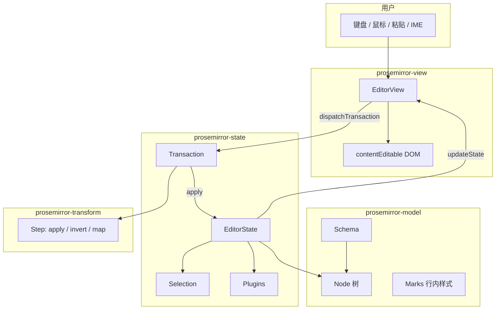

## 日常类比：乐高，而不是成品玩具车

你想做一款「能写标题、段落、加粗、还能协同」的笔记应用。最省事的路是找一个 `contentEditable` 的 div，让用户随便敲——就像把一盒**没说明书的水彩**交给小孩：颜色能涂，但粘进来一段 Word 文档，DOM 里会堆满 `<font>`、嵌套六层的 `<span>`，谁也说不清「合法文档」长什么样。

**ProseMirror** 换了一种思路：你先当**乐高设计师**，用 **Schema** 规定「文档只能由哪些积木、以什么顺序搭」；用户每次按键、粘贴、加粗，都不直接改 DOM，而是生成一张**变更清单（Transaction）**，清单里是一步步可回放、可撤销、可和别人合并的 **Step**。界面（View）只负责把当前「世界快照（State）」画到屏幕上，并把浏览器的偷偷改动抓回来翻译成清单。

官方 [ProseMirror Guide](https://prosemirror.net/docs/guide/) 把这套东西称为 *more of a Lego set than a Matchbox car*：核心库**不是** drop-in 组件，而是模块化工具；Tiptap、Atlassian Editor、Outline、NYT 等都在上面拼出自己的编辑器。作者 Marijn Haverbeke（同 [[codemirror-6-architecture]] 的 CodeMirror）2016 年前后把 1.0 定稿，设计目标之一是**从第一天就为协同编辑留好位置**。

## 是什么

**ProseMirror** 是一套用 JavaScript 实现的**富文本编辑框架**，强调：

1. **文档不是 HTML 字符串**，而是一棵受 Schema 约束的**节点树**（`prosemirror-model`）。
2. **编辑状态不可变**：`EditorState` 含文档、选区、插件状态；更新靠 `apply(transaction)` 得到新 state（`prosemirror-state`）。
3. **变更可记录、可逆、可映射**：`Transform` / `Step` 是事务与撤销、协同的数学基础（`prosemirror-transform`）。
4. **View 是薄壳**：`EditorView` 把 state 渲染成 `contentEditable`，用户操作产生 transaction（`prosemirror-view`）。

和「所见即所得」老式编辑器不同，ProseMirror 追求 WYSIWYG 体验，但**避免把浏览器 DOM 当唯一真相**——你的代码对文档结构与每次变更有完全掌控权。

## 为什么重要

不懂这套架构，下面问题很难答清：

| 问题 | 关键概念 |
|------|----------|
| 为什么 Notion / Confluence 类编辑器能协同，而自研 contentEditable 一加多人就乱？ | Step 可 `map` / `invert`，远端变更能 rebase 到本地 |
| 为什么 Tiptap 不重写内核？ | Schema + Step + Plugin 边界已被证明，重写等于重做 undo/collab/DOM 兼容 |
| 为什么粘贴 Word 不会把 schema 撑爆？ | `DOMParser` + Schema 只接纳合法节点，脏 HTML 被规范化 |
| 和 [[yjs-crdt-overview]] 怎么配合？ | `y-prosemirror` 把 transaction 与 `Y.XmlFragment` 双向翻译，CRDT 管合并，ProseMirror 管编辑语义 |

## 四大必备模块

Guide 把系统拆成四块「没有就编不了辑」的模块，外加 `prosemirror-commands`、`prosemirror-keymap`、`prosemirror-history`、`prosemirror-collab` 等可选扩展：



| 包 | 职责 |
|----|------|
| `prosemirror-model` | 文档树、Schema、Slice、DOM 解析/序列化 |
| `prosemirror-state` | `EditorState`、`Transaction`、选区、`Plugin` |
| `prosemirror-transform` | 文档变换、`Step`、`ReplaceStep` 等 |
| `prosemirror-view` | 渲染、输入事件、把 DOM 变动译回 transaction |

## 核心概念

### 1. Schema：版式手册，不是事后补丁

Schema 声明**有哪些节点类型、哪些 mark、谁能包谁**。例如 `doc` 只能包含 `block+`，`paragraph` 的 `content` 是 `inline*`（零个或多个行内节点）。违反规则的插入会在 transaction 应用时被拒绝或规范化。

**Content 表达式**（如 `paragraph+`、`heading block*`）是 ProseMirror 的「排版语法」——和 HTML 的随意嵌套不同，这里**每种文档只有一种合法形状**（相邻同 mark 的 text 会合并，不允许空 text 节点）。

### 2. 文档树：块级树 + 行内扁平面

块节点（段落、标题、列表项）形成树；**行内内容**在 textblock 里是**带 mark 的 text 扁平序列**，而不是 HTML 那种 `<strong><em>` 嵌套树。好处：

- 光标位置用**字符偏移**即可，不必维护 DOM path
- 拆分段落、切换样式不必做复杂树手术
- 协同时位置映射更简单

### 3. Node 与 Mark

- **Node**：结构单元（`paragraph`、`heading`、`image`…），有 `attrs`（如标题 level）。
- **Mark**：附着在 text 上的行内样式（`strong`、`link`、`code`…），可跨节点边界。

### 4. EditorState：不可变快照

State 三大件（Guide *State* 章）：

- `doc`：当前文档（只读）
- `selection`：选区或光标（`TextSelection`、`NodeSelection`…）
- `storedMarks`：「下一次输入将带上的 mark」（例如先点加粗再打字）

还有 **plugins** 附带的插件状态。旧 state 永不原地修改；`state.apply(tr)` 返回新 state。

### 5. Transaction 与 Step

用户输入时 View **不直接改 doc**，而是创建 `Transaction`（`Transform` 的子类）：

1. 记录对 doc 的 Step 序列
2. 可附带选区变化、`storedMarks`、metadata（给插件读）
3. `newState = oldState.apply(transaction)`
4. `view.updateState(newState)`

**Step** 必须实现 `apply`、`invert`（撤销）、`map`（在别的 Step 之后重新对齐位置）——这是 **undo 历史**与 **prosemirror-collab** 能工作的根本原因。

### 6. Command：可绑键、可挂菜单的编辑动作

`prosemirror-commands` 里的 `toggleMark`、`splitBlock` 等都是 **command**：`(state, dispatch?, view?) => boolean`。返回 `true` 表示已处理。`keymap` 插件把按键映射到 command；`baseKeymap` 让 Enter、Backspace 等符合直觉。

### 7. Plugin：横切关注点

插件在 `EditorState.create({ plugins: [...] })` 时注册，可：

- 拦截或观察 transaction（history、collab）
- 提供 `props` 给 View（`handleDOMEvents`、`decorations`）
- 维护与 doc 同步的插件状态（`PluginKey` + `state` field）

### 8. View：函数式 state 的命令式外壳

`EditorView` 把 `state.doc` 画成 DOM，用 `MutationObserver` 等把浏览器擅自改的 DOM **译回**合法 transaction。IME、Safari、Firefox 各有一套边角补丁——这是富文本框架的「永恒税」，也是为什么值得用成熟库而不是裸 contentEditable。

## 代码示例

### 示例 1：Guide 里的第一个编辑器

官方最小示例：空文档 + 默认选区，能打字但 Enter 尚无行为（需后续加 command / keymap）。

```js
import { schema } from "prosemirror-schema-basic"
import { EditorState } from "prosemirror-state"
import { EditorView } from "prosemirror-view"

const state = EditorState.create({ schema })
const view = new EditorView(document.body, { state })
```

要点：`schema` 决定空文档长什么样；没有 `dispatchTransaction` 时 View 内部默认 `apply` + `updateState`，对简单 demo 够用。

### 示例 2：显式接管 transaction（可观测数据流）

Hook `dispatchTransaction` 后，每次变更都经过你的逻辑——便于接 Redux、日志、协同网关：

```js
import { schema } from "prosemirror-schema-basic"
import { EditorState } from "prosemirror-state"
import { EditorView } from "prosemirror-view"

const state = EditorState.create({ schema })
const view = new EditorView(document.body, {
  state,
  dispatchTransaction(transaction) {
    console.log(
      "Document size:",
      transaction.before.content.size,
      "→",
      transaction.doc.content.size,
    )
    const newState = view.state.apply(transaction)
    view.updateState(newState)
  },
})
```

要点：**所有**正常编辑更新都应走 `updateState`；`transaction.before` / `transaction.doc` 让你对比前后文档，插件也可用 `transaction.setMeta` 打标。

### 示例 3：历史 + 键位 + 基础编辑命令

Guide 在示例 1 之上叠 `history`、`keymap`、`baseKeymap`，得到「能 Undo、Enter 能分段」的 baseline：

```js
import { schema } from "prosemirror-schema-basic"
import { EditorState } from "prosemirror-state"
import { EditorView } from "prosemirror-view"
import { undo, redo, history } from "prosemirror-history"
import { keymap } from "prosemirror-keymap"
import { baseKeymap } from "prosemirror-commands"

const state = EditorState.create({
  schema,
  plugins: [
    history(),
    keymap({ "Mod-z": undo, "Mod-y": redo }),
    keymap(baseKeymap),
  ],
})
const view = new EditorView(document.body, { state })
```

要点：`history()` 观察 transaction 存 invert step；`baseKeymap` 绑定 Enter、Delete 等到 schema-basic 的节点行为。

### 示例 4：自定义 Schema 与初始 HTML

产品级编辑器几乎不会只用 `schema-basic`，而要定义列表、代码块、@提及等：

```js
import { Schema, DOMParser } from "prosemirror-model"
import { EditorState } from "prosemirror-state"
import { EditorView } from "prosemirror-view"

const schema = new Schema({
  nodes: {
    doc: { content: "block+" },
    paragraph: {
      content: "inline*",
      group: "block",
      parseDOM: [{ tag: "p" }],
      toDOM: () => ["p", 0],
    },
    text: { group: "inline" },
  },
  marks: {
    strong: {
      parseDOM: [{ tag: "strong" }, { tag: "b" }],
      toDOM: () => ["strong", 0],
    },
  },
})

const html = document.getElementById("content")
const state = EditorState.create({
  doc: DOMParser.fromSchema(schema).parse(html),
  schema,
})
new EditorView(document.querySelector("#editor"), { state })
```

要点：`parseDOM` / `toDOM` 双向桥接 DOM 与模型；`0` 是子节点占位符。粘贴时脏 HTML 会被**压平**成 schema 允许的树。

### 示例 5：协同骨架（与 [[yjs-crdt-overview]] 对照）

原生 `prosemirror-collab` 用 Step 版本号 + 服务端排序；也可换 `y-prosemirror` 走 CRDT：

```js
import { collab, sendableSteps, receiveTransaction } from "prosemirror-collab"

let state = EditorState.create({ schema, plugins: [collab()] })
const view = new EditorView(document.querySelector("#editor"), { state })

// 本地未确认 step 发往服务端
const sendable = sendableSteps(view.state)
if (sendable) {
  socket.send(JSON.stringify({ steps: sendable.steps, clientID: sendable.clientID }))
}

// 收到远端 step
socket.onmessage = (event) => {
  const { steps, clientIDs } = JSON.parse(event.data)
  const tr = receiveTransaction(view.state, steps, clientIDs)
  view.dispatch(tr)
}
```

要点：`receiveTransaction` 内部对远端 Step 做 `map`，与本地未确认 Step 对齐后再 `apply`——这是 OT 风格协同在 ProseMirror 里的标准姿势。

## 与相关技术对照

| 维度 | ProseMirror | Slate.js | Lexical | contentEditable |
|------|-------------|----------|---------|-----------------|
| 文档模型 | 不可变 Node 树 + Schema | 可变 JSON 树 | Map + 链表节点 | 浏览器 DOM |
| 变更单元 | Step / Transaction | Operation | `editor.update` | 无统一抽象 |
| 协同 | collab / y-prosemirror 成熟 | 社区 y-slate | @lexical/yjs | 需自研 |
| 上手曲线 | 陡（模块化） | 中 | 中 | 低 |
| 结构约束 | Schema 强制 | 较弱 | 自定义节点 | 无 |

同作者的 [[codemirror-6-architecture]] 走**纯文本 + 语法树**；ProseMirror 走**富文本语义块**。二者都强调不可变 state + transaction，但文档形状与 View 难题完全不同。

## 常见坑

1. **忘记 `dispatchTransaction` 却想接协同/日志**——默认路径不经过你的中间层，元数据挂不上。
2. **Schema 的 `content` 写错**——`paragraph+` 与 `block+` 差一个字，空文档、Enter、粘贴表现全变。
3. **把 HTML 当真相**——应从 `state.doc` 或 `DOMSerializer` 导出，而不是 `innerHTML` 完事。
4. **自定义 NodeView 不实现 `update`/`destroy`**——React 包装层易内存泄漏、光标错位。
5. **协同发 DOM diff 而非 Step**——并发时无法可靠 merge，应序列化 Step 或走 Yjs binding。

## 学习路径建议

1. 通读 [ProseMirror Guide](https://prosemirror.net/docs/guide/) 前四章：Introduction → Documents → Schemas → Transforms。
2. 跑通示例 1→3，再改 Schema 加一个自定义节点（如 `callout`）。
3. 读 `prosemirror-example-setup` 源码看「生产级插件组合」长什么样（仅作参考，勿整包照搬）。
4. 需要协同时二选一：`prosemirror-collab` 教程 或 [[yjs-crdt-overview]] + `y-prosemirror` demo。
5. 产品向封装可看 [[tiptap]]（ProseMirror 上的声明式 API）与 [[outline]]（真实 Wiki 架构）。

## 延伸阅读

- 官方 [Reference manual](https://prosemirror.net/docs/ref/) — API 细查
- Marijn 博文 [ProseMirror 1.0](https://marijnhaverbeke.nl/blog/prosemirror-1.html) — 设计动机与 transaction 哲学
- 项目笔记 [[prosemirror]] — 本仓库中的工程向速览
- [[monaco-editor-2016]] — 代码编辑场景的另一极（大组件、VS Code 同源）
- [[operational-transform-jupiter-1995]] — 协同编辑 OT 脉络，对比 Step/rebase 思路
