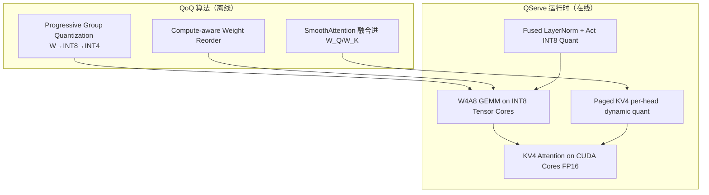

## 从日常类比开始：快餐店的后厨分工

想象一家**连锁快餐店**（GPU）要在午餐高峰同时服务几百位客人（大 batch LLM serving）。后厨有两类人：

- **主厨**（Tensor Core / INT8 矩阵乘单元）：刀工极快，一分钟能切完一大盆土豆丝（GEMM）。
- **配菜员**（CUDA Core）：负责拆包装、称重、调酱汁（**反量化 dequantization**、指针运算、地址计算）。

很多「4-bit 量化」论文的理论账算得很漂亮：权重从 16 位压到 4 位，显存省 4 倍，算力也该快 4 倍。但真实厨房里，**主厨在等配菜员**——每切一批菜，配菜员都要先把 4-bit 小包装拆成 8-bit 标准盒、再贴上每组的价签（per-group scale / zero point）。论文测出来，这一步在现有 GPU 上能吃掉 **20%–90%** 的 GEMM 时间，大 batch 场景下吞吐反而不如 W8A8 或 W4A16。

**QServe**（MIT Han Lab，MLSys 2025 / arXiv:[2405.04532](https://arxiv.org/abs/2405.04532)）的核心洞察就是：**LLM serving 的效率，往往卡在慢速 CUDA Core 上的「拆包装」活，而不是 Tensor Core 本身。**

于是作者做了两件事，必须一起才有效：

1. **QoQ 量化算法**（拉丁语 *quattuor-octo-quattuor* = 4-8-4）：**W4A8KV4**——权重 4 位、激活 8 位、KV cache 4 位，并专门设计让「拆包装」更省事。
2. **QServe 推理系统**：自定义 CUDA kernel、权重重排、寄存器级并行，把理论 roofline 上的收益变成**实测吞吐**。

结果：在 A100 / L40S 上，相对 TensorRT-LLM 最优配置，Llama-3-8B 吞吐提升约 **1.2×–1.4×**，Qwen1.5-72B 提升约 **2.4×–3.5×**；L40S 上 QServe 有时甚至能超过 A100 上的 TensorRT-LLM——相当于用 **3× 更便宜的卡** 打出旗舰卡的服务能力。开源实现见 [mit-han-lab/omniserve](https://github.com/mit-han-lab/omniserve)。

---

## 是什么

| 项目 | 内容 |
|------|------|
| 全称 | QServe: W4A8KV4 Quantization and System Co-design for Efficient LLM Serving |
| 作者 | Yujun Lin, Haotian Tang, Shang Yang 等（MIT Han Lab） |
| 会议 | MLSys 2025（预印本 2024-05） |
| 精度组合 | **W4A8KV4**：4-bit weight、8-bit activation、4-bit KV cache |
| 对比基线 | TensorRT-LLM（FP16 / W8A8 / W4A16）、Atom（W4A4）、QuaRot（W4A4） |
| 关键卖点 | **算法 + 系统协同设计**，针对 CUDA Core 反量化瓶颈 |

与 [[paged-attention-vllm]] 的关系：QServe 的 KV 管理沿用 **paged KV cache** 思路，但用 **per-head 动态 KV4 量化**（scale / zero point 存在每个 page 尾部），精度更低、更新更频繁。

与 [[flashattention-2]] 的关系：FlashAttention 优化 attention **怎么算**；QServe 优化 **权重/KV 怎么存、怎么在 GEMM 主循环里反量化**——正交，可叠加。

---

## 为什么 W4A4 在云端 serving 里常常「翻车」

论文用 roofline 模型说明：低比特量化理论上能提高 **算术强度**（每字节内存做更多 MAC），但若 GEMM **主循环（main loop）** 里夹杂大量：

- INT4 → FP16/INT8 的 **weight dequantization**
- per-group **scale / zero point** 查找与乘法
- 非连续存储带来的 **指针算术**（算下一个 weight 块地址）

这些活都在 **CUDA Core** 上跑，吞吐只有 Tensor Core 的约 **1/32**（A100 量级）。于是出现悖论：

| 方案 | 理论 | 实测（大 batch serving） |
|------|------|------------------------|
| W4A16 | 权重省显存，算在 FP16 Tensor Core | 需在线反量化权重，主循环慢 |
| W4A4 | 全链路 4-bit，算术强度最高 | per-group 反量化更重；Atom 在 A100 上比 W8A8 **慢 20–25%** |
| W8A8 | 工业界常用折中 | 激活仍 8-bit，KV 通常 8-bit，内存压力不小 |

**QServe 选的 W4A8KV4** 是一种「刻意偏科」的甜点：

- **权重 4-bit**：省参数带宽（LLM 参数量大，收益稳定）。
- **激活 8-bit**：比 W4A4 少一层激活分组反量化，主循环更干净；仍走 **INT8 Tensor Core**。
- **KV 4-bit**：decode 阶段 attention 占 30%–50% 时间，KV 减半带宽收益大；用 **SmoothAttention** 保住精度。

---

## 核心概念

### 1. QoQ：两级渐进分组量化（Progressive Group Quantization）

普通 **per-group INT4** 精度好，但每个 group 都要在 GEMM 内做 scale/zero 反量化，**主循环开销大**。

QoQ 对权重做 **两级** 量化：

1. **第一级**：per-channel 对称 **INT8** 量化（粗粒度，channel 级 scale）。
2. **第二级**：在 INT8 基础上再做 per-group 非对称 **INT4**（group size 常见 128）。

关键技巧叫 **protective range（保护区间）**：选第二级 scale 时保证中间积不会 INT8 溢出，使得 kernel 里可以用 **「先乘 scale、再减 zero」** 的顺序，并配合 `vadd4` 等指令做 **寄存器级并行（RLP）**——四个 INT8 加法合成一次 INT32 ALU 操作，而 4 路 INT8 乘法没有等价单指令。

直觉：不是一次把食材从 4-bit 直接变到算子入口，而是 **先粗分到 8-bit 大格、再细调到 4-bit 小格**，让主厨（Tensor Core）看到的始终是规整 INT8 tile，配菜员（CUDA Core）的拆包步骤可流水线化。

### 2. SmoothAttention：让 KV4 不至于「糊掉」

直接把 KV cache 压到 4-bit，困惑度会明显变差。论文观察：

- **Value** 分布较均匀，KV4 相对好压。
- **Key** 在 RoPE 之后存在 **固定 outlier 通道**（幅度约为均值的 ~10×），4-bit 量化等级不够分。

借鉴 SmoothQuant 思想，对每个 head 的 Key 通道做平滑缩放 λ：

\[
K' = \Lambda^{-1} K,\quad Q' = Q \Lambda
\]

attention 数学不变（\(Q'K'^T = QK^T\)），但 **K 的动态范围变小**，KV4 更好量化。实践中 α=0.5 的 λ 选取就够；scale 可 **融合进 Q/K 投影权重**（\(W_Q \leftarrow \Lambda W_Q,\; W_K \leftarrow \Lambda^{-1} W_K\)），避免额外 kernel。

### 3. QServe 运行时：一块 Transformer 里的精度地图

每个 decoder block **输入输出仍是 FP16**，内部按算子切分：

```
┌─────────────────────────────────────────────────────────┐
│  LayerNorm ──(融合)──► Act INT8 量化                     │
│       ↓                                                 │
│  QKV GEMM: W4 × A8 ──► INT8 Tensor Core ──► FP16 Q,K,V │
│       ↓                                                 │
│  Attention: FP16 on CUDA Core（读 KV4 page，动态反量化）  │
│       ↓                                                 │
│  Out Proj GEMM: W4A8 → FP16                              │
│       ↓                                                 │
│  FFN: 两段 W4A8 GEMM，激活量化融合在 LN / SiLU 后        │
└─────────────────────────────────────────────────────────┘
```

- **激活量化**：per-token 对称 INT8；尽量 **融合进前一层 LayerNorm 或激活函数**，少一次显存往返。
- **KV cache**：**per-head 动态** INT4（非 TRT-LLM 那种 per-tensor 静态 KV8）；scale/zero 存在 paged KV 的每个 page 末尾，便于 append 时更新。
- **调度**：支持 **in-flight batching**（与 vLLM / TRT-LLM 同类连续批处理）。

### 4. Compute-aware Weight Reordering

W4 权重在内存里常是「每 4 个 input channel 一组」，若按朴素顺序加载，线程要频繁 **跳地址**（例如读完 ch 0–3 跳到 ch 16–19），指针算术在 CUDA Core 上做，且无法满带宽 128-bit load。

QServe **离线重排权重布局**：让同一 warp 内线程读 **连续 128-bit**，再用 `ldmatrix` 在寄存器里打散成 Tensor Core 需要的排布。代价是离线预处理；收益是主循环里 **地址计算从「每个 4-channel 一次」降到「每个 16-channel 一次」**。

### 5. KV4 Attention：别让算子逃出「内存墙」

Roofline 说 KV4 应比 KV8 **快 2×**，但朴素替换后：L40S 上能到 1.7×，A100 上反而 **慢 1.2×**。原因又是 CUDA Core：decode 阶段 attention 是 **batched GEMV + softmax + GEMV** 融合，batch 一大，**算术强度升高**，从 memory-bound 滑向 compute-bound，低比特省带宽的优势被算力开销抵消。

QServe 的做法：**推迟 attention 的 roofline 转折点**——通过 fusion 策略与 KV4 解码 kernel 优化，让 attention 尽量留在 memory-bound 区，使 **4-bit KV 的带宽节省** 能转化为端到端加速。

---

## 代码示例 1：QoQ 两级权重量化（教学伪代码）

下面用 NumPy 风格说明 **progressive group quantization** 在做什么（非 QServe 生产 kernel，只为理解数据流）：

```python
import numpy as np

def quantize_per_channel_int8(W: np.ndarray) -> tuple[np.ndarray, np.ndarray]:
    """第一级：per-output-channel 对称 INT8。"""
    # W shape: [out_features, in_features]
    max_abs = np.max(np.abs(W), axis=1, keepdims=True)
    scale8 = max_abs / 127.0
    W_int8 = np.round(W / np.clip(scale8, 1e-8, None)).astype(np.int8)
    return W_int8, scale8.squeeze()

def quantize_per_group_int4(W_int8: np.ndarray, group_size: int = 128):
    """第二级：在 INT8 权重上 per-group 非对称 INT4。"""
    out, inp = W_int8.shape
    assert inp % group_size == 0
    W_g = W_int8.reshape(out, inp // group_size, group_size)
    mn = W_g.min(axis=2, keepdims=True)
    mx = W_g.max(axis=2, keepdims=True)
    scale4 = (mx - mn).astype(np.float32) / 15.0
    zero = np.round(-mn / np.clip(scale4, 1e-8, None))
    W_int4 = np.clip(
        np.round(W_g / np.clip(scale4, 1e-8, None) + zero),
        0, 15,
    ).astype(np.uint8)
    return W_int4, scale4.squeeze(-1), zero.squeeze(-1)

# 示例：模拟一个线性层权重 [4096, 4096]
W_fp16 = np.random.randn(4096, 4096).astype(np.float32) * 0.02
W_int8, s8 = quantize_per_channel_int8(W_fp16)
W_int4, s4, z4 = quantize_per_group_int4(W_int8, group_size=128)

# 推理时 GEMM kernel 内：INT4 → (乘 s4, 减 zero) → INT8 域 → (乘 s8) → 与 INT8 激活做 Tensor Core MMA
```

要点：**反量化发生在 GEMM 主循环内部**，QServe 通过 protective range 保证 `((w4 * s4) - z4)` 不溢出 INT8，从而能用 SIMD 式指令批量处理。

---

## 代码示例 2：SmoothAttention 平滑 Key outlier

```python
import torch
import torch.nn.functional as F

def smooth_attention_scales(K_sample: torch.Tensor, alpha: float = 0.5) -> torch.Tensor:
    """
    K_sample: [batch, seq, num_heads, head_dim]
    返回 per-head 对角缩放向量 lambda，shape [num_heads, head_dim]。
    """
    # 按 head_dim 通道取 max，观察 outlier（论文 Figure 7）
    per_channel_max = K_sample.abs().amax(dim=(0, 1))  # [heads, dim]
    global_max = per_channel_max.max()
    # 类似 SmoothQuant：λ = (max^α) / (max^(1-α)) 逐通道
    lam = per_channel_max.pow(alpha) / per_channel_max.pow(1 - alpha).clamp(min=1e-6)
    lam = lam / lam.max() * global_max.pow(alpha)  # 归一化到合理量级
    return lam

def apply_smooth_to_qk_proj(W_Q, W_K, lam):
    """融合进权重，推理时无额外 scale kernel。"""
    # lam: [heads, head_dim] → broadcast 到权重行
    W_Q_smooth = lam.unsqueeze(-1) * W_Q
    W_K_smooth = W_K / lam.unsqueeze(-1).clamp(min=1e-6)
    return W_Q_smooth, W_K_smooth

# 量化 KV cache 前，K 的动态范围已缩小，INT4 per-head 量化更稳
def quantize_kv4_per_head(K, V, lam):
    K_s = K / lam.view(1, 1, *lam.shape)
    # per-head 动态 scale/zero（QServe 在 paged KV page 尾部存 FP16 metadata）
    def dyn_quant(x, bits=4):
        qmax = 2 ** bits - 1
        mn, mx = x.min(-1, keepdim=True).values, x.max(-1, keepdim=True).values
        scale = (mx - mn) / qmax
        zero = (-mn / scale).round()
        q = ((x / scale) + zero).round().clamp(0, qmax).to(torch.uint8)
        return q, scale.half(), zero.half()
    return (*dyn_quant(K_s), *dyn_quant(V))
```

---

## 代码示例 3：激活融合量化（理解 runtime 节点）

QServe 在 LayerNorm 输出处直接出 INT8，避免单独 quantize kernel：

```python
class FusedLayerNormActQuant(torch.nn.Module):
    def __init__(self, hidden: int, eps: float = 1e-5):
        super().__init__()
        self.weight = torch.nn.Parameter(torch.ones(hidden))
        self.bias = torch.nn.Parameter(torch.zeros(hidden))
        self.eps = eps

    def forward(self, x: torch.Tensor) -> torch.Tensor:
        # x: [batch, seq, hidden] — FP16 in
        mean = x.mean(-1, keepdim=True)
        var = x.var(-1, keepdim=True, unbiased=False)
        x_norm = (x - mean) / torch.sqrt(var + self.eps)
        x_norm = x_norm * self.weight + self.bias
        # per-token 对称 INT8（与 QoQ 一致）
        scale = x_norm.abs().amax(-1, keepdim=True) / 127.0
        x_int8 = torch.round(x_norm / scale.clamp(min=1e-8)).clamp(-128, 127).to(torch.int8)
        # 生产实现会把 scale 传给紧随其后的 W4A8 GEMM custom op
        return x_int8, scale.squeeze(-1).half()
```

---

## 实验结果怎么读

论文在 **A100 80GB** 与 **L40S 48GB** 上测 **最大可持续吞吐**（固定 SLA 延迟下的 batch），覆盖 Llama-2/3、Mistral、Qwen1.5 等 7B–72B 模型：

| 对比 | 典型结论 |
|------|----------|
| vs TensorRT-LLM 最优（FP16/W8A8/W4A16） | A100 上 **1.2×–2.4×**；L40S 上 **1.5×–3.5×** |
| vs Atom / QuaRot（W4A4） | A100 上约 **2.5×–2.9×** |
| 经济性 | 六款模型里 **六款** 可在 L40S+QServe 上超过 A100+TRT-LLM 吞吐 |
| 精度 | WikiText-2 perplexity 相对 W8A8 SmoothQuant、W4A16 AWQ，QoQ 最多约 **+0.16**；优于 RTN/AWQ 等同精度档 |

**消融实验**验证各组件必要性：去掉 progressive quantization 或 weight reorder，GEMM 主循环开销上升；去掉 SmoothAttention，KV4 困惑度明显恶化；KV4 attention kernel 优化是把「理论 2×」兑现为实测的关键。

---

## 系统架构一图流



---

## 优势、局限与后续

**优势**

- 把「4-bit 量化 serving」从论文 roofline 拉进 **可测吞吐**，大 batch 云端场景尤其明显。
- 明确指出 **CUDA Core 反量化** 是 W4A4/W4A16 的隐形税，并给出算法+kernel 双侧解法。
- W4A8KV4 在 **精度-速度-显存** 三角上找到可部署平衡点；与 paged KV、in-flight batching 工业惯例兼容。

**局限**

- 依赖 **定制 CUDA/PTX kernel**，不像纯 PyTorch 量化即插即用；需 OmniServe/QServe 工具链。
- 权重 reorder、离线 QoQ 量化有 **预处理成本**；多 GPU 张量并行下的布局需与框架对齐。
- Attention 仍在 **FP16 CUDA Core** 上算，极长 context + 超大 batch 时 attention 占比与 roofline 形态会变，需重新 profile。
- 后续工作如 **LServe**（同仓库 OmniServe）把长上下文稀疏 attention 与 QServe 量化栈统一，说明这条路线还在演进。

---

## 自测题

1. **W4A8KV4** 每个字母分别指什么？为什么作者不选 W4A4？
2. 论文说 GEMM **main loop overhead** 主要来自哪两类 CUDA Core 操作？
3. **Progressive group quantization** 两级分别是什么精度？protective range 服务于哪条 kernel 计算顺序？
4. **SmoothAttention** 如何做到不改变 attention 数学结果却改善 KV4 精度？
5. 为什么 KV4 attention 在 A100 上朴素实现会反而慢于 KV8？QServe 的对策是什么？
6. QServe 与 [[paged-attention-vllm]] 在 KV 存储上的相同点与不同点是什么？

<details>
<summary>参考答案</summary>

1. W4=4-bit 权重，A8=8-bit 激活，KV4=4-bit KV cache。W4A4 激活也 4-bit，per-group 反量化更重，大 batch 下主循环 CUDA Core 开销常抵消理论收益。
2. **Weight/partial-sum dequantization**（scale/zero）与 **指针算术/非连续加载** 导致的地址计算。
3. 先 per-channel INT8，再 per-group INT4；protective range 支持 **先乘 scale 再减 zero**，配合寄存器级并行。
4. 对 Key 通道乘 \(\Lambda^{-1}\)、Query 乘 \(\Lambda\)，保持 \(QK^T\) 不变，压缩 K 的 outlier 动态范围；scale 融合进投影权重。
5. batch 增大使 attention 算术强度升高，从 memory-bound 变 compute-bound，KV4 省带宽优势变小而反量化开销凸显；QServe 优化 KV4 decode kernel 与 fusion，推迟 roofline 转折点，保持 memory-bound。
6. 相同：都用 paged KV 减碎片。不同：QServe 用 **per-head 动态 KV4** 与 page 内 FP16 scale/zero；vLLM 传统实现多为 FP16 或静态 KV8。

</details>

---

## 延伸阅读

- 论文：[arXiv:2405.04532](https://arxiv.org/abs/2405.04532)
- 代码：[github.com/mit-han-lab/omniserve](https://github.com/mit-han-lab/omniserve)（QServe + LServe）
- 基线：[TensorRT-LLM](https://github.com/NVIDIA/TensorRT-LLM)
- 相关量化：SmoothQuant（激活平滑）、AWQ（权重）、QuaRot（W4A4 旋转量化）
- 相关系统：[[paged-attention-vllm]]、[[flashattention-2]]、[[llm-serving-needs-math]]

---

## 小结

QServe 教给零基础读者最重要的一课：**量化 serving 不是「把位数变少」就结束，而是「慢速核心上的拆包税」决定大 batch 吞吐。** QoQ 用 W4A8KV4 和 progressive quantization、SmoothAttention 保住精度并减轻反量化；QServe 用 weight reorder、寄存器级并行和 KV4 attention 协同，把理论算力省下的账兑现成 **相对 TensorRT-LLM 最高约 3.5× 的实测吞吐**。读论文时建议对照 Figure 3（roofline）、Figure 8（block 精度图）、Figure 9–10（GEMM 主循环）——三张图串起全文主线。
