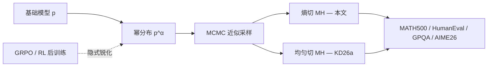

## 从日常类比开始：改作文时，该从哪一句重写？

你写一篇数学证明，写了一半发现思路错了。有两种改法：

1. **随机挑一句重写**：可能改的是「因此，我们得到……」这种过渡句——措辞变了，**证明策略没变**，错误照样留着。
2. **回到关键分叉点重写**：比如「我决定用归纳法」或「这里换用反证法」——从**真正做选择**的地方切开，整条推理路径才可能变。

大语言模型（LLM）做数学题、写代码时，生成的 token 序列也类似一篇「出声思考的作文」。其中只有少数位置是** consequential decisions（关键决策）**：选哪种证明技巧、用哪个算法、走哪条分支。其余大量 token 只是在**展开细节**——熵低、几乎确定下一个词是什么。

**Reasoning with Sampling: Cutting at Decision Points**（Zhou, Mehrotra, Liu；arXiv [2605.30327](https://arxiv.org/abs/2605.30327)）的核心洞察是：

> 要从基础模型里「榨出」推理能力，MCMC 采样器应该在**决策点**下刀重采样后缀，而不是在整段推理里均匀随机切一刀。

论文提出 **Entropy-Cut Metropolis–Hastings（熵切 MH）**：用下一 token 的**熵**当决策点代理，配合 MH 接受–拒绝，从 **power distribution（幂分布）** 高效采样——**无需 RL 训练、无需标注数据、无需 verifier**。

---

## 是什么

| 项目 | 内容 |
|------|------|
| 论文 | *Reasoning with Sampling: Cutting at Decision Points* |
| 作者 | Felix Zhou, Anay Mehrotra, Quanquan C. Liu |
| 日期 | 2026-05-28 |
| 前置工作 | Power sampling / Reasoning with Sampling（Karan & Du 等，arXiv 2510.14901） |
| 核心算法 | **Entropy-Cut Metropolis–Hastings** |
| 目标分布 | 序列级 power distribution \(p^\alpha\)，\(\alpha > 1\) 锐化基础分布 |
| 关键代理 | 下一 token 熵 \(H_t = -\sum_v p(v \mid x_{<t}) \log p(v \mid x_{<t})\) |
| 理论结果 | 混合时间随**决策数 \(k\)** 缩放，而非 token 深度 \(T\)（\(T \gg k\) 时差距大） |
| 评测 | MATH500、HumanEval、GPQA Diamond、AIME26 |
| 代表结果 | Qwen2.5-7B：标准采样 MATH500 **35.9%** → 熵切 MH **71.9%** |

---

## 为什么重要

### 1. 挑战「推理只能靠 RL 练出来」

前沿推理模型（o 系列、R1 等）多靠 **RL post-training** 把基础模型「推」向高奖励轨迹。Karan & Du（2025）表明：对基础分布做 **power sharpening** 再采样，单样本推理可接近甚至超过 GRPO，且**不塌缩多样性**。

但 power distribution 无法精确采样，必须用 MCMC。**怎么切、在哪切** 决定了采样是否实用——本文把「切的位置」从工程细节升格为**理论对象**。

### 2. 均匀切刀浪费算力

先前 stagewise MH 在位置 \(t\) 上**均匀**选 cut，然后从 \(t\) 起重采样后缀。推理轨迹里决策点稀疏（\(k\) 个）而 token 很长（\(T\) 个）。均匀切大概率落在**低熵、已确定**的局部，只改写措辞，不探索新策略——混合慢、算力空转。

### 3. 熵是可观测的决策信号

模型 forward 时本来就算 logits；熵几乎**零额外成本**。论文实证：**熵跃升（entropy jump）** 与人工标注的决策点高度相关，且熵切 MH 在各基准上稳定优于均匀切 MH 与 RL 基线。

---

## 核心概念

### 1. Power distribution：把「更像对」的轨迹放大

给定基础模型在长度 \(T\) 序列上的分布 \(p(x_{1:T})\)，**幂分布**定义为：

\[
p^\alpha(x_{1:T}) \propto p(x_{1:T})^\alpha, \quad \alpha > 1
\]

直觉：\(\alpha\) 越大，越偏向**高似然**（模型自认为更靠谱）的完整推理链。RL 可被理解为一种**隐式分布锐化**；power sampling 则在**推理时**显式瞄准锐化后的目标，不动权重。

与 **low-temperature decoding** 的区别：低温只在**逐步**贪心选高概率 token；power distribution 在**整段序列**层面重加权，能偏好「全局自洽」的长推理，而非局部尖峰。

### 2. Metropolis–Hastings 在推理轨迹上「改后缀」

精确采样 \(p^\alpha\) 不可行。MCMC 维护当前完整轨迹 \(x\)，每步：

1. **提议（propose）**：选 cut 位置 \(t\)，保留前缀 \(x_{1:t}\)，用基础模型自回归**重采样后缀** \(x'_{t+1:T}\)，得候选 \(x'\)。
2. **接受–拒绝**：按 MH 比率决定保留 \(x'\) 还是回到 \(x\)，保证平稳分布仍是 \(p^\alpha\)。

关键：**cut 位置的 proposal 分布** 可以改变（只要 MH 校正正确），于是可以把「更常切在决策点」编码进算法，而不改变目标分布。

### 3. 决策点 vs 局部细节

| 类型 | 例子 | 下一 token 熵 | 均匀切的效果 |
|------|------|---------------|--------------|
| **决策点** | 选归纳法 / 构造辅助函数 / 换排序算法 | **高**（多分支可行） | 重采样后缀 → 新策略 |
| **局部细节** | 「因此」「=」「return」 | **低**（几乎确定） | 只改措辞，策略不变 |

论文 Figure 1 示意：熵曲线上的**尖峰**对应策略分叉；均匀切落在平坦低熵区的概率远大于落在尖峰。

### 4. Entropy-Cut MH 算法

相对均匀切 baseline（Karan & Du 的 stagewise sampler），本文只改 **cut 位置如何抽样**：

- 计算每个位置 \(t\) 的下一 token 熵 \(H_t\)（或熵跃升 \(\Delta H_t\)）。
- 以与 \(H_t\)（或 \(\Delta H_t\)）**成正比**的概率选 cut 点，而非均匀。
- 仍用标准 MH 接受–拒绝，确保目标分布仍是 \(p^\alpha\)。

直觉：**把 MCMC 预算集中在「模型真的在犹豫」的地方**，更快在多种推理模式间混合（mix）。

### 5. 推理树模型与 Theorem 4.1（混合时间）

论文用 stylized **reasoning tree** 建模：根到叶路径 = token 序列；**分支节点 = 决策点**（共 \(k\) 个），其余边为确定性展开（深度 \(T\)）。

| 切法 | 混合时间量级（直觉） |
|------|---------------------|
| **均匀切** | 与序列深度 \(T\) 相关——要在 \(T\) 个位置里碰运气撞到决策点 |
| **熵切** | 与决策数 \(k\) 相关——proposal 已偏向分支节点 |

当 \(T \gg k\)（长链式推导、短决策链）时，熵切带来**量级上的效率优势**。这与 Table 1 中「熵切 consistently 优于均匀切」一致。

### 6. 实验结论摘要

在 **Qwen2.5-7B**、**Qwen2.5-Math-7B** 等模型上（详见论文 Table 1）：

- **相对标准采样**：MATH500 最高约 **+36%** 绝对提升（7B 模型）。
- **相对均匀切 MH**：熵切在多数任务上再涨一截（如 7B 上 MATH500 67.4% → 71.9%）。
- **相对 RL（GRPO）**：在 MATH500、HumanEval、GPQA、AIME26 上**可比或更好**，且无需训练。
- **AIME26** 等竞赛级任务亦有增益，说明不仅是「简单题库过拟合」。

---

## 代码示例 1：计算下一 token 熵，标出「决策尖峰」

推理时模型已输出 logits。熵衡量「下一个 token 有多不确定」——论文用它定位 cut 点。

```python
import torch
import torch.nn.functional as F

def next_token_entropy(logits: torch.Tensor) -> torch.Tensor:
    """logits: (seq_len, vocab_size) — 每个位置对「下一 token」的分布"""
    log_probs = F.log_softmax(logits, dim=-1)
    probs = log_probs.exp()
    # H_t = -sum_v p(v) log p(v)
    entropy = -(probs * log_probs).sum(dim=-1)
    return entropy  # shape: (seq_len,)

def entropy_jump(entropy: torch.Tensor) -> torch.Tensor:
    """熵跃升：尖峰往往对应「刚做完一个选择」"""
    jump = torch.zeros_like(entropy)
    jump[1:] = entropy[1:] - entropy[:-1]
    return jump

def top_decision_positions(logits: torch.Tensor, k: int = 5):
    H = next_token_entropy(logits)
    jumps = entropy_jump(H)
    # 论文用 H_t 或 ΔH 做 cut proposal 权重；这里演示取 top-k 尖峰
    scores = H + jumps.clamp(min=0)
    topk = scores.topk(min(k, scores.numel()))
    return topk.indices.tolist(), topk.values.tolist()

# 用法：对一条已生成推理链做一次 forward，得各位置熵
# logits = model(input_ids).logits[0, :-1]  # 对齐 next-token 预测
# positions, values = top_decision_positions(logits)
```

**读图方式**：若某步熵从 0.3 飙到 2.8，往往意味着模型在「选路径」；在此处 cut 重采样，比在中间「写公式细节」处切更可能换策略。

---

## 代码示例 2：简化版 Entropy-Cut Metropolis–Hastings 循环

下面是与论文思想一致的**教学伪代码**（省略 stagewise 扩展、长度变化等工程细节）。核心是：**按熵加权选 cut**，再用似然比做 MH 接受。

```python
import math
import random
from typing import Callable, List

def log_prob_sequence(model, token_ids: List[int]) -> float:
    """基础模型对整条序列的对数似然 log p(x)"""
  total = 0.0
  for t in range(1, len(token_ids)):
    logits = model.logits_at_prefix(token_ids[:t])  # 你的推理引擎 API
    log_p = log_softmax_pick(logits, token_ids[t])
    total += log_p
  return total

def sample_suffix(model, prefix: List[int], max_new: int) -> List[int]:
  """从 prefix 末 token 起自回归采样直到 EOS 或上限"""
  out = list(prefix)
  for _ in range(max_new):
    next_id = model.sample_next(out)
    out.append(next_id)
    if next_id == EOS:
      break
  return out

def propose_cut_position(entropies: List[float], eps: float = 1e-6) -> int:
  """按 H_t 比例抽样 cut；比 uniform(0..T) 更常命中决策点"""
  weights = [h + eps for h in entropies]
  s = sum(weights)
  r = random.random() * s
  acc = 0.0
  for t, w in enumerate(weights):
    acc += w
    if r <= acc:
      return t
  return len(entropies) - 1

def entropy_cut_mh_step(
    model,
    x: List[int],
    alpha: float,
    entropies: List[float],
) -> List[int]:
  """单步 MH：目标分布 p^alpha(x) ∝ p(x)^alpha"""
  t = propose_cut_position(entropies[: len(x)])
  prefix = x[: t + 1]  # 保留 cut 之前（含 cut 位置 token）
  x_prime = sample_suffix(model, prefix, max_new=len(x) + 512)

  log_p_x = log_prob_sequence(model, x)
  log_p_xp = log_prob_sequence(model, x_prime)

  # MH 接受率：min(1, p^alpha(x')/p^alpha(x) * q(x|x')/q(x'|x))
  # 若 cut proposal 对称或校正项可约，简化为似然比
  log_accept = alpha * (log_p_xp - log_p_x)
  if math.log(random.random()) < log_accept:
    return x_prime
  return x

def power_sample(model, prompt_ids, alpha=2.0, mcmc_steps=40):
  x = model.generate(prompt_ids)  # 初始轨迹
  for _ in range(mcmc_steps):
    logits = model.forward_logits(x)
    entropies = next_token_entropy(logits).tolist()
    x = entropy_cut_mh_step(model, x, alpha, entropies)
  return x
```

**与均匀切对比**：把 `propose_cut_position` 换成 `random.randint(0, len(x)-1)` 即 baseline。当 \(T=2000\)、决策点 \(k \approx 10\) 时，均匀切命中决策点的概率约 \(k/T \approx 0.5\%\)；熵加权可把大部分 proposal 压在 \(k\) 个高熵邻域。

---

## 与相关工作的关系



| 方法 | 训练 | Verifier | 切点策略 | 主要代价 |
|------|------|----------|----------|----------|
| 标准采样 | 无 | 无 | 无（一次生成） | 1× |
| GRPO | 有 | 通常需要 | N/A | 训练 + 推理 |
| 均匀切 Power MH | 无 | 无 | 均匀随机 | 多轮 forward × MCMC 步数 |
| **熵切 Power MH（本文）** | 无 | 无 | **熵加权** | 同上，但混合更快 → 同等步数更高质 |

后续 **Entropy-Guided Power Sampling（EGPS, arXiv 2606.09926）** 在同一脉络上进一步：跳过低熵块、在决策点用 Multiple-Try Metropolis，追求墙钟 **12×+** 加速。可与本文对照阅读。

---

## 局限与开放问题

1. **熵是代理，不是真值**：某些决策在表示层熵不高（模型错误地很自信）；反之高熵也可能是措辞犹豫而非策略分叉。
2. **算力仍显著高于单次采样**：MH 需要多轮完整序列似然估计；工程上需配合 stagewise、早停、块跳过（见 EGPS）。
3. **\(\alpha\) 与步数需调**：过大 \(\alpha\) 可能过尖；MCMC 步数不足则未混合到 \(p^\alpha\)。
4. **与 test-time scaling 的关系**：Best-of-\(N\)、树搜索、过程奖励模型是正交路线；熵切 power sampling 提供「**无训练分布锐化**」的一条独立轴。

---

## 零基础自检清单

读完笔记，你应该能回答：

1. **Power distribution 是什么？** 对 \(p(x)^\alpha\) 归一化，\(\alpha>1\) 放大高似然推理链。
2. **为什么要 MCMC？** 精确采样不可行；MH 保证渐近服从 \(p^\alpha\)。
3. **均匀切的问题？** 长序列里决策点少，随机切多改局部、少换策略，混合慢。
4. **熵为何有用？** 决策点处下一 token 分布平坦 → 熵高；可作 cut proposal 权重。
5. **Theorem 4.1 说什么？** 熵切混合时间与 \(k\)（决策数）相关；均匀切可与 \(T\)（token 数）相关。
6. **和 RL 比如何？** 多个基准上可比或更优，且无训练、无 verifier，多样性更好。

---

## 延伸阅读

- Karan & Du, *Reasoning with Sampling: Your Base Model is Smarter Than You Think* — [arXiv:2510.14901](https://arxiv.org/abs/2510.14901)（power distribution + 均匀切 MH 奠基）
- *Sample Where You Struggle: Entropy-Guided Power Sampling* — [arXiv:2606.09926](https://arxiv.org/abs/2606.09926)（熵门控 + 多块跳过 + MTM）
- *Scalable Power Sampling* — [arXiv:2601.21590](https://arxiv.org/abs/2601.21590)（低温与 power 的近似联系，降低 MCMC 开销）
- 本仓库：[Speculative Decoding](/docs/papers/speculative-decoding-leviathan-2023)（另一脉推理加速：分布保持的草稿–验证，与本文「改分布采样」正交）

---

## 一句话总结

**基础模型已经「藏」着推理能力；RL 是一种把它挖出来的方式，而对 power distribution 做 MCMC 采样是另一种。本文证明：挖的时候应该在熵高的决策点下刀，而不是在整段思考里盲目乱切——这样混合更快、分数更高、还不用训练。**
