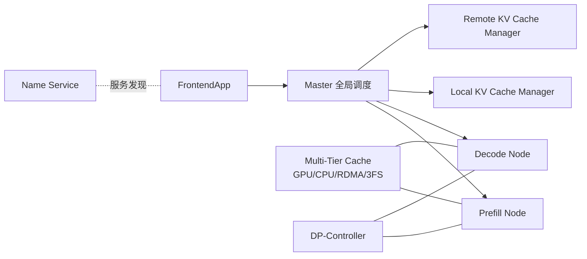

## 从日常类比开始：快餐店的「备餐台」与「出餐窗口」

想象你经营一家**连锁智能快餐店**（GPU 集群），每天要服务淘宝、天猫、菜鸟等业务线来的海量订单（**1 亿+ 用户**）：

- **备餐台（Prefill）**：顾客下单时，厨师要一次性把整份菜单原料切好、下锅预处理——对应 LLM 把**整段 prompt**并行算完，生成第一批 KV cache。这个阶段**算力密集**，适合开大锅、大 batch。
- **出餐窗口（Decode）**：之后每加一勺料、每出一片肉，都要回头看之前所有步骤的笔记（KV cache）——对应**自回归**逐 token 生成。这个阶段**内存带宽密集**，GPU 算力常常闲着等显存读写。

旧系统像让**同一组厨师既备餐又出餐**：短单和长单挤在一个灶台，有人等锅、有人等料，GPU 利用率忽高忽低。更糟的是，每家分店都要从云端仓库**整箱搬货**（加载 600B 参数模型），搬一次要几小时，业务没法「分钟级」换菜单。

**RTP-LLM**（*RTP-LLM: High-Performance Alibaba LLM Inference Engine*，arXiv:[2605.29639](https://arxiv.org/abs/2605.29639)）是阿里巴巴基础模型推理团队打造的**全栈推理引擎**，已在集团生产环境验证。它把备餐与出餐**物理拆开**（Prefill-Decode Disaggregation），用**四级 KV 仓库**（GPU → 本机 CPU → RDMA 远端 CPU → 分布式存储）复用相同前缀，再用**推测解码**让出餐窗口一次验证多勺料——论文报告相对 vLLM、SGLang 在加载、TTFT、吞吐、量化等维度均有显著优势。

一句话：**RTP-LLM 不是「又一个 vLLM 插件」，而是从模型加载、流量调度、KV 分层到推测解码的工业级 co-design。**

---

## 是什么

| 项目 | 内容 |
|------|------|
| 类型 | 系统论文（工业部署 + 开源引擎） |
| 机构 | 阿里巴巴集团；合作方含北大、浙大 |
| 开源 | [github.com/alibaba/rtp-llm](https://github.com/alibaba/rtp-llm) |
| 官网 | [rtp-llm.ai](https://rtp-llm.ai/) |
| 验证规模 | 8B–235B 参数；dense、MoE、多模态 |
| 生产场景 | 淘宝、天猫、菜鸟等；Aone Copilot 等达 **1000 tokens/s** 级吞吐 |

论文针对生产部署的四大挑战：

| 挑战 | 症状 | RTP-LLM 对策（论文章节） |
|------|------|--------------------------|
| **I. GPU 利用率低** | 输入/输出长度波动大；decode 内存 bound | PD 解耦、动态调度、推测解码（§5–6） |
| **II. KV cache 撑爆显存** | 128K+ 上下文；碎片与复用难 | 分层 KV、前缀哈希匹配、自适应量化（§5、§7） |
| **III. 架构异构** | MoE 600B+、ViT+LLM 多模态 | 多级并行、ViT-LLM 解耦（§7） |
| **IV. 运维迭代慢** | 大模型加载小时级；故障与滚动更新 | 文件序驱动 I/O、容错与隔离（§4） |

---

## 为什么重要

不理解 RTP-LLM，下面几件事很难讲清：

- 为什么 **vLLM 的 PagedAttention** 解决了单节点 KV 碎片，但**淘宝级流量**还要再做 **PD 分离 + 全局前缀调度**
- 为什么 **SGLang RadixAttention** 强调程序级前缀复用，而 RTP-LLM 用 **统一哈希表 + 四级存储** 做跨机房、跨 worker 的 KV 命中
- 为什么 **模型加载** 在 FUSE 云盘上会成为瓶颈——「按模块读权重」会让每个 TP 进程重复读全文件
- 为什么推测解码要拆成 **Propose / Score / Sample / Update** 四个 C++ 模块，才能在生产里换 Eagle、MTP、Prompt Lookup 而不改主引擎

和 [[paged-attention-vllm]]、[[sglang-radixattention]] 的关系：**互补而非替代**。PagedAttention 管物理块；RadixAttention 管 DSL 级前缀树；RTP-LLM 在**集团流量调度、分层 KV、分钟级加载、PD 集群拓扑**上走得更远——论文基线直接对比 vLLM 与 SGLang。

---

## 核心概念

### 1. 推理两阶段：Prefill vs Decode

```text
用户 prompt ──► [Prefill]  并行处理全部输入 token，写出 KV cache，产出第 1 个输出 token
                      │
                      ▼
              输出 token 流 ◄── [Decode]  每次只算 1 个新 token，反复读/写 KV cache
```

| 阶段 | 计算特征 | 优化方向 |
|------|----------|----------|
| **Prefill** | Compute-bound；可大 batch | 专用 Prefill 节点、前缀 cache 跳过已算块 |
| **Decode** | Memory-bandwidth-bound | 专用 Decode 节点、MMHA/XQA 类 kernel、推测解码 |

RTP-LLM 支持两种部署：

- **PD-Fusion**：Prefill 与 Decode 同节点（类似传统单引擎）
- **PD-Disaggregation**：物理分离，各自扩缩容（论文 Fig.1 默认拓扑）

### 2. 系统组件（鸟瞰）



- **Master**：维护集群全局视图（worker 负载、KV 分布），做 batch 与路由；**不做**跨集群负载均衡（那是 Name Service 上层的事）
- **DP-Controller**：单部署单元内的 batch 执行与本地显存管理
- **Multi-Tier Cache**：四级 KV 存储，Algorithm 1 按「GPU → 本地 CPU → RDMA 远端 → 3FS」逐级查找

### 3. 高效模型加载（§4）

传统 **model-structure-driven** 加载：每个 Tensor Parallel 进程为切自己的一片权重而**读遍所有文件** → 在 FUSE 云盘上产生大量随机读，预取失效。

RTP-LLM 改为 **file-order-driven**：

1. **按文件顺序**读完一个 safetensors 再读下一个，利于 FUSE 顺序预取
2. **单进程读文件 + broadcast**：集成 fastsafetensors，每个文件只由一个进程读，再 `broadcast` 给其他 TP rank
3. **共享 pinned memory 复用**：避免每读 2GB 就花 ~600ms 重新注册 pinned 区
4. **I/O 与通信重叠**：读下一文件的同时广播上一文件张量

论文数据：**4.7×–6.3×** 加载加速 vs vLLM/SGLang，支撑 **600B+ 模型分钟级**上线。

### 4. 流量调度与 KV 管理（§5）

**Prefill 调度**：

- 按 **block hash**（如每 64 token 一块）做前缀匹配
- 相似序列长度 **group batch** 减少 padding
- 预测各 DP-Controller 完成时间 \(t_{available}\)，把请求派给最早空闲的节点

**Decode 调度**：

- 优先 **chat ID 亲和**：同一会话尽量路由到已有本地 KV 的 worker
- **准入控制 + 驱逐 + 背压**，防止 cache thrashing

**统一哈希表**：把所有 worker 的 cache key 合并进一张 map，前缀匹配从 \(O(B \times W)\) 降到 \(O(B)\)（B=块数，W=worker 数）。

**Sampled Prefix Hashing**：块 ≥208 token 时，在 208, 212, 216… 位置采样哈希，平衡匹配粒度与元数据开销。

**调度得分**（简化）：

\[
score(w) = \alpha \frac{local\_match}{len} + \beta \frac{remote\_match}{len} - \gamma \frac{predicted\_latency(w)}{max\_latency}
\]

生产效果：**TTFT P95 降 35–37%**，cache 复用 **+215%**，prefill 机器数可减约 **75%**。

### 5. 推测解码框架（§6）

模块化 C++ 流水线：

| 组件 | 职责 |
|------|------|
| **ProposeExecutor** | 生成 k 个候选 token（小模型 / Eagle / MTP / Prompt Lookup） |
| **ScoreExecutor** | 目标模型并行打分 k 个位置 |
| **SpeculativeSampler** | 按接受准则验证哪些 token 保留 |
| **SpeculativeUpdater** | 把接受结果写回主流 |

支持算法：Naive Speculative、**MTP**（DeepSeek-V3）、**Eagle**、**Prompt Lookup**（n-gram 从 prompt 挖候选，适合代码补全）。

论文：**1.12×–2.48×** 吞吐提升（推测解码）；多模态 **1.86×–2.52×**；量化推理 batch 延迟 **降 35–40%**，TTFT **1.9×–3.0×**。

### 6. 其他系统能力（§7，简述）

- **Adaptive KV Cache Quantization**：按场景选 KV 精度，省显存、提并发
- **Multi-Level Parallelism**：TP / DP / PP / EP，覆盖 dense 与 600B+ MoE
- **Decoupled ViT-LLM**：视觉编码与语言生成分离调度，避免互相拖慢

---

## 代码示例 1：前缀 cache 匹配（Algorithm 2 思路）

下面用 Python 风格伪代码还原论文 **Prefix Cache Matching**：对请求的块哈希序列 \(H\)，在统一哈希表 \(\mathcal{H}\) 上找每个 worker 的最长前缀命中长度。

```python
from collections import defaultdict

def prefix_cache_match(
    block_hashes: list[str],      # H = [h1, h2, ..., hB]
    unified_map: dict[str, set],  # hi -> {(worker_id, block_meta), ...}
) -> dict[str, int]:
    """返回每个 worker 的最长连续前缀匹配块数。"""
    match_len: dict[str, int] = defaultdict(int)
    running = 0

    for h in block_hashes:
        if h not in unified_map:
            break  # 前缀链断裂，提前终止
        running += 1
        for worker_id, _meta in unified_map[h]:
            match_len[worker_id] = max(match_len[worker_id], running)

    return dict(match_len)


# 示例：3 个块哈希，worker-A 命中 3 块，worker-B 只命中前 2 块
H = ["hash_sys", "hash_doc", "hash_q"]
UNIFIED = {
    "hash_sys": {("worker-A", {}), ("worker-B", {})},
    "hash_doc": {("worker-A", {}), ("worker-B", {})},
    "hash_q":   {("worker-A", {})},
}
print(prefix_cache_match(H, UNIFIED))
# {'worker-A': 3, 'worker-B': 2}
```

Master 把 `match_len` 与负载、预测延迟一起代入 `score(w)`，决定请求去哪个 Prefill/Decode worker。

---

## 代码示例 2：四级 KV 查找与 PD 调度（Algorithm 1 简化）

```python
from enum import Enum, auto

class CacheTier(Enum):
    GPU_BLOCK = auto()
    LOCAL_CPU = auto()
    REMOTE_RDMA = auto()
    REMOTE_3FS = auto()


def resolve_kv_block(block_id: str, tiers: dict[CacheTier, set]) -> CacheTier:
    """按最快层级命中 KV 块；未命中则返回 None（需 prefill 重算）。"""
    for tier in (CacheTier.GPU_BLOCK, CacheTier.LOCAL_CPU,
                 CacheTier.REMOTE_RDMA, CacheTier.REMOTE_3FS):
        if block_id in tiers.get(tier, ()):
            return tier
    return None


def master_route_request(req, cluster):
    """极简 Master 决策：前缀分 + 负载。"""
    matches = prefix_cache_match(req.block_hashes, cluster.unified_kv_map)
    candidates = []
    for worker in cluster.decode_workers:
        local = matches.get(worker.id, 0) / max(len(req.block_hashes), 1)
        load_penalty = worker.queue_depth / cluster.max_queue
        score = 0.6 * local - 0.4 * load_penalty
        if req.chat_id and req.chat_id == worker.last_chat_id:
            score += 0.3  # chat 亲和加成
        candidates.append((score, worker))
    return max(candidates)[1]


# 模拟：KV 在 RDMA 层命中
tiers = {
    CacheTier.GPU_BLOCK: set(),
    CacheTier.LOCAL_CPU: set(),
    CacheTier.REMOTE_RDMA: {"blk_42"},
    CacheTier.REMOTE_3FS: {"blk_99"},
}
assert resolve_kv_block("blk_42", tiers) == CacheTier.REMOTE_RDMA
# 命中后：RDMATransfer -> LoadToGPU -> ExecuteInference
```

真实实现还包括引用计数、LRU 回写、partial block watermark 等；此处只保留「**先查 cache 再算**」的控制流骨架。

---

## 代码示例 3：推测解码四段流水线（配置示意）

RTP-LLM 用 C++ 模块拼装算法；下面用 YAML 风格示意**如何切换 Propose 策略**（非官方配置原文，便于理解模块边界）：

```yaml
# speculative_decoding.yaml（概念示意）
speculative:
  enabled: true
  max_proposal_tokens: 5
  propose:
    backend: eagle          # 可选: naive | mtp | eagle | prompt_lookup
    draft_model: qwen-0.5b
  score:
    target_model: qwen-72b
    parallel_positions: true
  sampler:
    algorithm: standard_speculative_acceptance
  updater:
    merge_strategy: in_place_kv_extend
```

执行顺序：`ProposeExecutor` → `ScoreExecutor`（一次 forward 评多个位置）→ `SpeculativeSampler` → `SpeculativeUpdater`。高并发时拒绝 token 会带来额外算力，论文指出在**显存受限**或**长上下文**场景仍值得开启。

---

## 论文关键数字（便于记忆）

| 场景 | vs vLLM / SGLang（论文报告） |
|------|------------------------------|
| 模型加载 | **4.7×–6.3×** 更快 |
| 生产流量 TTFT P95 | **降 35–37%**；cache 复用 **+215%** |
| 推测解码吞吐 | **1.12×–2.48×** |
| 多模态吞吐 / TTFT | **1.86×–2.52×** / **2.12×–2.36×** |
| 量化推理 | batch 延迟 **降 35–40%**；TTFT **1.9×–3.0×** |

---

## 与相关工作的对比（心智表）

| 维度 | vLLM | SGLang | RTP-LLM |
|------|------|--------|---------|
| KV 物理布局 | PagedAttention | Paged + Radix 树 | 分页 + **分层存储 + 全局哈希** |
| 前缀复用 | Prefix caching（后续） | RadixAttention（DSL 感知） | **跨 worker / 3FS** 前缀匹配 |
| 集群拓扑 | 多为主从扩展 | 多为主从扩展 | **PD 解耦** + Master 全局调度 |
| 加载优化 | 社区通用 | 社区通用 | **文件序 I/O + broadcast 重叠** |
| 推测解码 | 插件式 | 支持 | **模块化 C++ 四段流水线** |
| 生产背书 | 广泛开源 | 广泛开源 | **阿里 1 亿+ 用户** |

---

## 局限与未来方向（论文自述）

- 推测解码在**极高并发**时收益下降（拒绝 token 与争用）
- 更长的上下文与 **DeepSeek Sparse Attention（DSA）** 等稀疏 attention 仍是探索方向
- PD 分离增加**运维复杂度**：需监控 Prefill/Decode 资源比例，Master 需高频（20ms 级）负载采样

---

## 零基础自检清单

1. **Prefill 和 Decode 为什么适合拆到不同机器？** —— 前者算力 bound、后者带宽 bound，混部会互相拖累 batch 与延迟。
2. **前缀 hash 匹配解决什么问题？** —— 相同 system prompt、RAG 文档不必每个请求重算 KV，直接命中块。
3. **file-order-driven 加载为什么快？** —— FUSE 云盘顺序读友好 + 消除 TP 重复读文件。
4. **推测解码为何能加速？** —— 把「串行 decode 1 token」变成「并行验证 k 个候选 token」。
5. **和 vLLM 最大工程差异？** —— RTP-LLM 强调**全链路生产 co-design**（加载、分层 KV、PD 集群、容错），而不只是单节点 kernel + paging。

---

## 延伸阅读

- [[paged-attention-vllm]] —— KV 分页与连续批处理基线
- [[sglang-radixattention]] —— 结构化程序与前缀树复用
- [[flash-attention]] —— Attention kernel 的 IO 优化
- [[speculative-decoding-leviathan-2023]] —— 推测解码理论基础
- [[tensorrt-llm-overview]] —— NVIDIA 侧 kernel 与 MMHA 优化（RTP-LLM decode 优化与之同思路）
- [[megatron-core-moe-2026]] —— 训练侧 MoE 并行；RTP-LLM §7 覆盖推理侧 EP

---

## 参考

- Tan B. 等, *RTP-LLM: High-Performance Alibaba LLM Inference Engine*, arXiv:2605.29639, 2026. [https://arxiv.org/abs/2605.29639](https://arxiv.org/abs/2605.29639)
- RTP-LLM 开源仓库: [https://github.com/alibaba/rtp-llm](https://github.com/alibaba/rtp-llm)
- 项目主页: [https://rtp-llm.ai/](https://rtp-llm.ai/)
