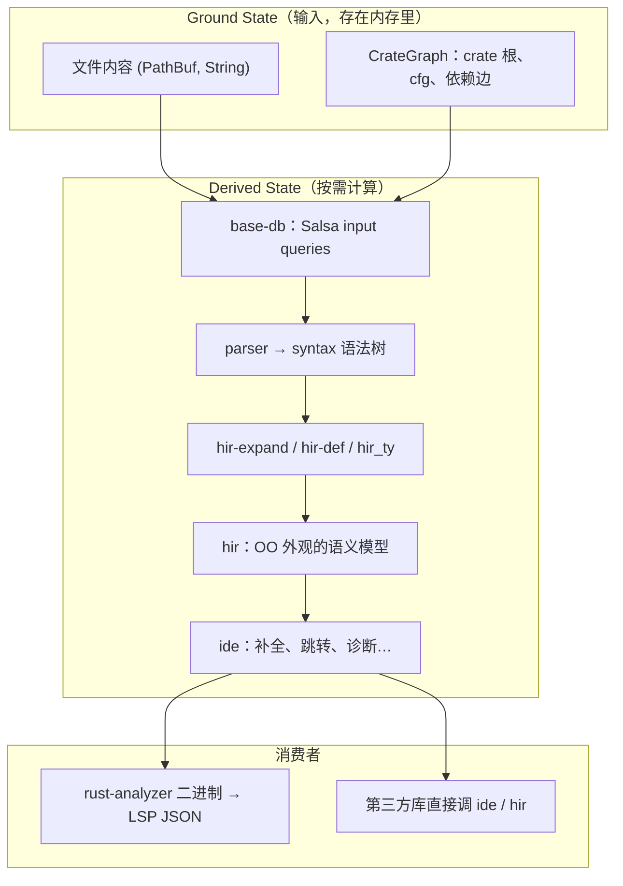

## 是什么

**rust-analyzer**（简称 r-a）是 Rust 官方维护的**语言服务器**实现，通过 [LSP](https://microsoft.github.io/language-server-protocol/) 给 VS Code、Neovim、Zed 等编辑器提供补全、跳转、悬停类型、重构、诊断等功能。官方 [Architecture](https://github.com/rust-lang/rust-analyzer/blob/master/docs/dev/architecture.md) 文档描述的不是「一个大二进制里塞满功能」，而是一套**分层 crate 地图**：从文本输入一路派生出语法树、HIR（高级中间表示）、类型信息，再翻译成编辑器能懂的偏移量和字符串。

日常类比：把 IDE 想成一家**连锁餐厅的中央厨房**。

- **前台（LSP / `rust-analyzer` crate）**：服务员只懂「客人要第几号桌的菜单项」，把订单翻译成标准 JSON，绝不亲自炒菜。
- **点菜系统（`base-db` + Salsa）**：所有食材清单（文件内容、crate 依赖图）记在一张**会自己增量更新的台账**上；你改一行代码，台账只重算受影响的那几道菜的成本表，而不是整张菜单重算。
- **后厨流水线（`parser` → `syntax` → `hir-*` → `hir`）**：洗菜切菜（解析）、摆盘（语法树）、调味（名字解析、宏展开、类型推断）、装盘（面向对象的 `hir` API）。
- **出餐口（`ide`）**：把「某函数的类型是 `Result<(), Error>`」翻译成「光标处显示这段字符串、补全列表里这几项」——用编辑器的词汇，而不是编译器内部 ID。

和「把 `rustc` 嵌进编辑器」不同，r-a 从第一天就为**交互式、可取消、可增量**设计：用户每按一个键，分析可能在几十毫秒内被作废重来，所以架构处处强调**边界、纯函数 query、以及「坏代码也要给出部分结果」**。

## 为什么重要

不理解这套架构，下面几件事很难讲清楚：

- 为什么改一个函数**函数体**不会让整个 crate 的名字解析缓存全部失效——`hir-*` 层维护「函数体内打字不污染全局派生数据」的不变量
- 为什么 `syntax` crate 可以单独拿去写「只靠语法树」的工具——它是刻意与 Salsa、LSP 无关的 **API 边界**
- 为什么 LSP 层和 `ide` 层的类型**故意不可序列化**——序列化一旦泄露到内部，就会锁死演进；IPC 格式由最外层单独定义
- 为什么 r-a 能在 Cargo 构建失败时仍提供补全——项目重载与 IDE 分析解耦，「坏构建」不等于「不能看代码」

## 鸟瞰：输入、派生、增量

官方文档用一张「鸟眼图」概括数据流：



三个关键词：

1. **全内存、无 IO**：分析器不把 `read_file` 当核心路径；客户端推送文件快照，`FileId` 是不透明整数，**`base-db` 甚至不暴露 `std::path::Path`**。
2. **CrateGraph 抽象构建系统**：`base-db` 不知道 Cargo；`feature = "foo"` 在 Cargo 层被降格成 `--cfg feature="foo"` 后才进入 ground state。
3. **小增量、快更新**：典型输入变化是「单文件 diff」；Salsa 的 red-green 算法决定哪些 query 可复用（详见同仓库笔记 [Salsa — 按需增量计算框架](./salsa-incremental-rust-analyzer.md)）。

## Crate 地图与架构不变量

下面按**从底向上**的顺序，摘录官方文档里最重要的 crate 与 **Architecture Invariant**（架构不变量）。不变量经常描述的是「**刻意不存在**的东西」——读 r-a 源码时，先找「这层**不负责**什么」往往比找「这层做什么」更快入门。

### `parser` + `syntax`：与语义无关的语法层

| 要点 | 说明 |
|------|------|
| 解析器 | 手写递归下降，输出扁平 **event 流**（`start node X` / `finish node Y`），借鉴 Kotlin 前端对**错误与残缺输入**的处理 |
| `rowan` | 构建 **green/red 树**（不可变语法树节点），`ast` 模块在其上提供类型安全 API |
| 独立性 | **`syntax` 完全不知道 Salsa 和 LSP**，可单独用来做 fmt-like、大纲提取等工具 |
| 值语义 | 语法树由节点内容完全决定，**不挂语义信息**；重构时要 transform 树，把类型塞进节点会让 assist 变难 |
| 单文件 | 每棵树对应**一个文件**，便于并行 parse 全工作区 |
| 宽容 | 语法树**不保证良构**；AST 方法返回 `Option` 时，运行时真的可能是 `None` |

**API 边界**：`syntax` 是对外可复用的入口之一。

### `base-db`：Salsa 与地面事实

- 使用 **[Salsa](https://github.com/salsa-rs/salsa)** 做增量、按需计算；可粗浅理解为「带派生函数的 KV 存储」。
- 定义大多数 **input queries**（客户端提供的事实）：文件文本、source root、crate 图等。读 `base_db::input` 模块是入门捷径——**其余全是派生**。
- **不知道 Cargo / 文件系统路径**；文件用 `FileId` 标识。
- **`CrateGraph`** 抽象 crate 之间依赖，与具体构建工具解耦。

### `hir-expand`、`hir-def`、`hir_ty`：编译器大脑（无公共 API）

这一层是 r-a 的「真正的编译器」：

- **ECS 风味**：大量 raw ID + 直接查 database，抽象很薄。
- 集成 **Salsa** 与 **[Chalk](https://github.com/rust-lang/chalk)**（trait 求解）。
- 名字解析、**宏展开**、类型推断、中间表示（`ItemTree`、`DefMap`、`Body` 等）都在这里。

**核心增量不变量**：

> 在函数 `foo` 的函数体里打字，**不会使**关于函数 `bar` 的全局派生数据失效。

也就是说，改局部代码时，模块树、其他函数的签名等应尽量保持 memo 有效。这是 IDE 跟批处理编译器性能特征的根本分歧。

**不是 API 边界**——外部不应依赖这些 crate 的稳定接口。

### `hir`：面向库使用者的语义外观

- **API 边界**：若把 r-a 当库用，多半从 `hir` 进门。
- 把 ECS 内部 API 包成 **OO 风格**（每个方法多一个 `db` 参数）。
- 对外呈现**静态、完全解析**的代码视图；内部在算，外部看起来像惰性数据结构。
- **`Semantics` / `source_to_def`**：语法节点 ↔ HIR 元素是 **一对多**（宏、include 会让同一片语法对应多个定义）。许多功能（跳转定义、找光标处符号）都从这里开始：先解析父语法 → 父 HIR → 再枚举子语法节点匹配光标。

这是 Roslyn、Kotlin Analysis API 里也能看到的 **IDE uber-pattern**。

### `ide` 家族：编辑器词汇里的功能

| Crate | 角色 |
|-------|------|
| `ide` | 公共 façade：补全、跳转、悬停等；**API 边界** |
| `ide-db` | 共享 IDE 逻辑（如 find usages） |
| `ide-assists` / `ide-completion` / `ide-diagnostics` / `ide-ssr` | 大块独立功能 |

**设计原则**：

- API 用 **POD + 公共字段**，谈论 **offset 和 label**，而不是 `hir::Type`。
- 参数与返回值**概念上可序列化**（实现里可以用语法树，但 API 面上不出现）。
- **`AnalysisHost`**：可事务性 `apply_change` 的状态；**`Analysis`**：不可变快照——这里才有「随时间变化」的概念。
- API 为**假想的理想 Rust IDE** 设计，**不被 LSP 形状绑架**；LSP 适配放在最外层。

### `rust-analyzer`：唯一懂 LSP 的入口

- `main.rs` 启动 LSP；`handlers.rs` 实现各 LSP 请求（熟悉 LSP 的好起点）。
- **唯一**知道 JSON 序列化的 crate；`ide` 里的结构体不要 `derive(Serialize)`，在边界处手写 DTO。
- **无状态服务器**：跨请求状态应能通过**重复携带原始请求参数**重建（例如 completion 的 `edit` 索引）。
- 改输入/可能阻塞打字的请求走**主线程**；只读请求放**后台线程**。
- **构建坏了也要部分可用**：reload 不应掐死所有 IDE 功能。

### 横切关注点（Cross-Cutting）

#### 取消（Cancellation）

用户打字时，正在跑的语法高亮等长任务应**作废**。Salsa 维护全局 **revision 计数器**；`apply_change` 时 bump 并等待其他线程结束。工作线程若发现 revision 变了，通过 **`Canceled::throw`** 触发特殊 panic（要求 **unwinding**）。`ide` 边界捕获后变成 `Result<T, Cancelled>`。

#### 错误处理

- 核心（`ide`/`hir`）不与外界 IO 打交道，**不会 fail**。
- 分析面对**坏代码**返回 `(T, Vec<Error>)`，不是 `Result<T, Error>`——残缺 AST 是常态，不是异常。
- 每个 LSP 请求 **`catch_unwind`**，单功能 panic 不拖垮进程。

#### 测试边界

官方划分三层测试「系统边界」：

1. **外层**：`rust-analyzer` crate 的 LSP 集成测试（重，需 `RUN_SLOW_TESTS`）。
2. **中层**：`ide` 的 `AnalysisHost` + 快照断言（最重要）。
3. **内层**：`hir` 的 query 快照测试。

测试**不依赖 libstd**（用 fixture 自带最小运行时），**数据驱动**，避免直接测易变的 API 形状。

## 核心概念速查

| 概念 | 一句话 |
|------|--------|
| **Ground state** | 文件文本 + `CrateGraph` + cfg 等 input queries |
| **Derived state** | 语法树、HIR、类型、诊断——全部由 Salsa query 派生 |
| **API Boundary** | `syntax`、`hir`、`ide`、`rust-analyzer` 四层对外契约；边界内可大胆重构 |
| **FileId** | 无路径语义的文件句柄；支持多 VFS 根、远程场景 |
| **CrateGraph** | 抽象依赖图；同一语法文件可因不同 cfg 出现多个 crate 实例 |
| **ItemTree** | 对单文件语法树的「摘要」，函数体改动时仍稳定 |
| **Semantics** | 语法 ↔ HIR 的桥梁；goto-def 的起点 |
| **Revision / Cancelled** | 输入变更版本号；过期计算主动取消 |

## 代码示例

### 示例 1：用 `ide` API 驱动一次「迷你分析」（概念切片）

下面不是 r-a 仓库里的单文件可运行样例，而是把官方 **`AnalysisHost` / `Analysis`** 心智模型压成最小伪代码，展示「改输入 → 拿快照 → 调功能」循环——真实测试里用 `Fixture` 字符串描述多文件工程：

```rust
// 概念示例：ide 层测试的典型形状（简化自官方 testing 文档）
use ide::{AnalysisHost, FilePosition};

fn check_goto_definition(fixture: &str, position_offset: u32) {
    let mut host = AnalysisHost::new();
    // fixture 是特殊格式的多文件字符串，测试里一次性灌入 ground state
    host.apply_change_fixture(fixture);

    let analysis = host.analysis(); // 不可变快照
    let file_pos = FilePosition {
        file_id: /* 从 fixture 解析 */,
        offset: position_offset.into(),
    };

  match analysis.goto_definition(file_pos) {
        Some(nav) => { /* 与 expect! 快照比较 */ }
        None => { /* 光标处无定义，也是合法结果 */ }
    }
}
```

要点：

- **`apply_change` 走 host**，读走 **`analysis()` 快照**——和 Salsa revision 对齐。
- 功能 API 谈 **offset**，不谈 `hir::ModuleDefId`。
- 测试用 **一个 `check` 辅助函数** 集中碰 API，上百个 case 只喂不同 fixture。

### 示例 2：`Semantics`：从光标语法节点找到 HIR 定义

跳转定义的核心是「语法 → HIR」映射。官方强调这是**递归的**：先找父 HIR，再在父的子语法集合里匹配当前节点。

```rust
// 概念示例：对应 hir::Semantics 的使用方式（简化）
use hir::{Semantics, FilePosition};
use syntax::{ast, AstNode};

fn definition_at_cursor(db: &dyn hir::db::HirDatabase, pos: FilePosition) -> Option<hir::ModuleDef> {
    let sem = Semantics::new(db);
    let file = sem.parse(pos.file_id);
    let root = file.syntax();

    // 1. 找到覆盖 offset 的最内层语法节点
    let token = root.token_at_offset(pos.offset.into()).right_biased()?;
    let name_like = ast::NameLike::cast(token.parent()?)?;

    // 2. 通过 Semantics 解析到 HIR（内部走 source_to_def，处理宏/重复定义）
    sem.resolve_name_like(&name_like)
}
```

要点：

- 同一片 `foo` 文本在宏里可能出现多次；**一对多**是常态，所以返回 `Option` / 列表，而非假定双射。
- `hir` 方法需要 `db`，但对外类型像普通 Rust 对象（`ModuleDef` 等）。

### 示例 3：Salsa input 与「改一行文件」触发的增量（与 `base-db` 对齐）

```rust
// 概念示例：base-db 层 input 变更如何进入 Salsa（字段名简化）
fn on_file_edited(db: &mut dyn base_db::SourceDatabase, file_id: FileId, new_text: String) {
    // setter 会 bump Salsa revision，并使依赖 file_text 的 query 失效
    db.set_file_text(file_id, Arc::from(new_text));

    // 后台正在 typeck 的线程会在下一次读 db 时 Cancelled::throw
    // ide 边界捕获为 Err(Cancelled)，LSP 层可丢弃本次响应
}
```

这与示例 1 串联：**LSP `didChange` → 更新 input → 取消旧分析 → 新 `Analysis` 快照 → 补全/高亮**。

## 与其他子系统的衔接

```text
vfs / paths          → 把操作系统路径变成可快照的 VFS（可不假设单一全局文件系统）
project-model        → 调 cargo 解析 Cargo.toml，构建 CrateGraph（在 base-db 之外）
toolchain / flycheck   → 「保存时 cargo check」与语义分析并行，错误来自编译器而非 hir
mbe / tt / proc-macro  → 宏是 token tree 变换；过程宏在独立进程，防 panic/segfault 拖死主进程
cfg                  → 解析与求值 `#[cfg]`，决定哪些 HIR 实例存在
```

过程宏特别注意：**非确定性**与 Salsa 假设冲突，需要额外处理；**坏宏**可能崩溃，所以 **proc-macro-srv** 子进程隔离。

## 和「三种 IDE 架构」博文的对照

官方博文 [*Three Architectures for Responsive IDE*](https://rust-analyzer.github.io/blog/2020/07/20/three-architectures-for-responsive-ide.html) 把常见路线概括为：

1. **编译器当黑盒**（调 `rustc`）——准确但慢，难增量。
2. **全量内存数据库**——快，但/rustc 脱节。
3. **r-a 路线：自研增量前端 + 与 rustc 共享语法/部分语义思想**——在「跟语言演进」和「按键级延迟」之间折中。

Architecture 文档里的 crate 分层，就是第 3 条路线的工程化展开。

## 稳定性与序列化哲学

- **`ide` / `base-db` 内部类型故意不 derive Serialize**——可序列化 ≈ 对外 IPC 契约，改起来很贵。
- 对外稳定主要靠 **LSP** 与 **Rust 语言/Cargo** 本身的稳定性。
- 非 Cargo 构建系统走 **`rust-project.json`**（事实上的稳定格式），但它不会直接序列化 `CrateGraph`，而是调用构造 API 生成。

## 学习路径建议

1. 读 [Architecture 原文](https://github.com/rust-lang/rust-analyzer/blob/master/docs/dev/architecture.md) 的 **Bird's Eye View** 与 **Code Map**（半天）。
2. 看 YouTube 系列 [*Explaining Rust Analyzer*](https://www.youtube.com/playlist?list=PLhb66M_x9UmrqXhQuIpWC5VgTdrGxMx3y) 选「syntax」「salsa」「hir」几集（按需）。
3. 在仓库里打开 `crates/ide/src/lib.rs` 看 `Analysis` API；打开 `crates/ide/src/goto_definition.rs` 跟踪一次跳转。
4. 读 `crates/hir/src/semantics.rs` 理解 `source_to_def`。
5. 配合本库笔记 [Salsa](./salsa-incremental-rust-analyzer.md)、[LSP 规范](./language-server-protocol-spec.md) 对照「协议层」与「增量层」分工。

## 小结

rust-analyzer 的架构可以用一句话记住：

> **输入事实进 Salsa，语法与语义分层派生，边界 crate 把编译器概念翻译成 IDE 概念，最外层才碰 LSP。**

记住几条不变量，就不会在源码海里迷路：

- `syntax` 不懂语义；`hir-*` 不对外；`ide` 不谈内部 ID；`rust-analyzer` 才谈 JSON。
- 改函数体**尽量**不动全局 query。
- 坏代码、坏构建、被取消的请求都是**一等公民**，不是异常路径。

这套设计的目标不是复刻 `rustc` 的全部行为，而是在编辑器里提供**足够好、足够快、足够稳**的 Rust 语义服务——Architecture 文档就是这张地图的图例。

## 延伸阅读

- [rust-analyzer Architecture（官方）](https://github.com/rust-lang/rust-analyzer/blob/master/docs/dev/architecture.md)
- [rust-analyzer 贡献指南：Salsa 与 query](https://rust-analyzer.github.io/book/contributing/guide.html)
- [Three Architectures for Responsive IDE](https://rust-analyzer.github.io/blog/2020/07/20/three-architectures-for-responsive-ide.html)
- [System Boundaries（Tedinski）](https://www.tedinski.com/2018/02/06/system-boundaries.html) — 理解「API Boundary」为何反复出现
- [Salsa 文档](https://salsa-rs.github.io/salsa/overview.html)
