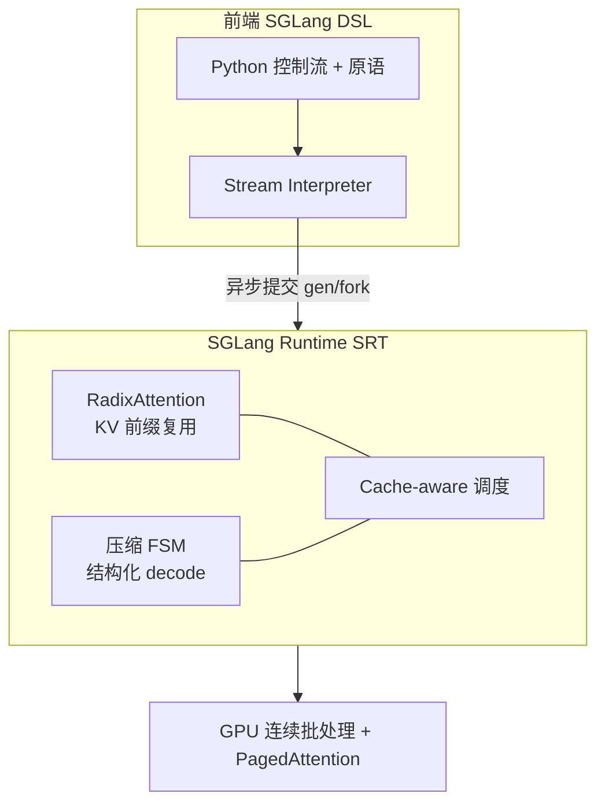

## 从日常类比开始：连锁快餐的「半成品库」

想象你经营一家连锁快餐店，菜单上有很多组合套餐：

- 每个顾客都要先拿**同一款底堡 + 同一套标准酱**（相当于 system prompt、few-shot 示例、RAG 检索到的长文档）。
- 然后才加**各自不同的配料**（用户问题、本轮要生成的 JSON 字段、agent 的下一步动作）。

如果厨房按「一单一做」来：

1. 每个订单都从揉面开始；
2. 100 个订单 = 把底堡和酱做 100 遍；
3. GPU 上的 LLM 推理正是这样——**每个请求各自 prefill 一遍相同前缀**，算力白白烧掉。

**SGLang**（*SGLang: Efficient Execution of Structured Language Model Programs*，Zheng 等，NeurIPS 2024，arXiv [2312.07104](https://arxiv.org/abs/2312.07104)）的做法像在中央厨房维护一棵**半成品树**：

- 已经做好、且还在用的底堡路径，挂在树上；
- 新订单先问：「我的开头和树上哪条路径最长匹配？」——匹配到的部分**直接复用**，只从分叉处继续加工；
- 显存不够时，按 **LRU** 淘汰最久没人点的叶子节点。

这棵「半成品树」在论文里叫 **RadixAttention**；整家店从「怎么写订单（前端 DSL）」到「怎么调度灶台（runtime）」是一体 co-design 的。

---

## 是什么

| 项目 | 内容 |
|------|------|
| 论文 | *SGLang: Efficient Execution of Structured Language Model Programs* |
| 作者 | Lianmin Zheng, Liangsheng Yin, Zhiqiang Xie 等（Stanford / UC Berkeley / SJTU 等） |
| 会议 | NeurIPS 2024 |
| 核心贡献 | **前端 DSL** + **SGLang Runtime (SRT)**，运行时两大优化：**RadixAttention**、**压缩 FSM** |
| 实测 | 相对 vLLM / Guidance / LMQL，吞吐最高 **6.4×**，延迟最高 **3.7×** |
| 开源 | [github.com/sgl-project/sglang](https://github.com/sgl-project/sglang) |

论文把现代 LLM 用法概括成 **Language Model Programs（LM Programs）**——不是单次 `chat.completions`，而是用程序调度**多次**生成调用，中间夹控制流、工具调用、结构化输入输出。典型场景：

- Agent（ReAct、Generative Agents）
- Tree-of-Thought / Skeleton-of-Thought
- Few-shot 评测（MMLU、HellaSwag）
- JSON / 正则约束解码
- 多轮对话、RAG pipeline

SGLang 要同时解决两件事：

1. **编程难**：字符串拼接、并行分支、解析输出，手写 OpenAI 式 API 代码又臭又长；
2. **执行慢**：多次调用之间大量**共享前缀**，但 vLLM 等引擎请求结束就丢 KV cache，下次从头算。

论文 Fig. 1 的整体架构可以用下面这张图概括——**前端 DSL** 和 **SGLang Runtime (SRT)** 是 co-design 的，优化机会（RadixAttention、压缩 FSM）来自对「程序结构」的感知，而不是只看单次 HTTP 请求：



---

## 为什么重要

不理解 SGLang，下面几件事很难讲清：

- 为什么 **vLLM 已经用 PagedAttention 管好了显存**，agent 场景还要换/加 SGLang——PagedAttention 管的是「块怎么放」，RadixAttention 管的是「相同语义前缀算不算第二遍」
- 为什么 **结构化 JSON 输出**在 SGLang 里可以比「每 token 调一次模型 + mask 非法 token」快一截——压缩 FSM 能**一次 forward 跳过整段确定字符**
- 为什么 Chatbot Arena 生产环境能报出 **50%+ 的 RadixAttention 命中率**，首 token 延迟平均降 **1.7×**
- 为什么后续 vLLM 也加了 **prefix caching**——思路被 SGLang 从「语义层复用」方向推动

和 [[paged-attention-vllm]]、[[flash-attention]] 的关系：**正交**。FlashAttention 优化 attention 算子 IO；PagedAttention 优化 KV 物理布局；RadixAttention 优化**跨请求、跨 fork 的前缀复用**——可以叠在一起用。

---

## 核心概念

### 1. KV cache 与前缀可复用性

Transformer 自回归解码时，每生成一个新 token，都要对**之前所有 token**做 attention。为省重复计算，推理引擎把每层 attention 的 **Key / Value 张量**缓存下来，叫 **KV cache**。

关键性质：**第 t 个 token 的 KV 只依赖位置 1…t-1 的 token**。因此：

- 两个请求若 prompt 前 500 token 完全相同，这 500 token 对应的 KV **不必算两遍**；
- 多轮对话里，历史轮次是下一轮的超长共享前缀；
- `fork()` 出来的并行分支，共享 fork 点之前的全部 KV。

传统 serving：请求结束 → 释放该请求 KV → 下一请求从零 prefill。  
SGLang：**把 KV 当 cache 留着**，用 radix tree 索引。

### 2. RadixAttention：radix tree + LRU + 引用计数

**Radix tree（基数树）** 是压缩版前缀树：边可以带**一段 token 序列**而不只是单个 token，省节点数。

SGLang 维护 **token 序列 → KV cache 块** 的映射：

- 新请求到达：在树上做**最长前缀匹配**，命中部分直接挂接已有 KV；
- 未命中后缀：分配新节点，继续 prefill；
- 显存压力：**LRU 淘汰叶子**；父节点仍可能被其他请求引用；
- 正在运行的 batch：节点有 **ref count**，使用中不可 evict；
- KV 物理存储仍可用 **paged layout**（与 vLLM 兼容），RadixAttention 管的是**逻辑共享**。

论文 Fig. 3 用九步动画说明：两个 chat session 如何共享 system prompt、few-shot batch 如何共享 examples、self-consistency 采样如何复用同一题干的 KV。

**Cache-aware scheduling**：等待队列里不盲目 FCFS，而是优先调度**与当前树匹配前缀更长**的请求，提高命中率。离线最优可证：在 cache 足够大时，对 radix tree 做 **DFS** 等价于最长共享前缀优先。

**Frontend Hint**：`fork` 时前端先把**共享前缀**发给 runtime 插入树，再发各分支差异部分——前后端 co-design，调度更简单。

### 3. 压缩有限状态机（Compressed FSM）

约束解码（JSON schema、正则）常把正则编译成 **FSM**。朴素做法每步只允许合法 token，**一步 decode 一个 token**。

但很多步其实**没有分支**：例如输出固定字面量 `"summary": "`，下一个 token 唯一确定，却照样调用模型 N 次。

SGLang 把 FSM 里「单入单出」的连续边**压缩成一条边**，一次 forward **注入多个确定 token**（compressed FSM）。JSON  benchmark 上仅此一项吞吐约 **1.6×**；若不对 FSM 预编译复用，还会慢 **2.4×**。

### 4. 前端 DSL 与执行模型

SGLang 是嵌在 Python 里的 **DSL**，核心原语：

| 原语 | 作用 |
|------|------|
| `+=` / `extend` | 追加 prompt 文本或多模态输入 |
| `gen` | 调用模型生成，可带 `regex` 约束 |
| `select` | 从选项列表中选最高概率项 |
| `fork` / `join` | 复制 prompt 状态并行探索，再合并 |
| `image` / `video` | 多模态输入 |

执行方式类似 **异步 CUDA kernel**：`gen` 非阻塞提交到 stream executor，Python 继续跑；取结果时再同步。程序可被 trace 后编译成计算图（论文附录），默认用解释器模式。

### 5. API Speculative Execution（黑盒 API）

对 OpenAI 等**只能调 HTTP、改不了 KV** 的模型：第一次 `gen` 时**故意多生成几个 token**（忽略 stop），后面 primitive 若匹配上则**免一次 API  round-trip**，省 latency 和重复 input token 费用。

---

## 代码示例

### 示例 1：Branch-Solve-Merge 多维度评审（论文 Fig. 2 风格）

下面这段展示：**图像 + 作文**输入、`select` 分支、`fork` 并行、`regex` 约束 JSON——正是论文用来对比「手写 OpenAI API 要多 2.1× 行数」的那类程序。

```python
import sglang as sgl

@sgl.function
def multi_dimensional_judge(s, image_path, essay):
    s += sgl.image(image_path)
    s += "Essay:\n" + essay + "\n"

    # 先判断作文是否与图片相关
    s += "Is the essay related to the image?"
    s += sgl.select(sgl.SYSTEM, ["Yes", "No"], name="related")

    if s["related"] == "Yes":
        # 三个维度并行评审——fork 共享前缀 KV
        forks = s.fork(3)
        dimensions = ["relevance", "coherence", "grammar"]
        for f, dim in zip(forks, dimensions):
            f += f"Rate {dim}: "
            f += sgl.gen("judgment", max_tokens=64)

        s += "Summary: "
        s += sgl.gen("summary", max_tokens=128)
        s += "Grade: "
        s += sgl.gen(
            "grade",
            regex=r"[A-F]",  # 压缩 FSM：字母等级可跳步
        )
    else:
        s += '{"error": "unrelated"}'

    return s
```

Runtime 看到 `fork(3)` 就知道三条分支共享「图片 + 作文 + 相关性问题」整段 KV；`regex=r"[A-F]"` 触发压缩 FSM，减少无效 decode 步数。

### 示例 2：Few-shot + 多选题——RadixAttention 主战场

MMLU 类 benchmark：1000 道题共用同一份 5-shot examples。vLLM 会对每题重算 examples 的 KV；SGLang 在树上只保留一份。

```python
import sglang as sgl

FEW_SHOT = """
Q: What is 2+2? A: 4
Q: Capital of France? A: Paris
... (5 examples)
"""

@sgl.function
def mmlu_item(s, question, choices):
    s += FEW_SHOT  # 所有题目共享——RadixAttention 核心收益点
    s += f"Q: {question}\n"
    for i, c in enumerate(choices):
        s += f"({chr(65+i)}) {c}\n"
    s += "Answer:"
    s += sgl.select(sgl.SYSTEM, choices, name="answer")

# 批量跑 512 题：cache hit rate 论文报告可达 90%+
# 吞吐相对 vLLM 常见 2–4×（取决于 batch 与 examples 长度）
```

### 示例 3：启动 Runtime + 约束 JSON（部署最小闭环）

```bash
# 终端 1：启动 SRT（SGLang Runtime）
python -m sglang.launch_server \
  --model-path meta-llama/Llama-3.1-8B-Instruct \
  --port 30000
```

```python
# 终端 2：客户端程序
import sglang as sgl

sgl.set_default_backend(sgl.RuntimeEndpoint("http://127.0.0.1:30000"))

@sgl.function
def extract_person(s, bio_text):
    s += "Extract person info as JSON.\n"
    s += bio_text + "\nJSON:"
    s += sgl.gen(
        "json",
        regex=r'\{"name":"[^"]+","age":[0-9]+\}',
    )

state = extract_person.run(bio_text="Alice is 30 and lives in NYC.")
print(state["json"])
```

`regex=` 路径走压缩 FSM；若同一 `bio_text` 前缀在并发请求间重复，RadixAttention 自动复用 prefill。

---

## 性能数据（论文摘要）

| 场景 | 主要加速来源 | 相对 vLLM 量级（论文） |
|------|----------------|------------------------|
| 5-shot MMLU | RadixAttention 复用 examples | 吞吐明显提升 |
| HellaSwag | examples + 问题前缀两级共享 | 同上 |
| ReAct / Generative Agents | 模板 + 历史调用前缀 | 2–5× 常见 |
| Tree-of-Thought | fork 并行 + KV 复用 | 高 |
| JSON decoding | 压缩 FSM | 最高 **6.4×** 吞吐 |
| 多轮 chat（短输出） | 历史轮次 KV | 明显 |
| 多轮 chat（长输出） | 解码占主导，共享少 | 接近 1× |
| LLaVA 多模图像问答 | 同图 hash 作 radix key | 最高 **6×** |

Chatbot Arena 生产数据（论文 §6.2）：LLaVA-Next-34B RadixAttention 命中率 **52.4%**，Vicuna-33B **74.1%**。

RadixAttention **无复用场景开销**：ShareGPT 100 请求总耗时 74.3s，树维护仅 **0.2s（<0.3%）**——因此可默认开启。

---

## 与 vLLM / Guidance 的对比

| 维度 | vLLM | Guidance / LMQL | SGLang |
|------|------|-----------------|--------|
| KV 物理管理 | PagedAttention | 依后端而定 | 兼容 paged + radix 逻辑共享 |
| 跨请求前缀复用 | 后期加 prefix caching（可选） | 有限 | **RadixAttention 默认系统化** |
| 结构化 decode | 外部库 | token 级 mask | **压缩 FSM，多 token 一步** |
| 程序内并行 | 无 DSL | 弱 / 无 fork | **fork/join 一等公民** |
| 自研 runtime | SRT | 多后端 | **SRT，与 DSL co-design** |

选型经验（论文 + 社区实践）：

- **前缀重复率高**（agent、RAG、few-shot、多轮）→ SGLang 优势明显；
- **单轮随机短 prompt** → vLLM 足够；
- **极致单请求延迟** → TensorRT-LLM 等内核向方案仍可能更优；
- 生产常见组合：**结构化/agent 流量走 SGLang，通用 chat 走 vLLM**。

---

## 踩坑与局限

1. **命中率决定一切**：请求前缀各不相干时，收益接近 0，只剩树维护的微小开销。
2. **Cache-aware 调度可能饥饿**：论文承认 FCFS 公平性与 cache 贪心存在张力，公平调度仍是开放问题。
3. **压缩 FSM 依赖已知 schema**：正则/JSON 模板固定时最强；schema 运行时动态生成则退化。
4. **不是训练框架**：SGLang 定位 inference / serving；训练看 [[megatron-core-moe-2026]]、PyTorch FSDP 等。
5. **多模态 key**：图像 KV 用**图像 hash** 作 radix key，同图不同问法才能复用视觉 prefix。

---

## 学到什么（零基础 checklist）

1. **LLM 应用正在从「一次聊天」变成「程序」**——多次 `gen`、分支、工具、结构化 I/O；优化要对着**程序结构**做，不能只优化单次 forward。
2. **KV cache 是可复用的中间结果**，不是请求私有、用完即扔的临时变量——这是 RadixAttention 的第一性原理。
3. **Radix tree + LRU** 把「哪些前缀还活着」变成可调度、可淘汰的 cache 问题，和 CPU cache / CDN 是同一类思路。
4. **结构化输出里大量 token 是确定的**——FSM 压缩是「免费加速」，不必每个字符都问模型。
5. **前端写清楚 fork 与共享**，后端才敢做激进调度——DSL 不是语法糖，是指挥 runtime 的接口。

---

## 对照阅读路径（与 PagedAttention / vLLM 叠读）

若你已读过 [[paged-attention-vllm]]，可以用「三层 KV 优化」把几篇笔记串起来——**互不替代，可叠加**：

| 层次 | 论文 / 系统 | 解决什么问题 | 类比 |
|------|-------------|--------------|------|
| 算子 | [[flash-attention]] | attention 本身 HBM IO 太多 | 厨师在操作台上一口气切完，少跑仓库 |
| 物理布局 | [[paged-attention-vllm]] | KV 占显存碎片化，batch 上不去 | 笔记分页存抽屉，不必连续长桌 |
| 语义复用 | **SGLang / RadixAttention** | 相同 prompt 前缀被重复 prefill | 中央厨房保留已做好的底堡，新单只加配料 |
| 批调度 | [[orca-continuous-batching]] | 请求到达时间不齐，GPU 空转 | 外卖拼单，凑满一锅再开火 |
| decode 深度 | [[speculative-decoding-leviathan-2023]] | 大模型逐 token 串行慢 | 学生先猜几个字，老师一次批改 |

**推荐阅读顺序（零基础）**：

1. [[paged-attention-vllm]] —— 先搞清 KV cache 是什么、为什么占显存
2. **本篇 SGLang** —— 再理解「前缀相同」时为何不必算第二遍
3. [[speculative-decoding-leviathan-2023]] —— 最后看 decode 阶段另一维加速

**一句话区分 vLLM 与 SGLang**：vLLM 的 PagedAttention 回答「**一块 KV 在显存里放哪**」；RadixAttention 回答「**这块 KV 能不能给下一个请求接着用**」。vLLM 后来也加了 optional prefix caching，思路与 RadixAttention 同源。

---

## 最小可运行 Demo（本地验证 RadixAttention 收益）

下面脚本不依赖业务逻辑，只演示 **few-shot 前缀共享**——第二、三次 `run` 应比第一次更快（首 token / prefill 时间下降，具体数值依 GPU 而定）。

```bash
pip install "sglang[all]"   # 或按官方文档安装
python -m sglang.launch_server \
  --model-path meta-llama/Llama-3.2-1B-Instruct \
  --port 30000 \
  --log-level info
```

```python
# demo_radix_hit.py — 另开终端运行
import time
import sglang as sgl

sgl.set_default_backend(sgl.RuntimeEndpoint("http://127.0.0.1:30000"))

SHARED = "You are a helpful assistant.\n" + ("Q: 2+2?\nA: 4\n" * 5)

@sgl.function
def one_shot(s, question):
    s += SHARED
    s += f"Q: {question}\nA:"
    s += sgl.gen("ans", max_tokens=8)

questions = ["Capital of Japan?", "Capital of France?", "Capital of Germany?"]
for i, q in enumerate(questions):
    t0 = time.perf_counter()
    state = one_shot.run(question=q)
    elapsed = time.perf_counter() - t0
    print(f"[{i+1}] {elapsed:.2f}s  ans={state['ans']!r}")
```

观察 server 日志中的 **cache hit / prefix match** 相关指标；三题共用 `SHARED` 时，第 2、3 次 prefill 通常明显短于第 1 次。若每题 prompt 完全不同，则几乎无收益——这与论文「命中率决定一切」一致。

---

## 延伸阅读

- 论文 PDF：[arXiv 2312.07104](https://arxiv.org/abs/2312.07104)
- 官方文档：[docs.sglang.ai](https://docs.sglang.ai/)
- LMSys 博客：[Fast and Expressive LLM Inference with SGLang](https://lmsys.org/blog/2024-01-17-sglang/)

## 关联

- [[sglang-2024]] —— 同论文的 shorter 笔记
- [[paged-attention-vllm]] —— KV 物理层：分页管理
- [[orca-continuous-batching]] —— 连续批处理，与 RadixAttention 可叠加
- [[speculative-decoding-leviathan-2023]] —— 另一维 decode 加速（投机解码）
- [[projects/sglang]] —— 开源项目与部署实践
