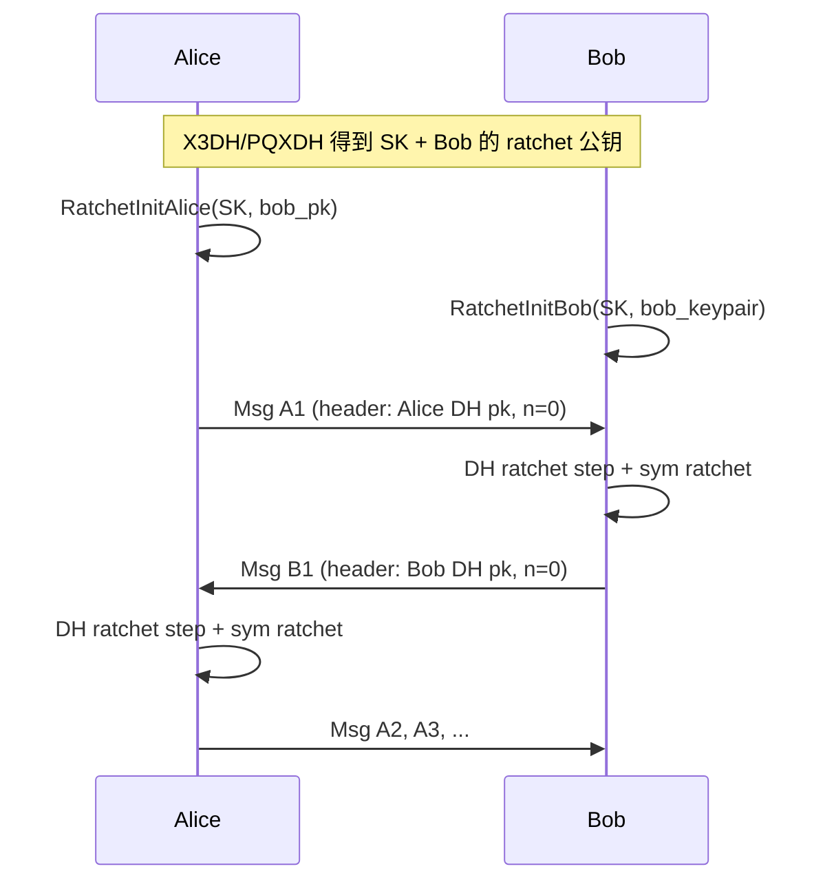

## 是什么

**Double Ratchet Algorithm**（双棘轮算法）是 Signal 用来在双方已经共享一个初始密钥之后，持续收发加密消息的会话协议。规范由 Trevor Perrin 与 Moxie Marlinspike 设计，现行 Revision 4（2025-11-04）还扩展了 Header Encryption、Sparse Post-Quantum Ratchet（SPQR）与 Triple Ratchet；本文聚焦经典 Double Ratchet 的核心机制。

日常类比：

> 想象你和好友共用一条**单向滚动的密码纸带**。每发一条消息，就从纸带上撕下一格密钥加密，撕过的格子立刻烧掉——这是**对称棘轮**。  
> 但万一有人偷拍了你当前整卷纸带，他就能推算后面所有格子。于是你们约定：每隔几轮，各自换一把新的**临时公钥锁**（Diffie-Hellman），把新算出的共享秘密混进纸带起点，旧偷拍作废——这是 **DH 棘轮**。  
> 两个棘轮套在一起，就像自行车链两侧各有一个只能向前转的棘轮：**一条消息一个密钥，泄露后还能自愈**。

Double Ratchet 不解决「第一次怎么认识对方」——那由 **X3DH / PQXDH** 等密钥协商协议完成。它解决的是：**会话建立之后，每条消息如何独立加密、如何应对丢包乱序、如何在设备被短暂入侵后恢复安全**。

## 为什么重要

不理解 Double Ratchet，下面这些事都会变成黑盒：

- Signal、WhatsApp、Matrix Olm/Megolm 等 E2EE 聊天为何强调「前向保密（Forward Secrecy）」与「入侵后恢复（Post-Compromise Security, PCS）」
- 为什么泄露**当前**会话状态通常只能解密**有限窗口**内的消息，而不是整段聊天史
- 为什么每条消息头里要带 `(pn, n)` 序号和发送方 DH 公钥——为了乱序到达时「跳格取钥」
- 实现安全消息协议时，KDF 链、根密钥 RK、发送/接收链 CKs/CKr 各管什么

## 核心概念

### 1. KDF 链（KDF Chain）

KDF（Key Derivation Function）接受秘密密钥与输入，输出伪随机数据。规范推荐 **HMAC / HKDF**。

**KDF 链**：每次调用 KDF，一部分输出当作**消息密钥**，另一部分**替换**链上的 KDF 密钥，供下一步使用。

KDF 链具备三类性质（规范术语）：

| 性质 | 含义 |
|------|------|
| **Resilience（弹性）** | 没有链密钥时，输出密钥对外看起来随机 |
| **Forward Security（前向安全）** | 泄露**当前**链密钥，**过去**输出密钥仍不可算 |
| **Break-in Recovery（入侵恢复）** | 泄露当前链密钥后，若未来输入混入了足够新熵，**未来**密钥再次对外随机 |

Double Ratchet 里每个参与方维护三条链：**根链 RK**、**发送链 CKs**、**接收链 CKr**（Alice 的发送链 = Bob 的接收链）。

### 2. 对称棘轮（Symmetric-Key Ratchet）

每条消息用**唯一 message key** 加密。message key 来自发送/接收 KDF 链的一步：

```
chain_key ──KDF_CK──► (new_chain_key, message_key)
```

- 消息密钥**不再**派生其他密钥，用后可删
- 链密钥单向前进：知道 message key **不能**反推 chain key
- 只提供「每条消息不同钥」，**不提供** PCS——若链密钥被偷，未来消息全裸

### 3. DH 棘轮（Diffie-Hellman Ratchet）

每方持有一对 **ratchet DH 密钥**（发送方当前 DH 公钥写在每条消息头里）。当收到**新的**对方 ratchet 公钥时，执行 **DH ratchet step**：

1. 用本地当前 DH 私钥 × 对方新公钥 → `dh_out`
2. `KDF_RK(root_key, dh_out)` → 新的 RK 与**接收链** CKr
3. **生成新的**本地 DH 密钥对
4. 再次 `KDF_RK` → 新 RK 与**发送链** CKs

双方像乒乓球一样轮流换 DH 密钥对。攻击者若只偷到**某一时刻**的 DH 私钥，等对方换钥并完成下一步 DH 棘轮后，新链密钥来自攻击者未知的 DH 输出——**窗口关闭**。

### 4. 双棘轮如何协作

规范 §2.4 的两条规则：

1. **发/收每条消息**：对发送链或接收链做一步对称棘轮 → 得到 message key
2. **收到新的 ratchet 公钥**：**先**做 DH 棘轮更新链密钥，**再**做对称棘轮

### 5. 乱序与丢包（Out-of-Order Messages）

消息头包含：

- **`n`**：当前发送链上的消息序号（0, 1, 2, …）
- **`pn`**：**上一条**发送链的长度（previous chain length）

接收方若发现 `n` 比本地 `Nr` 大，说明中间有消息跳过——对链做多次 `KDF_CK`，把跳过的 message key 存进 `MKSKIPPED` 字典，等迟到消息再用。`MAX_SKIP` 限制单次可跳格数，防 DoS。

### 6. 状态变量一览

| 变量 | 含义 |
|------|------|
| `RK` | 32 字节根密钥 |
| `CKs`, `CKr` | 发送/接收链密钥 |
| `DHs` | 本地 ratchet DH 密钥对 |
| `DHr` | 对方当前 ratchet 公钥 |
| `Ns`, `Nr` | 发送/接收消息计数 |
| `PN` | 上一发送链长度 |
| `MKSKIPPED` | 跳过的 message key 缓存 |

### 7. 推荐密码学原语（§7.2 摘要）

- **DH**：Curve25519（X25519）
- **KDF**：HKDF-SHA256 或 HMAC-SHA256
- **AEAD**：AES-256-GCM 或 ChaCha20-Poly1305
- 现代 Signal 栈还会用 **PQXDH** 做初始密钥协商，Revision 4 引入 **Triple Ratchet** 叠加 ML-KEM 等后量子棘轮——经典 DH 棘轮对「先录密文、等量子计算机再解密」无效，PCS 需 PQ 扩展补强

## 协议流程（Alice 先发）



## 代码示例 1：初始化（规范 §3.3）

双方经密钥协商得到 32 字节共享秘密 `SK` 与 Bob 的 ratchet 公钥。Alice 先发言的简化初始化：

```python
def RatchetInitAlice(state, SK, bob_dh_public_key):
    state.DHs = GENERATE_DH()           # Alice 生成自己的 ratchet 密钥对
    state.DHr = bob_dh_public_key       # 记录 Bob 的 ratchet 公钥
    # 根 KDF：SK + 首次 DH → 根密钥 RK 与 Alice 的发送链 CKs
    state.RK, state.CKs = KDF_RK(SK, DH(state.DHs, state.DHr))
    state.CKr = None                    # 接收链等 Bob 首条消息后再建立
    state.Ns = 0
    state.Nr = 0
    state.PN = 0
    state.MKSKIPPED = {}


def RatchetInitBob(state, SK, bob_dh_key_pair):
    state.DHs = bob_dh_key_pair         # Bob 的 ratchet 密钥对（公钥已给 Alice）
    state.DHr = None                    # 尚未收到 Alice 的 ratchet 公钥
    state.RK = SK                       # Bob 暂以 SK 为根密钥
    state.CKs = None                    # 发送链等收到 Alice 第一条消息后建立
    state.CKr = None
    state.Ns = 0
    state.Nr = 0
    state.PN = 0
    state.MKSKIPPED = {}
```

要点：Alice 在初始化时就完成**第一次 DH 棘轮的一半**（用自己的新 DH 私钥 × Bob 的公钥），因此她**可以立即发送**；Bob 必须**先收到** Alice 的消息才能对齐链状态。

## 代码示例 2：加密、解密与 DH 棘轮步（规范 §3.4–3.5）

```python
def RatchetSendKey(state):
    """对称棘轮一步：链密钥前进，产出 message key"""
    state.CKs, mk = KDF_CK(state.CKs)
    Ns = state.Ns
    state.Ns += 1
    return Ns, mk


def RatchetEncrypt(state, plaintext, AD):
    Ns, mk = RatchetSendKey(state)
    header = HEADER(state.DHs, state.PN, Ns)  # 含 ratchet 公钥、pn、n
    return header, ENCRYPT(mk, plaintext, CONCAT(AD, header))


def DHRatchet(state, header):
    """收到新 ratchet 公钥时：更新根链与收发链"""
    state.PN = state.Ns
    state.Ns = 0
    state.Nr = 0
    state.DHr = header.dh
    # 第一次 KDF_RK：建立新的接收链
    state.RK, state.CKr = KDF_RK(state.RK, DH(state.DHs, state.DHr))
    state.DHs = GENERATE_DH()           # 换新的本地 DH 密钥对
    # 第二次 KDF_RK：建立新的发送链
    state.RK, state.CKs = KDF_RK(state.RK, DH(state.DHs, state.DHr))


def RatchetReceiveKey(state, header):
    mk = TrySkippedMessageKeys(state, header)
    if mk is not None:
        return mk
    if header.dh != state.DHr:
        SkipMessageKeys(state, header.pn)
        DHRatchet(state, header)
    SkipMessageKeys(state, header.n)
    state.CKr, mk = KDF_CK(state.CKr)
    state.Nr += 1
    return mk


def RatchetDecrypt(state, header, ciphertext, AD):
    mk = RatchetReceiveKey(state, header)
    return DECRYPT(mk, ciphertext, CONCAT(AD, header))
```

解密路径的三层逻辑：

1. **缓存命中**：乱序消息曾在 `MKSKIPPED` 里预存密钥 → 直接解密
2. **新 ratchet 公钥**：先补跳旧链、再 `DHRatchet` 换链
3. **常规情况**：对称棘轮一步 → 解密；认证失败则**丢弃状态变更**

## 代码示例 3：用 HKDF 理解 KDF_CK（教学简化）

规范把 `KDF_CK` / `KDF_RK` 留给具体实现；下面用 Python `cryptography` 演示**对称棘轮一步**的形状（非 Signal 生产代码）：

```python
import os
import hkdf

CHAIN_LABEL = b"DoubleRatchetChain"
MSG_LABEL = b"DoubleRatchetMessage"

def kdf_ck(chain_key: bytes) -> tuple[bytes, bytes]:
    """模拟 KDF_CK：输入链密钥 → (新链密钥, 消息密钥)"""
    okm = hkdf.hkdf_expand(
        hkdf.hkdf_extract(b"", chain_key),
        CHAIN_LABEL + MSG_LABEL,
        64,
    )
    return okm[:32], okm[32:]  # new_ck, message_key

# 模拟连续发送三条消息
ck = os.urandom(32)
for i in range(3):
    ck, mk = kdf_ck(ck)
    print(f"msg#{i} key={mk.hex()[:16]}…")  # 每把 mk 只加密一条消息
# 旧 mk 无法从当前 ck 反推，已发送的 mk 应 secure delete
```

## 安全属性与实现纪律

### 前向保密（Forward Secrecy）

长期密钥或**当前**链状态泄露，**不应**推导出**更早**消息的密钥——对称棘轮保证「烧掉纸带格子」，DH 棘轮保证「换锁后旧 DH 私钥无关」。

### 入侵后恢复（Post-Compromise Security / Break-in Recovery）

设备被入侵、攻击者拿到当前 RK/CK/DH 私钥后，只要对方**正常收发**并触发新的 DH 棘轮，新链密钥含攻击者未知的 DH 输出，**后续**消息恢复保密。规范 §8.2 强调：**必须安全删除**旧 message key、旧 chain key、旧 DH 私钥——否则 PCS 只是纸面性质。

### 实现注意事项（精选）

| 话题 | 建议 |
|------|------|
| **安全删除** | message key 用一次删一次；跳过密钥在解密或超时后删 |
| **MAX_SKIP** | 容忍正常丢包，但限制恶意超大 `n` |
| **AEAD nonce** | 每 message key 只用一次，nonce 可固定或从 mk 派生 |
| **异常处理** | 解密/认证失败时**回滚**状态，勿半更新 |
| **Header Encryption** | §4 变体隐藏 ratchet 公钥与序号，防流量分析 |

## 与相关协议的关系

```
PQXDH / X3DH          Double Ratchet           应用消息
(首次共享 SK)    →    (会话内逐条换钥)    →    Signal 聊天
       │                      │
       └─ Noise 思路相近 ─────┴─ OTR 的 DH ratchet 启发
```

- [[noise-protocol-framework]]：Noise 管**握手 + 传输**通道；Double Ratchet 管**长会话多消息**密钥演进，二者常组合出现
- **OTR**（Off-the-Record）：较早引入 DH ratchet 思想
- **Revision 4 Triple Ratchet**：在经典 DH 棘轮外再叠 **SPQR（ML-KEM Braid 等）**，对抗量子「先 harvest 后 decrypt」

## 常见误解

1. **「Double Ratchet = Signal 全部加密」** — 错。它只是**会话层**；身份认证、首次密钥、群聊（Sender Keys）是别的层。
2. **「偷到手机就能看全部历史」** — 不一定。若历史 message key 已删、且无备份明文，前向保密可保护**旧消息**；但未删密钥或明文备份仍危险。
3. **「DH 棘轮每消息都转」** — 错。只有收到**新的** ratchet 公钥才 DH 棘轮；同方向连续多条消息通常只走对称棘轮。
4. **「乱序会破坏安全」** — 不会，只要 `MKSKIPPED` 有界且最终一致；只会多占内存。

## 动手检验清单

1. 用测试向量实现 `KDF_RK` / `KDF_CK`，对齐规范或 libsignal 参考实现
2. 模拟 A1→B1→A2→B2 序列，打印每步 RK/CKs/CKr 是否与对方镜像
3. 故意跳过 B2，用 B3 触发 DH 棘轮，验证 B2 迟到仍能从 `MKSKIPPED` 解密
4. 解密篡改 ciphertext，确认状态不被污染
5. 对比 Revision 4 中 Header Encryption 与 Triple Ratchet 扩展阅读路径

## 参考资料

- 规范 PDF（Revision 4）：https://signal.org/docs/specifications/doubleratchet/doubleratchet.pdf
- HTML 版：https://signal.org/docs/specifications/doubleratchet/
- PQXDH 初始密钥协商：https://signal.org/docs/specifications/pqxdh/
- Cohn-Gordon 等形式化分析：*On Ends-to-Ends Encryption* 系列
- 实现参考：libsignal（Rust）、signal-protocol-java

---

**一句话总结**：Double Ratchet = **对称棘轮**（每条消息一把新钥，前向保密）+ **DH 棘轮**（定期注入新 DH 熵，入侵后恢复）；读懂 `KDF_CK`、`KDF_RK`、`DHRatchet` 与 `(pn, n)` 乱序处理，就读懂了 Signal 1:1 会话加密的主引擎。
