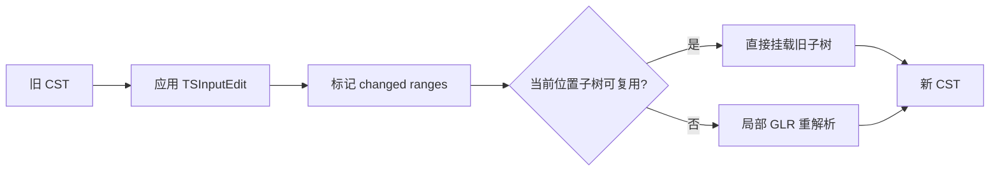

## 是什么

Tree-sitter 是一套**给编程工具用的解析器生成器 + 增量解析库**。它能把源代码变成**具体语法树（Concrete Syntax Tree, CST）**，并在你每次敲键盘时**只更新受影响的那一小段树**，而不是把整份文件从头解析一遍。

日常类比：想象你在编辑一本 500 页的书。传统 parser 的做法是——你改了一个逗号，它就把 500 页全部重新排版一遍。Tree-sitter 的做法是：标记「第 37 页第 3 段变了」，只重排那一小段，前面 499 页的原样复用。这就是为什么它能在编辑器里**每按一次键就解析一次**，仍然跟得上。

```javascript
// 最小用法：解析一段 JavaScript，打印语法树
const Parser = require('tree-sitter');
const JavaScript = require('tree-sitter-javascript');

const parser = new Parser();
parser.setLanguage(JavaScript);

const tree = parser.parse('function add(a, b) { return a + b; }');
console.log(tree.rootNode.toString());
// 输出类似：(program (function_declaration name: (identifier) ...))
```

Tree-sitter 由 Max Brunsfeld 在 GitHub 内部开发，**2018 年 10 月 31 日**通过 [GitHub 官方博客《Atom understands your code better than ever before》](https://github.blog/news-insights/product-news/atoms-new-parsing-system/) 与 [Strange Loop 演讲](https://www.youtube.com/watch?v=Jes3bD6P0To) 公开；当时 Atom 默认启用，已支持 Bash、C/C++、Go、JS/TS、Python、Ruby 等约 11 种语言。官方 README 用四个词概括设计目标：**General**（通用）、**Fast**（按键级解析）、**Robust**（有错也有树）、**Dependency-free**（纯 C 运行时）。今天 Neovim、Helix、Zed、GitHub 代码浏览、[[ast-grep]]、[[shiki]] 生态里的很多工具都直接或间接依赖它。

## 为什么重要

不理解 Tree-sitter，下面这些事都没法解释：

- 为什么 Neovim 能在你打字的同时做语法高亮、缩进、文本对象——不是靠正则，是靠**实时语法树**
- 为什么 [[ast-grep]] 能用 `function $A($$$ARGS) { $$$BODY }` 这种「长得像代码」的模式搜全仓库——底下是 Tree-sitter 的 CST
- 为什么大文件（几万行）在 IDE 里改一个字，高亮不会卡半秒——**增量解析**复用了未改动的子树
- 为什么代码中间有语法错误（少写了一个 `}`）时，编辑器仍然能高亮、折叠、跳转——**错误恢复**保证始终返回一棵「尽量完整」的树

## 核心概念

Tree-sitter 的工作可以拆成 **六件事**：

### 1. 具体语法树（CST），不是抽象语法树（AST）

CST 保留**每一个 token**，包括逗号、括号、分号。这对语法高亮、格式化、精确 refactor 至关重要。Tree-sitter 同时区分 **named node**（语法规则里命名的节点，如 `function_declaration`）和 **anonymous node**（匿名 token，如 `(`、`+`），你可以按需遍历「全细节」或「只看命名节点」。

```javascript
// grammar.js 片段：if 语句的 5 个子节点
if_statement: $ => seq("if", "(", $._expression, ")", $._statement),
// 树里会有：expression（named）、statement（named）、以及 "if"、"("、")"（anonymous）
```

遍历命名子节点时，API 提供 `namedChild` / `namedChildCount`，效果接近 AST；遍历全部子节点则保留完整 CST。

### 2. 用 JavaScript 写语法，用 C 跑解析

你用 `grammar.js` 描述语言的上下文无关文法，CLI 生成 `parser.c`（内含 lexer + 解析表）。语法文件用 JS 写的好处是：可以**编程式组合**——C++ 的 grammar 直接复用 C 的 grammar 规则；还能用 `choice`、`seq`、`prec`、`conflicts` 等 DSL 函数消歧。

```bash
tree-sitter init --grammar calc
tree-sitter generate   # grammar.js → src/parser.c
tree-sitter test       # test/corpus/*.txt 回归
```

### 3. GLR 解析 + 歧义处理

Tree-sitter 使用 **GLR（Generalized LR）** 变体算法。普通 LR 遇到歧义就报错；GLR 维护**多条解析栈**，并行探索多种解释，最终按 **dynamic precedence**（`prec.dynamic`）或 `conflicts` 声明选出最优子树。这对 C/C++ 这类「`T * x` 到底是 typedef 声明还是乘法」的语言尤其关键。

### 4. 增量解析（Incremental Parsing）——核心创新

这是 Tree-sitter 2018 年公开时的**招牌能力**。Max Brunsfeld 在 Strange Loop 演讲里用改函数调用的例子说明：把 `foo(1)` 改成 `foo(1, 2)` 时，**改点左侧**的 `const`、左括号等子树可复用；**改点附近**重新 lex + parse 出新的 `arguments` 节点；**改点右侧**的 `return` 语句再次复用。总耗时与**编辑规模**成正比，而非与**整文件行数**成正比。

内部流程分三阶段（C 库实现）：

1. **`ts_tree_edit()`**：用 `TSInputEdit` 描述字节/行列范围的替换，在旧树上标记受影响节点
2. **`ts_range_array_get_changed_ranges()`**：对比新旧 included ranges，算出必须重解析的区域
3. **`ts_parser__reuse_node()`**：解析循环中，`ReusableNode` 在旧树对应位置尝试**整棵子树复用**，失败才回退到完整 lex + shift/reduce

复杂度大致是 **O(e log n)**（e = 编辑量，n = 文件大小）。Keystroke 级别的编辑完全扛得住。



### 5. 错误恢复（Error Recovery）

开发者写代码时，语法几乎总是「不完整」的——少一个括号、函数体写到一半。Tree-sitter 不会直接报错退出，而是在出错处插入 **`ERROR` 节点**，继续解析后面的代码。设计受 *Error Detection and Recovery in LR Parsers* 等研究影响。编辑器因此能在「烂代码」里仍然提供高亮、大纲、局部跳转。

### 6. Tree Query（S-expression 模式匹配）

Tree-sitter 提供 **Tree Query**——用 S-expression 在 CST 上模式匹配，类似 CSS 选择器之于 DOM。这是 [[ast-grep]]、Neovim 高亮规则、LSP 辅助功能的基础。Query 可以绑定 `@capture` 名字，供高亮或重构工具消费。

## 实践案例

### 案例 1：从零写一个最小 grammar

假设我们要给一种叫 `calc` 的迷你语言写 parser：

```javascript
// grammar.js
export default grammar({
  name: 'calc',

  rules: {
    source_file: $ => repeat($.expression),

    expression: $ => choice(
      $.binary_expression,
      $.number,
    ),

    binary_expression: $ => prec.left(1, seq(
      field('left', $.expression),
      field('operator', choice('+', '-', '*', '/')),
      field('right', $.expression),
    )),

    number: $ => /\d+/,
  },
});
```

生成并测试：

```bash
tree-sitter generate
echo '1 + 2 * 3' | tree-sitter parse -
# (source_file (expression (binary_expression
#   left: (number) operator: (binary_expression
#     left: (number) operator: (number)))))
```

注意 `field('left', ...)` —— **field name** 让你不用数「第几个 child」，直接按名字取子节点。`prec.left(1, ...)` 解决运算符优先级（`*` 比 `+` 先结合）。

### 案例 2：增量编辑——只重解析变更区域

这是 Tree-sitter 区别于 ANTLR / Bison 的关键 API：

```javascript
const Parser = require('tree-sitter');
const JavaScript = require('tree-sitter-javascript');

const parser = new Parser();
parser.setLanguage(JavaScript);

const sourceCode = 'const x = 1;\nconst y = 2;\n';
let tree = parser.parse(sourceCode);

// 用户把 "1" 改成 "42"（字节偏移 10，长度 1 → 2）
const edit = {
  startIndex: 10,
  oldEndIndex: 11,
  newEndIndex: 12,
  startPosition: { row: 0, column: 10 },
  oldEndPosition: { row: 0, column: 11 },
  newEndPosition: { row: 0, column: 12 },
};

const oldTree = tree;
// 第二次 parse 传入 oldTree + edit → 增量更新
tree = parser.parse('const x = 42;\nconst y = 2;\n', tree, edit);

const ranges = oldTree.getChangedRanges(tree);
console.log(ranges);
// [{ startIndex: 10, endIndex: 12, ... }] — 只有这一小段重解析，其余子树复用
```

编辑器集成时，每次 `onChange` 事件把 edit 传给 `parser.parse(newText, oldTree, edit)` 即可。Neovim 的 `nvim-treesitter`、Helix 内置高亮都是这个模式。C API 等价形式是 `ts_parser_parse(self, old_tree, input)`，其中 `TSInput` 还支持从 rope / piece table 按需 `read` 文本，不必先把整文件拼成连续字符串。

### 案例 3：Tree Query 做语法感知搜索

不用正则猜结构，直接在 CST 上查询：

```scheme
;; queries/highlights.scm
(function_declaration
  name: (identifier) @func-name
  parameters: (formal_parameters) @params
  body: (statement_block) @body)
```

```javascript
const { Parser, Query } = require('tree-sitter');
const JavaScript = require('tree-sitter-javascript');

const parser = new Parser();
parser.setLanguage(JavaScript);
const tree = parser.parse('function foo(a, b) { return a + b; }');

const query = new Query(JavaScript, `
  (function_declaration
    name: (identifier) @name)
`);

for (const { name, node } of query.captures(tree.rootNode)) {
  console.log(name, node.text); // name foo
}
```

这比 `grep "function "` 精确得多——不会误匹配字符串里的 `"function foo"`，因为 Tree-sitter 知道那是 `string` 节点里的内容。

### 案例 4：外部 Scanner 处理上下文相关语法

纯上下文无关文法搞不定的场景（如 TLA+ 对齐的 `/\` 列表、C 的 typedef 消歧），可在 `grammar.js` 里声明 `externals`，用 C 编写 **external scanner**：parser 把「当前合法 token 集合」传给 scanner，scanner 返回下一个 token 并维护任意状态。

```javascript
// grammar.js 片段
externals: $ => [$.indent, $.dedent, $.newline],
```

这在 Tree-sitter 生态里是进阶手段，但解释了为何它能覆盖比「教科书 CFG」更刁钻的真实语言表面语法。

## 与传统工具对比

| 维度 | 正则 / TextMate | ANTLR / Bison | Tree-sitter |
|------|----------------|---------------|-------------|
| 理解语法结构 | 否 | 是 | 是 |
| 增量更新 | 否 | 否（通常全量） | **是** |
| 语法错误容忍 | 不适用 | 通常直接失败 | **ERROR 节点继续** |
| 嵌入编辑器 | 容易但不准 | 重、慢 | **轻（C 库）+ 快** |
| 歧义文法 | 不适用 | 需手动消歧 | **GLR 自动处理** |

Tree-sitter **不是编译器前端**——它不做法语分析、类型检查、IR 生成。LLVM / GCC 仍然需要自己的 parser + semantic analysis。Tree-sitter 的定位是 **IDE / linter / 代码搜索 / 高亮** 这一层的「够快、够稳、够通用」的语法树引擎。

## 生态系统

- **编辑器**：Neovim (`nvim-treesitter`)、Helix（内置）、Emacs (`emacs-tree-sitter`)、Zed
- **工具**：[[ast-grep]]（结构化搜索替换）、GitHub 代码导航、Sourcegraph 部分功能
- **语言 parser**：上游组织维护 40+ 官方 grammar（JS/TS、Python、Rust、Go、C/C++……），社区 wiki 还有更多
- **绑定**：Rust、Node.js、Python、Go、Swift、WASM 等

写新语言支持的标准流程：`tree-sitter init` → 编辑 `grammar.js` → `tree-sitter generate` → `tree-sitter test` → 发布 npm/crates.io 包。

## 局限与注意事项

1. **Context-sensitive 语义搞不定**：知道「这是 `declaration` 节点」，不知道 `T` 是不是类型名——完整语义仍要 LSP / 编译器
2. **grammar 质量决定一切**：烂 grammar → 烂树 → 高亮乱、query 误匹配。需要 `tree-sitter test` + corpus 持续维护
3. **内存占用**：CST 比 AST 大（每个 token 都是节点），大文件会占更多内存——增量解析换来的速度代价
4. **跨文件分析需叠加**：Tree-sitter 单文件内很强；GitHub 的 stack graphs 等方案在 CST 之上做跨文件引用，那是另一层系统

## 底层研究脉络

Tree-sitter 设计深受以下工作影响（官网 *Underlying Research* 章节）：

- *Practical Algorithms for Incremental Software Development Environments* —— 增量软件环境算法
- *Efficient and Flexible Incremental Parsing* —— 子树复用与灵活增量策略
- *Context Aware Scanning for Parsing Extensible Languages* —— 可扩展语言的上下文感知扫描
- *Incremental Analysis of Real Programming Languages* —— 真实语言的增量分析
- *Error Detection and Recovery in LR Parsers* —— LR 错误检测与恢复

可以把 Tree-sitter 看成把这些 80–90 年代 IDE 研究**工程化 + 通用化**后的产物：统一 C API、grammar 即代码、GLR + 增量 + 错误恢复打包成可嵌入的库。

## 小结

| 概念 | 一句话 |
|------|--------|
| CST | 保留所有 token 的完整语法树，适合高亮/格式化 |
| 增量解析 | 编辑时复用未变子树，O(编辑量) 而非 O(文件大小) |
| GLR | 处理歧义文法，适合 C/C++ 等语言 |
| ReusableNode | 解析时优先挂载旧子树，失败再局部重算 |
| ERROR 节点 | 语法不完整时仍返回可用树 |
| grammar.js → parser.c | JS 写规则，C 跑解析，零运行时依赖 |
| Tree Query | S-expression 在 CST 上模式匹配 |

Tree-sitter 解决的不是「怎么编译程序」，而是**编程工具如何以毫秒级延迟理解正在被你改动的代码**。在 LSP 普及之前，这是编辑器智能化最难的一环；Tree-sitter 把它变成了**可复用的基础设施**。

## 延伸阅读

- [Tree-sitter 官方文档](https://tree-sitter.github.io/tree-sitter/) —— API、grammar DSL、Query 语法
- [Strange Loop 2018 演讲](https://www.youtube.com/watch?v=Jes3bD6P0To) —— Max Brunsfeld 原始介绍（含增量复用动画式讲解）
- [[ast-grep]] —— 基于 Tree-sitter 的结构化代码搜索
- [[tomita-glr]] —— GLR 算法家族背景
- [[earley-parser]] —— 另一路可处理歧义的解析思路（对比阅读）
- [[ssa]] —— 编译器内部的另一种「代码表示」（SSA vs CST，层次不同）
