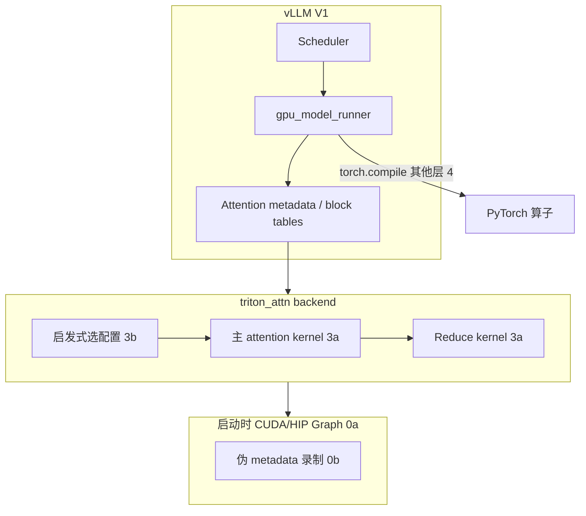

## 从日常类比开始：一家餐厅，却要为每家分店各写一本菜谱

想象你经营一家**连锁餐厅集团**（vLLM 推理服务器），核心菜品是 **Attention 炒饭**——每来一位客人（请求），厨师都要把新点的配料（Query）和仓库里所有历史配料（KV cache）对一遍，算出「该加多少料」。

过去为了快，你给 **NVIDIA 店** 雇了一支 CUDA 大厨团，写了 **7 万行** 秘方（FlashAttention-3）；又给 **AMD 店** 再雇一支 HIP 大厨团，再写几万行。两家店的菜谱**几乎不能互用**，每换一代 GPU（Hopper、Blackwell、MI300…）又要重写一轮——维护成本像雪球一样滚。

**这篇论文做的事**，相当于：只用一种**高级料理语言 Triton**（Python 写 kernel、JIT 编译到各平台），做出一份约 **800 行** 的通用菜谱，在 NVIDIA H100 上跑到 FlashAttention-3 的 **105.9%**，在 AMD MI300 上比旧实现快约 **5.8×**，并且**同一份源码**两边都能用。

更关键的是：它解剖了这份菜谱是怎么从「只有 SOTA 19.7% 性能的菜鸟配方」一路优化上来的——**Q Block、并行分块 Softmax、持久化 kernel、离线 autotune + 启发式决策树、CUDA Graph 兼容**——每一步都有工程理由，而不只是「多试几次参数」。

一句话：**用开源 DSL + 系统级集成，把「跨厂商 LLM attention」从梦想变成 vLLM 里 AMD 的默认后端。**

---

## 是什么

**The Anatomy of a Triton Attention Kernel**（Ringlein 等，IBM Research，2025 年 10 月，[arXiv:2511.11581](https://arxiv.org/abs/2511.11581)）记录如何用**纯 Triton** 实现生产级 **Paged Attention** kernel，并集成进 **vLLM** 的 `triton_attn` 后端。

| 项目 | 内容 |
|------|------|
| 作者机构 | IBM Research Zurich；与 Red Hat、AMD 协作 upstream 到 vLLM |
| 核心目标 | 跨 NVIDIA / AMD（及 Intel XPU）的**性能可移植** attention |
| 起点性能 | 朴素 Triton paged attention ≈ SOTA 的 **19.7%** |
| 终点性能 | H100 上 ≈ FlashAttention-3 的 **100.7%–105.9%**；MI300 解码约 **5.8×** |
| 代码规模 | Triton 实现约 **800 行** vs FlashAttention-3 约 **70,000 行** CUDA |
| 开源 | [ibm.biz/vllm-ibm-triton-lib](https://ibm.biz/vllm-ibm-triton-lib)；vLLM 主仓 `triton_unified_attention.py` |
| 生产地位 | **AMD ROCm 上 vLLM 默认 attention 后端**；NVIDIA 上作特性回退（ALiBi、sink token、小 head dim 等） |

与 [[paged-attention-vllm]] 的关系：PagedAttention 解决 **KV 怎么分页存**；本篇解决 **分页 KV 上的 attention 怎么算得快且可移植**。

与 [[triton-2019]] 的关系：Triton 提供 tile 抽象与 JIT；本篇是 Triton 在 **LLM 推理最热路径** 上的解剖级案例。

---

## 为什么重要

- **硬件彩票（hardware lottery）**：FlashAttention、FlashInfer 等库深度绑定 NVIDIA；换 AMD 往往要 fork + hipify 或维护第二套代码。论文论证 **开源 DSL 可以打破这种锁定**。
- **维护成本数量级差异**：7 万行 CUDA 换一个 mask 变体 vs 800 行 Triton——对 inference 框架维护者是质变。
- **性能可移植 ≠ 写一次不管**：朴素 Triton 只有 19.7% SOTA；论文价值在于**可复用的优化方法论**（见下文核心概念）。
- **与 serving 栈深度耦合**：kernel 再快，若 launch grid 随 batch 变、与 CUDA Graph 冲突，端到端仍慢——论文专章讨论 **vLLM V1 集成与 graph 录制**。
- **产业落地**：不是实验室 microbench，而是成为 **vLLM 默认路径之一**，影响真实部署成本。

---

## 核心概念

### 1. Paged Attention kernel 在算什么？

对每个 batch 中的 query token、每个 query head（GQA 下多个 Q head 可共享一个 KV head）：

1. 用 **block table** 遍历分页 KV cache 里的 K、V 块（逻辑块 → 物理块，块不必连续）
2. 算 attention score：`QK^T / sqrt(d)`，加 causal mask / sliding window 等
3. **Online（tiled）softmax**：分块算 exp 与归一化，不把完整 N×N 分数矩阵写进 HBM
4. 加权求和 V，得到输出

三维循环结构（概念上）：**batch 内 token × head × KV 页遍历**。实现上要把这个循环映射成 GPU 上的 **program instance 网格**。

### 2. 基线 kernel 的问题（19.7% 从哪来）

第一版实现沿用 vLLM 原始 paged attention 算法：

- **每个 program instance 只处理 1 个 (query token, query head) 对**
- Prefill launch grid：`tokens_in_batch × num_query_heads`
- Decode launch grid：`sequences_in_batch × num_query_heads`

Decode 时 batch 常很小（甚至 1），grid 很瘦 → **SM 大量空转**。同时 `tl.dot` 的 tile 太小，Tensor Core 吃不满。这就是「能跑但远慢于 FlashAttention」的根本原因。

### 3. Q Block：把「小活」拼成「大矩阵乘」

**Q Block** 把多个 query token + 共享同一 KV head 的多个 query head **打平成一个 `BLOCK_M × HEAD_SIZE` 的二维块**，一次 `tl.dot` 干更多活：

- Prefill：连续多个 prompt token 可复用同一段 K/V
- GQA：同一 KV head 只加载一次，多个 Q head 一起算

Launch grid 改为大致 **`batch × num_kv_heads`**（每个 instance 处理若干 Q Block）。这是论文里**第一条大幅提速**的杠杆——让 attention 的核心计算更像「胖 GEMM」。

### 4. Parallel Tiled Softmax（3D kernel）

Decode 时 query 长度常为 1，Q Block 帮不上忙。论文引入 **并行分块 softmax**：

- 把沿 KV 序列方向的 tile 切成多 **segment**
- 多个 program instance **并行**处理不同 segment，各算局部 softmax 统计量（max、sum、部分输出）
- 再 launch **第二个 reduce kernel** 合并（Triton 无全局 barrier，不能在一个 kernel 里安全做完）

适用启发式：**小 batch + 长 context** 的 decode。Prefill 本身并行度够，不必走这条路。

### 5. 可调 KV tile 与 BLOCK_SIZE 解耦

vLLM 里 **page block size**（一页多少 token）是内存管理参数；**softmax 计算 tile** 是性能参数——二者不必相等。解耦后可为 prefill/decode、不同 GPU 选不同 tile；也支持 Mamba+Transformer 混合模型里**非 2 幂次**的大 block 对齐。

### 6. Static / Persistent Launch Grid + CUDA Graph

vLLM V1 常在启动时 **录制 CUDA/HIP Graph** 以降低 launch 开销。若 attention 的 grid 随 `batch_size`、`seq_len` 变化：

- Graph 录制的是**固定拓扑**；replay 时即使实际 token 变少，仍可能按录制时的「大 grid」空跑 → **假并行、真浪费**（第二波 wave 占满 SM 却在干空转）

**Persistent kernel** 思路：launch **固定数量** instance（≈ SM 数量），每个 instance 从 GPU 上的 **metadata** 动态认领 Q Block / segment，干完再取下一批。Grid 恒定 → **Full CUDA Graph** 可复用。

### 7. Autotune 的悖论与「启发式决策树」

Triton `@triton.autotune` 能在多种 `BLOCK_M`、`BLOCK_Q`、`num_warps` 等配置里选最快，但：

- 全量 tune 一次 attention 可能要 **24 小时/GPU 型号**
- vLLM 启动时 tune 会拖慢服务就绪
- CUDA Graph replay 时**无法再查 autotune 缓存**

论文方案（两阶段）：

1. **离线 microbenchmark**：在 vLLM 外对 kernel 压测 prefill/decode/mixed、不同 batch 与 context
2. 把 tune 结果压缩成 **if-else 决策树启发式**（按 GPU 型号、phase、seq len 区间选配置），打包进 backend——运行时 **零 tune 开销**，且能覆盖未见过的长度（比精确 cache key 泛化更好）

### 8. 三 kernel 分工（triton_attn backend）

典型实现拆成：

- **主 attention kernel**（含 Q Block / parallel softmax 逻辑）
- **Reduce kernel**（并行 softmax 的合并）
- 以及 metadata 准备、与 vLLM scheduler / `gpu_model_runner` 的衔接

Backend 层还负责：何时选 2D vs 3D kernel、是否走 persistent path、FP8 KV 等特性开关。

---

## 性能旅程（论文数字）

| 阶段 | 相对 SOTA | 关键改动 |
|------|-----------|----------|
| 基线 Triton paged attn | **19.7%** | 1 token × 1 head / instance |
| + Q Block + GQA | 大幅提升 | 胖 `tl.dot`、KV 复用 |
| + Parallel tiled softmax | decode 长上下文 | 3D 并行 + reduce |
| + 解耦 tile / autotune 启发式 | 接近平台最优 | 离线 benchmark → 决策树 |
| + Persistent grid + graph 集成 | **~105.9%** (H100) | 端到端 latency 对齐 FA3 |

注：不同论文版本写 100.7% 或 105.9%，差异来自 benchmark 设定（如 Llama 3.1 8B、batch=1、input=500、变 output len）；核心是 **同一 Triton 源码跨 H100 与 MI300 都达 SOTA 量级**。

---

## 代码示例

### 示例 1：最小 Triton 向量加（理解 program instance 与 tile）

论文 §2.2 用向量加说明 Triton 编程模型——**没有 threadIdx，只有 `program_id` + `tl.arange` 构成的 tile**：

```python
import triton
import triton.language as tl

@triton.jit
def vector_add_kernel(x_ptr, y_ptr, output_ptr, n_elements, BLOCK_SIZE: tl.constexpr):
    # 当前 program instance 负责第 pid 块
    pid = tl.program_id(axis=0)
    block_start = pid * BLOCK_SIZE
    offsets = block_start + tl.arange(0, BLOCK_SIZE)
    mask = offsets < n_elements

    x = tl.load(x_ptr + offsets, mask=mask)
    y = tl.load(y_ptr + offsets, mask=mask)
    tl.store(output_ptr + offsets, x + y, mask=mask)
```

Paged attention kernel 复杂得多，但同一套抽象：`program_id` 决定「我负责哪块 Q / 哪个 KV head」，`tl.load`/`tl.dot` 在 tile 上操作，边界用 `mask` 处理。

### 示例 2：Q Block 形状的简化伪代码

下面不是 vLLM 生产源码，而是把论文 §4.4 的 **Q Block** 思想压成可读骨架（省略 page table、mask、online softmax 细节）：

```python
import triton
import triton.language as tl

@triton.jit
def paged_attn_qblock_skeleton(
    Q_ptr, K_cache_ptr, V_cache_ptr, Out_ptr,
    block_tables_ptr, context_lens_ptr,
    stride_qm, stride_qh, stride_kp, stride_vp,
    num_kv_heads, HEAD_SIZE: tl.constexpr,
    BLOCK_M: tl.constexpr,   # Q Block 行数 = BLOCK_Q * (Q_heads_per_KV_head)
    BLOCK_N: tl.constexpr,   # KV 方向 tile（可与 page size 解耦）
    BLOCK_Q: tl.constexpr,
):
    # grid: (batch_size, num_kv_heads) — 每个 instance 处理一个 KV head 上的若干 Q
    batch_id = tl.program_id(0)
    kv_head_id = tl.program_id(1)

    # 从 block table 遍历 context；对 Q Block 内 BLOCK_M 行一起算 QK^T
    q_block_start = 0  # 实际由 metadata 映射到 token / head 范围
    q_offs = q_block_start + tl.arange(0, BLOCK_M)
    q_mask = q_offs < context_lens_ptr[batch_id]  # 简化

    # Q: [BLOCK_M, HEAD_SIZE]  —  多 token、多 Q head 打平
    q = tl.load(
        Q_ptr + batch_id * stride_qm + q_offs[:, None] * stride_qh
        + tl.arange(0, HEAD_SIZE)[None, :],
        mask=q_mask[:, None],
        other=0.0,
    )

    acc = tl.zeros([BLOCK_M, HEAD_SIZE], dtype=tl.float32)
    m_i = tl.full([BLOCK_M], -float("inf"), dtype=tl.float32)
    l_i = tl.zeros([BLOCK_M], dtype=tl.float32)

    # 沿 KV 序列分 tile（内层循环遍历 paged blocks）
    for kv_tile in range(0, context_lens_ptr[batch_id], BLOCK_N):
        k = tl.load(...)  # 从 paged K cache 按 block_tables  gather
        v = tl.load(...)

        scores = tl.dot(q, tl.trans(k)) * (HEAD_SIZE ** -0.5)

        # online softmax 更新 m_i, l_i, acc（FlashAttention 同款）
        m_ij = tl.maximum(m_i, tl.max(scores, axis=1))
        p = tl.exp(scores - m_ij[:, None])
        l_ij = tl.sum(p, axis=1)
        alpha = tl.exp(m_i - m_ij)
        acc = acc * alpha[:, None] + tl.dot(p.to(v.dtype), v)
        l_i = l_i * alpha + l_ij
        m_i = m_ij

    out = acc / l_i[:, None]
    tl.store(Out_ptr + ..., out, mask=q_mask[:, None])
```

读这段时抓住三点：**(1)** `BLOCK_M` 把多个 Q 捆在一起；**(2)** `kv_head_id` 在 grid 上而不是每个 Q head 一个 instance；**(3)** 内层 `kv_tile` 循环里 fused softmax，避免物化完整 attention 矩阵。

### 示例 3：离线 tune → 运行时启发式（概念）

论文 Listing 7 风格：把 microbenchmark 结果变成 **决策树**，避免 graph replay 时调用 autotuner：

```python
def pick_triton_attn_config(
    gpu_name: str,
    phase: str,          # "prefill" | "decode"
    batch_size: int,
    max_context_len: int,
) -> dict:
    """运行时 O(1) 选 kernel 配置，替代 @triton.autotune 动态查表。"""
    if "MI300" in gpu_name and phase == "decode":
        if batch_size <= 4 and max_context_len > 8192:
            return {"use_parallel_softmax": True, "BLOCK_M": 64, "BLOCK_N": 64}
        return {"use_parallel_softmax": False, "BLOCK_M": 32, "BLOCK_N": 32}

    if "H100" in gpu_name and phase == "prefill":
        return {"BLOCK_M": 128, "BLOCK_Q": 8, "num_warps": 8}

    return {"BLOCK_M": 64, "BLOCK_Q": 4, "num_warps": 4}
```

生产代码在 `vllm/v1/attention/backends/triton_attn.py` 一类模块里会更细，但逻辑一致：**把 24 小时 tune 压缩成启动时可嵌入的启发式**。

---

## 与 vLLM 系统栈的衔接



关键张力：**Graph 要静态，workload 要动态**。Persistent kernel + 固定 grid + GPU 侧 metadata 是论文在系统层给出的答案。

---

## 何时用 Triton Attention Backend？

| 场景 | 倾向 |
|------|------|
| AMD ROCm 部署 | **默认**，无需 FlashAttention |
| NVIDIA Hopper+ | 通常 FlashAttention-3 / FlashInfer；Triton 作 **fallback** |
| NVIDIA pre-Hopper（A100）+ ALiBi / sink token | Triton 特性覆盖更好 |
| Intel XPU、FP32 attention | FA 不支持时的回退 |
| 需要**单源码**跨厂商 CI | Triton backend 降低 fork 维护 |

---

## 局限与未解问题

- **双 kernel reduce**：Parallel softmax 引入第二次 launch，短序列可能得不偿失——靠启发式切换。
- **启发式非最优**：决策树是 tune 结果的压缩，新模型结构 / 新 GPU 仍需重新跑 microbenchmark 流水线。
- **与专用库的功能差距**：FP8、复杂 mask、最新 MLA 等，专用库往往仍先行；Triton backend 在持续追赶。
- **编译器/backend 差异**：同一 Triton 源码在 AMD 上曾需编译器 pass 优化（消除冗余 matmul、layout 转换等），见 Triton 社区 RFC——**可移植不等于零后端工作**。
- **Helion 等更高层 DSL**：PyTorch 团队在探索比 Triton 更抽象的 tiled Python，可能进一步降低 800 行里的样板代码。

---

## 与相关笔记的阅读顺序

1. [[triton-2019]] — tile 编程模型与 `@triton.autotune` 从哪来  
2. [[paged-attention-vllm]] — block table 与 KV 分页内存管理  
3. [[flashattention-2]] — online softmax 与并行划分（CUDA 手工版）  
4. 本文 — 如何把分页 KV + Triton + serving 集成推到 SOTA  
5. vLLM 官方博文：[Triton Attention Backend Deep Dive](https://vllm.ai/blog/2026-03-04-vllm-triton-backend-deep-dive)

---

## 自测题

1. 为什么 decode 阶段基线 kernel 只有 `batch × heads` 个 instance 会慢？  
2. Q Block 如何解决 GQA 下的 KV 重复加载？  
3. Parallel tiled softmax 为什么需要第二个 kernel？  
4. CUDA Graph 与动态 launch grid 冲突时，persistent kernel 如何缓解？  
5. 为何论文选择「离线 autotune + 启发式」而不是运行时 `@triton.autotune`？

<details>
<summary>参考答案</summary>

1. Decode 的 query 长度常为 1，grid 维度小，SM occupancy 低，且每个 instance 的 `tl.dot` 太小。  
2. 同一 KV head 的多个 Q head 被打进同一 Q Block，K/V 只加载一次，多个 Q 共享。  
3. Triton 无全局 barrier，segment 并行后的 partial softmax 统计量必须在另一 kernel 里归约合并。  
4. 固定 launch instance 数，每个 instance 从 metadata 动态领任务，graph replay 时 grid 不变、无空 wave。  
5. 避免 vLLM 启动 tune 延迟、24h 级 CI 成本，且 graph replay 路径无法每次查 autotune cache；决策树可泛化到未见长度。

</details>

---

## 参考资料

- 论文：[arXiv:2511.11581](https://arxiv.org/abs/2511.11581)（HTML 版便于跳转附录 Listing）  
- vLLM 内核源码：[triton_unified_attention.py](https://github.com/vllm-project/vllm/blob/main/vllm/v1/attention/ops/triton_unified_attention.py)  
- IBM microbenchmark / tune 工具：[vllm-ibm-triton-lib](https://ibm.biz/vllm-ibm-triton-lib)  
- 姊妹工作：*GPU Performance Portability needs Autotuning*（同作者组，解释启发式 tune 方法论）  
- PyTorch AMD 部署博文：[Enabling vLLM V1 on AMD GPUs with Triton](https://pytorch.org/blog/enabling-vllm-v1-on-amd-gpus-with-triton/)
