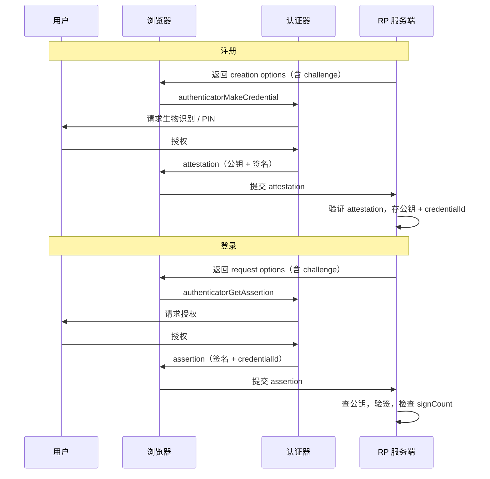

## 是什么

**Web Authentication Level 2**（简称 WebAuthn）是 W3C 2021 年发布的推荐标准，定义了一套浏览器 API，让网站能用**公钥密码学**完成注册与登录，而不必把密码存在服务器上。它是 FIDO2 协议在 Web 端的落地规范；Apple / Google / Microsoft 推广的 **Passkey（通行密钥）** 就建在这套 API 之上。

日常类比：传统密码登录像「你把家门钥匙的复印件交给物业，物业把复印件锁进档案柜」——物业一旦被偷，所有住户都危险。WebAuthn 则像「银行保险箱」：

- **注册**：你在银行（Authenticator，认证器）开一个箱子，银行给你一把**只能开这个箱子的私钥**，把**公钥**复印件交给网站（Relying Party，依赖方）。
- **登录**：网站每次发一张**一次性挑战纸条**（challenge），你必须带着私钥到场签名，银行确认是你本人（指纹 / PIN）后才签。网站用存档的公钥验签——**私钥从不离开你的设备**。

浏览器（User Agent）站在中间：它帮网站找到认证器、传递挑战、保护隐私，确保 `github.com` 的凭证不会被 `evil.com` 冒用。

## 为什么重要

不理解 WebAuthn，下面这些事都讲不清：

- 为什么 iPhone / Android 能「扫脸就登录 GitHub」——平台认证器把私钥锁在 Secure Enclave / TEE 里
- 为什么 Passkey 可以跨设备同步，却仍能抵抗钓鱼——`rpId` 把凭证绑定到具体域名，假网站拿不到合法签名
- 为什么安全密钥（YubiKey）能当第二因素，也能单独当第一因素——同一套 API，不同 `authenticatorAttachment`
- 为什么服务端「验签」比「比对密码哈希」复杂——要处理 CBOR、attestation、签名计数器、challenge 时效
- 为什么 Level 2 比 Level 1 多了 resident key、扩展、企业证明等能力——Passkey 时代的基础设施

WebAuthn 把「强认证」从原生 App 专属能力，变成了**任何 HTTPS 网站都能调用的标准 JavaScript API**。

## 核心概念

### 三方角色

| 角色 | 是谁 | 做什么 |
|------|------|--------|
| **Relying Party (RP)** | 你的网站后端 + 前端 | 发起注册/登录，验证签名，存公钥 |
| **User Agent** | Chrome / Safari / Firefox | 调用 `navigator.credentials`，强制执行同源策略 |
| **Authenticator** | 安全密钥、Touch ID、Windows Hello | 生成密钥对、要求用户手势、返回签名 |

### 两条主路径

1. **注册（Registration）**：`navigator.credentials.create({ publicKey })` → 认证器生成新密钥对 → 返回 **attestation object**（含公钥 + 设备证明）
2. **认证（Authentication）**：`navigator.credentials.get({ publicKey })` → 认证器用已有私钥签名 challenge → 返回 **assertion**

### 关键数据结构

- **challenge**：服务端生成的随机数（通常 ≥16 字节），防重放；必须一次性使用、短期有效
- **rpId**：依赖方标识，一般是域名（如 `example.com`），写进签名里，防钓鱼
- **credentialId**：认证器生成的 opaque ID，服务端用来查「这是哪把钥匙」
- **userHandle**：服务端给用户的稳定 ID（不必是邮箱），存在 resident credential 里供无用户名登录
- **attestation**：注册时认证器证明自己「是什么设备」（厂商、型号、是否带 UV）
- **signature counter**：每次签名递增，服务端检测克隆密钥

### 凭证类型（Level 2 重点）

- **Non-discoverable（服务端凭证）**：credentialId 存在服务端，登录时要带 `allowCredentials` 列表
- **Discoverable / Resident（客户端可发现凭证）**：私钥和 userHandle 存在认证器本地，登录时用户直接选账号——**Passkey 默认走这条路**

`authenticatorSelection.residentKey` 控制是否要求可发现凭证：`"discouraged"` | `"preferred"` | `"required"`。

### userVerification

| 值 | 含义 |
|----|------|
| `"required"` | 必须 PIN / 生物识别 |
| `"preferred"` | 有则用，默认 |
| `"discouraged"` | 不要求（如仅作第二因素） |

### 安全边界（规范反复强调）

- 私钥**永不导出**；浏览器只看到签名结果
- 每次操作必须**用户同意**（触摸密钥、扫脸等）
- 签名覆盖 **origin + rpId + challenge**，换域名即失效
- RP 之间**互不可见**——GitHub 无法探测你在 Google 有没有 Passkey

## 端到端流程



## 代码示例

### 示例 1：前端注册（`create`）

下列代码摘自规范 §1.3.1，展示 RP 如何请求 ES256 或 RS256 凭证，并排除已注册设备：

```javascript
if (!window.PublicKeyCredential) {
  throw new Error('浏览器不支持 WebAuthn');
}

// challenge / user.id 应由服务端生成并下发，不能在前端硬编码
const creationOptions = {
  challenge: Uint8Array.from(atob(serverChallengeB64), c => c.charCodeAt(0)),
  rp: { name: 'ACME Corporation', id: 'acme.example.com' },
  user: {
    id: Uint8Array.from(atob(serverUserIdB64), c => c.charCodeAt(0)),
    name: 'alex.mueller@example.com',
    displayName: 'Alex Müller',
  },
  pubKeyCredParams: [
    { type: 'public-key', alg: -7 },   // ES256
    { type: 'public-key', alg: -257 }, // RS256
  ],
  authenticatorSelection: {
    residentKey: 'required',       // Passkey：可发现凭证
    userVerification: 'preferred',
    authenticatorAttachment: 'platform', // 平台内置（Face ID 等）
  },
  timeout: 60_000,
  excludeCredentials: existingCredentialIds.map(id => ({
    type: 'public-key',
    id: Uint8Array.from(atob(id), c => c.charCodeAt(0)),
  })),
};

const credential = await navigator.credentials.create({ publicKey: creationOptions });

// 发给服务端：credential.id, rawId, type, response.attestationObject, response.clientDataJSON
await fetch('/webauthn/register/verify', {
  method: 'POST',
  headers: { 'Content-Type': 'application/json' },
  body: JSON.stringify({
    id: credential.id,
    rawId: bufferToBase64url(credential.rawId),
    type: credential.type,
    response: {
      attestationObject: bufferToBase64url(credential.response.attestationObject),
      clientDataJSON: bufferToBase64url(credential.response.clientDataJSON),
    },
  }),
});
```

### 示例 2：前端登录（`get`）+ 可发现凭证

无用户名登录时，不传 `allowCredentials`，认证器展示本地保存的 Passkey 列表：

```javascript
const authOptions = {
  challenge: Uint8Array.from(atob(serverChallengeB64), c => c.charCodeAt(0)),
  rpId: 'acme.example.com',
  timeout: 120_000,
  userVerification: 'required',
  // 不传 allowCredentials → 使用 discoverable / resident credentials
};

const assertion = await navigator.credentials.get({ publicKey: authOptions });

await fetch('/webauthn/login/verify', {
  method: 'POST',
  headers: { 'Content-Type': 'application/json' },
  body: JSON.stringify({
    id: assertion.id,
    rawId: bufferToBase64url(assertion.rawId),
    type: assertion.type,
    response: {
      authenticatorData: bufferToBase64url(assertion.response.authenticatorData),
      clientDataJSON: bufferToBase64url(assertion.response.clientDataJSON),
      signature: bufferToBase64url(assertion.response.signature),
      userHandle: assertion.response.userHandle
        ? bufferToBase64url(assertion.response.userHandle)
        : null,
    },
  }),
});

function bufferToBase64url(buf) {
  return btoa(String.fromCharCode(...new Uint8Array(buf)))
    .replace(/\+/g, '-').replace(/\//g, '_').replace(/=+$/, '');
}
```

### 示例 3：服务端验证（Node.js 思路）

规范把密码学验证放在 RP 服务端；实践中常用 [@simplewebauthn/server](https://simplewebauthn.dev/) 等库。核心步骤与规范 §7 一致：

```javascript
import {
  generateRegistrationOptions,
  verifyRegistrationResponse,
  generateAuthenticationOptions,
  verifyAuthenticationResponse,
} from '@simplewebauthn/server';

const rpID = 'acme.example.com';
const origin = 'https://acme.example.com';

// --- 注册：第一步，下发 options ---
app.get('/webauthn/register/options', async (req, res) => {
  const options = await generateRegistrationOptions({
    rpName: 'ACME Corporation',
    rpID,
    userID: req.session.userId,
    userName: req.session.email,
    attestationType: 'none', // 多数网站不校验设备厂商证明
    authenticatorSelection: {
      residentKey: 'required',
      userVerification: 'preferred',
    },
  });
  req.session.currentChallenge = options.challenge;
  res.json(options);
});

// --- 注册：第二步，验证 attestation ---
app.post('/webauthn/register/verify', async (req, res) => {
  const verification = await verifyRegistrationResponse({
    response: req.body,
    expectedChallenge: req.session.currentChallenge,
    expectedOrigin: origin,
    expectedRPID: rpID,
  });
  if (!verification.verified) return res.status(400).send('注册验证失败');

  const { credentialPublicKey, credentialID, counter } = verification.registrationInfo;
  await db.saveCredential({
    userId: req.session.userId,
    credentialId: credentialID,
    publicKey: credentialPublicKey,
    signCount: counter,
  });
  res.json({ verified: true });
});

// --- 登录：验证 assertion ---
app.post('/webauthn/login/verify', async (req, res) => {
  const cred = await db.findByCredentialId(req.body.rawId);
  const verification = await verifyAuthenticationResponse({
    response: req.body,
    expectedChallenge: req.session.currentChallenge,
    expectedOrigin: origin,
    expectedRPID: rpID,
    authenticator: {
      credentialID: cred.credentialId,
      credentialPublicKey: cred.publicKey,
      counter: cred.signCount,
    },
  });
  if (!verification.verified) return res.status(401).send('登录验证失败');

  await db.updateSignCount(cred.id, verification.authenticationInfo.newCounter);
  req.session.userId = cred.userId;
  res.json({ verified: true });
});
```

### 示例 4：能力检测与中止长时间操作

Level 2 引入 `PublicKeyCredential.isUserVerifyingPlatformAuthenticatorAvailable()`，以及用 `AbortSignal` 取消挂起的认证：

```javascript
// 检测是否可用平台 Passkey（Touch ID / Windows Hello）
const uvpa = await PublicKeyCredential.isUserVerifyingPlatformAuthenticatorAvailable();

const controller = new AbortController();
const timer = setTimeout(() => controller.abort(), 60_000);

try {
  const cred = await navigator.credentials.create({
    publicKey: creationOptions,
    signal: controller.signal,
  });
  clearTimeout(timer);
} catch (err) {
  if (err.name === 'AbortError') {
    console.log('用户超时或主动取消');
  }
}
```

## Level 2 相对 Level 1 的增量

| 能力 | 说明 |
|------|------|
| **Resident / discoverable keys** | 支撑无密码用户名登录（Passkey 核心） |
| **Credential Properties 扩展** | 注册后可查询 `rk`（是否 resident）等属性 |
| **AppID Exclude 扩展** | 与旧 U2F `appid` 凭证去重，平滑迁移 |
| **Enterprise attestation** | 企业可要求设备合规证明（MDM 场景） |
| **AbortSignal** | 可取消进行中的 create/get |
| **更完整的 UV 平台检测 API** | 引导用户走生物识别注册流程 |

Level 3 草案已在推进（如 `prf` 扩展、联合凭证等），但截至 2026 年，**生产环境仍以 Level 2 为事实标准**。

## 与相邻技术的关系

```
密码 / OAuth          →  「你知道什么」或「第三方担保」
TOTP / SMS OTP        →  「你暂时持有的码」，可被钓鱼 + 重放
WebAuthn / FIDO2      →  「你持有的设备 + 你的生物特征」，挑战-响应、域名绑定
```

- **CTAP2**：浏览器与认证器之间的有线/无线协议（USB / NFC / BLE），WebAuthn 是它的 Web 绑定层
- **FIDO U2F**：上一代标准，Level 2 通过 `appid` / `appidExclude` 保持向后兼容
- **Credential Management API**：WebAuthn 扩展了 `navigator.credentials`，新增 `PublicKeyCredential` 类型

## 常见坑与最佳实践

1. **challenge 必须服务端随机生成**，存 session / Redis，验证后立即作废；不要用固定值或前端生成
2. **rpId 必须是有效域后缀**：页面在 `auth.example.com` 时，rpId 可以是 `example.com`，但不能写成 `other.com`
3. **生产环境务必 HTTPS**；`localhost` 例外仅用于开发
4. **attestation 策略**：消费级网站通常设 `attestation: 'none'`，减少隐私指纹；金融 / 企业场景才强制 `direct` / `enterprise`
5. **检查 signature counter**：若新签名计数不大于数据库记录，可能密钥被克隆
6. **跨设备 Passkey**：依赖平台云同步（Apple iCloud Keychain、Google Password Manager）；自建 RP 要设计「多凭证 per 用户」
7. **权限策略**：iframe 内嵌需 `Permissions-Policy: publickey-credentials-create=(self)` 等，防止恶意嵌套页调起认证

## 动手检验

1. 打开 [webauthn.io](https://webauthn.io/) 或 Chrome DevTools → **Application → WebAuthn**，模拟注册/登录
2. 本地起一个简单的 Express + `@simplewebauthn/server` demo，用 Chrome `localhost` 走通 create → verify → get → verify
3. 读规范 §1.3 四个示例流程图，对照自己项目的时序是否缺了「challenge 下发」或「验签」步骤
4. 用 `security key` 实物（YubiKey）注册后，故意在错误 `rpId` 的子域测试，确认断言失败

## 小结

WebAuthn Level 2 做了一件看似简单、影响深远的事：**把 FIDO 的强认证协议，翻译成两个浏览器方法**——`credentials.create` 和 `credentials.get`。网站不再存储可被拖库的密码，而是存储公钥；每次登录都是一次性的挑战-响应签名。理解 RP / Authenticator / challenge / rpId / resident key 这条主线，就能读懂 Passkey 产品叙事背后的协议层，也能在安全审计时判断实现是否「验了该验的东西」。

## 延伸阅读

- 规范正文：[Web Authentication Level 2](https://www.w3.org/TR/webauthn-2/)
- MDN API 参考：[Web Authentication API](https://developer.mozilla.org/en-US/docs/Web/API/Web_Authentication_API)
- FIDO CTAP2：[Client to Authenticator Protocol](https://fidoalliance.org/specifications/download/)
- 本库相关笔记：[[rsa]]（公钥密码基础）、[[sgx-2013]]（可信执行环境，与平台认证器存储类比）
