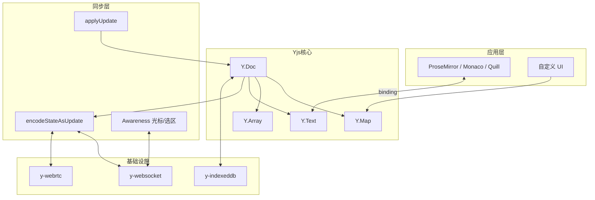

## 日常类比：魔法白板，而不是抢粉笔

你和同事改同一份策划案。最土的做法是**抢锁**：谁拿到 Word 独占编辑权谁改，别人只能看只读——像会议室里只有一支马克笔。

**Git** 像**轮流誊抄**：你改完 commit、对方 pull 再改，冲突时弹窗「保留你的还是他的」。适合代码，不适合两个人同时敲同一段文案。

**Google Docs / Figma / Notion** 像**一块魔法白板**：你插一个字、对方删一行、第三个人改标题颜色，最后板上自动变成**大家都认得的合理结果**，不用弹冲突对话框。背后要么是 **OT（操作变换）**，要么是 **CRDT（无冲突可复制数据类型）**。

**Yjs** 就是给开发者用的「魔法白板引擎」：它把 CRDT 的数学保证藏在 `Map`、`Array`、富文本等**长得像普通 JS 对象**的 API 后面。你只管 `ymap.set('title', 'Hello')`，库负责在 Wi-Fi 抖动、断网重连、乱序收包时把多份副本**自动合并成同一份**。

官方定位见 [Yjs 文档](https://docs.yjs.dev/)：*high-performance CRDT for building collaborative applications that sync automatically*。它和 [[crdt-json]] 同属 CRDT 家族，但 Yjs 是**可直接 npm install 的生产级库**，而不是论文里的抽象定义；和 [[eg-walker-collab-text-2024]]、[[zed-editor-collaborative]] 对比时，Yjs 走「CRDT 常驻内存、增量 update 同步」的主流路线。

## 是什么

**Yjs**（读作 "wise"）是 Kevin Jahns（[@dmonad](https://github.com/dmonad)）维护的 **JavaScript CRDT 实现**，核心能力：

1. **共享类型（Shared Types）**：`Y.Map`、`Y.Array`、`Y.Text` 等，API 接近原生 JS 集合，但任意副本并发修改后**必然收敛**。
2. **文档（Y.Doc）**：所有共享类型的容器；一次 `transact` 里的改动打包成一个**原子 update**。
3. **二进制增量（Update）**：`Y.encodeStateAsUpdate` / `Y.applyUpdate` 只传差量，适合 WebSocket、WebRTC、IndexedDB。
4. **网络无关**：不绑定中心服务器；只要 update 最终都到达，**到达顺序不影响最终结果**。
5. **生态**：`y-prosemirror`、`y-codemirror`、`y-monaco`、`y-websocket`、`y-indexeddb` 等，把「协同」接到编辑器与传输层。

一句话：**Yjs = CRDT 数学 + 好用的 JS 数据结构 + 可插拔的网络/持久化适配器**。

## 为什么重要

不懂 Yjs，下面问题很难答清：

1. **为什么两小时能做出「迷你 Google Docs」？** —— 共享状态与冲突合并在库里完成，你只接编辑器 binding + provider。
2. **为什么可以 P2P、离线、local-first？** —— CRDT 不依赖中心仲裁；`y-webrtc` + `y-indexeddb` 即可断网编辑、上线合并。
3. **Yjs 和 Automerge 有何不同？** —— 都基于 CRDT；Yjs 更偏**实时协同编辑**（二进制 update、编辑器集成极多），Automerge 更偏**通用 JSON 文档 + 长历史**。
4. **和 OT（如 ShareJS）比？** —— OT 常要中心服务器做变换；Yjs 副本可对等合并，后端可水平扩展（如 y-redis 分片）。

## 架构全景



## 核心概念

### 1. Y.Doc — 文档根

`new Y.Doc()` 创建一个**逻辑文档**。文档内有 client ID、时钟向量（state vector），用于判断「对方比我多知道哪些 update」。同一业务文档在所有参与者之间应共享**同一个 room / doc name**（由 provider 约定），但每个浏览器里是**独立的 Y.Doc 实例**，靠 apply update 保持一致。

### 2. Shared Types — 会自己合并的数据结构

| 类型 | 用途 | 合并直觉 |
|------|------|----------|
| `Y.Map` | 键值、元数据、JSON 形结构 | 不同 key 并发写都保留；同一 key 并发写由 CRDT 规则决出胜者（常表现为「后写入者」在语义上占优） |
| `Y.Array` | 有序列表、Todo、幻灯片页序 | 并发插入用内部 ID 排序，不靠整数下标硬抢 |
| `Y.Text` | 纯文本 / 富文本（Delta 属性） | 协同编辑正文字段；与 Quill Delta、ProseMirror 步骤对接 |
| `Y.XmlElement` 等 | 结构化富文本树 | 复杂 WYSIWYG |

嵌套规则：一个 shared type 在**同一文档里只能挂一处**；要把子结构塞进 `Y.Map`，用 `ymap.set('notes', yarray)` 这类方式。

### 3. Transaction — 批量、可监听的原子操作

所有修改应包在 `ydoc.transact(() => { ... })` 里（单条 `set` 也会隐式开事务）。好处：

- 观察者（`observe` / `observeDeep`）**每事务触发一次**，不会每个字符回调一次拖垮 UI。
- 网络层**一个事务对应一个 update 包**，省带宽。

### 4. Update 与 State Vector — 增量同步的货币

- `Y.encodeStateAsUpdate(ydoc)`：把文档状态编码成 `Uint8Array`。
- `Y.encodeStateAsUpdate(ydoc, stateVector)`：只编码「对方还没有」的部分——**同步的核心**。
- `Y.applyUpdate(ydoc, update)`：把远端差量合并进来；**幂等且可交换**，乱序到达也能收敛。

类比：不是每次全量复印白板，而是只邮寄「自上次以来新贴上的便利贴」。

### 5. Awareness — 谁在线、光标在哪

Yjs 核心只管**文档数据**；**临时态**（用户名、光标颜色、选区）走 `awareness` 协议（`y-protocols`）。这类状态**不进 CRDT**，断线就丢，减轻持久化负担。

### 6. Provider 模式 — 网络和持久化解耦

官方文档强调：**Yjs 不对传输做假设**。常见组合：

- **y-websocket** + 自建 Node 房间服务
- **y-webrtc** — 无中心服务器 P2P
- **y-indexeddb** — 本地持久化 update 日志，刷新页面可恢复

换 provider 通常**不用改** CRDT 业务逻辑——这是「网络无关」的实际含义。

## 代码示例 1：离线合并两个「用户」的 Y.Map

下面复现 [官方 Quick Start](https://docs.yjs.dev/)：两个独立 `Y.Doc` 各改不同 key，再 encode/apply 合并。

```javascript
import * as Y from 'yjs'

// 用户 A 的副本
const ydocA = new Y.Doc()
const ymapA = ydocA.getMap('metadata')
ymapA.set('keyA', 'valueA')

// 用户 B 的副本（另一台机器、另一个浏览器 tab 都行）
const ydocB = new Y.Doc()
const ymapB = ydocB.getMap('metadata')
ymapB.set('keyB', 'valueB')

// 把 B 的「全部状态」当作 update 合并进 A
const updateFromB = Y.encodeStateAsUpdate(ydocB)
Y.applyUpdate(ydocA, updateFromB)

// A 现在同时拥有两边的 key
console.log(ymapA.toJSON())
// => { keyA: 'valueA', keyB: 'valueB' }

// 反向再同步一次，两边就完全一致
const updateFromA = Y.encodeStateAsUpdate(ydocA)
Y.applyUpdate(ydocB, updateFromA)
console.log(ymapB.toJSON())
// => { keyA: 'valueA', keyB: 'valueB' }
```

要点：**没有 `if (conflict) alert()`**；合并是库的内置代数运算。真实系统里不会每次都 `encodeStateAsUpdate` 全量，而是用 **state vector** 只传差量。

## 代码示例 2：协同富文本 + 监听变更

`Y.Text` 是搭建记事本、评论线程的基础；常与 `y-prosemirror` 或 Quill binding 配合。下面演示纯 Yjs API：两人并发插入，观察合并结果与事件。

```javascript
import * as Y from 'yjs'

const docLocal = new Y.Doc()
const docRemote = new Y.Doc()

const textLocal = docLocal.getText('content')
const textRemote = docRemote.getText('content')

// 监听本地文档正文的每一次事务级变更
textLocal.observe(event => {
  console.log('local text now:', textLocal.toString())
  // event.changes 可算出 Quill 风格的 Delta diff
})

docLocal.transact(() => {
  textLocal.insert(0, 'Hello ')
})
docRemote.transact(() => {
  textRemote.insert(0, 'World')
})

// 双向同步
Y.applyUpdate(docLocal, Y.encodeStateAsUpdate(docRemote))
Y.applyUpdate(docRemote, Y.encodeStateAsUpdate(docLocal))

console.log(textLocal.toString())  // 并发插入的相对顺序由 CRDT 内部 ID 决定
console.log(textRemote.toString()) // 两边字符串最终一致
```

富文本格式（粗体、链接）用 `insert` 的第三个参数或 `format` / `applyDelta` 完成，与 [Y.Text API](https://docs.yjs.dev/api/shared-types/y.text) 一致。接上编辑器时，binding 负责把 ProseMirror transaction 翻译成对 `Y.Text` 的调用。

## 代码示例 3：接入 WebSocket 房间（概念骨架）

生产环境应使用官方 `y-websocket` 包；逻辑永远是「本地 transact → provider 广播 update → 远端 applyUpdate」。

```javascript
import * as Y from 'yjs'
import { WebsocketProvider } from 'y-websocket'

const ydoc = new Y.Doc()
const provider = new WebsocketProvider(
  'wss://your-signaling-server.example',
  'my-room-name',   // 同一房间共享同一逻辑文档
  ydoc
)

const ytext = ydoc.getText('shared-notes')

provider.on('status', ({ status }) => {
  console.log('connection:', status) // 'connected' | 'disconnected'
})

// 本地编辑
ydoc.transact(() => {
  ytext.insert(ytext.length, '\n新的一行')
})

// Awareness：显示协作者光标（可选）
const awareness = provider.awareness
awareness.setLocalStateField('user', { name: 'Alice', color: '#ff6b6b' })
awareness.on('change', () => {
  console.log('在线协作者:', Array.from(awareness.getStates().values()))
})
```

服务器只做**消息扇出**与可选持久化，**不做 OT 变换**——这是 Yjs 架构与经典 ShareJS 路线的关键差异。

## Y.Array 补充：有序列表

任务看板、幻灯片顺序常用 `Y.Array`：

```javascript
const ydoc = new Y.Doc()
const todos = ydoc.getArray('todos')

ydoc.transact(() => {
  todos.insert(0, ['买牛奶', '写 Yjs 笔记'])
  todos.delete(1, 1) // 删掉第二项
})

console.log(todos.toArray()) // => ['买牛奶']
```

注意：`insert` 的第二个参数**永远是数组**（性能原因），`insert(0, [item])` 插入单个元素。

## 与相关技术对照

| 方案 | 冲突处理 | 中心服务器 | 典型场景 |
|------|----------|------------|----------|
| 锁 / 单写者 | 人工排队 | 可选 | 传统 CMS |
| OT | 服务器变换操作 | 通常必需 | 早期 Google Docs 类 |
| **Yjs (CRDT)** | 副本自动合并 | 不必需 | 实时协作、P2P、local-first |
| Automerge | CRDT | 不必需 | 长历史、JSON 文档、Git-like |
| [[eg-walker-collab-text-2024]] | 按需 CRDT | 不必需 | 超大文档、低内存文本 |

## 性能与工程注意

1. **事务粒度**：把一连串编辑包进一个 `transact`，减少 update 数量与 UI 抖动。
2. **不要 JSON 深拷贝整个文档**：用 `Y.encodeStateAsUpdate`；大文档用 state vector 差量同步。
3. **垃圾回收**：Yjs 对删除内容保留墓碑元数据；超长会话要关注 [GC 相关 API 与策略](https://docs.yjs.dev/)（文档持续更新中）。
4. **基准**：作者在 [crdt-benchmarks](https://github.com/dmonad/crdt-benchmarks) 中对比多种 CRDT 实现，Yjs 在多数协同编辑负载上领先——但具体仍取决于文档大小、编辑模式与绑定层开销。
5. **测试**：用两个内存 `Y.Doc` 互相同步即可单测合并逻辑，无需起真实 WebSocket。

## 生态地图（选读）

| 包 | 作用 |
|----|------|
| `yjs` | 核心 CRDT |
| `y-websocket` / `y-webrtc` | 网络传输 |
| `y-indexeddb` | 浏览器持久化 |
| `y-prosemirror` / `y-tiptap` | 富文本编辑器绑定 |
| `y-monaco` / `y-codemirror` | 代码编辑器绑定 |
| `y-protocols` | Awareness 等辅助协议 |

更多 demo 源码见官方 [yjs-demos](https://github.com/yjs/yjs-demos) 仓库。

## 学习路径建议

1. 读 [Introduction](https://docs.yjs.dev/) Quick Start，亲手跑通示例 1。
2. 打开 [yjs-demos](https://github.com/yjs/yjs-demos) 里 `prosemirror` 或 `monaco` 子项目，看 binding 如何把编辑器事件映射到 `Y.Text`。
3. 对照 [[crdt-json]] 理解「为什么 Map/List/Text 嵌套仍能收敛」。
4. 若关心编辑器内核而非库 API，继续读 [[zed-editor-collaborative]]、[[eg-walker-collab-text-2024]]。

## 小结

Yjs 把 CRDT 从论文里的符号变成**日常能用的 `Map` / `Array` / 富文本`**。你负责业务 UI 和房间管理，它负责在分布式、乱序、断网重连的世界里守住一条承诺：**所有副本最终看到同一份数据，且无需中央裁判**。

从「抢粉笔」到「魔法白板」，差的不只是一个 WebSocket 服务，而是一套**可证明会收敛的合并规则**——Yjs 是目前 JavaScript 生态里把这套规则做得最易上手、生态最丰的一组实现之一。
