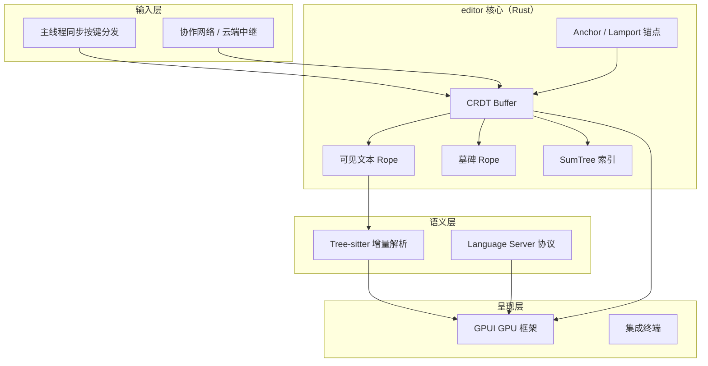

## 日常类比：F1 维修站里的同一块白板

想象你和同事在远程 pair programming。最土的做法是：一个人改完文件、保存、推 Git，另一个人 `git pull` 才能看到——像两个人**轮流用同一块粉笔**，写完必须擦掉再递给对方。

Google Docs 那种实时协作文档，像**一块魔法白板**：你写「hello」，对方同时写「world」，最后板上稳定出现合理结果，不用抢锁。

**Zed** 想做的是第三种体验：不是网页里嵌一个 Electron 壳，而是像 **F1 维修站**——每个人有自己的扳手（本地 GPU 渲染、本地键盘响应），但所有人盯着**同一块引擎盖上的电路图**（共享 buffer）。你拧一颗螺丝的同时，队友能在旁边标注释；系统保证最后图纸不会拧乱、标错位置。

Zed 由 Atom 编辑器原班团队（ Nathan Sobo 等）用 **Rust 从零重写**，约 13.5 万行核心代码。它把「多人实时编辑」当作**一等公民**，而不是后期插件；底层用 **CRDT** 保证跨洲异步协作时副本最终一致，用 **SumTree** 统一文本、诊断、文件列表等索引，用 **GPUI** 做 GPU 加速 UI。

官方架构解读系列 **Zed Decoded**（Rope、Async Rust、坐标系、扩展 Wasm 等）是理解其设计的入口；本文以该系列与 [CRDT 博文](https://zed.dev/blog/crdts) 为主线，为零基础读者串起全貌。

## 是什么

**Zed** 是一款：

- **原生桌面**代码编辑器（macOS / Windows / Linux），非 Electron 套壳
- 用 **Rust** 编写，强调多线程、零成本抽象与内存安全
- 内置 **实时多人协作**（共享 buffer、多光标、语音通道）
- **垂直整合**：自研 GPUI 渲染、自研 rope/CRDT、深度集成 Tree-sitter，LSP 走标准协议

和 [[monaco-editor-2016]]、[[codemirror-6-architecture]] 的对照：

| 维度 | Monaco（浏览器） | CodeMirror 6（浏览器） | Zed（原生 Rust） |
|------|------------------|------------------------|------------------|
| 运行时 | JS + Web Worker | JS 模块化扩展 | Rust + 后台线程 |
| UI | DOM | contentEditable | GPUI（GPU） |
| 协作 | 通常外接服务 | 需 Yjs 等扩展 | 内置 CRDT buffer |
| 文本结构 | Piece tree 等 | 行树 `Text` | SumTree + Rope |

## 为什么重要

不懂 Zed 的架构，以下几类问题很难答清：

1. **为什么不用 Electron 也能做「现代 IDE 感」？** —— GPUI 直接走 Metal / Vulkan / Direct3D，UI 与编辑器同进程、同语言，减少 IPC 与 JS 边界。
2. **远程协作如何避免「抢锁」或 OT 变换地狱？** —— 选 CRDT：并发插入天然可交换（commutative），用 Lamport 时间戳保因果顺序。
3. **大文件下为何还能后台高亮、blame、LSP？** —— Rope 是 **Arc 引用计数的持久化结构**，主线程 `O(1)` 拍快照丢给后台线程。
4. **为什么一个 SumTree 能管这么多东西？** —— B+ 树叶子存数据，每个节点带 **Summary** 聚合子树信息，按字节偏移、行号、UTF-16 偏移都能在 `O(log n)` 跳转。

## 架构全景



设计信条（来自 Zed 团队公开材料）：

- **主线程不持锁处理按键**：重绘先于键事件分发，绑定永远针对最新状态；重活丢给 `BackgroundExecutor`。
- **协作与本地编辑同一条数据路径**：Buffer 始终是 CRDT，单机模式只是「只有一个 replica」的特例。
- **一切皆 SumTree**：文件树、诊断、聊天消息、git blame 信息——同一套可并发、可快照的 B+ 树。

## 核心概念

### 1. SumTree：Zed 的「瑞士军刀」索引

传统 **rope** 是二叉树，叶子挂字符串片段。Zed 的 `Rope` 本质是 `SumTree<Chunk>`：

- **B+ 树**：叶子存多个 `Item`，内部节点存子树的 `Summary`
- **持久化 / 写时复制**：`Arc` 共享子树，分叉快照几乎只增加引用计数
- **多维度摘要**：同一棵树可按字节偏移、行数、UTF-16 长度等 summary 维度二分查找

团队并不是先选 rope 再选 CRDT，而是先做出 SumTree，发现它同时满足「大文件编辑 + 并发快照 + CRDT 片段索引」，再在上层堆出 Rope 与 Buffer。

### 2. CRDT Buffer：不可变插入 + 墓碑删除

文本不是「可变字符串」，而是**插入历史的有序片段序列**：

- 每次插入分配全局唯一 id：`(replica_id, sequence)`，例如 `0.0` 表示 host 的初始全文
- 逻辑位置用 **Anchor** `(insertion_id, offset)` 描述，不依赖会漂移的数字 offset
- 删除不抹掉字节，而是给片段打 **tombstone**；并发删除带 **version vector**，避免误删他人刚插入的字

并发在同一位置插入时，用 **Lamport 时间戳** 排序：先观测到的操作时间戳更小；时间戳相同时按 replica id 打破平局。这样所有副本对「同一锚点旁的多个插入」得到相同顺序。

### 3. Anchor：协作与后台任务的共同语言

`Anchor` 钉在**某次插入的不可变片段**上，而不是钉在「第 42 行第 3 列」。用户继续打字时，行号会变，但 anchor 仍指向同一段逻辑文本。

用途：

- 多人协同时的光标、选区、评论线程
- 后台 Tree-sitter 高亮：主线程拍 buffer 快照 + 两个 anchor 界定范围，工作线程解析时不阻塞输入
- LSP：`PointUtf16` / `OffsetUtf16` 与语言服务器对齐，SumTree 预索引 UTF-16 使转换接近 `O(log n)`

### 4. GPUI + 异步 Rust

Zed 在 macOS 上不用 tokio 做主调度，而用 **Grand Central Dispatch（GCD）** 薄封装 + `async_task`：

- `ForegroundExecutor`：主线程 UI 与输入
- `BackgroundExecutor`：解析、网络、文件 IO

这让系统能统一调度 CPU/GPU 负载，保持「按键到像素」低延迟。扩展则走 **Wasmtime + WIT**，把 Tree-sitter 语法、主题等隔离在沙箱组件里。

### 5. Tree-sitter：编辑器自带的语法眼睛

Zed 联合创始人 Nathan Sobo 是 Tree-sitter 作者。编辑器内很多「懂语法」的功能（折叠、结构选择、局部重构）不靠 LSP，而靠：

- **增量 GLR 解析**：编辑后只重解析受影响子树
- **Tree 查询（queries）**：声明式模式匹配，新语言多半只需加 grammar + query 文件

语法树与 buffer 快照配合 SumTree 的 seek/slice，使主线程开销可控。

## 代码示例一：Rope 的基本用法（来自 Zed `rope` crate 公开 API）

下面示例摘自 Zed Decoded「Rope & SumTree」一文，展示 rope 相对 `String` 的优势：**拼接与替换大量文本时主要改树指针，而非搬移整块内存**。

```rust
use rope::Rope;

fn main() {
    // 构造与追加
    let mut rope = Rope::new();
    rope.push("Hello World!");

    let mut tail = Rope::new();
    tail.push("This is your captain speaking.");

    // 拼接：连接两棵树的根，而非 memcpy 整个字符串
    rope.append(tail);
    assert_eq!(
        rope.text(),
        "Hello World! This is your captain speaking."
    );

    // 区间替换：中间生成新树，复用左右子树节点
    let mut order = Rope::new();
    order.push("One coffee, please. Black, yes.");
    order.replace(4..10, "guinness");
    assert_eq!(order.text(), "One guinness, please. Black, yes.");

    // 删除 = 替换为空串
    order.replace(4..12, "");
    assert_eq!(order.text(), "One , please. Black, yes.");
}
```

要点：`replace(range, text)` 在内部把原 rope 切成三段逻辑——保留 range 前、插入新 chunk、保留 range 后——未触及的子树通过 `Arc` 共享。

## 代码示例二：用 Anchor 思维理解 CRDT 插入（教学化伪代码）

真实实现分布在 `text` / `rope` / `editor` crate，逻辑等价于：每个插入带 id 与 Lamport 时间戳，应用远程操作时按父插入 id 查找片段，而非用裸 offset。

```rust
/// 教学用简化模型，帮助理解 Zed CRDT 插入协议（非仓库源码拷贝）

#[derive(Clone, Copy, Debug, PartialEq, Eq, PartialOrd, Ord)]
struct OpId {
    replica: u16,
    seq: u32,
}

#[derive(Clone, Debug)]
struct InsertOp {
    id: OpId,
  lamport: u64,
    parent: OpId,   // 插入发生在哪个已有片段之后
    parent_offset: usize,
    text: String,
}

struct Replica {
    replica_id: u16,
    next_seq: u32,
    lamport: u64,
    // 真实 Zed 用 SumTree 存 Fragment，而非 Vec
    fragments: Vec<(OpId, String, bool)>, // (id, text, tombstoned)
}

impl Replica {
    fn local_insert(&mut self, parent: OpId, parent_offset: usize, text: &str) -> InsertOp {
        self.lamport += 1;
        let op = InsertOp {
            id: OpId {
                replica: self.replica_id,
                seq: self.next_seq,
            },
            lamport: self.lamport,
            parent,
            parent_offset,
            text: text.to_string(),
        };
        self.next_seq += 1;
        self.apply_remote(op.clone());
        op
    }

    fn apply_remote(&mut self, op: InsertOp) {
        self.lamport = self.lamport.max(op.lamport) + 1;
        // 1. 在 fragments 中找到 parent 片段及 parent_offset
        // 2. 按 Lamport 降序、replica id 升序插入同位置并发片段
        // 3. 必要时 split 原 fragment
        self.fragments.push((op.id, op.text, false));
    }
}

fn demo_two_replicas() {
    let mut host = Replica {
        replica_id: 0,
        next_seq: 1,
        lamport: 0,
        fragments: vec![(OpId { replica: 0, seq: 0 }, "In 1968,".into(), false)],
    };
    let mut guest = Replica {
        replica_id: 1,
        next_seq: 0,
        lamport: 0,
        fragments: host.fragments.clone(),
    };

    let root = OpId { replica: 0, seq: 0 };
    let op_a = host.local_insert(root, 3, "December of ");
    let op_b = guest.local_insert(root, 8, " Douglas Engelbart");

    host.apply_remote(op_b);
    guest.apply_remote(op_a);
    // 两副本按相同规则合并后，可见文本收敛为同一结果
}
```

这段伪代码省略了 tombstone、version vector 与 undo map，但抓住了 Zed 与 OT 的根本分歧：**不为并发操作写变换函数，而是让操作在 CRDT 状态下直接可应用**。

## 协作中的删除、撤销与一致顺序

| 机制 | 作用 |
|------|------|
| Tombstone | 删除 = 标记隐藏，保留插入 id 供 anchor 解析 |
| Version vector on delete | 并发插入进「已删区间」时不被误埋 |
| Lamport timestamp | 同锚点并发插入的全局一致排序 |
| Per-replica undo map | 每人撤销自己的 op id，而非全局栈 |

单机撤销栈假设「文档状态与 offset 一一对应」；多人环境下 offset 会因他人编辑漂移，因此 Zed 用 **operation id → undo 计数** 的映射判断片段是否可见。

## 与 Atom / Electron 路线的分野

Atom 曾用 JavaScript + Web 技术栈； shipped 版 buffer 甚至是「字符串行数组」。Zed 团队结论：**要在性能与协作上突破，需要重写而非修补**——

- Rust 的所有权 + `Arc` 让 copy-on-write 结构「免费」多线程友好
- 不捆绑 Chromium，内存与启动体积显著低于典型 Electron IDE
- 协作协议与编辑器同代码库，减少「编辑器 + 外接 CRDT 服务」的缝隙

## 学习路径建议

1. 读 [How CRDTs make multiplayer text editing part of Zed's DNA](https://zed.dev/blog/crdts) —— 弄懂 insertion id、anchor、tombstone、Lamport（有动画，适合零基础）
2. 读 [Rope & SumTree](https://zed.dev/blog/zed-decoded-rope-sumtree) —— 对照本文代码示例看真实 `Rope` API
3. 读 [Text Coordinate Systems](https://zed.dev/blog/zed-decoded-text-coordinate-systems) —— 理解 `Point`、`Anchor`、`DisplayPoint` 为何共存
4. 克隆 [zed-industries/zed](https://github.com/zed-industries/zed)，从 `crates/rope`、`crates/text`、`crates/editor` 开始跳读
5. 与 [[tree-sitter-2018]]、[[language-server-protocol-spec]] 对照：语法本地、语义远程的分工

## 常见误解

| 误解 | 事实 |
|------|------|
| Zed 协作靠中心服务器强一致锁 | 各副本独立应用 ops，靠 CRDT 最终一致；网络层负责中继 |
| Rope = 普通二叉树字符串 | Zed 的 Rope 是带多维 Summary 的 SumTree |
| GPU UI 只为炫技 | 大量编辑器元素（字形、装饰）走 GPU 减轻 CPU 布局压力 |
| 用 CRDT 一定很占内存 | 团队认为相对 Electron 基线，fragment 元数据开销可接受 |

## 小结

**Zed** 把「高性能原生编辑器」与「多人实时协作」绑在同一套 Rust 数据结构上：底层 **SumTree** 统一索引，**Rope** 承载可见文本与墓碑，**CRDT** 让跨洲编辑无需 OT 变换，**Anchor** 贯穿协作、高亮与 LSP，**GPUI** 负责 GPU 呈现。它不是「又一个插件式协作补丁」，而是从 Atom 的经验里选择 **start over** 的产物。

若你来自 Web 编辑器世界（Monaco / CodeMirror），最值得带走的一条观念是：**先把文本建模成可并发、可快照、可交换操作的数学对象，UI 与网络只是往这个对象上挂视图**——这正是 Zed 把 multiplayer 写进 DNA 的方式。
