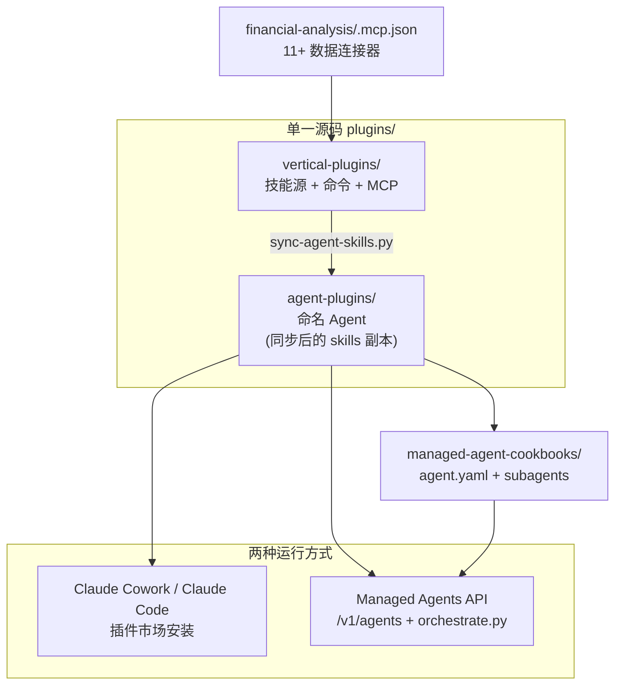

## 日常类比：带 SOP 手册的投行实习组 + 数据终端接线员

想象你在一家投行或资管公司实习，第一天领到的不只是一台电脑，而是：

- **一叠标准作业程序（SOP）**：可比公司分析怎么拉、DCF 里 WACC 怎么设、 earnings note 段落结构怎样写——对应仓库里的 **Skills**（`SKILL.md`）
- **快捷指令卡**：老板说「做 comps」「写 CIM」「出 IC memo」时你按固定流程开干——对应 **Commands**（`/comps`、`/cim`、`/ic-memo`）
- **彭博 / FactSet / 内部文档库的 VPN 账号**：不用手动复制粘贴，模型通过 MCP 直接查数——对应 **Connectors**
- **带名字的完整小组**：Pitch Agent 从估值做到 deck，GL Reconciler 从对账差异追到根因——对应 **Named Agents**

[anthropics/financial-services](https://github.com/anthropics/financial-services)（Apache 2.0）就是 Anthropic 把上述「实习组 + 终端 + SOP」**文件化**后的参考实现：全是 Markdown 与 YAML，无编译步骤。可在 [Claude Cowork](https://claude.com/product/cowork) 里当插件装，也可通过 [Claude Managed Agents API](https://docs.claude.com/en/api/managed-agents) 部署到你自己的工作流引擎——**同一套 system prompt 与 skills，两种运行面**。

> **合规提醒（仓库原文强调）**：内容不构成投资、法律、税务或会计建议；输出需经 qualified professional 复核，Agent 不执行交易、不过账、不批准 onboarding。

---

## 是什么：FSI 垂直里的「插件 + Agent 双轨」



| 层级 | 作用 | 典型路径 |
|------|------|----------|
| **Vertical plugins** | 按业务线打包 skills/commands | `plugins/vertical-plugins/equity-research/` |
| **Agent plugins** | 端到端工作流，自包含 skills | `plugins/agent-plugins/pitch-agent/` |
| **Managed Agent cookbooks** | 无头部署：orchestrator + leaf workers | `managed-agent-cookbooks/gl-reconciler/` |
| **Partner plugins** | LSEG、S&P Global 等合作方 | `plugins/partner-built/` |

与「单个 ChatGPT 自定义 GPT」不同，这里强调 **Research → Model → Deck/Memo** 的整条链路，且通过 MCP 把外部终端数据接进同一会话，减少 tab 切换与手工抄数错误。

---

## 核心概念

### 1. Skills — 自动触发的领域 SOP

每个 skill 是目录下的 `SKILL.md`：写清**何时触发**、**步骤**、**输出格式**、**常见坑**。Claude 在对话中语义匹配后自动加载，无需你每次重复「请按我们行标做 comps」。

示例：`comps-analysis` 指导可比公司选取、倍数计算、表格版式；`audit-xls` 指导 Excel 公式追踪与 hardcode 检测。

**编辑约定**：skills 的**权威源**在 `vertical-plugins/<vertical>/skills/`；agent 目录里是同步副本。改 skill 后需跑 `python3 scripts/sync-agent-skills.py`，再用 `python3 scripts/check.py` 验证引用与版本。

### 2. Commands — 显式 slash 工作流

Commands 是 `commands/*.md`，用户主动输入 `/comps`、`/earnings` 等。适合步骤固定、输入参数明确的任务（公司名、deal 名、报告期）。

在 Claude Code 里可能呈现为 `/plugin:command-name` 形式，取决于插件命名空间。

### 3. Connectors — MCP 数据面

核心插件 **financial-analysis** 的 `.mcp.json` 集中注册连接器，覆盖 Daloopa、Morningstar、S&P Global、FactSet、Moody's、PitchBook、LSEG、Egnyte、Box 等。各 vertical 共享这套连接；换数据源时改 MCP 配置或 `.local.md`（gitignore 的用户本地覆盖）。

### 4. Named Agents — 工作流 owner

每个 Agent 有 canonical system prompt：`plugins/agent-plugins/<slug>/agents/<slug>.md`。例如：

| 职能 | Agent | 典型产出 |
|------|-------|----------|
|  coverage & advisory | Pitch Agent | comps → precedents → LBO → branded deck |
| research | Earnings Reviewer | 业绩会 + filing → model update → note 草稿 |
| fund admin | GL Reconciler | 找 break、追根因、路由签批 |
| operations | KYC Screener | 解析 onboarding 材料、规则网格、缺口标记 |

Agent 插件**自包含**其用到的 skills，Cowork 里装一个 Agent 即可开跑，不必再手动叠五六个 vertical（除非你只想用 slash 而不装整 Agent）。

### 5. Managed Agents — 可编排的无头部署

`managed-agent-cookbooks/<slug>/` 含 `agent.yaml`（指向同一 system prompt）、`subagents/*.yaml`（深度 1 的 leaf worker）、`steering-examples.json`。部署脚本上传 skills、创建 subagent，POST 到 `/v1/agents`。

`scripts/orchestrate.py` 提供参考事件循环：处理 `handoff_request`，在你自己的 orchestration 层把任务从 orchestrator 路由到 leaf agent（Research Preview 能力，生产需按各 Agent README 做安全与 handoff 审查）。

### 6. 与 Microsoft 365 加载项的关系

`claude-for-msft-365-install/` 是**独立**的 IT 管理插件：帮企业在 Excel/PPT/Word/Outlook 里部署 Claude 加载项（可走 Vertex、Bedrock 或内部 gateway）。FSI agents/skills 是加载项**内部**跑的能力，不是同一个安装包。

---

## 垂直插件一览（先装 core）

官方建议顺序：**financial-analysis（core）→ 按需 vertical / agent**。

| 插件 | 亮点命令 |
|------|----------|
| financial-analysis | `/comps`、`/dcf`、`/lbo`、`/3-statement-model`、`/debug-model` |
| investment-banking | `/cim`、`/teaser`、`/buyer-list`、`/merger-model` |
| equity-research | `/earnings`、`/initiate`、`/model-update`、`/morning-note` |
| private-equity | `/screen-deal`、`/dd-checklist`、`/ic-memo`、`/portfolio` |
| wealth-management | `/client-review`、`/financial-plan`、`/rebalance`、`/tlh` |
| fund-admin | GL 对账、关账、NAV tie-out 相关 skills |
| operations | KYC 解析与规则评估 |

Partner：**lseg**（债券 RV、swap 曲线等）、**sp-global**（tear sheet、earnings preview 等）。

---

## 代码示例 1：Claude Code 安装 marketplace 与插件

在终端用 Claude Code 添加官方 marketplace，先装核心建模与 MCP，再按岗位装 Agent 或 vertical：

```bash
# 注册 marketplace（仓库 README 当前 slug）
claude plugin marketplace add anthropics/financial-services

# 核心：共享建模 skills + 全部数据连接器（必须先装）
claude plugin install financial-analysis@claude-for-financial-services

# 命名 Agent — 按职能挑选
claude plugin install pitch-agent@claude-for-financial-services
claude plugin install earnings-reviewer@claude-for-financial-services
claude plugin install gl-reconciler@claude-for-financial-services

# 或只装垂直 skill 包（不要整 Agent 时）
claude plugin install equity-research@claude-for-financial-services
claude plugin install private-equity@claude-for-financial-services
```

安装后：

- Agent 出现在 Cowork dispatch
- Skills 在相关对话里**自动**加载
- Slash commands 在会话中可用，例如 `/comps`、`/earnings`、`/ic-memo`

Cowork 图形界面也可直接粘贴仓库 URL `https://github.com/anthropics/financial-services`，从 marketplace 列表勾选插件；或 zip `plugins/agent-plugins/pitch-agent/` 上传。

---

## 代码示例 2：Managed Agent 部署与编排

无头环境（cron、内部 deal desk 门户、合规 sandbox）用 Managed Agents API：

```bash
export ANTHROPIC_API_KEY=sk-ant-...

# 部署单个 cookbook（如 GL 对账 Agent）
scripts/deploy-managed-agent.sh gl-reconciler
```

脚本会：解析 `agent.yaml` 中的 `system.file` 与 `skills.path` 引用 → 上传 skills → 创建 leaf subagents → POST orchestrator 到 `/v1/agents`。

自定义编排时可参考 `orchestrate.py` 的事件循环概念（伪代码结构）：

```python
# 概念示意：处理 Agent 之间的 handoff_request
# 完整实现见仓库 scripts/orchestrate.py

async def run_orchestrator(agent_id: str, user_message: str):
    session = await agents_api.create_session(agent_id=agent_id)
    async for event in session.stream(user_message):
        if event.type == "handoff_request":
            # 将子任务路由到 callable_agents 中的 leaf worker
            leaf_id = resolve_leaf(event.target_slug)
            async for sub_event in delegate_to(leaf_id, event.payload):
                yield sub_event
        else:
            yield event
```

`callable_agents` 与 subagent 委托目前为 **Research Preview**；上线前需阅读对应 `managed-agent-cookbooks/<slug>/README.md` 的安全 tier 与数据边界说明。

---

## 代码示例 3：会话内典型 slash 工作流

安装 **investment-banking** 与 **financial-analysis** 后，可在同一会话串联（示意输入，非 API）：

```text
/comps Apple

# Skill 引导：选 peer set、拉 MCP 数据、输出 trading multiples 表
# 可导出 xlsx 或嵌入 deck

/merger-model Acquirer acquiring Target

# 输出：sources & uses、pro forma、EPS accretion/dilution、sensitivity

/cim TargetCo

# 基于 filings + 管理层材料草稿 CIM 各章，待 MD 复核
```

Research 侧类似：

```text
/earnings NVDA

# 业绩会 transcript + 10-Q/8-K → 模型假设更新 → quarterly update 段落

/thesis NVDA

# 更新 investment thesis 与风险清单
```

这些命令背后是 `commands/*.md` 调用对应 `skills/*/SKILL.md` 里的步骤；有 MCP 权限时自动查 Morningstar、FactSet 等，无 key 则退化为公开 filing + 用户上传文件。

---

## 仓库开发与贡献要点

| 动作 | 命令 / 位置 |
|------|-------------|
| 改 skill | 编辑 `vertical-plugins/.../skills/`，再 `sync-agent-skills.py` |
| 新增 Agent | `plugins/agent-plugins/<slug>/` + 镜像 `managed-agent-cookbooks/<slug>/` |
| 提交前检查 | `python3 scripts/check.py`（manifest、交叉引用、skill 漂移） |
| 版本 bump | pre-commit 自动 patch `plugin.json` version，PR 有 GitHub Action 兜底 |

插件本质是 **Markdown + JSON**；改完即生效，无 build。Fork 后可：

- 替换 `.mcp.json` 指向行内数据湖或私有 MCP
- 在 skill 里写入行术语、字体、slide master 规则（`/ppt-template` 可教 Claude 你的模板）
- 改 `agents/<slug>.md` 对齐真实审批链

---

## 与其他工具的关系（学习定位）

| 对比对象 | 差异 |
|----------|------|
| 通用 Claude Code / Cursor Agent | 本仓库提供 **FSI 预制 SOP + 终端 MCP**，不是空 agent |
| 纯 Excel Copilot | 强调 cross-document（Excel + PPT + Word + 研究 note）与 deal 级 workflow |
| 自研 RAG on filings | 官方 connectors 覆盖商业终端；skill 层编码的是**分析师方法**而不只是检索 |

若你已在用 [Claude API SDK](https://docs.anthropic.com/) 或 Managed Agents，本仓库是**可直接 fork 的领域 prompt/skill 库**；若你在 Cowork 桌面端，则是「一键专业化」的插件市场来源。

---

## 零基础上手路径（建议 90 分钟）

1. **15 min** — 读 README「Agents / Vertical Plugins / How It Fits Together」三张表，选与自己岗位最近的一个 Agent（如 equity research → Earnings Reviewer）。
2. **20 min** — Claude Code 安装 `financial-analysis` + 一个 vertical；配置至少一个 MCP provider 的 API key（或先用上传 PDF/Excel 离线试）。
3. **30 min** — 跑通一条 slash：research 用 `/comps` 或 `/earnings`，IB 用 `/one-pager`，PE 用 `/screen-deal`。
4. **15 min** — 打开对应 `SKILL.md`，看 trigger 条件与输出 checklist，理解「模型被约束了什么」。
5. **10 min**（可选） — 读 `managed-agent-cookbooks/<your-agent>/README.md`，了解 headless 部署与 handoff 安全说明。

---

## 小结

**Claude for Financial Services** 把投行、研究、PE、财富管理、基金运营里高频 workflow 拆成可组合的 **Skills、Commands、Connectors、Named Agents**，并统一维护 Cowork 插件与 Managed Agent 两套包装。学习价值在于：看清 Anthropic 如何用**文件即配置**的方式编码金融专业流程，以及 MCP 如何把「终端数据」接进 agent 闭环——这对设计任何行业的垂直 Agent 都有参考意义。

**关键链接**

- 仓库：https://github.com/anthropics/financial-services
- Managed Agents 文档：https://docs.claude.com/en/api/managed-agents
- MCP 规范：https://modelcontextprotocol.io/
