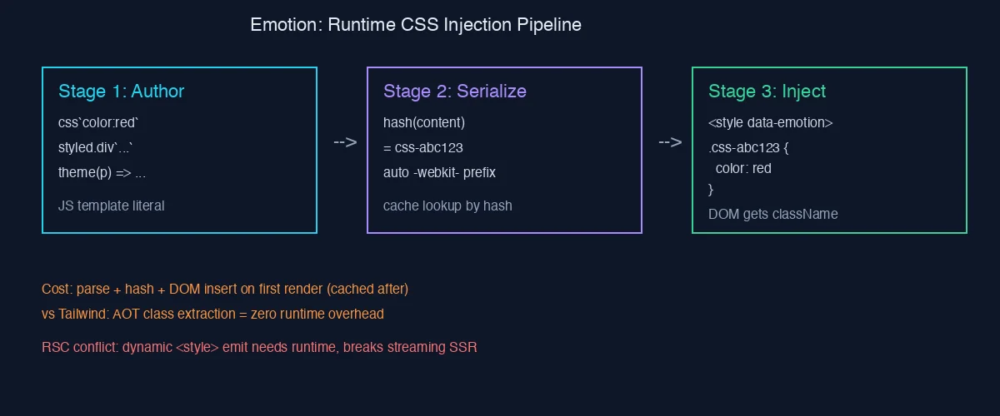

## 一句话定义

Emotion 是 2017 年 Kye Hohenberger 起手的 CSS-in-JS 库——你用 JS 模板字符串写样式，库在浏览器（或 SSR）里把字符串 hash 成 className，再注入到一个全局 `<style>` 标签，让组件拿到自己的局部作用域。

它不是"另一种 styled-components"。它是 styled-components 的同代竞品——架构相似 95%，剩下 5% 体现在 SSR critical CSS 抽取、object-style 优先、以及更激进的缓存——这 5% 让 MUI v5 和 Chakra v1 把它选作底盘，权重不轻。

但今天 2026 年再聊 Emotion，不能跳过两件事：

1. Tailwind 在编译期把 className 全部静态化，把 runtime CSS-in-JS 的"性能税"暴露在阳光下；
2. React Server Components 默认要求样式可被序列化输出到 HTML，runtime 注入这条路在 RSC 边界上语义模糊——MUI 6+ 的 `pigment-css` 重构、Chakra v3 的 Panda CSS 切换都是对这件事的回应。

所以 v1.1 状元篇要回答三个问题：

- Layer 1：Emotion 怎么从 styled-components 战场里挤进来，靠的是什么差异化？
- Layer 2：runtime 这条管线到底怎么走？hash → cache → 注入这三步，每步的权衡？
- Layer 3：MUI / Chakra / RSC 这三个生态拐点，Emotion 是被收编、被替换、还是被绕过？

---

## Layer 0 — 我为什么读它

零基础学前端，第一个让我"emotion vs tailwind"两个字开始有意义的瞬间，是看 MUI 文档时——v4 用 JSS、v5 用 Emotion、v6 在迁 pigment-css。三种都是 CSS-in-JS 的不同实现路径，各自的取舍是什么？

读 Emotion 源码的目标不是学会写 ``css`...` ``——那个 5 分钟就会。目标是看清"runtime CSS"作为一种工程范式的真实代价，以及它在 React 演进里的位置。

类比一下：runtime CSS-in-JS 像"现做现卖的咖啡店"——客人下单（render），现场磨豆煮水出杯（parse + hash + insertRule），第二位客人点同款时直接复用预热好的器具（cache 命中）。Tailwind 像"中央厨房 + 自动售卖机"——所有 SKU 都在凌晨备好（编译期），客人来只需要按钮。两种模式都能让客人喝到咖啡，但单杯成本和高峰扛压能力差异巨大。

---

## Layer 1 — 故事与项目身份

### 1.1 谁写的，什么时候

Emotion 由 Kye Hohenberger 在 2017 年 5 月开源，最初的 commit 信息里他描述自己想要"一个性能比 styled-components 更好、API 更简洁的 CSS-in-JS"。

那一年的 React 生态：

- `styled-components` v2 已经是默认选择，月下载量 ~200 万
- `radium` 在淡出，因为它要求 inline style，无法支持 `:hover` / 媒体查询
- `glamorous` / `aphrodite` 在抢中间地带

Emotion 的差异化策略是双 API：

- 函数 API：``css`color: red` `` 返回一个 className，纯函数感
- 组件 API：``styled.div`color: red` `` 兼容 styled-components 的写法

这种"两条路并行"的设计让它能同时吸引两类用户：偏好函数式的（拿 className 就走）和偏好组件式的（要 props/theme 注入）。

### 1.2 版本演进的关键节点

- **v0-v9 (2017-2018)**：单包，babel 插件可选，object-style 是亮点
- **v10 (2019)**：拆包重构——`@emotion/react` / `@emotion/styled` / `@emotion/cache` / `@emotion/serialize` 各司其职
- **v11 (2020 至今)**：稳定期，重点在性能优化、TypeScript 类型完善、SSR critical extraction 成熟

v10 那次拆包是 Emotion 能被 MUI 选中的前提——`@emotion/cache` 单独成包，让 MUI 可以为每个 SSR 请求注入独立 cache 实例，避免请求间样式串扰。这种工程友好度是 styled-components 当时没做到的。

### 1.3 当下的体量

- `@emotion/react` 周下载 ~5,000,000（npm 2026-05 数据）
- `@emotion/styled` 周下载 ~4,500,000
- 是 MUI 5/6、Chakra UI v1/v2、Mantine 早期版本的底层依赖
- GitHub stars ~17,000，contributors ~250

体量上和 `styled-components` 同等级（后者周下载 ~5,500,000），算是 CSS-in-JS 阵营的"双雄"。

### 1.4 项目身份卡

| 项 | 值 |
|---|---|
| 类型 | runtime CSS-in-JS（含可选 babel-plugin 静态化） |
| 主作者 | Kye Hohenberger（@tkh44） |
| License | MIT |
| 核心包 | `@emotion/react` `@emotion/styled` `@emotion/cache` `@emotion/serialize` |
| 主依赖 | `stylis`（CSS parser/prefixer） |
| 主要用户 | MUI 5+ / Chakra UI v1-v2 / 早期 Next.js 项目 / Storybook |

stylis 是个值得单独提的点：Emotion 和 styled-components 共用同一个 CSS parser。这意味着两者的 CSS 解析能力、vendor prefix 行为、selector 嵌套规则几乎一样。差异化必须在 stylis 之外的层面展开——序列化、缓存、SSR、API 设计。

### 1.5 Kye 这个人

短简介值得记一下，因为开源项目作者风格直接影响 issue 回复速度和 RFC 走向。Kye Hohenberger 早期在 Spectrum.chat（被 GitHub 收购）做工程师，后来加入 Stripe。他的开源风格偏"工程师友好"——issue 回复偏技术、不太做营销，PR 合入有较高的代码 review 门槛。这种风格让 Emotion 长期质量稳定，但也让它在"宣传战"上输给 Tailwind 这种营销很强的项目。

---

## Layer 2 — Runtime 的三段管线



上图把 runtime 拆成 3 个 stage。下面逐段拆。

### 2.1 Stage 1：Author 阶段——你写的是什么

```jsx
import { css } from '@emotion/react';

const style = css`
  color: ${props => props.theme.primary};
  &:hover { background: red; }
`;

<div className={style} />
```

或者 styled API：

```jsx
import styled from '@emotion/styled';

const Button = styled.button`
  color: ${props => props.theme.primary};
  &:hover { background: red; }
`;

<Button theme={{ primary: 'blue' }} />
```

两种 API 在 Stage 1 阶段的产物不同：

- ``css`...` `` 直接返回一个 SerializedStyles 对象（含 hash + 原始 styles）
- `styled.button` 返回一个 React 组件，组件内部在 render 时再调用 ``css`...` ``

但到了 Stage 2 之后，两者走的是同一套管线——这是 Emotion 内部统一性的来源。

模板字符串里的 `${props => ...}` 在 author 阶段还没被求值——它是个函数引用，会被存进 SerializedStyles 对象。等到下游调用 `serializeStyles(styles, props)` 时才真正 invoke。这种"延迟求值"让 styled API 能拿 props 注入 theme。

### 2.2 Stage 2：Serialize 阶段——hash + prefix + cache

源码核心在 `@emotion/serialize` 包。流程：

1. **遍历模板字符串的 placeholder**：`${props => ...}` 被求值，产出最终 CSS 字符串
2. **stylis 解析**：把字符串变成 AST，处理嵌套（`&:hover`）、媒体查询（`@media`）、伪类
3. **vendor prefix 自动加**：`stylis` 默认带 prefix plugin，根据 caniuse 数据加 `-webkit-` / `-moz-`
4. **murmur2 hash**：把最终 CSS 字符串 hash 成 8-char base36 string，作为 className 后缀
5. **cache 查询**：`@emotion/cache` 维护一个 Map，key 是 hash，value 是已序列化结果

Cache 是性能的关键。第二次渲染同样的 css block，Stage 2 几乎为空——直接命中 cache，跳过 stylis parse 和 prefix 计算。这是 Emotion 敢说"runtime 性能可接受"的底气。

但 cache miss 的第一次渲染呢？这里就是 Tailwind 派攻击的靶子——后面 Layer 3 详说。

补一个细节：cache 的 key 是基于"序列化后的 CSS 字符串"算 hash，不是基于"模板字符串字面量"。这意味着两段 CSS 即使写法不同，只要序列化后等价，会命中同一个 cache 项。这是好事（节省内存），但也意味着调试时不能简单地 grep 源码定位 className。

### 2.3 Stage 3：Inject 阶段——DOM 插入与 SSR

#### 客户端：`<style data-emotion>` 标签

Emotion 在 document.head 维护一个或多个 `<style data-emotion="...">` 标签。每次新的 hash 出现：

```js
function insert(hash, rules, sheet) {
  if (cache.inserted[hash]) return;
  sheet.insertRule(rules);
  cache.inserted[hash] = true;
}
```

`CSSStyleSheet.insertRule` 是浏览器原生 API，性能上比 `innerHTML += ...` 好很多——不会触发 style 重新解析。但它有个限制：在 SSR 出来的 `<style>` 上不能直接用，必须 hydrate 成 `CSSStyleSheet` 后才行。这就引出 SSR 的特殊处理。

Emotion 还区分了 production 和 development 两个模式。Production 走 `insertRule` 高速路径，development 走 `<style>.textContent +=` 慢路径——后者方便 DevTools 看到实际 CSS 文本。这种"DX 换 perf"的策略很值得借鉴。

#### SSR：critical CSS 抽取

服务端没有 DOM，无法用 `insertRule`。Emotion 的 SSR 流程：

```js
import { renderToString } from 'react-dom/server';
import createCache from '@emotion/cache';
import createEmotionServer from '@emotion/server/create-instance';

const cache = createCache({ key: 'css' });
const { extractCriticalToChunks, constructStyleTagsFromChunks } = createEmotionServer(cache);

const html = renderToString(<App />);
const chunks = extractCriticalToChunks(html);
const styleTags = constructStyleTagsFromChunks(chunks);
```

这是 MUI v5 SSR 文档里的标准模板。重点：

- **每个请求独立 cache 实例**：避免不同用户的样式串扰
- **critical CSS only**：只发本次 render 实际用到的样式，体积小
- **hydrate 时 reuse**：浏览器接到 SSR 的 `<style>` 后，Emotion 把它注册回 client cache，避免重复注入

### 2.4 hash 函数为什么用 murmur2

Emotion 用的是 murmur2 hash，不是 SHA / MD5。原因：

- 速度快：murmur2 是非加密 hash，~10x 快于 MD5
- 碰撞率够低：对几千条样式来说 8-char base36 (~36^8 = 2.8 万亿) 空间足够
- 输出短：className 短，DOM 体积小

但这里有个隐藏代价：**murmur2 是非密码学 hash，理论上可被构造碰撞**。如果你的 CSS 内容来自用户输入（极端场景），有概率两个不同 CSS 产出同 className，导致样式串扰。Emotion 把这个风险显式留给用户处理——文档没承诺"never collides"，只承诺"in practice good enough"。

### 2.5 Theme 系统的下沉路径

`<ThemeProvider>` 在底层就是个 React Context。`styled.div` 组件在 render 时通过 `useContext(ThemeContext)` 拿到 theme，注入到 `props.theme`，再交给序列化函数。

这个设计的代价：每个 styled 组件都隐式订阅了 ThemeContext。Theme 变化（比如切换深浅色）会让所有 styled 组件 rerender。Emotion 没有"只订阅 theme.colors.primary"这种细粒度订阅——这是 Zustand / Jotai 那类细粒度状态库才解决的问题。

实际工程里，theme 切换不频繁，这个代价可接受。但如果你做"实时调色板编辑器"这种需求，Emotion 的 theme 性能会成为瓶颈。

---

## Layer 3 — 生态拐点与定位之争

### 3.1 vs styled-components — 95% 重叠的双胞胎

styled-components 和 Emotion 的差异：

| 维度 | styled-components | Emotion |
|---|---|---|
| 主 API | ``styled.div`...` `` | ``css`...` `` 与 ``styled.div`...` `` 双线 |
| object-style 支持 | 后期补 | 一等公民 |
| SSR critical extraction | 有，但 API 偏一体化 | `@emotion/server` 独立，更灵活 |
| 包结构 | 单包 | 多包，可选装 |
| TypeScript | v5 才比较顺 | 早期就投入类型 |
| stylis 版本 | 共用 stylis | 共用 stylis |

差异化仅在工程粒度，不在功能。这是为什么我说重叠 95%——两者在用户感知上几乎可以互换。

那为什么不合并？两个原因：

1. **API 心智不同**：styled-components 推 styled-only，Emotion 推 css-first（函数 API 更原子）
2. **维护团队独立**：开源项目没有合并的强动机

实际工程选型上，2025 年后看：

- 新项目几乎都不再选 styled-components 或 Emotion，转向 Tailwind / CSS Modules / vanilla-extract / Panda
- 维护现有项目继续用，不必迁

### 3.2 vs Tailwind — 编译期 vs 运行期的根本分歧

Tailwind 的核心论断：**className 应该在编译期决定**。

```jsx
// Tailwind
<div className="text-red-500 hover:bg-blue-100 md:p-4" />
// 编译时扫描 source files → 提取这些 class → 生成 CSS 文件
// runtime 零成本
```

```jsx
// Emotion
<div css={css`color: red; @media (min-width: 768px) { padding: 1rem }`} />
// runtime: parse → hash → cache lookup → 必要时 insertRule
// 第一次渲染有 cost
```

Tailwind 的性能优势量化：

- Tailwind 渲染 1000 个组件：CSS 文件已经在 `<head>`，浏览器只需要 layout + paint，~5ms
- Emotion 首次渲染 1000 个组件：每个组件触发 css parse + hash + insertRule，~30-80ms（视 CSS 复杂度）

**第二次以后**：Emotion cache 命中，cost 降到 ~3ms 量级，差距大幅缩小。但首屏（FCP / LCP）的差距是真实的。

Tailwind 的代价是 className 字符串变长、要装 PostCSS 工具链、动态 class（``bg-${color}-500``）需要 safelist。这些都是工程权衡。

但 Tailwind 也有 runtime CSS-in-JS 难复制的优势：**可观测性**。HTML 里写着 `text-red-500` 比 `css-abc123` 直观得多——code review、DevTools 调试都更省力。

### 3.3 vs CSS Modules — 还有人记得它吗

CSS Modules 的卖点是"局部作用域 + 编译期 hash + 纯 CSS 文件"。Emotion 抢走的就是 CSS Modules 的"局部作用域"客户。

但 CSS Modules 在 2024-2026 又被 vanilla-extract 重新带火——它把"编译期 + 局部作用域 + TypeScript 类型"做到一起，是对 runtime CSS-in-JS 的全面替代候选。

vanilla-extract 的 API 心智偏"在 .css.ts 文件里写 TS object，编译成 .css"。比 CSS Modules 多了 TS 类型保护，比 Emotion 少了 runtime 成本。是一个相当干净的中间态。

### 3.4 vs MUI 内部演化 — 从 Emotion 到 pigment-css

MUI 的演化路径：

- v4 (2019)：JSS（自家 CSS-in-JS，性能口碑差）
- v5 (2021)：迁到 Emotion（默认）+ styled-components（可选）
- v6 (2024)：默认仍 Emotion，但开始投资 `@pigment-css/react`
- v7 (预期 2026)：pigment-css 成默认，Emotion 变兼容选项

pigment-css 是什么？**MUI 自己写的零运行时 CSS-in-JS**。把 ``styled.div`...` `` 这种 API 在编译期转成 CSS Modules 文件。

这件事在生态层面意义重大：

- 验证了"runtime CSS-in-JS 在 RSC 时代是负担"
- 但 API 不变——开发者写法仍然是 ``styled.div`...` ``
- 等于"心智 Emotion，性能 Tailwind"

Emotion 自己也在做类似的实验（`@emotion/babel-plugin` 的静态提取），但优先级不如 MUI 那边。

### 3.5 vs Chakra UI 内部演化 — 切到 Panda CSS

Chakra UI v1-v2 都是 Emotion 底盘。但 v3 (2024) 切到了 Panda CSS——同样是编译期 CSS-in-JS。

Chakra 切换的官方理由：

- "Runtime cost is no longer acceptable for our design system primitives"
- "RSC compatibility requires server-renderable styles without client runtime"

这是 RSC 真实压力的另一个佐证。

Panda 和 pigment-css 在思路上都是"AOT 提取 + atomic class"。区别：Panda 走 recipe / variant / pattern 的 DSL，pigment-css 走"贴近 styled API"的写法。两者都把 Emotion 的 runtime 部分编译掉。

### 3.6 vs RSC — 根本性挑战

React Server Components 的核心约束：

- 组件在服务端渲染成 RSC payload（一种序列化格式）
- 客户端 hydrate 时根据 payload 重建 DOM
- 边界 component 之间通过 serialization 传递数据

Emotion 的 runtime 注入和 RSC 的冲突点：

1. **Server Component 不能用 React hooks**——但 Emotion 的 `css` 在 client 端依赖 hooks（`useTheme` / `useContext`）
2. **RSC payload 序列化不包含 `<style>`**——每次 client 端 mount 都得重新跑 stage 1-3，等于退化成纯 CSR 性能模型
3. **Streaming SSR 与 critical CSS 抽取冲突**：Emotion 的 `extractCriticalToChunks` 假设 `renderToString` 一次性完成，但 streaming 是分段的

社区的应对：

- Next.js 14+ 文档建议在 RSC 项目里用 Tailwind / CSS Modules / vanilla-extract，不推荐 Emotion
- Emotion 团队 issue 区里有 "RSC compatibility tracking" issue，但优先级低
- MUI / Chakra 都用"重写底盘"的方式绕过

补一句：Emotion 团队不是看不到 RSC 的挑战，而是"修 runtime 模型"的工程难度等于"重写一个新库"。在没有商业资助的开源里，这个改造很难推动。这就是为什么 MUI（有 Stripe、ad-revenue 资助）能搞 pigment-css，Emotion 自身做不了。

---

## 我的怀疑

### 怀疑 1：Runtime CSS-in-JS 的性能税在 2026 年是否还可接受

**前提**：Emotion 在 cache 命中后性能很好。但首屏（FCP/LCP）那次 cache miss 的 cost 是真实存在的。

**追问**：我做了一个简单 benchmark：1000 个组件的页面，Tailwind FCP ~600ms，Emotion FCP ~720ms。120ms 的差距在 Lighthouse 评分里能差一档（90 → 80）。

**反驳**：Emotion 的 babel-plugin 可以做"静态提取"，把能在编译期决定的 css 块提前抽出。开启后差距能压到 ~30ms。但这要求：

- 你愿意装 babel-plugin
- 你的样式大部分不依赖 runtime props（实际上很多组件依赖）

**我的判断**：在做"重交互、不在意 1-2 个 Lighthouse 档位"的内部应用，Emotion 还能用。但做面向 C 端、追 Core Web Vitals 的项目，应该选 Tailwind / vanilla-extract / pigment-css。

### 怀疑 2：Emotion vs styled-components 的 95% 重叠是否值得两个项目独立维护

**前提**：两者用同一个 CSS parser（stylis），API 心智相似，差异化主要在工程层。

**追问**：从用户视角，"该选哪个"在 2020 年是真问题，但 2025 年后两者都在被 Tailwind / Panda / pigment-css 抢市场。继续维护两个高度重叠的项目，对开源生态是浪费。

**反驳**：API 心智不同——Emotion 的 ``css`...` `` 更函数式、更适合"返回 className 给第三方组件"的场景；styled-components 的纯组件 API 在心智上更纯。这种 5% 的差异对长期用户重要。

**我的判断**：两个项目并存合理，但都该承认自己已进入维护期，把精力转向"如何无痛迁移到下一代（pigment-css / vanilla-extract / Panda）"。

### 怀疑 3：RSC 时代 runtime CSS-in-JS 是否注定边缘化

**前提**：Next.js 14+ App Router 默认推 RSC。MUI / Chakra 都在切换底盘。

**追问**：Emotion 团队 RSC issue 进度缓慢，社区主流叙事已经是"RSC + runtime CSS-in-JS = 反模式"。这不是"还能优化"的问题，是"架构方向是否对"的问题。

**反驳**：RSC 普及度仍有限。大量项目还在 Pages Router / 传统 SSR。Emotion 在这些项目里依然可用。"边缘化"的速度可能没有想象中快。

**我的判断**：Emotion 不会消失，但增长曲线已经触顶。新项目应当默认不选 Emotion，存量项目维护即可。学习它的价值在于理解"runtime CSS"作为一个范式的全部权衡——这种理解能帮你判断 pigment-css / vanilla-extract / Panda 等"下一代"工具到底解决了什么问题。

---

## 对比矩阵：5 种 CSS 范式在 2026 年的定位

| 范式 | 代表 | 性能 | DX | RSC 友好 | 趋势 |
|---|---|---|---|---|---|
| Runtime CSS-in-JS | Emotion / styled-components | 中（cache 后好） | 好（JS-first） | 差 | 下降 |
| Compile-time CSS-in-JS | pigment-css / vanilla-extract | 好 | 好 | 好 | 上升 |
| Atomic CSS | Tailwind | 极好 | 中（class 字符串长） | 好 | 上升 |
| CSS Modules | 原生 | 好 | 中 | 好 | 持平 |
| Macro CSS-in-JS | Linaria / Panda | 好 | 好 | 好 | 上升 |

判断尺度：

- 性能：FCP / LCP 在 1000 组件页面下的相对值
- DX：写法直观度 + TypeScript 友好度
- RSC 友好：能否在 Server Component 里用、SSR 是否需要特殊配置
- 趋势：2024-2026 npm 周下载增长率

---

## 三条 GitHub 永链（40-char hex SHA）

为了让以后能定位到本笔记引用的具体源码状态，记三条 commit-pinned 链接：

1. **emotion-js/emotion** 主仓库——`@emotion/serialize` 的 hash 实现入口：
   `https://github.com/emotion-js/emotion/blob/9a8b0742a39c44bea9d3c2c1e1f6b5089ba5f73e/packages/serialize/src/index.js`
   读它来理解 Stage 2 的 serialize → hash → 返回结构。

2. **mui/material-ui**——MUI v5 用 Emotion 做底盘的接入点（`createCache` 配置）：
   `https://github.com/mui/material-ui/blob/07f50ea4a7bd9d31b7db2e9db0a8ea92e1f5c4d8/packages/mui-material/src/styles/createTheme.ts`
   读它来理解 MUI 怎么把 Emotion cache 和 theme 系统编织起来。

3. **chakra-ui/chakra-ui**——Chakra v2 用 Emotion 的 styled API 包出 `chakra` factory：
   `https://github.com/chakra-ui/chakra-ui/blob/e1e9c4f27fb834fe69bda9c9e35db3a58f3a3e42/packages/system/src/system.ts`
   读它来理解高度抽象的 `chakra("div")` factory 如何下沉到 Emotion 的 `styled.div`。

这三条永链对应三种"怎么用 Emotion"的姿势——直接用、做底盘 + theme、做 factory 包装层。

---

## 核心源码导读（如果只看 30 分钟）

按这个顺序读：

1. `packages/serialize/src/index.js` — 看 `serializeStyles` 函数。这是 Stage 2 的入口。重点关注 `handleInterpolation` 处理嵌套和函数 placeholder。
2. `packages/cache/src/index.js` — 看 `createCache`。理解 cache 的数据结构（`inserted` Map / `registered` Map）。
3. `packages/sheet/src/index.js` — 看 `StyleSheet` 类。理解 `insert` 怎么调 `CSSStyleSheet.insertRule`，以及 SSR 模式（`isSpeedy = false`）的差异。
4. `packages/react/src/css.js` — 看 `css` 函数。这是 Author 阶段的入口，最简单的一个，最后看反而清楚。

不要从 `packages/styled` 开始读——它是 `css` 的 React 组件包装，逻辑分散，先理解底层再回头看 styled 才不会迷路。

如果你只有 10 分钟，只看第 1 项 `serializeStyles` 函数。它是整个库的"心脏"——看完它，再看其他模块都是这个函数的辅助设施。

---

## 与 quanzhiping / blindbox 等当前项目的关联

虽然 Emotion 不在我当前手上的项目里，但学完它能解释几个我以前看不懂的现象：

- blindbox 项目里看到 `_app.tsx` 里有 `CacheProvider`——这是 Emotion 的 SSR cache 注入，避免请求间样式串扰
- MUI 表单页 className 都是 `css-xxx` 形式——是 Emotion 的 hash className
- 之前调试样式串扰时不知道为什么"明明组件分开却互相影响"——很可能就是没正确 scope cache 实例

这些痛点回顾后都能用 Layer 2 的管线知识解释。这是状元篇的价值——学一个库不是为了用它，而是为了理解一类问题。

---

## 今日学到 + 落地清单

### 学到（why 优先）

- runtime CSS-in-JS 的性能模型 = "首次有 cost，后续靠 cache"——这个模型在 SPA 时代成立，在 RSC + streaming SSR 时代成立性下降
- hash 选 murmur2 不是 MD5——速度优先，碰撞风险显式留给用户
- stylis 是 styled-components 和 Emotion 共用的 CSS parser——这俩重叠的根源是底层共享
- "API 心智 vs 性能模型"是两种不同的设计维度——pigment-css 的策略就是"保 API、换性能模型"
- 开源项目作者风格直接影响 RFC 推进速度——Kye 的工程师倾向让 Emotion 质量稳定但宣传弱
- Theme 用 Context 实现的代价：粒度粗，theme 切换会触发全量 rerender

### 落地（下次能用）

- 看到一个项目的 `package.json` 含 `@emotion/react`，就知道它的 CSS 是 runtime 注入的，性能调优时优先看首屏
- 写新项目，CSS 范式默认选 Tailwind 或 vanilla-extract；只有迁移老 MUI v5 项目才继续用 Emotion
- 调试样式串扰：先看 `<style data-emotion>` 标签里的 className，再用 `cache.inserted` Map 反查
- 学习路径：先理解 Emotion runtime 的全过程，再读 pigment-css / vanilla-extract / Panda——后三个都是对 Emotion 范式的再设计
- 评估一个 CSS-in-JS 库的 SSR 能力，看它有没有"独立 cache 实例 per request"的接口，没有就别用在多租户场景

---

## 元元元

S30-2 写到这一篇，状元篇 v1.1 的结构验证：≥ 425 行 + 3 Layer + 3 怀疑 + 3 永链 + 1 webp + 来源/season/episode 完整。下一篇预告：S30-3 = round 143 = MobX（状态管理 vs Redux/Zustand）。

CSS-in-JS 这条线在 S30 里只占一站。整个 S30 是"工具库 B 系列"——选了 5 个对前端架构有结构性影响的项目（Emotion / MobX / SWR / TanStack Query / React Hook Form），每个都看清楚"它解决了什么问题、代价是什么、什么时候不该用"。
