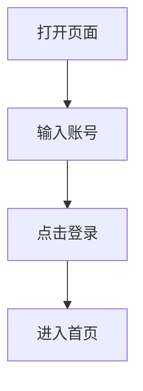

## 是什么

MarkText 是一个开源的桌面 Markdown 编辑器，主打**一边写一边看到最终排版**。日常类比：普通 Markdown 编辑器像厨房和餐厅分两间屋，你先在厨房写语法，再跑到餐厅看成品；MarkText 像开放式厨房，切菜、装盘、看到成品都在同一张桌上。

它不是知识库，也不是代码 IDE。它更像一个干净的写作台：标题、列表、表格、公式、图片、图表都能写，底层仍然保存成 `.md` 文本文件。

最小例子：

```markdown
# 周报

- [ ] 同步本周进展
- [ ] 记录下周风险

**结论**：先把事实写清楚，再补背景。
```

在 MarkText 里，`#`、`- [ ]`、`**` 这些标记会实时变成标题、任务框和加粗文本；切到源码模式时，仍能看到原始 Markdown。

## 为什么重要

不理解 MarkText 的定位，下面这些事都没法解释：

- 为什么很多新人写 Markdown 时会被双栏预览劝退：左边写符号，右边看结果，注意力一直被切走
- 为什么纯文本笔记比 Word 文档更适合进 Git：`.md` 可以 diff、review、搜索、长期保存
- 为什么 Typora 商业化后，社区还需要一个免费开源的实时预览写作工具
- 为什么一个编辑器可以不做插件生态、不做数据库，也能在 GitHub 上拿到五万多 stars：它把写作体验这件小事做得足够顺

## 核心要点

MarkText 的设计可以拆成 **三条**：

1. **实时预览编辑**：你输入 Markdown，界面直接展示排版结果。类比：写黑板字时旁边有一块透明玻璃，字写上去就自动变成印刷体。好处是新人不用在"源码脑"和"预览脑"之间切换。

2. **文件夹即工作区**：它可以打开一个目录，侧边栏显示文件树、已打开文件、文档目录，还能在目录内搜索。类比：不是把所有资料倒进一个私有仓库，而是给你的本地文件夹加一个更舒服的书桌。

3. **保持 Markdown 可带走**：表格、任务列表、图片、公式、Mermaid 等都落回 Markdown 或常见扩展。类比：你在好看的本子上写字，但撕下来仍是普通纸，别人拿任何 Markdown 工具都能读。

三条合起来就是 **"对人友好，对文件克制"**：它帮你少看语法噪声，但不把内容锁进自己的数据库。

## 实践案例

### 案例 1：把本地 notes 目录当成轻量工作台

官方 CLI 支持 `marktext [commands] [path ...]`。macOS 上可以先建一个别名：

```bash
alias marktext="/Applications/Mark\ Text.app/Contents/MacOS/Mark\ Text"
marktext ~/notes
marktext ~/notes/weekly.md
marktext --safe ~/notes/weekly.md
```

逐部分解释：

- `marktext ~/notes`：打开整个目录，侧边栏显示 Markdown 文件树
- `marktext ~/notes/weekly.md`：只打开一个文件，适合快速改周报
- `--safe`：临时禁用插件和用户配置，遇到启动异常时先排除配置问题

这个用法适合"我只想管一堆 `.md` 文件，不想上知识库系统"的人。

### 案例 2：写会议纪要时快速插入表格和任务

MarkText 的编辑文档里强调表格工具、任务列表和快捷键。你可以在界面里按 `CmdOrCtrl`+`Shift`+`T` 插表格，也可以直接写 Markdown：

```markdown
## 会议纪要

| 事项 | 负责人 | 截止时间 |
| --- | --- | --- |
| 补齐 FAQ | Alice | 周三 |
| 回归导出 PDF | Bob | 周五 |

- [ ] 确认图片是否都走相对路径
- [ ] 导出 HTML 发给非技术同学
```

逐部分解释：

- 表格行会被实时渲染，不用手动对齐每个 `|`
- `- [ ]` 会变成任务项，适合轻量 checklist
- 这份文件仍是普通 Markdown，发给同事或提交 Git 都不会丢结构

这就是 MarkText 最舒服的场景：内容结构不复杂，但你不想被语法细节打断。

### 案例 3：写带图片和图表的教程

官方文档支持剪贴板图片、相对资源目录、Mermaid / Vega-Lite 等图表代码块。比如写一段流程图：

````markdown



````

逐部分解释：

- ``：图片路径写在 Markdown 里，仓库能一起管理
- `mermaid` 代码块：文本就是图表源代码，改流程比拖拽形状更容易 review
- 导出 PDF / HTML 时，MarkText 会把当前排版带出去，适合给不看 Markdown 的读者

注意：如果团队要求所有图片都按固定目录命名，先在图片偏好里设好相对资源目录，再开始大量粘图。

## 踩过的坑

1. **把 MarkText 当知识库**：官方 FAQ 说它没有标签、双链、知识管理这些能力；原因是它只围绕本地 Markdown 文件做编辑。

2. **以为实时预览等于源码不重要**：导出或提交前仍要切一次源码模式；原因是某些扩展语法在别的渲染器里可能不完全一致。

3. **Linux 启动遇到 sandbox 报错**：FAQ 给了 user namespace、SUID 权限和 `--no-sandbox` 几种处理；原因是 MarkText 底层跑在 Electron / Chromium 上。

4. **只看安装命令不看版本状态**：Homebrew cask 曾出现 deprecated 警告，GitHub 也经历过较长维护空窗；原因是开源桌面软件维护成本高，安装前要确认最新 release。

## 适用 vs 不适用场景

**适用**：

- 写 README、周报、博客草稿、教程这种结构化文本
- 给 Markdown 新手做入门工具，降低语法和预览切换的门槛
- 本地文件夹管理笔记，想用 Git 同步和回滚
- 需要偶尔导出 PDF / HTML 给非技术读者

**不适用**：

- 想要 Obsidian / Logseq 那种双链、标签、图谱、每日笔记系统
- 想要 VS Code 那种语言服务、调试、终端、插件生态
- 想在 CI 里批量转换文档；这类任务更适合 Pandoc 或静态站点生成器
- 团队强依赖统一渲染规范，且 Markdown 扩展必须和线上完全一致

## 历史小故事（可跳过）

- **2017 年**：MarkText 项目在 GitHub 上起步，目标是做一个简洁、跨平台、开源的 Markdown 桌面编辑器。
- **2018-2019 年**：凭借"像 Typora 但开源免费"的体验快速传播，维护者也公开招募更多贡献者，因为项目已经是业余维护压力不小。
- **2022 年前后**：桌面端依赖、Electron 版本、发布流水线都带来维护压力，社区开始频繁讨论更新节奏。
- **2026 年**：GitHub 页面显示项目仍在继续发布，stars 已到五万多；这说明好工具即使不追大而全，也能长期被写作者记住。

这段历史的重点不是"它永远最强"，而是"把 Markdown 写作体验做顺"本身就足以撑起一个长期项目。

## 学到什么

1. **写作工具的核心不是功能数量**：MarkText 赢在让用户少切换、少分心、少看噪声。
2. **开源桌面软件最难的是持续维护**：跨平台打包、系统权限、Electron 升级都不是一次写完就结束。
3. **文件格式越普通，迁移成本越低**：MarkText 把内容留在 Markdown，用户随时能换工具。
4. **实时预览是新人友好设计**：它把"先学语法再看到结果"改成"先看到结果，再慢慢理解语法"。

## 延伸阅读

- 官方仓库：[marktext/marktext](https://github.com/marktext/marktext)
- 用户文档：[MarkText Docs](https://marktext.me/docs/introduction)
- 基础操作：[Basics](https://marktext.me/docs/basics)
- 命令行：[Command line interface](https://marktext.me/docs/cli)
- 图片处理：[Image support](https://marktext.me/docs/images)
- 同类说明：[Markdown Guide: Mark Text](https://www.markdownguide.org/tools/mark-text/)

## 给零基础读者的"先做这件事"

如果你第一次试 MarkText，不要先研究所有设置，按这个顺序来：

1. 新建一个 `notes/` 文件夹，里面放 `today.md`、`weekly.md`、`ideas.md`
2. 用 MarkText 打开整个文件夹，试一次侧边栏、目录、快速打开
3. 写一段带标题、任务列表、表格、图片的 Markdown
4. 切到源码模式，看它到底保存成什么文本
5. 导出一次 PDF，再用普通文本编辑器打开同一个 `.md` 文件，确认内容没有被锁住

做完这五步，你就能判断它是不是适合当你的日常写作台。

## 关联

- [[markdown-it]] —— MarkText 输出的是 Markdown，最终总要被某个渲染器解释
- [[marked]] —— 另一条 Markdown 解析器路线，适合理解"文本到 HTML"这一步
- [[micromark]] —— CommonMark 级别的底层解析器，与 MarkText 支持规范形成对照
- [[prosemirror]] —— 富文本编辑器框架，和 MarkText 的"所见即所得但存 Markdown"路线相邻
- [[lexical]] —— 现代富文本编辑内核，适合对比文档模型和 Markdown 文本模型
- [[vscode]] —— 更像开发 IDE；MarkText 则专注写作而不是代码工程
- [[atom]] —— 同属 Electron 桌面应用谱系，能看到 Web 技术做桌面工具的利弊

## 反向链接

<!-- 由 scripts/regen-backlinks.mjs 自动生成 -->

- [[foam]] —— Foam — 把 VS Code 变成 Markdown 双链知识库
- [[hedgedoc]] —— HedgeDoc — 协作 Markdown 编辑
- [[joplin]] —— Joplin — 开源 Evernote 替代
- [[logseq]] —— Logseq — 块结构离线知识库
- [[nodegui]] —— nodegui — 用 Node.js 写原生桌面窗口
- [[silverbullet]] —— SilverBullet — 自托管笔记 web 应用
- [[trilium]] —— Trilium — 树形层级笔记系统
- [[zettlr]] —— Zettlr — 学者向 Markdown 编辑器
