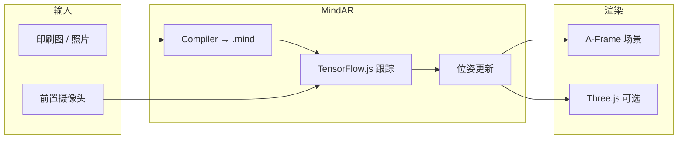

## 是什么

MindAR（[hiukim/mind-ar-js](https://github.com/hiukim/mind-ar-js)）是一套**纯浏览器端**的 Web AR 库，支持 **图像追踪（Image Tracking）** 和 **人脸追踪（Face Tracking）**。底层用 TensorFlow.js 在 WebGL 上跑特征检测与跟踪，上层提供 A-Frame 扩展和 Three.js API，让你用静态 HTML 就能做出「扫海报出 3D 模型」「试戴虚拟眼镜」这类体验。

日常类比：想象你在博物馆看一幅名画，手机摄像头对准画框，画面上「长」出一段讲解动画——MindAR 负责两件事：认出「就是这幅画」（图像追踪），以及把 3D 内容稳稳贴在画上（位姿跟踪）。人脸模式则像短视频滤镜：库持续跟踪鼻尖、额头、耳垂等锚点，你把帽子、眼镜模型挂到对应锚点上，用户转头时配饰跟着动。

和需要安装 App 的 ARKit / ARCore 不同，MindAR **零原生依赖**：一个 `.html` 文件 + CDN 脚本 + 本地静态服务器即可在 Chrome / Safari 移动端跑通。若要做 GPS 定位 AR 或黑白 fiducial 标记追踪，官方建议改用 [AR.js](https://github.com/AR-js-org/AR.js)；MindAR 专注「自然特征」图像与人脸。

```html
<!-- 最小图像追踪骨架：约 10 行有效 AR 代码 -->
<a-scene mindar-image="imageTargetSrc: ./targets.mind;" vr-mode-ui="enabled: false">
  <a-camera position="0 0 0" look-controls="enabled: false"></a-camera>
  <a-entity mindar-image-target="targetIndex: 0">
    <a-box color="#4CC3D9" scale="0.5 0.5 0.5"></a-box>
  </a-entity>
</a-scene>
```

## 为什么重要

不了解 MindAR，下面这些事很难在 Web 侧落地：

- **营销/展览扫码互动**：海报、包装盒、门票上的印刷图可直接当「锚点」，无需贴 AR 专用二维码
- **电商虚拟试戴**：眼镜、帽子、耳环挂到人脸 486 个 landmark 锚点之一，比从零接 MediaPipe + Three.js 省大量胶水代码
- **与 A-Frame 生态衔接**：已有 WebVR 经验的人，用 `mindar-image-target` / `mindar-face-target` 组件即可扩展 AR，学习曲线平缓
- **编译期预处理**：目标图特征提取在构建时完成，运行时只加载紧凑的 `.mind` 文件，首屏比现场算特征快得多

## 核心概念

### 1. 两条产品线：Image vs Face

| 模式 | 入口脚本 | 场景属性 | 锚定方式 |
|------|----------|----------|----------|
| 图像追踪 | `mindar-image-aframe.prod.js` | `mindar-image="imageTargetSrc: ..."` | `mindar-image-target="targetIndex: N"` |
| 人脸追踪 | `mindar-face-aframe.prod.js` | `mindar-face` | `mindar-face-target="anchorIndex: N"` |

图像模式：一张印刷图 = 一个 target，`targetIndex` 从 0 起，支持多图同场景。人脸模式：基于 TensorFlow 人脸 mesh，**486 个 anchorIndex**（鼻尖常为 `1`，额头附近 `10`，详见 [mesh_map.jpg](https://github.com/tensorflow/tfjs-models/blob/master/face-landmarks-detection/mesh_map.jpg)）。

### 2. 编译目标图 → `.mind` 文件

图像追踪不能直接把 JPG 丢进运行时——须先用 **Image Targets Compiler**（[在线编译器](https://hiukim.github.io/mind-ar-js-doc/tools/compile) 或 npm 包里的 `Compiler`）扫描图片，提取角点、边缘等 **feature points**，序列化为 `.mind`。

好目标图特征：纹理丰富、对比明显、无大块留白；反面教材是纯色墙或重复条纹。编译完成后可下载可视化图，绿点表示特征分布——点太少或挤在一角会导致识别不稳。

### 3. AR 引擎只做一件事

官方文档强调：MindAR **只负责更新 `a-entity` 的可见性与位姿**。3D 内容（平面、glTF、动画）仍由 A-Frame / Three.js 渲染；业务逻辑（切换配饰、计分、跳转）用普通 JavaScript 事件完成。图像追踪常见事件：`targetFound`、`targetLost`；人脸试戴则常用 `visible` 属性切换多个互斥模型。

### 4. TensorFlow.js + WebGL 后端

检测与跟踪核心写在 TF.js 算子里，推理走 **WebGL backend**（GPU）。首次加载会下载模型权重，移动端建议控制 glTF 面数与纹理尺寸。桌面调试需 **localhost HTTP 服务**——`file://` 打开会因摄像头权限和模块加载失败；`npx serve .` 或 Vite 开发服务器即可。

### 5. Three.js 路径（进阶）

除 A-Frame 外，dist 还提供 `mindar-image.prod.js` / `mindar-face.prod.js`，可 `new MindARThree({ container, imageTargetSrc })` 手动挂 Three.js 场景，适合已有 Three 管线、不想引入 A-Frame 的项目。examples 目录有 `three.html` 演示启停相机、前后摄切换。

## 实践案例

### 案例 1：图像追踪 — 扫描贺卡弹出 3D 角色

完整静态页（与官方 Quick Start 一致，版本可改用 npm `mind-ar@1.2.5`）：

```html
<!DOCTYPE html>
<html>
  <head>
    <meta name="viewport" content="width=device-width, initial-scale=1" />
    <script src="https://aframe.io/releases/1.6.0/aframe.min.js"></script>
    <script src="https://cdn.jsdelivr.net/npm/mind-ar@1.2.5/dist/mindar-image-aframe.prod.js"></script>
  </head>
  <body>
    <a-scene
      mindar-image="imageTargetSrc: https://cdn.jsdelivr.net/gh/hiukim/mind-ar-js@1.2.5/examples/image-tracking/assets/card-example/card.mind;"
      color-space="sRGB"
      renderer="colorManagement: true, physicallyCorrectLights"
      vr-mode-ui="enabled: false"
      device-orientation-permission-ui="enabled: false">
      <a-assets>
        
        <a-asset-item id="avatarModel" src="https://cdn.jsdelivr.net/gh/hiukim/mind-ar-js@1.2.5/examples/image-tracking/assets/card-example/softmind/scene.gltf"></a-asset-item>
      </a-assets>

      <a-camera position="0 0 0" look-controls="enabled: false"></a-camera>

      <a-entity mindar-image-target="targetIndex: 0">
        <!-- 平面贴图与物理卡片对齐 -->
        <a-plane src="#card" position="0 0 0" height="0.552" width="1" rotation="0 0 0"></a-plane>
        <!-- glTF 角色带上下浮动动画 -->
        <a-gltf-model
          rotation="0 0 0"
          position="0 0 0.1"
          scale="0.005 0.005 0.005"
          src="#avatarModel"
          animation="property: position; to: 0 0.1 0.1; dur: 1000; easing: easeInOutQuad; loop: true; dir: alternate">
        </a-gltf-model>
      </a-entity>
    </a-scene>
  </body>
</html>
```

**要点**：

- `imageTargetSrc` 指向预编译的 `.mind`，与展示用 `card.png` 内容对应
- `look-controls="enabled: false"` 防止用户拖拽视角干扰 AR 相机
- 子实体坐标相对 target 平面，单位与 A-Frame 一致（target 宽度通常为 1）

监听识别状态（可加在 `</a-scene>` 前）：

```html
<a-entity mindar-image-target="targetIndex: 0"
  id="target0"></a-entity>
<script>
  document.querySelector('#target0').addEventListener('targetFound', () => {
    console.log('识别到目标图');
  });
  document.querySelector('#target0').addEventListener('targetLost', () => {
    console.log('目标丢失');
  });
</script>
```

### 案例 2：人脸追踪 — 鼻尖绿球与虚拟帽子试戴

最小人脸 demo（鼻尖 anchor `1`）：

```html
<!DOCTYPE html>
<html>
  <head>
    <meta name="viewport" content="width=device-width, initial-scale=1" />
    <script src="https://aframe.io/releases/1.6.0/aframe.min.js"></script>
    <script src="https://cdn.jsdelivr.net/npm/mind-ar@1.2.5/dist/mindar-face-aframe.prod.js"></script>
  </head>
  <body>
    <a-scene mindar-face embedded color-space="sRGB"
      renderer="colorManagement: true, physicallyCorrectLights"
      vr-mode-ui="enabled: false"
      device-orientation-permission-ui="enabled: false">
      <a-camera active="false" position="0 0 0"></a-camera>
      <a-entity mindar-face-target="anchorIndex: 1">
        <a-sphere color="green" radius="0.1"></a-sphere>
      </a-entity>
    </a-scene>
  </body>
</html>
```

扩展为试戴帽子：在额头锚点 `10` 挂 glTF，用 JS 切换可见性（官方 [Virtual Try-On](https://hiukim.github.io/mind-ar-js-doc/face-tracking-examples/tryon/) 同款模式）：

```html
<a-assets>
  <a-asset-item id="hatModel" src="./assets/hat/scene.gltf"></a-asset-item>
</a-assets>
<a-entity mindar-face-target="anchorIndex: 10">
  <a-gltf-model
    src="#hatModel"
    rotation="0 0 0"
    position="0 1.0 -0.5"
    scale="0.35 0.35 0.35"
    class="hat-entity"
    visible="false">
  </a-gltf-model>
</a-entity>
<button id="btn-hat">戴帽子</button>
<script>
  const hat = document.querySelector('.hat-entity');
  document.getElementById('btn-hat').addEventListener('click', () => {
    hat.setAttribute('visible', hat.getAttribute('visible') !== 'true');
  });
</script>
```

人脸场景常用 **head occluder**（`mindar-face-occluder` + 头部遮挡用 glb）让眼镜腿藏进头发后面，立体感更真实。

## 与相关项目的关系



- **[A-Frame](aframe.md)**：MindAR 推荐的场景描述层；`<a-scene mindar-image>` 即 AR 会话入口
- **AR.js**：同属 Web AR，偏 GPS / marker；与 MindAR 互补而非替代
- **PlayCanvas / three.js**：若需重度游戏逻辑，可用 MindAR Three API 把跟踪矩阵喂给自有渲染循环

## 开发与部署清单

1. **本地**：`npx serve .` 或 `python -m http.server`，HTTPS 生产环境摄像头权限更稳
2. **编译**：自有图片 → [Image Targets Compiler](https://hiukim.github.io/mind-ar-js-doc/tools/compile) → `targets.mind`
3. **依赖版本**：A-Frame 与 `mind-ar` 主版本宜与[官方示例](https://hiukim.github.io/mind-ar-js-doc/quick-start/overview)对齐，避免组件 API 漂移
4. **性能**：限制同时追踪 target 数量；人脸场景减少透明材质与实时阴影
5. **发布**：纯静态资源，可挂 Vercel / GitHub Pages / 任意 CDN；注意跨域加载 `.mind` 与 glTF 的 CORS 头

从仓库开发：`npm run build` 产出 `dist/`；`npm run watch` 便于改 Three 版核心。examples 目录覆盖多目标追踪、自定义 UI、事件接口等，是读完 Quick Start 后的下一站。

## 小结

MindAR 把「识别物理世界中的图或脸」和「在 WebGL 里贴 3D」拆成清晰两步：**离线编译特征** + **在线跟踪位姿**。零基础路径：选模式 → 编译或选 anchor → 复制 A-Frame 模板 → 本地 HTTP 打开手机测。掌握 `imageTargetSrc`、`.mind`、`targetIndex` / `anchorIndex` 四条主线，就能从贺卡 AR 扩展到多图展览与虚拟试戴产品线。
