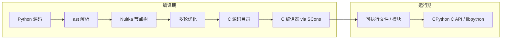

## 是什么

**Nuitka** 是 [Nuitka/Nuitka](https://github.com/Nuitka/Nuitka) 维护的 **Python 优化编译器（AOT, Ahead-Of-Time）**：在运行程序**之前**，把 `.py` 源码翻译成 **C/C++ 源文件**，再调用系统 C 编译器（经 **SCons** 编排）链接成 **原生可执行文件** 或 **扩展模块**。它仍深度依赖 **CPython 运行时 API**（`PyObject*`、内置类型、导入机制），语义目标是「和用解释器跑一样」，而不是换一门语言。

日常类比：如果把 **CPython** 想成「每次点菜都现炒」的中央厨房，把 **PyInstaller** 想成「把整个厨房、冰箱、煤气罐一起打包进集装箱运到客户现场」，那 **Nuitka** 更像 **把菜谱提前翻译成米其林主厨能直接执行的工序卡（C 代码），在客户工厂里现焊一台专用灶台（原生二进制）**：

- **菜谱翻译**（Python → Nuitka 节点树 → C）发生在**编译期**，不是运行时边跑边猜；
- **优化师**（多轮 `optimizeModules`）像品控：常量折叠、死代码消除、类型特化，反复改稿直到改不动；
- **焊工**（GCC / Clang / MSVC / MinGW / Zig）把 C 烙成机器码，启动时不必再解析 `.py`；
- **集装箱模式**（`--mode=standalone` / `onefile`）仍可把依赖的 `.so` / `.dll` 和数据文件一起带走，方便分发；
- **源码保护**：发布物里不再附带可读 `.py`（商业场景常关心字符串与逻辑外泄）。

Nuitka **用 Python 写编译器本身**，却给用户程序走 **编译到 C** 的路径；与 **PyPy**（RPython 写 VM + 运行时 JIT）、**Cython**（手写类型注解生成 C 扩展）形成不同分工。官方支持 **Python 3.4–3.13** 与 **2.6/2.7**，覆盖 Windows、macOS、Linux、FreeBSD 等主流平台。

## 为什么重要

不懂 Nuitka，下面这些决策容易踩坑：

- **「打包 Python 程序」该选 PyInstaller 还是 Nuitka**——前者主要是**嵌入解释器 + 收集依赖**；后者是**真编译**，启动与热路径往往更快，但首次编译慢、需要 C 工具链
- **为什么编译后 `dis.dis()` 看不到字节码**——函数对象没有 `co_code`，调试方式要换（见局限）
- **为什么 NumPy / PySide 还要配 plugin 和 package config**——动态导入、隐式数据文件、`.dll` 依赖需要显式告诉 Nuitka
- **为什么必须用 CPython 来跑 Nuitka**——生成代码调用 CPython C API，与 PyPy 等替代实现不兼容
- **AOT 与 JIT 的取舍**——Nuitka 在**短进程 CLI** 上常比「等 JIT 预热」的 PyPy 更稳；超长纯 Python 数值循环则未必赢 PyPy

## 核心概念

### 1. 在 Python 工具链谱系中的位置

| 工具 | 本质 | 典型产物 | 运行时 |
|------|------|----------|--------|
| **CPython** | 解释器 | `python script.py` | 每次解释字节码 |
| **PyInstaller / cx_Freeze** | 打包器 | 目录或单文件，内嵌解释器 | 仍是解释执行 |
| **Nuitka** | AOT 编译器 | `.exe` / `.bin` / 原生模块 | 编译进二进制的 C + libpython |
| **Cython** | 源到源 + 扩展 | `.so` / `.pyd` | 需 CPython 加载扩展 |
| **PyPy** | 替代 VM + JIT | `pypy3` 可执行文件 | 跟踪 JIT 热路径 |

一句话：**PyInstaller 搬厨房，Nuitka 把菜做成预制菜工厂。**

### 2. 四阶段编译流水线

`MainControl.py` 编排端到端流程（概念与官方/社区文档一致）：

```
Python 源码 (.py)
  ▼ Parse          标准库 ast → Nuitka 节点树（Building.py）
  ▼ Optimize       多轮 optimizeModules 直到不动点
                   （常量折叠、分支裁剪、类型推断、闭包分析…）
  ▼ Generate C     makeSourceDirectory → 大量 .c / .h
  ▼ Compile        runSconsBackend → SCons 调 C 编译器 → 二进制
```

节点树阶段会建立 **变量作用域、闭包、SSA 式 trace**，再驱动 `computeExpression()` 等自变换优化。生成 C 时大量调用 **CPython C API**，保证 `import`、`try/except`、描述符协议等行为与解释器一致。

### 3. 编译模式（`--mode`）

| 模式 | 行为 | 适用 |
|------|------|------|
| **accelerated**（默认） | 生成与脚本同名的加速二进制，仍依赖系统 Python 环境 | 本地加速、开发迭代 |
| **standalone** | 独立目录，拷贝所需 stdlib 片段与依赖 `.so` | 服务器、内网分发 |
| **onefile** | 单文件可执行，启动时解压到临时目录 | 给最终用户一个 exe |
| **app** | macOS `.app` 等应用包形态 | 桌面 GUI |
| **module** | 编译为扩展模块 `.so` / `.pyd` | 隐藏实现、加速库 |
| **package** | 以包为入口（类似 `python -m pkg`） | 可执行包 |

`--mode=onefile` 启动快，但**第一次解压**有成本；`standalone` 启动通常更快、排查依赖更直观。

### 4. 与 CPython 的耦合点

- **必须用 CPython 执行** `python -m nuitka`（Anaconda 等变种大多可用，Microsoft Store 版不推荐）
- 生成代码假设 **GIL、对象布局、异常传播** 与当前 CPython 版本匹配
- **C 扩展模块**（`numpy`、`cryptography` 等）以二进制形式链入，不靠重新编译其 C 源码
- **插件**（`--enable-plugin=numpy`、`pyside6` 等）修补第三方包的隐式导入与 Qt 插件路径

### 5. 优化在编译期完成

Nuitka 的「快」主要来自：

- 去掉 **字节码解释循环** 的开销（函数体已是 C）
- **编译期常量折叠**、**内置调用内联**、**类型已知时的特化路径**
- **LTO / PGO**（取决于 C 编译器与选项）

它**不是** PyPy 那种「跑起来才发现热循环再 JIT」。因此：**改一行代码往往要重新完整编译**，CI 里要预算时间。

### 6. 数据文件与「代码不是数据」

配置、图片、`.json` 用 `--include-data-files`、`--include-package-data` 等打入分发包。**`.py` / `.pyc` / `.so` 不会被当成普通数据文件**——代码依赖要走 `--include-module` 或正常 import 分析。第三方包缺文件时，社区维护 **Nuitka Package Configuration**（YAML）描述隐式 DLL、数据路径。

### 7. `nuitka-project` 内嵌选项

可在源码**注释**里写编译指令，便于「单文件即构建脚本」：

```python
# nuitka-project: --mode=onefile
# nuitka-project-if: {OS} == "Windows":
#    nuitka-project: --windows-console-mode=disable
```

支持 `{OS}`、`{MAIN_DIRECTORY}`、`{Arch}` 等变量展开，适合跨平台 CI 同一份源码。

### 8. 局限与语义差异

| 话题 | 说明 |
|------|------|
| **`co_code` / `dis`** | 编译后函数无字节码，`dis.dis(fn)` 无意义 |
| **`pdb` 单步** | 不能像在纯 `.py` 里那样跟踪编译函数内部 |
| **首次编译时间** | 中大型项目可达数分钟至数十分钟 |
| **工具链** | Windows 需 MSVC 或 Nuitka 捆绑的 MinGW64；macOS 需 Xcode CLI |
| **极端动态代码** | `eval`、`exec`、运行时改 `sys.modules` 仍可能工作，但削弱优化 |

## 架构一图



## 从零开始：安装与第一次编译

**依赖**：已安装的 **CPython**、可用的 **C 编译器**（Linux 上 `gcc`/`clang`，macOS 上 Xcode，`pip install nuitka` 会拉取部分依赖如 `ordered-set`）。

```bash
python -m pip install -U nuitka ordered-set zstandard
python -m nuitka --version
```

## 代码示例

### 示例 1：CLI 工具编译为单文件可执行

假设 `greet_cli.py`：

```python
#!/usr/bin/env python3
"""简单 CLI：编译后可在无 Python 的机器上运行（onefile）。"""

import argparse
import sys


def main() -> int:
    parser = argparse.ArgumentParser(description="向某人问好")
    parser.add_argument("name", help="名字")
    parser.add_argument("-u", "--upper", action="store_true", help="大写输出")
    args = parser.parse_args()
    msg = f"Hello, {args.name}!"
    print(msg.upper() if args.upper else msg)
    return 0


if __name__ == "__main__":
    sys.exit(main())
```

编译命令（Linux / macOS 示例；Windows 把输出名换成 `greet_cli.exe`）：

```bash
python -m nuitka \
  --mode=onefile \
  --output-filename=greet_cli.bin \
  --assume-yes-for-downloads \
  greet_cli.py

# 运行
./greet_cli.bin Alice
./greet_cli.bin bob --upper
```

说明：

- `--assume-yes-for-downloads` 允许 Nuitka 自动下载兼容的 C 编译器组件（如 MinGW），CI 里常用
- **onefile** 会把依赖打进一个文件；首次启动会解压到临时目录，GUI 程序可配 **splash screen** 掩盖导入耗时
- 若只要本机加速、不追求独立分发，可省略 `--mode=onefile`（默认 accelerated）

### 示例 2：在源码内声明跨平台 `nuitka-project` 选项

把构建配置写进主文件，避免 shell 脚本分叉：

```python
# nuitka-project-if: {OS} in ("Windows", "Linux", "Darwin"):
#    nuitka-project: --mode=onefile
# nuitka-project-else:
#    nuitka-project: --mode=standalone

# nuitka-project-if: {OS} == "Windows":
#    nuitka-project: --windows-console-mode=disable

# nuitka-project: --include-data-files={MAIN_DIRECTORY}/config.json=config.json

import json
import pathlib
import sys

ROOT = pathlib.Path(__file__).resolve().parent


def load_config() -> dict:
    cfg_path = ROOT / "config.json"
    if not cfg_path.exists():
        # standalone/onefile 下数据文件在分发目录内
        cfg_path = pathlib.Path("config.json")
    return json.loads(cfg_path.read_text(encoding="utf-8"))


def main() -> None:
    cfg = load_config()
    print(f"app={cfg.get('app_name')}, version={cfg.get('version')}")


if __name__ == "__main__":
    main()
```

编译时仍只需：

```bash
python -m nuitka app_main.py
```

Nuitka 会读取文件头注释中的 `nuitka-project*` 指令，在 Windows 上打 onefile 并隐藏控制台，在其他系统用 standalone。`{MAIN_DIRECTORY}` 展开为被编译主文件的目录，适合相对路径打包资源。

### 示例 3：测量编译产物与 import 开销（对比直觉）

下面脚本**用于理解**而非严谨基准：同一逻辑在解释器与编译二进制下的启动差异因模式、缓存、磁盘而异。

```python
# bench_import.py — 用 python bench_import.py 跑；编译后用 ./bench_import.bin
import time

t0 = time.perf_counter()

def hot_loop(n: int) -> int:
    s = 0
    for i in range(n):
        s += i * i
    return s

result = hot_loop(500_000)
elapsed = time.perf_counter() - t0
print(f"result={result}, wall={elapsed:.4f}s")
```

```bash
# 解释器
python bench_import.py

# 编译（standalone 便于 strace / 查看目录）
python -m nuitka --mode=standalone --output-dir=build bench_import.py
./build/bench_import.bin
```

在 **CPU 密集纯 Python 循环** 上，编译版常有可见提升；若热点在 **NumPy C 扩展** 里，两者差距会缩小——瓶颈已不在字节码解释。

## 常用命令速查

```bash
# 查看全部选项
python -m nuitka --help

# 模块模式：生成 mypkg.so 供 CPython import
python -m nuitka --module mypkg/__init__.py

# 包含整个包 + 数据
python -m nuitka --mode=standalone --include-package=mypkg --include-package-data=mypkg app.py

# 启用 NumPy / Qt 等插件
python -m nuitka --enable-plugin=numpy --enable-plugin=pyside6 gui.py

# 生成编译报告（排错必备）
python -m nuitka --report=compilation-report.xml --mode=onefile app.py
```

## 与周边生态的关系

| 项目 | 关系 |
|------|------|
| **CPython** | Nuitka 的语义基准与 C API 宿主；编译器自身也用 CPython 运行 |
| **PyInstaller** | 竞品/互补：打包快、配置熟；Nuitka 编译慢但运行时与保护性往往更好 |
| **Cython** | 手写类型可极致优化单模块；Nuitka 全自动、少改源码 |
| **PyPy** | 另一轴优化（JIT）；与 Nuitka 的 AOT 场景不同，不宜简单二选一 |
| **SCons** | Nuitka 内置后端，驱动 C/C++ 编译与链接 |
| **Nuitka Commercial** | 官方商业分支，额外 IP 保护、Windows 服务封装等企业特性 |

## 学习路径建议

1. **先会跑**：`pip install nuitka`，用示例 1 编译一个无第三方依赖的 CLI，确认工具链可用
2. **读 Compilation Report**：`--report=compilation-report.xml`，弄清哪些模块被拉进、哪些被优化掉
3. **加一个真实依赖**：例如 `requests` 或 `numpy`，体验 `--include-package-data` 与 `--enable-plugin`
4. **对照 CPython 笔记**：理解「没有字节码」与 C API 边界后，再读官方 [User Manual](https://nuitka.net/user-documentation/user-manual.html) 的 Data Files、Plugins 章节
5. **CI 集成**：生产环境可用 [Nuitka-Action](https://github.com/Nuitka/Nuitka-Action) 矩阵构建多平台产物

## 延伸阅读

- 官方站点与手册：[nuitka.net](https://nuitka.net/) · [User Manual](https://nuitka.net/user-documentation/user-manual.html)
- 源码入口：`MainControl.py`（主编排）、`nuitka/tree/Building.py`（AST → 节点树）、`nuitka/optimizations/Optimization.py`（优化循环）
- 论文视角：*An Empirical Study on the Performance and Energy Usage of Compiled Python Code*（arXiv:2505.02346）将 Nuitka 与 PyPy、Numba 等一并比较
- 本库相关笔记：[CPython](./cpython.md)（解释器与字节码）、[PyPy](./pypy.md)（JIT 路线）
