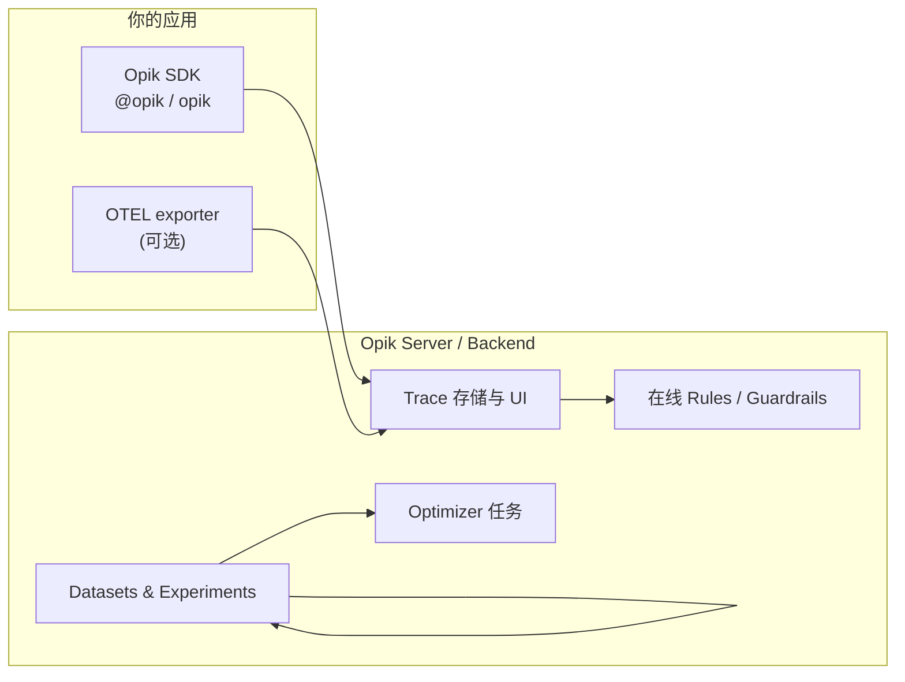

## 日常类比：飞行记录仪 + 质检车间 + 调参台

把手机壳工厂想成一家「AI 应用工厂」：

- **客户投诉**：答案胡编、越权、Agent 死循环  
- **车间主任的三件事**：  
  1. **飞行记录仪（Tracing）**：每一步谁说了什么、调了哪个工具、花了多少 token  
  2. **质检线（Evaluation）**：出货前用标准卷宗批量打分  
  3. **调参台（Optimization）**：根据次品反推提示词该怎么改  

[Opik](https://github.com/comet-ml/opik)（Comet 开源，Apache 2.0）就是这套车间的**一体化系统**：Python/TypeScript SDK、自托管 Docker Compose 或 Comet 云、OpenTelemetry 兼容 trace、在线/离线评测、提示词实验与 **OPIK Agent Optimizer**（论文见 [Opik Agent Optimization](../../papers/opik-agent-optimization.md)）。

它和纯「评测脚本集合」不同：强调 **生产可观测 → 结构化评估 → 闭环优化** 的一条链。

---

## 是什么：LLMOps 里 Opik 占哪一块



| 能力 | 一句话 |
|------|--------|
| **Tracing** | 嵌套 span：模型、工具、检索、Agent 回合 |
| **Evaluation** | 数据集项 + `evaluate()` / experiment 对比指标 |
| **在线评估** | 抽样把 trace 送进 metrics / 自定义 scorer |
| **Annotations** | 人在 UI 上标对错，反哺评测集 |
| **Prompt 管理** | 版本、Playground、与实验绑定 |
| **Agent Optimizer** | 用失败轨迹迭代提示词（MetaPrompt、GEPA 等） |
| **Guardrails** | 规则 + LLM Judge 拦截次品输出 |

README 称单节点 **>100k traces/秒** ingest、百万级检索（具体取决于部署与硬件）。

---

## 核心概念

### 1. Trace / Span 与 `@track`

一次用户请求是一棵 **trace**；每个 LLM 调用、工具、子 Agent 是 **span**。`@track` 装饰器自动记录输入输出、耗时、错误，并支持 `flush_tracker`、`sleep` 等异步场景。

### 2. Dataset、Experiment、Metric

- **Dataset**：`DatasetItem(input=..., expected_output=...)` 列表  
- **Experiment**：对同一 dataset 跑多组配置（模型、prompt 版本）  
- **Metric**：`context_precision`、`answer_relevance` 或自定义 `BaseMetric`  

这与 [Mira 多维度评测基准](../../papers/mira-rubric.md) 强调的「rubric 可审计」互补：Opik 管**流水线**，Mira 管**题目与准则长什么样**。

### 3. 在线 vs 离线评估

- **离线**：发版前 `evaluate()` 全量扫 dataset  
- **在线**：production trace 抽样 → scorer → 超阈值告警（对接 [[steering-vector-constraint]] 一类「事后约束」时，常先要有 trace 才知道约束是否生效）

### 4. OpenTelemetry

已有 OTEL 栈的应用可把 exporter 指到 Opik，避免双写 SDK；见官方 OpenTelemetry 文档。

### 5. 与竞品简表

| 维度 | Opik | Langfuse | Arize Phoenix |
|------|------|----------|---------------|
| 自托管 | Docker Compose | 有 | 有 |
| 评测 + 实验 | 一等公民 | 有 | 偏观测 |
| Prompt 优化器 | OPIK Agent Optimizer | 较弱 | 无 |
| OpenTelemetry | 支持 | 支持 | 支持 |

选型：要 **评+优+观** 一体且能接受 Comet 生态 → Opik；只要 trace UI → 三皆可。

---

## 例子 A：最小 Trace + 装饰器

```python
import opik
from opik import track

opik.configure(use_local=True)  # 或 cloud API key

@track
def retrieve(query: str) -> list[str]:
    return ["doc-1: refund policy 30 days"]

@track
def generate_answer(query: str, docs: list[str]) -> str:
    ctx = "\n".join(docs)
    return f"Based on: {ctx}\nAnswer: You may return within 30 days."

@track
def handle_ticket(query: str) -> str:
    docs = retrieve(query)
    return generate_answer(query, docs)

if __name__ == "__main__":
    print(handle_ticket("What is the refund policy?"))
    opik.flush_tracker()
```

在 Opik UI 里应看到 **3 层 span**：`handle_ticket` → `retrieve` / `generate_answer`，便于对照 [[mem-ft-lora|Mem@M_{FT+LoRA}]] 式「记忆写了但模型没用」类问题。

---

## 例子 B：离线 `evaluate()` + 内置指标

```python
import os
from opik import Opik
from opik.evaluation import evaluate
from opik.evaluation.metrics import (
    AnswerRelevance,
    ContextPrecision,
    Hallucination,
)

client = Opik(use_local=True)

dataset = client.get_or_create_dataset("support-faq-v1")
dataset.insert([
    {"input": "refund window?", "expected_output": "30 days"},
    {"input": "shipping to EU?", "expected_output": "5-7 business days"},
])

def pipeline(item):
    # 生产中替换为真实 RAG + LLM
    return {"output": "30 days", "context": ["policy doc"]}

result = evaluate(
    dataset=dataset,
    task=pipeline,
    scoring_metrics=[
        AnswerRelevance(),
        ContextPrecision(),
        Hallucination(),
    ],
    experiment_name="baseline-gpt4o-mini",
    project_name="support-bot",
)

print(result)
```

`evaluate()` 会为每条样本写 experiment 行，UI 可对比多次实验。敏感场景可把 `Hallucination` 换成规则 + 人审 [[dwork-differential-privacy-2006|差分隐私]] 发布前的红队集。

---

## 例子 C：TypeScript（Next.js API Route）

```typescript
import { Opik } from "opik";

const client = new Opik({
  projectName: "my-app",
  // apiKey / baseUrl from env
});

export async function POST(req: Request) {
  const { message } = await req.json();
  const trace = client.trace({ name: "chat-turn", input: { message } });

  const span = trace.span({
    name: "llm-call",
    type: "llm",
    input: { prompt: message },
  });

  const answer = await callYourModel(message); // your wrapper

  span.end({ output: { answer } });
  trace.end({ output: { answer } });
  await client.flush();

  return Response.json({ answer });
}
```

与 [[anyscale-ray-data|Ray Data]] 批推理对比：Opik 管**单次请求可解释性**；Ray Data 管**离线大批量吞吐**——常组合使用（Ray 跑批，Opik 抽样子集做 eval）。

---

## 例子 D：自托管与生产注意点

```bash
git clone https://github.com/comet-ml/opik.git
cd opik
./opik.sh

export OPIK_URL_OVERRIDE=http://localhost:5173/api
export OPIK_WORKSPACE=default
```

- **数据驻留**：金融/医疗常必须 `use_local=True`  
- **采样率**：在线评估对 100% trace 跑 LLM Judge 会贵，用 `sample_rate`  
- **PII**： SDK `privacy` / 脱敏规则，避免把身份证写进 span  
- **与 [[SGLang|SGLang]] / [[vLLM|vLLM]]**：在推理网关外侧包一层 `@track`，不要改引擎内核  

---

## 与「训练 / 推理 / 安全」文献的衔接

| 主题 | 关联 |
|------|------|
| Agent 优化 | [Opik Agent Optimization](../../papers/opik-agent-optimization.md) — MetaPrompt、Few-shot、GEPA |
| KV / 吞吐 | 观测到 TTFT 尖刺后，再查 [[Mooncake|Mooncake]]、[[FlashAttention-2|FA2]] |
| 对齐与约束 | 在线规则类似轻量 [[Safe RLHF|Safe RLHF]] 部署侧护栏 |
| 评测哲学 | [[MIRA|MIRA]] 定 rubric，Opik 跑 experiment |
| LLM Judge | [[llm-as-judge|LLM-as-a-Judge]] 可作 Opik 自定义 metric 的理论背景 |
| RAG 错误 | `ContextPrecision` 低 → 查索引与 [[DistServe|DistServe]] 路由是否拿错 shard |

---

## 局限与选型建议

- **运维成本**：自托管等于多一套有状态服务（Postgres/ClickHouse 等，以当前 `opik.sh` 为准）  
- **Judge 偏差**：`Hallucination` 等 LLM metric 会继承评委模型偏见，关键域要加人审 [[实体追踪与状态表示|实体追踪]] 式黄金集  
- **不是功能开关**：Opik 不会替你修提示词，Optimizer 需预算与失败样本  
- **竞品迁移**：Langfuse export、OTEL 可减轻锁定  

**适合**：已有 Python/TS Agent、需要 **可复现实验 + 生产 trace 同源** 的团队。  
**暂缓**：仅做一次性脚本、无多版本 prompt、无合规留痕需求。

---

## 动手清单

1. `./opik.sh` 起本地，浏览器打开 UI  
2. 用 **例子 A** 打一条 trace，确认 span 树  
3. 建 10 条 `DatasetItem`，跑 **例子 B**，截一张 experiment 对比图  
4. 选一个 production 失败 case，在 UI **Annotate**，加入下一版 dataset  
5. 读 [Optimizer 文档](https://www.comet.com/docs/opik/agent_optimization/overview)，对一个 metric 最低的项跑 small budget 优化  

---

## 参考资料

- 仓库：<https://github.com/comet-ml/opik>
- 文档：<https://www.comet.com/docs/opik/>
- 论文：[Opik Agent Optimization](../../papers/opik-agent-optimization.md)
- 相关笔记：[[mcp-ts-sdk]]（工具 trace）、[[wandb]]（训练实验，与 LLM eval 可并存）、[[llm-as-judge|LLM-as-a-Judge]]
