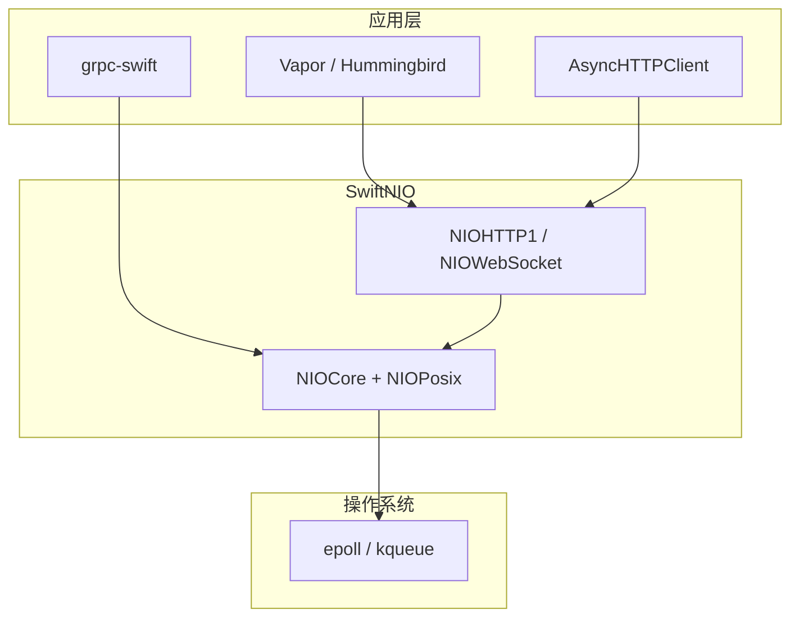

## 是什么

**swift-nio**（SwiftNIO）是 Apple 开源的**跨平台、事件驱动、非阻塞 I/O** 网络框架，用来快速搭建高性能协议服务器与客户端。仓库地址：[apple/swift-nio](https://github.com/apple/swift-nio)，Apache-2.0 协议，SSWG **Graduated** 级别项目，GitHub 约 8k+ star。官方一句话：**「It's like Netty, but written for Swift.」**

日常类比：

- 传统「一个连接一个线程」的服务器，像一家餐厅**每个顾客配一名专属服务员**——顾客少时还行，上千人同时等菜时，服务员（线程）数量爆炸，光换人交接就忙不过来。
- SwiftNIO 像一家**中央调度的大堂**：少数几个熟练工（EventLoop / 线程）在吧台后轮转，谁点的菜好了、谁要结账，内核通过 `epoll` / `kqueue` 通知调度台，调度台把活派给对应的「桌号」（Channel）。**一个工人可以同时照看多桌**，不会因为新来一桌就新雇一个人。

因此 SwiftNIO 特别适合：**连接多、但每个连接并不一直满载**的场景——HTTP API、WebSocket、代理、数据库协议客户端等。上层框架 [[vapor]]、AsyncHTTPClient、gRPC-Swift、PostgresNIO 等，底层 I/O 往往都建在 SwiftNIO 之上。

最小依赖（Swift Package Manager）：

```swift
// Package.swift
dependencies: [
    .package(url: "https://github.com/apple/swift-nio.git", from: "2.80.0"),
],
targets: [
    .executableTarget(name: "MyServer", dependencies: [
        .product(name: "NIOPosix", package: "swift-nio"),
        .product(name: "NIOCore", package: "swift-nio"),
    ]),
]
```

日常开发也可以直接 `import NIO`（伞模块，导出 Core + Posix + Embedded）。

## 为什么重要

零基础学 Swift 服务端时，理解 SwiftNIO 能帮你回答这些问题：

| 问题 | SwiftNIO 提供的答案 |
|------|---------------------|
| 为什么不用「每连接一线程」？ | 线程栈与上下文切换成本高；SwiftNIO 用少量 EventLoop  multiplex 成千上万连接 |
| 数据在内存里怎么表示？ | `ByteBuffer`：Copy-on-Write 字节缓冲，避免频繁分配 |
| 协议解析和业务逻辑放哪？ | `ChannelPipeline` + `ChannelHandler`：像流水线工位，入站/出站分开处理 |
| 异步结果怎么组合？ | `EventLoopFuture` / `EventLoopPromise`：在**同一个 EventLoop** 上链式调度，避免数据竞争 |
| 和 [[swift-collections]] 什么关系？ | 不同层：collections 管数据结构；NIO 管网络事件与 I/O 生命周期 |

SwiftNIO **不是** Web 框架——它不会帮你路由 URL 或渲染模板。它是**垫在下面的砖**：你要写 HTTP 服务，通常用 Vapor / Hummingbird；要写原始 TCP、自定义协议、或读懂上层库的行为，才需要直接碰 NIO。

## 仓库与模块结构

主仓库拆成多个 product，按职责记这张表即可：

| 模块 | 作用 | 谁该 import |
|------|------|-------------|
| `NIOCore` | EventLoop、Channel、Handler、ByteBuffer、Future 等抽象 | 扩展库、协议实现 |
| `NIOPosix` | Linux/macOS 上基于 epoll/kqueue 的高性能实现 | 真正做网络 I/O 的可执行程序 |
| `NIOEmbedded` | 内存里的假 EventLoop/Channel | **单元测试**、不碰网卡的协议调试 |
| `NIOHTTP1` / `NIOWebSocket` | HTTP/1.1、WebSocket **底层**编解码 | 需要裸协议或自定义 pipeline 时 |
| `NIOFoundationCompat` | `ByteBuffer` ↔ `Data` 互转 | 和 Foundation 混用时 |

TLS、HTTP/2、SSH 等在**独立仓库**（`swift-nio-ssl`、`swift-nio-http2`、`swift-nio-ssh` 等），按需加依赖，不必一次全装。

## 核心概念

### 1. EventLoop 与 EventLoopGroup

**EventLoop** 是 SwiftNIO 的心脏：一个**长期运行**的循环，等待 I/O 就绪或已提交的闭包，然后在**同一线程**上执行回调。可以把它想成「专管网络事件的 serial `DispatchQueue`」——保证挂在该 loop 上的 Channel 回调**不需要额外加锁**（只要你不在 handler 里把活丢到别的线程乱写共享状态）。

**EventLoopGroup** 是一组 EventLoop。生产环境常用 `MultiThreadedEventLoopGroup(numberOfThreads: System.coreCount)`：每个 CPU 核心一个线程，每个线程一个 `SelectableEventLoop`（内部用 epoll/kqueue 监听文件描述符）。

要点：

- 应用生命周期内 EventLoop 数量通常**很少**（≈ CPU 核数），而不是 ≈ 连接数。
- 新连接会**绑定**到 group 里某一个 EventLoop（常见 round-robin），该连接生命周期内不换 loop。
- 跨 EventLoop 传数据要用 `execute` / Future 跳转，不能假设随便哪个线程都能碰 Channel。

### 2. Channel — 一条连接的抽象

**Channel** 代表一个 I/O 对象（最常见是 TCP socket）。它负责：

- 管理底层文件描述符生命周期
- 提供 `read` / `write` / `close`
- 持有 **ChannelPipeline**（处理器链）

每个 Channel 只属于一个 EventLoop。内核通知「某个 fd 可读」时，EventLoop 会唤醒对应 Channel 的 pipeline。

### 3. ChannelPipeline 与 ChannelHandler

Pipeline 是挂在 Channel 上的**双向链表工位**：

```
入站（读）:  socket → Handler A → Handler B → 你的业务 Handler
出站（写）:  socket ← Handler A ← Handler B ← 你的业务 Handler
```

- **入站（Inbound）**：数据从网络进来，从 pipeline **头**往**尾**传（例如：字节 → HTTP 解析 → 你的路由）
- **出站（Outbound）**：响应从**尾**往**头**传，最后写到 socket（例如：你的对象 → JSON 编码 → ByteBuffer）

`ChannelInboundHandler` / `ChannelOutboundHandler` 是协议；实现时声明 `InboundIn`、`OutboundOut` 类型（底层几乎都是 `ByteBuffer`）。

类比：快递分拣中心——**入站**是卸货口依次扫码、拆包；**出站**是装车口依次打包、贴单。同一包裹经过不同工位，但顺序固定。

### 4. ByteBuffer

网络读写的基本单位。`ByteBuffer` 是 **Copy-on-Write** 的字节容器，支持 `readSlice`、`getString`、`writeInteger` 等，避免 Swift `Array<UInt8>` 频繁拷贝。从 socket 读到的数据、要发出去的 HTTP 报文，在 NIO 层通常都是 `ByteBuffer`。

### 5. Bootstrap — 启动服务器的模板

- **`ServerBootstrap`**：监听端口，每接受一个客户端就创建一个子 Channel，并配置其 pipeline。
- **`ClientBootstrap`**：主动连接远端，配置 pipeline 后发起连接。

常见链式配置：`.serverChannelOption`（监听 socket 选项）、`.childChannelInitializer`（每个连接要加哪些 Handler）、`.bind(host:port:)`。

### 6. EventLoopFuture 与 Promise

异步操作的结果用 **`EventLoopFuture<T>`** 表示（类似「稍后会有值的单子」）。**`EventLoopPromise<T>`** 用来在将来某个时刻 `succeed` 或 `fail` 该 Future。

规则：**在创建 Future 的 EventLoop 上完成 Promise**；用 `.map`、`.flatMap` 链式组合，避免阻塞 `wait()`（测试代码除外）。

## 代码示例

### 示例 1：Echo TCP 服务器（经典入门）

客户端发什么，服务器原样回显。展示 Bootstrap、Handler、ByteBuffer 的最小闭环：

```swift
import NIOCore
import NIOPosix

final class EchoHandler: ChannelInboundHandler {
    typealias InboundIn = ByteBuffer
    typealias OutboundOut = ByteBuffer

    func channelRead(context: ChannelHandlerContext, data: NIOAny) {
        let input = unwrapInboundIn(data)
        guard let message = input.getString(at: input.readerIndex, length: input.readableBytes) else {
            return
        }
        var buffer = context.channel.allocator.buffer(capacity: message.utf8.count)
        buffer.writeString(message)
        context.write(wrapOutboundOut(buffer), promise: nil)
    }

    func channelReadComplete(context: ChannelHandlerContext) {
        context.flush()
    }

    func errorCaught(context: ChannelHandlerContext, error: Error) {
        print("error: \(error)")
        context.close(promise: nil)
    }
}

@main
struct EchoServer {
    static func main() throws {
        let group = MultiThreadedEventLoopGroup(numberOfThreads: System.coreCount)
        defer { try? group.syncShutdownGracefully() }

        let bootstrap = ServerBootstrap(group: group)
            .serverChannelOption(ChannelOptions.backlog, value: 256)
            .serverChannelOption(ChannelOptions.socketOption(.so_reuseaddr), value: 1)
            .childChannelInitializer { channel in
                channel.pipeline.addHandler(EchoHandler())
            }

        let channel = try bootstrap.bind(host: "127.0.0.1", port: 2048).wait()
        print("Echo server on \(channel.localAddress!)")
        try channel.closeFuture.wait()
    }
}
```

**逐段理解**：

- `EchoHandler.channelRead`：从 `NIOAny` 解包成 `ByteBuffer`，再写回出站——**还没有 `flush` 时数据可能在缓冲区**。
- `channelReadComplete`：一批读事件结束后 `flush()`，把出站缓冲真正推到 socket。
- `errorCaught`：NIO 约定——pipeline 里未处理的错误要在这里关闭连接，否则资源泄漏。
- `defer { group.syncShutdownGracefully() }`：进程退出前优雅关掉所有 EventLoop 线程。

测试：终端 `nc 127.0.0.1 2048`，输入一行应原样返回。

### 示例 2：用 NIOAsyncChannel 的 echo（Swift 并发风格）

SwiftNIO 2.60+ 提供 **`NIOAsyncChannel`**，用 `async/await` 读写 Channel，适合新代码与结构化并发：

```swift
import NIOCore
import NIOPosix

func runEchoServer() async throws {
    let server = try await ServerBootstrap(group: MultiThreadedEventLoopGroup.singleton)
        .bind(host: "0.0.0.0", port: 2048) { channel in
            channel.eventLoop.makeCompletedFuture {
                try NIOAsyncChannel(
                    wrappingChannelSynchronously: channel,
                    configuration: .init(
                        inboundType: ByteBuffer.self,
                        outboundType: ByteBuffer.self
                    )
                )
            }
        }
        .get()

    print("Listening on \(server.channel.localAddress!)")

    try await withThrowingDiscardingTaskGroup { group in
        group.addTask {
            while let client = try await server.inbound.next() {
                group.addTask {
                    try await handleClient(client)
                }
            }
        }
    }
}

func handleClient(_ client: NIOAsyncChannel<ByteBuffer, ByteBuffer>) async throws {
    try await client.executeThenClose { inbound, outbound in
        for try await buffer in inbound {
            try await outbound.write(buffer)
        }
    }
}
```

**和示例 1 的对比**：

- 不再手写 `ChannelInboundHandler`，用 `for try await` 消费入站流。
- 每个客户端可在独立 `Task` 里处理，但底层读写仍由 Channel 所属 EventLoop 驱动。
- 适合与 Swift 6 并发模型结合；底层原理仍是 EventLoop + ByteBuffer。

### 示例 3：EmbeddedChannel 做无网络单元测试

不想起真端口时，用 `EmbeddedChannel` 在内存里模拟 pipeline：

```swift
import NIOCore
import NIOEmbedded
import XCTest

final class EchoHandlerTests: XCTestCase {
    func testEcho() throws {
        let channel = EmbeddedChannel()
        try channel.pipeline.syncOperations.addHandler(EchoHandler())

        var buffer = channel.allocator.buffer(capacity: 8)
        buffer.writeString("hello")
        try channel.writeInbound(buffer)

        var outbound: ByteBuffer = try channel.readOutbound()!
        XCTAssertEqual(outbound.readString(length: outbound.readableBytes), "hello")
        XCTAssertTrue(try channel.finish().isClean)
    }
}
```

这是 NIO 生态的常规测试姿势：**协议 Handler 与真 socket 解耦**，CI 里跑得飞快。

## 与上层框架的关系



你写 REST API：**优先选上层框架**。只有以下情况才值得直接写 NIO：

- 实现自定义 TCP/UDP 协议
- 编写或调试 `ChannelHandler`（如 HTTP 升级、代理透传）
- 做性能敏感的网络中间件
- 阅读 Vapor / postgres-nio 源码

## 常见坑与最佳实践

1. **不要在 EventLoop 上阻塞**：`sleep`、同步文件 IO、长时间 CPU 计算会卡住该 loop 上所有连接。耗时活丢到 `DispatchQueue` 或 `Task`，完成后再 `eventLoop.execute` 回来写 Channel。

2. **`ChannelHandlerContext` 不是线程安全的**：跨线程只能碰 `Channel`（或把闭包提交回正确 EventLoop）。官方 ChatServer 示例用 `DispatchQueue` 保护共享 `Dictionary<Channel>` 就是典型模式。

3. **记得 `flush`**：出站 `write` 可能缓冲；`channelReadComplete` 或业务结束时调用 `context.flush()`。

4. **生产环境优雅关闭**：`serverChannel.close()` + `group.shutdownGracefully()`，让在途请求收尾，避免 RST 风暴。

5. **版本与 Swift 对齐**：当前 2.x 要求 Swift 6.0+（见 README 版本表）；升级 NIO 时连同 `swift-nio-ssl` 等卫星库一起看。

## 学习路径建议

| 阶段 | 做什么 | 目标 |
|------|--------|------|
| 1 | 跑通 Echo 服务器 + `nc` 客户端 | 理解 Bootstrap、Handler、ByteBuffer |
| 2 | 读 `NIOChatServer` 示例（按行分包、广播） | 理解多 Channel、pipeline 组合 |
| 3 | 用 `EmbeddedChannel` 为 Handler 写测试 | 不依赖网络的 TDD |
| 4 | 接一个 `NIOHTTP1` pipeline 或转去 Vapor 教程 | 理解 HTTP 只是 pipeline 上多几节 Handler |
| 5 | 读 AsyncHTTPClient / Vapor 如何 bootstrap NIO | 把「底层砖」和「日常开发」接上 |

官方资源：

- [Conceptual Overview（README）](https://github.com/apple/swift-nio/blob/main/README.md)
- 仓库内 `Sources/NIOEchoServer`、`Sources/NIOChatServer` 可运行示例
- Swift on Server：[Using SwiftNIO – Channels](https://swiftonserver.com/using-swiftnio-channels/)

## 小结

SwiftNIO 用**少量 EventLoop + 非阻塞 I/O + Pipeline 式协议栈**，让 Swift 在服务端也能做出 Netty 级别的高并发网络程序。核心记八件事：**EventLoopGroup、EventLoop、Channel、Pipeline、Handler、ByteBuffer、Future/Promise、Bootstrap**。上层框架负责「网站长什么样」，SwiftNIO 负责「字节怎么高效、安全地在内核与你的代码之间流动」。零基础不必一次精通全部 Handler API——先 Echo、再测试、再 HTTP，路径最清晰。
