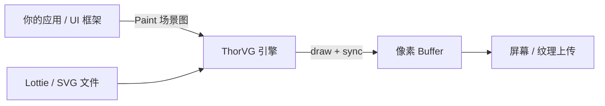

## 日常类比：ThorVG 是「矢量皮影的放映机」

设计师在 After Effects 或 Figma 里画的是**可无限放大的线稿**（路径、渐变、描边），不是一张固定像素的 JPG。要把这些矢量场景画到屏幕、手表或车载 HUD 上，需要一台**放映机**：读入 SVG / Lottie JSON，在内存缓冲区里光栅化成像素。

**ThorVG**（Thor Vector Graphics，[thorvg/thorvg](https://github.com/thorvg/thorvg)）就是这样一台**超轻量放映机**：核心库约 150KB 量级，C++ 实现，主打 CPU/SIMD 矢量光栅化，也支持 OpenGL ES、WebGL、WebGPU 等后端。它已被 Tizen、Godot、LVGL、LottieFiles、Espressif、Canva iOS 等产线采用——同一套 API 从 ESP32 微控制器到桌面工具都能跑。

和 [lottie-web](lottie.md)（浏览器里解析 Lottie JSON 的 JS 播放器）不同，ThorVG 是**底层图形引擎**：你不一定直接面对终端用户，而是把它嵌进 UI 框架、游戏引擎或固件里，负责「把矢量场景画进 buffer」。

## 是什么

ThorVG 是生产级 **C++ 矢量图形引擎**，支持：

- **图元**：矩形、圆、路径、渐变填充、描边（虚线/圆角端）、文本（TTF/OTF）、图片
- **场景图**：`Scene` 组合多个 `Paint` 节点，统一做平移/旋转/缩放
- **格式加载**：SVG Tiny、Lottie JSON、PNG/JPG/WebP 等（通过 Meson 选项裁剪 loader）
- **特效**：模糊、阴影、混合、遮罩等合成（可能走离屏 buffer）
- **动画**：`Animation` 控制 Lottie 帧进度；SVG 动画暂不支持

典型数据流：应用持有像素 buffer → 创建 `SwCanvas` 并 `target()` 绑定 buffer → 往 canvas `add()` 各种 Shape/Picture → `update()` 预处理 → `draw()` + `sync()` 异步光栅化 → 把 buffer 交给显示栈（SDL、LVGL、自研 UI 等）。



## 为什么重要

不懂 ThorVG，这几件事很难选型或排障：

- **嵌入式 UI 要 Lottie 启动页**，但不想塞整个 Chromium + lottie-web——ThorVG 可 `-Dloaders="lottie"` 裁成专用播放库
- **同一套矢量资源**要跑在 Web（WebGPU）、手机（Metal/Vulkan 抽象）和 RTOS——ThorVG 用 Meson 模块化二进制，按平台选后端
- **CPU 光栅化场景**（无 GPU、或 GPU 要给 3D 让路）——官方基准称在常见矢量 workload 上相对 Skia 约有 ~1.8× 优势（几何密集时更明显）
- **与 Lottie 生态的关系**：Lottie 是 JSON **协议**；ThorVG 是实现之一，表达式默认走内嵌 JerryScript，可 `-Dextra=""` 关掉以减小固件体积

## 核心概念

### 1. 初始化与线程池

`Initializer::init(n)` 启动引擎与可选的 **Task Scheduler**（`n` 为工作线程数，可用 `std::thread::hardware_concurrency()`）。内部异步处理编解码、update、draw；因此 **`draw()` 之后必须 `sync()`** 才能安全读 buffer。用完调用 `Initializer::term()` 释放全局字体等资源。

### 2. Canvas 与 Paint 模型

- **Canvas**：渲染目标，软件路径下常用 `SwCanvas::gen()` + `target(buffer, stride, w, h, ColorSpace)`
- **Paint**：基类概念；具体类型有 `Shape`（矢量路径）、`Scene`（子节点容器）、`Picture`（SVG/位图/Lottie 载体）、`Text`
- 一帧流程：`add()` →（动画时 `update(picture)`）→ `draw()` → `sync()` → `remove()` 清空节点

### 3. Shape：路径与样式

`Shape::appendRect` / `appendCircle` 是便捷 API；复杂图形用 `moveTo` / `lineTo` / `cubicTo` / `close()` 拼路径。填充可以是纯色或 `LinearGradient` / `RadialGradient`；描边独立设置 `strokeWidth`、`strokeCap`、`strokeJoin`、`strokeDash`。

### 4. Picture 与 Loader

`Picture::load("file.svg")` 走 SVG 解释器（偏 SVG Tiny，无 SMIL 动画）。Lottie 则通过 `Animation::gen()` 拿到关联的 `picture()` 再 `load("anim.json")`。Loader 在编译期用 Meson `-Dloaders=...` 开关，避免未用格式增大二进制。

### 5. 渲染后端与智能局部重绘

除 CPU/SIMD 软件渲染器外，可选 OpenGL ES、WebGL、**WebGPU**（Web 端较完整）。**Partial rendering** 只重绘变化区域——适合 UI 静态背景 + 小控件动画；全屏每帧全变的游戏场景则收益有限。

### 6. 绑定与生态

主 API 为 C++；可选 **C API**（`-Dbindings="capi"`）。另有 `@thorvg/webcanvas`、`thorvg-python`、Rust crate 等。工具链含 Viewer、VS Code LiveView、Lottie→GIF、SVG→PNG。

## 构建安装

依赖 [Meson](https://mesonbuild.com/) + Ninja：

```bash
git clone https://github.com/thorvg/thorvg.git
cd thorvg
meson setup builddir
ninja -C builddir install
```

只要 Lottie 播放器的精简构建：

```bash
meson setup builddir -Dloaders="lottie"
# 固件上可关闭 Lottie 表达式以减小体积：
meson setup builddir -Dloaders="lottie" -Dextra=""
```

macOS / Linux 也可通过 Homebrew、vcpkg、系统包管理器安装。Web 侧可关注 npm 包 `@thorvg/lottie-player`、`@thorvg/webcanvas`。

## 实践案例

### 案例 1：软件 Canvas 上画圆角矩形与渐变圆

以下片段来自[官方 Native Tutorial](https://www.thorvg.org/native-tutorial)，展示最小绘制闭环：

```cpp
#include <thorvg.h>

static const int WIDTH = 800, HEIGHT = 600;
static uint32_t buffer[WIDTH * HEIGHT];

int main() {
    tvg::Initializer::init(4);

    auto canvas = tvg::SwCanvas::gen();
    canvas->target(buffer, WIDTH, WIDTH, HEIGHT, tvg::ColorSpace::ARGB8888);

    auto rect = tvg::Shape::gen();
    rect->appendRect(50, 50, 200, 200, 20, 20);
    rect->fill(100, 100, 100);
    canvas->add(rect);

    auto circle = tvg::Shape::gen();
    circle->appendCircle(400, 400, 100, 100);

    auto fill = tvg::RadialGradient::gen();
    fill->radial(400, 400, 150, 400, 400, 0);
    tvg::Fill::ColorStop stops[2] = {
        {0.0f, 255, 255, 255, 255},
        {1.0f, 0, 0, 0, 255},
    };
    fill->colorStops(stops, 2);
    circle->fill(fill);
    canvas->add(circle);

    canvas->draw();
    canvas->sync();
    // 此处 buffer 中已是 ARGB 像素，可 blit 到窗口或写 PNG

    tvg::Initializer::term();
    return 0;
}
```

**要点**：`appendRect` 最后两个参数是圆角半径；渐变用 `ColorStop` 数组描述色标；`draw` 不阻塞，`sync` 等待 GPU/线程池完成。

自定义星形路径 + 虚线描边：

```cpp
auto path = tvg::Shape::gen();
path->moveTo(199, 34);
path->lineTo(253, 143);
path->lineTo(374, 160);
path->lineTo(287, 244);
path->lineTo(307, 365);
path->lineTo(199, 309);
path->lineTo(97, 365);
path->lineTo(112, 245);
path->lineTo(26, 161);
path->lineTo(146, 143);
path->close();
path->fill(150, 150, 255);
path->strokeWidth(3);
path->strokeFill(0, 0, 255);
path->strokeJoin(tvg::StrokeJoin::Round);
path->strokeCap(tvg::StrokeCap::Round);
float dash[2] = {10, 10};
path->strokeDash(dash, 2);
canvas->add(path);
```

### 案例 2：Lottie 动画循环

```cpp
#include <thorvg.h>
#include <cmath>

static uint32_t buffer[800 * 600];

void renderFrame(tvg::Canvas* canvas, tvg::Animation* anim, float progress) {
    anim->frame(static_cast<uint32_t>(anim->totalFrame() * progress));
    canvas->update(anim->picture());
    canvas->draw();
    canvas->sync();
}

int main() {
    tvg::Initializer::init(4);

    auto canvas = tvg::SwCanvas::gen();
    canvas->target(buffer, 800, 800, 600, tvg::ColorSpace::ARGB8888);

    auto animation = tvg::Animation::gen();
    auto picture = animation->picture();
    picture->load("lottie.json");
    canvas->add(picture);

    const float duration = animation->duration(); // 秒
    for (int frame = 0; frame < 300; ++frame) {
        float t = fmodf(frame / 60.0f, duration) / duration; // 假设 60fps
        renderFrame(canvas, animation, t);
        // 将 buffer 呈现到屏幕...
        canvas->remove(picture);
        canvas->add(picture);
    }

    tvg::Initializer::term();
    return 0;
}
```

**要点**：一个 `Animation` 实例对应一个 `Picture`；`progress` 取 0~1 映射到 `totalFrame()`；每帧改帧号后必须 `canvas->update(picture)` 再 draw。交互式应用里用 `animation->duration()` 驱动自己的主循环即可，不必依赖 AE 时间轴。

加载静态 SVG 只需 Picture 一行：

```cpp
auto picture = tvg::Picture::gen();
picture->load("icon.svg");
canvas->add(picture);
```

### 案例 3：Scene 组合与变换

多个图标作为一组移动/缩放时，用 `Scene` 包一层：

```cpp
auto scene = tvg::Scene::gen();
auto icon = tvg::Picture::gen();
icon->load("badge.svg");
scene->add(icon);
scene->translate(120, 40);
scene->scale(1.5f);
canvas->add(scene);
```

子节点可以是 Shape、Picture 或嵌套 Scene，形成树状场景图——与游戏引擎的节点层级类似。

## 与相关项目的关系

| 项目 | 关系 |
|------|------|
| [lottie-web](lottie.md) | 同吃 Lottie JSON；ThorVG 偏原生/嵌入式引擎，lottie-web 偏浏览器 |
| [Rive](rive.md) | 都服务交互 UI 动画；Rive 用 `.riv` + 状态机，ThorVG 主攻 SVG/Lottie 开放格式 |
| [LVGL](https://lvgl.io/) | 可选 ThorVG 作为矢量/Lottie 后端 |
| Skia | 桌面级 2D 引擎，体积与依赖更大；ThorVG 强调轻量与 MCU 友好 |

## 选型与踩坑

1. **合成开销**：模糊、遮罩、复杂 blend 会触发离屏 buffer；轻量设备上尽量简化特效层级  
2. **Lottie 表达式**：默认开启 JerryScript，复杂 AE 表达式增加 CPU 与体积；嵌入式可关闭  
3. **SVG 能力边界**：按 SVG Tiny，无动画与交互；复杂 SVG 需先简化或用 Lottie 导出  
4. **异步渲染**：忘记 `sync()` 会出现撕裂或读到半帧 buffer  
5. **Web 集成**：除 C++ 嵌入外，可直接评估 `@thorvg/lottie-player` 等现成 Web 组件，减少自己绑 WASM 的成本  

## 小结

ThorVG 把「矢量场景描述」和「像素 buffer 输出」封装成一套稳定的 C++ API：**Paint 场景图 + Canvas 光栅化 + 可裁剪的 Loader**。零基础路径：Meson 编库 → `Initializer::init` → `SwCanvas::target` → 画 Shape 或 load Lottie → `draw/sync`。掌握 init、canvas、picture、animation、sync 五条主线，就能在嵌入式 splash、HMI、移动端 Lottie 与 WebGPU 矢量管线之间复用同一引擎认知。
