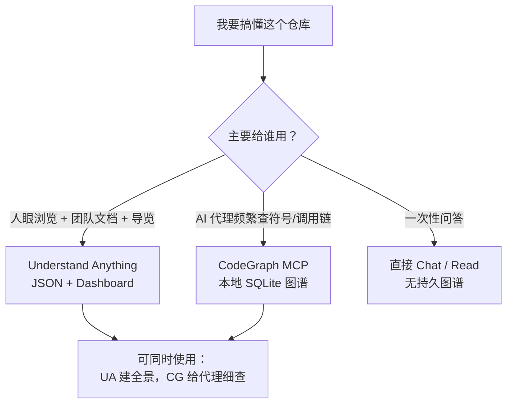

## 日常类比：地铁线路图，而不是挨家敲门

你刚入职一家新公司，接手一个 20 万行的陌生仓库。传统做法是：

1. 从 `README` 和 `main` 入口文件开始读；
2. 跟着 `import` 一层层点进去；
3. 在脑子里拼凑「谁调用谁、支付流程经过哪些模块」。

这就像在陌生城市里**没有地图，只能挨家敲门问路**——每敲一扇门都花时间，还容易迷路。

[Understand Anything](https://github.com/Lum1104/Understand-Anything)（原作者 [Lum1104](https://github.com/Lum1104)，现由 [Egonex-AI](https://github.com/Egonex-AI) 维护，MIT 许可）做的是另一件事：用**多 Agent 流水线**扫描整个项目，把文件、函数、类、依赖、配置、文档甚至业务域都建成**知识图谱（Knowledge Graph）**，再打开一个可缩放、可搜索、可点击的 Web 仪表盘让你「按图索骥」。

官方 slogan 写得很直白：**Graphs that teach > graphs that impress**——图的价值不是炫复杂度，而是**安静地教会你每一块怎么拼在一起**。

它面向 Claude Code、Cursor、Codex、Copilot、Gemini CLI 等 AI 编程环境，既可当插件/Skill 用，也可把生成的 `knowledge-graph.json` 提交进仓库，让队友跳过分析直接看图。

---

## 是什么：和「纯 grep 探索」差在哪

| 维度 | 传统读代码 / grep | Understand Anything |
|------|-------------------|---------------------|
| 入口 | 线性读文件 | 图节点 + 搜索 + 导览 Tour |
| 结构 | 自己记 import 链 | Tree-sitter 确定性抽边 + LLM 写摘要 |
| 语义 | 靠注释和猜测 | 节点 plain-English 说明、架构分层、业务域视图 |
| 协作 | 口头交接 | 提交 `.understand-anything/*.json` 给新人 |
| 变更影响 | 靠经验猜 ripple | `/understand-diff` 做 diff 影响分析 |

与同仓库笔记里的 [CodeGraph](./codegraph-claude-code.md) 相比：CodeGraph 偏 **MCP + SQLite**，给 AI 代理做结构化查询；Understand Anything 偏 **人机共用的可视化仪表盘 + 多命令工作流**（聊天、导览、入职文档、Wiki 知识库分析等），两者互补而非替代。

---

## 核心概念

### 1. 知识图谱：节点 + 边

- **节点（Node）**：不仅是源码里的 `file` / `function` / `class`，自 v2.0 起还覆盖 `config`、`document`、`service`、`table`、`endpoint`、`pipeline`、`schema`、`resource` 等 13 种类型（配置、文档、K8s、SQL、OpenAPI 等）。
- **边（Edge）**：共 26 种，分结构（`imports`、`contains`、`inherits`）、行为（`calls`）、数据流（`reads_from`、`writes_to`）、基础设施（`deploys`、`serves`）、语义（`related`）等。
- **持久化**：默认写入项目根目录 `.understand-anything/knowledge-graph.json`（纯 JSON，可 git 跟踪）。

### 2. Tree-sitter + LLM 混合流水线

- **Tree-sitter（确定性）**：解析 AST，提取 import、定义、调用点、继承等；同一输入多次运行结构边一致；还用于**指纹（fingerprint）**检测变更，支撑增量更新。
- **LLM（语义层）**：在结构之上生成摘要、标签、架构层（API / Service / Data / UI…）、导览步骤、语言概念说明（泛型、闭包、装饰器等 12 种模式）。

### 3. 多 Agent 编排（`/understand`）

| Agent | 职责 |
|-------|------|
| `project-scanner` | 发现文件、识别语言与框架 |
| `file-analyzer` | 抽函数/类/import，产出节点与边（并行，每批 20–30 文件，最多 5 路并发） |
| `architecture-analyzer` | 识别架构分层 |
| `tour-builder` | 生成按依赖排序的 Guided Tour |
| `graph-reviewer` | 校验完整性；默认内联校验，`--review` 时走完整 LLM 复审 |
| `domain-analyzer` | `/understand-domain`：业务域、流程、步骤 |
| `article-analyzer` | `/understand-knowledge`：Wiki 实体与隐含关系 |

### 4. 命令族（不只是「建图」）

| 命令 | 用途 |
|------|------|
| `/understand` | 全量或增量分析，写出知识图谱 |
| `/understand-dashboard` | 打开交互式力导向图界面 |
| `/understand-chat` | 基于图谱问答，如「支付流程怎么走」 |
| `/understand-diff` | 当前改动的影响范围 |
| `/understand-explain` | 深潜单个文件/函数 |
| `/understand-onboard` | 生成新人入职导读 |
| `/understand-domain` | 业务逻辑横向视图 |
| `/understand-knowledge` | Karpathy 式 LLM Wiki → 概念图 |

### 5. 增量更新与团队共享

- 默认**增量**：只重分析变更文件；`--auto-update` 可挂 post-commit hook。
- 大单体可 scoped：`/understand src/frontend`。
- 团队实践：提交 `.understand-anything/` 下 JSON，**排除** `intermediate/` 与 `diff-overlay.json`；超大图（10MB+）建议 git-lfs。

---

## 快速上手

### 安装（Claude Code 插件市场）

```bash
/plugin marketplace add Egonex-AI/Understand-Anything
/plugin install understand-anything
```

其他平台可用一键脚本（Codex / Cursor / OpenCode 等）：

```bash
curl -fsSL https://raw.githubusercontent.com/Egonex-AI/Understand-Anything/main/install.sh | bash
# 或指定平台，例如：
curl -fsSL https://raw.githubusercontent.com/Egonex-AI/Understand-Anything/main/install.sh | bash -s codex
```

Cursor 克隆含 `.cursor-plugin/plugin.json` 的仓库后通常可自动发现；也可在 **Settings → Plugins** 里粘贴仓库 URL 安装。

### 分析 + 看图

```bash
/understand
/understand-dashboard
```

中文内容（节点摘要、仪表盘 UI、导览文案）：

```bash
/understand --language zh
```

首次未指定语言时，插件会根据对话语言询问确认，并写入 `.understand-anything/config.json` 供后续复用。

---

## 代码示例 1：知识图谱 JSON 片段（节点与边）

分析完成后，`.understand-anything/knowledge-graph.json` 是仪表盘的数据源。结构简化示例如下（字段名与类型以官方 Schema 为准，此处为便于理解的裁剪版）：

```json
{
  "meta": {
    "projectName": "my-shop",
    "version": "1.0.0",
    "lastAnalyzedAt": "2026-06-13T08:00:00.000Z"
  },
  "layers": [
    { "id": "api", "name": "API", "color": "#4F46E5" },
    { "id": "service", "name": "Service", "color": "#059669" },
    { "id": "data", "name": "Data", "color": "#D97706" }
  ],
  "nodes": [
    {
      "id": "file:src/api/checkout.ts",
      "type": "file",
      "label": "checkout.ts",
      "layer": "api",
      "summary": "处理结账 HTTP 路由，校验购物车并调用支付服务。",
      "filePath": "src/api/checkout.ts",
      "tags": ["http", "checkout"]
    },
    {
      "id": "function:src/api/checkout.ts::createCheckout",
      "type": "function",
      "label": "createCheckout",
      "parentId": "file:src/api/checkout.ts",
      "summary": "接收订单 DTO，调用 PaymentService.charge。"
    },
    {
      "id": "class:src/services/payment.ts::PaymentService",
      "type": "class",
      "label": "PaymentService",
      "layer": "service",
      "summary": "封装第三方支付网关与重试逻辑。"
    }
  ],
  "edges": [
    {
      "source": "file:src/api/checkout.ts",
      "target": "class:src/services/payment.ts::PaymentService",
      "type": "imports",
      "weight": 0.7
    },
    {
      "source": "function:src/api/checkout.ts::createCheckout",
      "target": "class:src/services/payment.ts::PaymentService",
      "type": "calls",
      "weight": 0.8
    }
  ],
  "tours": [
    {
      "id": "architecture-overview",
      "title": "从 API 到支付服务",
      "steps": [
        "file:src/api/checkout.ts",
        "class:src/services/payment.ts::PaymentService"
      ]
    }
  ]
}
```

读图时记住三条约定：

1. **节点 id** 带类型前缀，如 `function:path::symbolName`；
2. **边 type** 决定语义（调用、包含、部署等），**weight** 影响布局与筛选；
3. **layers** 与 **tours** 让人类按「层」和「学习顺序」看，而不是只看一团乱线。

---

## 代码示例 2：团队 `.gitignore` 与 LFS（协作）

要把图谱当「活文档」提交，推荐忽略本地中间产物：

```gitignore
# 本地流水线 scratch，勿提交
.understand-anything/intermediate/
.understand-anything/diff-overlay.json
```

大图仓库启用 Git LFS：

```bash
git lfs install
git lfs track ".understand-anything/*.json"
git add .gitattributes .understand-anything/knowledge-graph.json
git commit -m "docs: add committed knowledge graph for onboarding"
```

队友克隆后可直接 `/understand-dashboard` 浏览，无需每人跑一遍全量 Agent 流水线；发布前用 `/understand` 或 `--auto-update` 保持 JSON 与代码同步。

---

## 代码示例 3：Monorepo 子目录与 diff 影响（命令行工作流）

```bash
# 只分析前端包，缩短首轮时间
/understand packages/webapp

# 改了一堆文件后，看 ripple 再提交
/understand-diff

# 针对单个热点文件要白话解释
/understand-explain packages/webapp/src/auth/session.ts

# 自然语言追问（依赖已生成的图谱）
/understand-chat 会话过期时刷新 token 的完整调用链是什么？
```

`--language zh` 与上述命令可组合，适合中文团队统一仪表盘文案。

---

## 仪表盘里值得点的功能

- **力导向图**：缩放、拖拽、按层配色（API / Service / Data / UI / Utility）。
- **模糊 + 语义搜索**：既可搜符号名，也可搜「哪些部分管鉴权」。
- **Guided Tours**：按依赖顺序的架构导览，适合 onboarding。
- **Domain 视图**：`/understand-domain` 后的业务流程横向图。
- **Persona 自适应**：初级开发、PM、老手看到不同粒度（官方 UI 特性）。
- **在线 Demo**：无需本地安装即可体验交互 — [understand-anything.com/demo](https://understand-anything.com/demo/)。

---

## 与 CodeGraph、纯 LLM「读仓库」的选型建议



- **零基础入职**：先 `/understand` + `/understand-dashboard` + Tour，建立心理地图。
- **改核心模块前**：`/understand-diff` 或 `/understand-chat` 问影响面。
- **业务同学对齐**：`/understand-domain` 把代码映射到流程步骤。
- **知识库/wiki**：`/understand-knowledge` 把 Markdown wiki 变成概念网络。

---

## 局限与注意点

1. **首次全量分析耗时**：大仓库依赖多路 `file-analyzer`，需要稳定 LLM 配额；应用子目录 scope 或增量模式。
2. **语义层非 100% 确定**：结构边可复现，摘要/分层仍可能随模型版本漂移；关键决策以源码为准。
3. **图谱会过期**：与 CodeGraph 类似，需增量或 hook；代理应警惕未更新的节点。
4. **隐私**：分析过程会读仓库内容并调用 LLM 写摘要；敏感仓库需自建策略或仅提交脱敏子图。

---

## 延伸资源

| 资源 | 链接 |
|------|------|
| 上游仓库（Lum1104 fork） | https://github.com/Lum1104/Understand-Anything |
| 组织主页 | https://github.com/Egonex-AI/Understand-Anything |
| 官网与 Demo | https://understand-anything.com |
| 最新 Release（撰写时 v2.7.3） | https://github.com/Lum1104/Understand-Anything/releases |
| Skill 文档（`/understand` 七阶段流水线） | 仓库内 `understand-anything-plugin/skills/understand/SKILL.md` |

---

## 小结

Understand Anything 把「读代码」从线性翻文件，变成**可搜索、可导览、可协作的图谱产品**：Tree-sitter 保底结构，LLM 补上「这块是干什么的」，仪表盘负责**教人**而不是吓人。零基础使用者只需记住三步：`/understand` 建图 → `/understand-dashboard` 看图 → `/understand-chat` 或 Tour 带着问题学；团队再把 JSON 纳入版本库，就把 onboarding 成本摊到每一次 CI/提交维护里。
