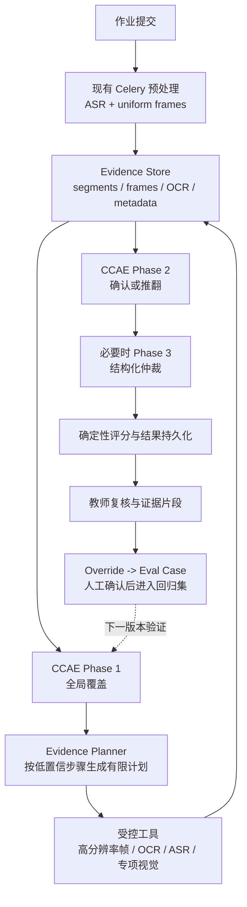

# 横向比较与全智评借鉴

## 1. 总体比较

### 1.1 产品类型

| 项目 | 核心产品形态 | 主要用户 | 输出 |
|---|---|---|---|
| 全智评 | 实操视频评价 SaaS | 教师、学生、管理员 | 步骤评分、证据、反馈 |
| Director | 通用视频工作流 Agent | 开发者、媒体团队 | 搜索、剪辑、生成、播放 |
| watch-skill | Agent 视频证据层 | 各类 AI Agent | 时间戳回答、索引、验证 |
| VideoAgent | 视频理解/编辑/生成工具箱 | 创作者、研究者 | QA、摘要、编辑和生成 |
| DVD | 长视频研究问答 Agent | 研究者、知识工作者 | 经工具取证的答案 |
| OmAgent | 通用多模态 Agent 框架 | Agent 开发者 | 分治任务结果 |
| VidMentor | 教育视频助手 | 学习者 | 搜索、脑图、问答、题目 |
| proteomics | 实验室专业 Agent | 蛋白质组研究者 | 协议、lab note、偏差 |
| multimodal-rag | 视频 RAG Web 应用 | 视频资料用户 | 问答、搜索和片段 |
| ReAgent-V | 视频推理研究框架 | 多模态研究者 | 初答、评价报告、修订答 |

全智评与其他项目的根本差异：

> 其他大多以“找到内容或回答问题”为终点，全智评以“按可版本化标准评价行为，并允许教师复核”为终点。

### 1.2 端到端能力矩阵

| 维度 | 全智评 | Director | watch | VideoAgent | DVD | OmAgent | VidMentor | proteomics | MM-RAG | ReAgent-V |
|---|---|---|---|---|---|---|---|---|---|---|
| 视频采集 | OSS/本地 | VideoDB | URL/流/本地 | 本地目录 | YouTube/本地 | 本地 | 本地 | GCS | 上传共享卷 | 本地 |
| 选帧 | 1 fps + Phase 2 | 云 scene | 场景+去重 | 固定切片 | 2 fps+回看 | 场景+回看 | 每 5 秒 OCR | 原生视频 | 固定 30 帧 | CLIP×熵 |
| ASR | Whisper/DashScope | VideoDB | 字幕/本地/云 | Whisper/FunASR | SRT | STT | Whisper | Gemini 原生 | Groq/OpenAI | Whisper |
| OCR | 模型视觉/可扩展 | scene prompt | RapidOCR | 部分工具 | 无独立 OCR | 可配工具 | PaddleOCR | Gemini 原生 | 无独立 OCR | OCR RAG |
| 检索 | 评价内时间定位 | 云语义搜索 | FTS+向量 | ImageBind | caption 向量 | Milvus | BGE | Confluence/MCP | Pixeltable | 动态 RAG |
| 主动回看 | Phase 2 窗口 | 无通用机制 | 有 | 弱 | 强 | 强 | 无 | prompt 要求 | 无 | 追问再取证 |
| 领域标准 | 强 | 弱 | 可传 criteria | 弱 | 弱 | 弱 | 教学内容 | 强 | 弱 | 可提示 |
| 结构化评价 | 强 | 通用内容 schema | Answer/Critique | 工具 schema | 最终答案 | TaskTree | 文件结果 | 强 | ToolResult | Eval report |
| 人工复核 | 强 | 会话 | mistake report | 无 | 无 | 无 | 无 | 用户确认 | 无 | 无 |
| 持久业务状态 | PostgreSQL | DB 会话 | 本地 SQLite | 文件 | 文件 VDB | STM/LTM | 文件 | ADK/SQLite | Pixeltable | 文件 |
| 异步/恢复 | Celery/Redis | Socket.IO | jobs/loop state | 脚本 | 有限 | workflow | 离线批处理 | ADK | FastAPI task | 脚本 |
| 测试证据 | 强 | 弱 | 强 | 弱 | 弱 | 中低 | 弱 | 强 | 弱 | 弱 |

## 2. 架构模式比较

### 2.1 媒体处理：先拆还是原生交给模型

#### 路线 A：先拆成帧和文本

项目：

- 全智评；
- watch-skill；
- DVD；
- OmAgent；
- VidMentor；
- multimodal-rag；
- ReAgent-V。

优点：

- 每个证据可定位；
- 可按预算采样；
- 可复用索引；
- 可单独验证 ASR/OCR/视觉；
- 适合评分审计。

代价：

- 可能漏掉帧间动作；
- 数据管线更复杂；
- 需要处理时间对齐。

#### 路线 B：原生视频模型

项目：

- proteomics_lab_agent。

优点：

- 实现简单；
- 模型可直接利用时序；
- 无需自行管理全部抽帧细节。

代价：

- 观察过程不透明；
- 时间戳约束较弱；
- 费用和隐私依赖云服务；
- 同一视频重复任务可能重复消费。

#### 对全智评的判断

生产主链应继续以可审计拆分为主。原生视频模型更适合：

- 离线 A/B 对照；
- 对抽帧链结果的独立 reviewer；
- 极端时序动作的补充验证；
- 生成协议草稿而非直接决定分数。

### 2.2 选帧：固定覆盖还是问题驱动

#### 固定覆盖

全智评当前 1 fps 的优势是可预测和易解释。它提供稳定 baseline，不会因为问题理解错误完全漏掉某段。

#### 场景感知

watch-skill 和 OmAgent 根据画面变化选帧。适合：

- 场景切换明显的视频；
- 屏幕操作；
- 讲座和演示。

风险：

- 同一场景内细微手部动作不会触发切换；
- 实验操作经常背景稳定、动作关键。

#### 查询相关

ReAgent-V 的 CLIP×熵和 DVD 的语义检索适合 Phase 2，不适合完全替代全局 baseline：

- 查询编码可能不理解专业步骤；
- entropy 可能偏好复杂但无关的画面；
- 检索依赖预先生成的描述。

#### 推荐组合

```text
Phase 1
  = 低频均匀帧
  + 场景边界帧
  + 模板指定 cue

Phase 2
  = evidence_seconds 时间窗
  + ASR keyword 时间窗
  + query/rubric 相关帧
  + 必要时原始分辨率或短片段
```

这比“统一改成智能选帧”更稳健，因为保留了可比较 baseline。

### 2.3 视频记忆：文件、数据库还是多模态表

| 方案 | 项目 | 特点 | 适用 |
|---|---|---|---|
| 文件 JSON/NPZ | DVD、VidMentor、ReAgent-V | 简单、可检查，事务和并发弱 | 研究/单机 |
| SQLite + FTS/向量 | watch-skill | 可迁移、低运维、单用户友好 | 本地 Agent |
| Milvus + STM | OmAgent | 向量规模和过滤强，部署重 | 多模态 Agent 服务 |
| Pixeltable | multimodal-rag | 视频与派生列统一，生态较新 | 多模态数据实验 |
| 云视频数据库 | Director | 能力完整，供应商绑定 | 媒体 SaaS |
| PostgreSQL + Redis | 全智评 | 业务事务强，派生证据缓存独立 | 多用户生产 |

#### 对全智评的判断

不建议为了“有 RAG”替换 PostgreSQL/Redis。更合理的是增加可重建证据层：

```text
PostgreSQL：业务事实、模板版本、评价结果、人工覆写
OSS：原始视频/图片
Redis：短期帧和任务协调
Evidence Index：可重建的转录、帧描述、OCR、向量、时间范围
```

Evidence Index 可以先用 PostgreSQL pgvector、独立 SQLite 实验或专用向量库验证，不应在没有真实查询指标前直接更换基础设施。

### 2.4 编排：开放式 Agent 还是确定性工作流

#### 开放式工具循环

- Director；
- DVD。

适合问题探索、搜索和媒体操作，不适合直接扣分，因为：

- 路径随模型变化；
- 重复调用和终态难保证；
- 失败恢复依赖上下文；
- 审计成本高。

#### 动态 DAG

- VideoAgent。

比开放循环更可视，但图本身由 LLM 生成和评审，仍需确定性 schema、成本、权限和幂等检查。

#### 显式状态图/工作流

- LangGraph multimodal-rag；
- OmAgent ConductorWorkflow；
- 全智评 Celery chain/group。

适合业务主线。全智评已经选对了形态：评价主链应保持确定性，Agent 只用于受控子问题。

#### 推荐边界

| 动作 | 是否适合 Agent 自主决定 |
|---|---|
| 是否重新看某时间窗 | 是，但受预算和次数约束 |
| 选择 OCR/ASR/对象工具 | 是，最好有规则默认和 schema |
| 修改评分模板 | 否，需要人工审核和版本 |
| 决定最终分数公式 | 否，后端确定性计算 |
| 触发重复扣费评价 | 否，必须幂等和授权 |
| 生成教师复核摘要 | 是 |
| 将教师覆写转成 eval 草稿 | 是，人工确认后入库 |

## 3. 评价可信度比较

### 3.1 证据来源

可信度从弱到强可分：

1. 模型自报“我看到了”；
2. 检索到文字描述；
3. 描述带原始时间范围；
4. 最终判断基于重新读取的原始帧；
5. 判断绑定领域标准和确定性后处理；
6. 人工校正形成可回放 benchmark；
7. 新版本在 benchmark 上证明回归未恶化。

项目位置：

- Director：2-3；
- VideoAgent/VidMentor/MM-RAG：2-3；
- DVD/OmAgent：3-4；
- ReAgent-V：3-4，外加模型反思；
- watch-skill：3-4 和 replay eval；
- proteomics：4-6；
- 全智评：3-7 的部分能力，尤其领域模板、人工覆写和离线样本线。

### 3.2 置信度来源

三种常见方案：

| 方案 | 项目 | 风险 |
|---|---|---|
| 模型自报 confidence | 全智评部分 Phase、ReAgent-V | 未校准时数字不等于概率 |
| 检索信号计算 | watch-skill | 只反映证据检索，不等于领域判断正确 |
| 多轮一致性/仲裁 | 全智评、ReAgent-V | 同模型错误可能高度一致 |

可靠做法应组合：

```text
检索/画面质量信号
  + 模型证据质量
  + 多轮状态一致性
  + 特定步骤历史准确率
  + 人工 benchmark 校准
```

### 3.3 “反思”是否真实增加信息

| 反思方式 | 是否增加新证据 | 评价 |
|---|---:|---|
| 同 prompt 重写 | 否 | 容易只改变措辞 |
| 多角色投票 | 不一定 | 可减少偶然性，不能消除共同偏差 |
| 回看原始帧 | 是 | 高价值 |
| 扩大时间窗 | 是 | 高价值 |
| 启用新工具 | 是 | 高价值 |
| 引入领域协议 | 是 | 高价值 |
| 人工校正 | 是 | 最高价值但成本高 |

因此，全智评 Phase 2/3 的质量应重点看是否获得了新证据，而不是多了一次模型调用。

## 4. 对全智评的具体借鉴

### 4.1 P0：保持现有主链，先补证据可度量性

目标不是改架构，而是建立 baseline：

- 每个步骤记录 Phase 1 使用帧集合；
- 记录 Phase 2 新增了哪些帧、ASR 段或工具结果；
- 记录最终证据是否来自新观察；
- 把教师覆写映射到步骤级 TP/TN/FP/FN；
- 区分“操作错误”和“不可观察/拍摄问题”。

理由：

- 没有 baseline，无法判断场景抽帧、RAG 或 Agent 是否改善；
- 现有 CCAE 已有复杂逻辑，盲加机制会掩盖真实变量。

### 4.2 P1：场景感知作为增量候选，不替换均匀帧

参考 watch-skill：

```text
uniform baseline
  + scene start/mid
  + perceptual dedup
  + 模板 cue
```

实验指标：

- 每步骤关键动作召回率；
- Phase 1 时间定位误差；
- 总帧数和图像 token；
- Phase 2 触发率；
- 最终 FP/FN；
- 墙钟时间。

通过条件必须同时包含“质量不下降”和“成本有明确收益”。

### 4.3 P1：把 Phase 2 做成主动取证

参考 DVD、OmAgent 和 ReAgent-V：

1. 根据 Phase 1 明确生成“待验证假设”；
2. 后端将假设编译成有限工具动作；
3. 动作只能是读取时间窗、扩大窗口、OCR、ASR、对象/刻度专项工具；
4. 每个步骤限制轮次、帧数和 token；
5. 没有新证据时停止，不循环重写；
6. 最终记录支持、反驳或仍不可确认。

这里不需要引入完整通用 Agent。一个类型化 `EvidencePlan` 已足够：

```json
{
  "step_id": "D2S4",
  "hypothesis": "学生从游码左侧读取刻度",
  "actions": [
    {"tool": "frames", "start": 31.0, "end": 39.0, "resolution": "high"},
    {"tool": "ocr", "region_hint": "ruler"}
  ],
  "budget": {"max_frames": 12, "max_rounds": 2}
}
```

### 4.4 P1：建立持久 Evidence Index

参考 watch-skill 和 multimodal-rag：

建议索引单元：

- ASR segment；
- 原始帧 metadata；
- OCR block；
- 可选 scene description；
- 模板步骤与候选证据的关联；
- 生成模型、版本和 prompt/template 版本。

必须保留：

- `assignment_id`；
- `timestamp_start/end`；
- 原始对象或帧引用；
- `source_type`；
- `derived_by`；
- `created_at`。

索引是派生物，业务结果和人工覆写仍以 PostgreSQL 为事实源。

### 4.5 P1：教师校正进入 replay eval

参考 watch-skill lessons 和 proteomics eval：

```text
teacher override
  -> 分类：FP / FN / 错误级别 / 拍摄问题 / 模板问题
  -> 固定输入证据快照
  -> 期望步骤状态
  -> 下次 evaluator 版本回放
  -> 报告总体与分类型变化
```

不应直接把一次教师覆写变成生产规则。先积累样本，经过：

- 去重；
- 专家确认；
- 样本门；
- A/B；
- 回归检查。

### 4.6 P2：证据片段 compilation

参考 Director：

- 将某步骤多个关键时间窗合并成短视频；
- 教师不必在原视频中手工拖动；
- 每个片段展示来源轮次、模型判断和模板要求。

这是产品价值较高、算法风险较低的方向。

### 4.7 P2：领域工具按需调用

参考 ReAgent-V：

- 刻度读取；
- 屏幕 OCR；
- 物体数量；
- 空间关系；
- 手部/器械定位；
- 音频优先步骤。

工具选择可采用“规则默认 + 模型建议”：

```text
模板字段声明 allowed_tools / required_tools
  -> 后端先给出确定性工具集合
  -> 模型只能在集合内选择
  -> 工具输出结构化并记录成本
```

## 5. 不建议的做法

### 5.1 不直接引入通用多 Agent 主循环

全智评已有 Celery、状态机、策略路由和多阶段 evaluator。引入 Director/VideoAgent 式通用 planner 会：

- 增加非确定性；
- 使幂等、扣费和失败恢复更难；
- 降低审计性；
- 未必提高视觉准确率。

### 5.2 不把向量数据库当作目标

只有出现明确查询：

- “这一步最可能发生在哪？”
- “过去哪些视频出现相同错误？”
- “哪些帧与这个示例相似？”

并有可量化 baseline 时，向量索引才有价值。

### 5.3 不把 ASR 命中当动作完成

全智评当前 prompt 已明确禁止。其他项目的 transcript QA 说明 ASR 很适合内容理解，但不能证明物理操作。

### 5.4 不用同模型多次回答代替新证据

ReAgent-V 的多角色反思适合研究，但生产评分应优先：

- 新帧；
- 新时间窗；
- 新工具；
- 专家标准；
- 人工校正。

### 5.5 不一次性复制重型模型仓

VideoAgent、OmAgent、ReAgent-V 的依赖和固定路径适合参考机制，不适合作为生产依赖直接嵌入。

## 6. 建议参考架构



重要边界：

- Evidence Planner 不改模板、不决定分数；
- 工具只读媒体和派生证据；
- 所有外部调用有预算、超时和幂等键；
- 评分仍由后端根据最终状态计算；
- 人工校正不自动污染生产策略。

## 7. 实验顺序

### 实验 A：场景帧增量

变量：

- baseline：当前均匀帧；
- treatment：均匀帧 + scene boundary + dedup。

独立验收：

- 固定样本；
- 固定模型和 prompt；
- 比较步骤级错误、帧数、token 和耗时。

### 实验 B：主动回看

变量：

- baseline：当前 Phase 2；
- treatment：类型化 EvidencePlan + 最多两轮新取证。

独立验收：

- 低置信和冲突步骤子集；
- 统计获得新证据比例；
- 统计推翻错误初判的比例；
- 统计无进展停止率。

### 实验 C：教师校正回放

变量：

- 固定历史 override 样本；
- 对比旧 evaluator 和新 evaluator。

独立验收：

- TP/TN/FP/FN；
- 错误类型；
- 拍摄问题单列；
- 不允许只报告总分 MAE。

## 8. 最终判断

按“对全智评近期架构决策的参考价值”排序：

1. `proteomics_lab_agent`：领域协议、步骤偏差和评测方法。
2. `watch-skill`：证据索引、主动补证和校正回放。
3. `DeepVideoDiscovery`：长视频粗看—搜索—原帧确认。
4. `OmAgent`：场景记忆、分治状态和 Rewinder。
5. `ReAgent-V`：按问题选工具和批评问题驱动重取证。
6. `Director`：媒体工具编排和证据 compilation 产品形态。
7. `multimodal-rag-agent`：视频 RAG 的完整服务分层。
8. `VidMentor`：教育视频知识组织和练习生成。
9. `VideoAgent`：工具注册和 DAG 规划；整体依赖不宜直接采用。

这个顺序不是项目质量排名，而是与全智评当前缺口的距离。
