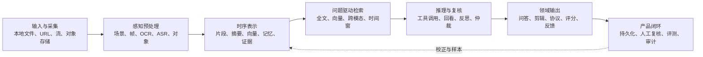

# 多模态视频 AI 开源生态研究

> 研究快照：2026-07-17
>
> 对标项目：`quanzhiping-deploy`（本地镜像为 `explorations/own/quanzhiping-ci-local`）
>
> 研究对象：9 个已 fork、已 clone、保留独立 Git 历史的开源项目

## 先说结论

全智评不是通用视频问答工具，而是一个面向实操教学的评价系统：

```text
视频/图片提交
  -> ASR 与抽帧并行
  -> 领域评分模板约束下的多阶段视觉评价
  -> 结构化步骤结果、证据、置信度和分数
  -> 教师复核、审计、资源台账与学生反馈
```

本轮项目没有任何一个能整体替代这条产品链。它们分别代表了值得借鉴的能力：

| 能力 | 最强参考 | 对全智评的意义 |
|---|---|---|
| 通用视频工作流编排 | Director | 学习把上传、索引、搜索、剪辑等能力做成统一工具接口 |
| 本地视频证据层 | watch-skill | 学习场景感知抽帧、持久索引、时间戳引用、低置信升级与验证闭环 |
| 长视频主动探索 | DeepVideoDiscovery、OmAgent | 学习先粗看，再按问题回看关键时间窗，而不是固定密度处理全部内容 |
| 多模态工具选择与反思 | ReAgent-V | 学习按问题启用 OCR/ASR/检测，并用批评问题重新取证 |
| 完整视频 RAG 应用 | multimodal-rag-agent | 学习前端、FastAPI、MCP、Pixeltable 和 LangGraph 的应用分层 |
| 教育视频组织 | VidMentor | 学习把转录组织成知识树、视频检索和题目生成 |
| 垂直实操评价 | proteomics_lab_agent | 与全智评最相似：领域协议、操作视频、逐步偏差、证据时间戳和评测集 |
| 视频理解、编辑、生成一体化 | VideoAgent | 学习工具注册和动态 DAG；同时观察重型依赖与能力边界失配的代价 |

最重要的综合判断：

> 全智评当前强在“业务闭环、领域模板和结构化评价”，最值得补的是“问题驱动的主动取证、可复用视频证据索引、校正后的可回放评测闭环”，而不是再叠一层泛化多 Agent。

## 推荐阅读顺序

| 顺序 | 材料 | 解决的问题 |
|---|---|---|
| 1 | [研究范围与样本](01-scope-and-corpus.md) | 为什么选这 9 个项目，筛选标准和证据边界是什么 |
| 2 | [生态地图与发展现状](02-ecosystem-landscape.md) | 多模态视频 AI 的技术层、主要路线和当前难点 |
| 3 | [逐项目深度分析](03-project-deep-dives.md) | 每个项目的架构、数据流、技术栈、优点与限制 |
| 4 | [横向比较与全智评借鉴](04-comparison-and-quanzhiping.md) | 各方案如何取舍，全智评应该吸收什么、避免什么 |
| 5 | [学习路线与关键问题](05-learning-questions.md) | 后续提问、精读和实验从哪里开始 |
| 6 | [来源、fork 与快照](06-sources-and-snapshots.md) | 原仓、个人 fork、本地路径、commit、许可证和验证记录 |
| 7 | [2026-07-17 全量刷新](07-2026-07-17-refresh.md) | 9 仓上游差异、共同主链、真实测试与证据边界 |
| 8 | [零基础视频证据实验](08-beginner-video-evidence-lab.md) | 亲手生成 MP4，完成全局扫描、聚焦回看、rubric 与 provenance gate |
| 9 | [9 个项目上手卡](09-beginner-project-onboarding-cards.md) | 每个项目的类比、主链、源码锚点、取舍和第一项任务 |

## 零基础 30 分钟路线

1. 用 5 分钟读本页“先说结论”和“当前最关键的五个认识”。
2. 用 10 分钟读[视频证据实验](08-beginner-video-evidence-lab.md)第 1-10 节，
   先分清“检索到线索”和“回到原视频确认”。
3. 用 10 分钟真实运行实验和 9 个测试：

   ```bash
   cd src/content/docs/research/multimodal-video-ai-open-source-study/labs
   PYTHONDONTWRITEBYTECODE=1 \
     python3 video_evidence_lab.py --output /tmp/video-evidence-lab
   PYTHONDONTWRITEBYTECODE=1 \
     python3 -m unittest -v test_video_evidence_lab.py
   ```

4. 用 5 分钟回答实验页第 15 节前 3 题。
5. 再从[项目上手卡](09-beginner-project-onboarding-cards.md)按问题选择一个仓库，
   不要按 9 个项目的目录顺序扫代码。

## 领域总图



9 个项目覆盖这条链的不同区段：

- `Director` 偏工具编排和视频操作。
- `watch-skill` 覆盖采集到证据验证的通用底座。
- `DeepVideoDiscovery`、`OmAgent`、`ReAgent-V` 偏长视频推理研究。
- `VideoAgent` 覆盖理解、编辑和生成，但依赖和子系统较重。
- `multimodal-rag-agent` 是完整视频 RAG 应用样板。
- `VidMentor`、`proteomics_lab_agent` 分别代表教育视频和实验操作垂直化。

## 当前最关键的五个认识

1. **视频不是一串等价图片。** 时间关系、动作前后、语音与画面对齐，决定了评价是否可信。
2. **抽更多帧不等于理解更好。** 固定 1 fps 提供覆盖，场景选择、语义检索和主动回看负责把预算花到关键位置。
3. **ASR 更适合定位和补充，不应单独证明“做了”。** 全智评当前的提示约束与多个研究项目的回看机制指向同一结论。
4. **结构化标准比通用问答更接近真实评价。** `proteomics_lab_agent` 的协议逐步核对与全智评 CCAE 的步骤状态最接近。
5. **反思只有重新取证才有价值。** 只让同一模型重写答案容易放大原始偏差；DVD、OmAgent、ReAgent-V 和 watch-skill 的共同价值在于重新观察。

## 证据规则

材料区分三类内容：

- **源码事实**：本地固定 commit 中的代码、配置、测试或仓库文档直接支持。
- **工程解释**：根据控制流解释设计取舍，不冒充维护者原话。
- **未验证边界**：没有安装全部重型模型、连接云服务或逐仓运行端到端流程。

本轮新增证据：

- 2026-07-17 重新核对 9 个 canonical upstream，默认分支 HEAD 均与 pinned
  commit 相同。
- 本地真实生成、探测和解码一个 12 秒 MP4，并通过 9 个离线测试验证时间戳聚焦、
  步骤顺序、跨模态冲突和证据 hash。
- 合成颜色只提供确定性 ground truth；它不证明 VLM、ASR 或真实实操评分效果。

README 中的功能宣传不自动视为实现事实。例如：

- `VideoAgent` 宣称多模态理解，但当前独立 `VideoContentQA` 主链主要依赖 Whisper 转录；视觉 VideoRAG 更集中在编辑素材检索。
- `multimodal-rag-agent` 的问答工具返回检索到的帧描述，最终自然语言合成发生在上层 LangGraph 响应节点。
- `proteomics_lab_agent` 的视频会上传到 Google Cloud Storage，因此不是本地优先方案。

## 研究状态

- 已完成：生态搜索、9 个项目 fork、9 份本地 clone、固定 commit、静态源码分析、
  横向比较、项目上手卡和真实视频证据实验。
- 当前状态：`reference`。
- 不继续无边界扩充项目清单，也不自动下载模型或调用付费 API。
- 重新激活条件：需要验证某项机制、准备把设计落入全智评，或针对某项目继续精读。

后续提问时可以直接引用“项目名 + 章节 + 问题”，例如：

- “DeepVideoDiscovery 为什么必须在最后回看帧？”
- “watch-skill 的置信度为什么不能直接照搬到评分？”
- “proteomics_lab_agent 和 CCAE 的逐步核对有何本质差异？”
